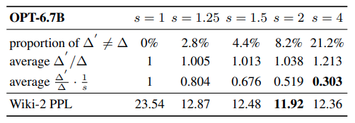

# AWQ

[github](https://github.com/mit-han-lab/llm-awq)

## Concept

- The QAT methods cannot easily scale up to large models like LLMs. Therefore, people usually use PTQ methods to quantize LLMs.

- We focus on the W4A16 instead of W8A8 in this work, since it not only reduces the hardware barrier (requiring a smaller memory size) but also speeds up the token generation (remedies memory-bound workload).

- The reconstruction process of GPTQ leads to an over-fitting issue to the calibration set and may not preserve the generalist abilities of LLMs for other modalities and domains.

  Doubts this statement

- Analysis on Quantization Error

  通常量化只会针对线性层，对于 LayerNorm & bias 是不会进行量化的，考虑单个 linear layer 权重的对称量化结果：
  $$
  Q(W) = \Delta·\text{Round}(\frac{W}{\Delta}) \\
  \Delta = \frac{\max{(|W|)}}{2^{N-1}}
  $$
  其中 $\Delta$ 就是 scale。下面计算 linear layer single element 前向结果的量化误差
  $$
  Err(Q(w)x) = \Delta·\text{RoundErr}(\frac{w}{\Delta})·x
  $$
  $\text{RountErr}(·)$ 可以看做一个分布近似于 uniform distribution from [0, 0.5] 的函数，那么 average error 就约为 0.25。正是因为这个特性，我们可以先将 weight 进行放大，然后再 round 过后进行缩小，从而保持 Err 成倍缩小
  $$
  Err(Q(w·s)\frac{x}{s}) = \Delta·\text{RoundErr}(\frac{w·s}{\Delta})·x·\frac{1}{s}
  $$
  以上分析基于两个假设：

  1. 这是对 single element 的误差分析，而不是对整体 channel/weight

     理想情况下，我们可以对每一个 element 计算其缩放的 s，但是这违背我们的初衷：压缩权重，每一个权重都有个 float16 的缩放因子，那压缩就没有意义。所以通常我们的 s 是在 per-channel 层面进行

  2. $\Delta$ 保持不变

     当 s 不大时 $\Delta$ 可能仍然保持不变，因为权重的最大值没有变化，而当 s 变得非常大时，$\Delta$​ 将也会随之缩放，缩放的误差将被抵消

     

  基于上面的分析 AWQ 就采用了两点妥协：scale would shared by channel & appropreate scale value

- Searching to scale

  接下来的目标就非常简单：优化 loss function
  $$
  s^*=\arg \min L(s)\\
  L(s) = ||Q(W·diag(s))·(diag(s)^{-1}·X) - WX||
  $$
  要找到最优的 s 比较麻烦，论文直接使用 grid search，且搜索范围是基于激活值（activation aware is here!!!）
  $$
  s=s_X^\alpha, \ \alpha^*=\arg \min L(s_X^\alpha)
  $$
  这里 $s_X$ 就是激活值的 average magnitude，$\alpha$​ 的取值范围为 [0, 1]
  
- What is MNK in matrix multiplication?

  

## Question

- How to apply AWQ & GPTQ algorithm to small vision models? Does GPTQ really overfits?