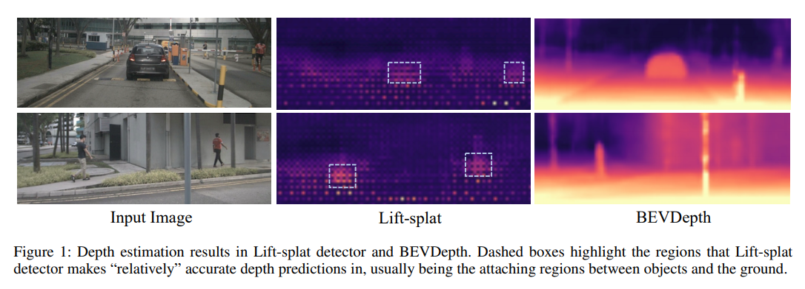
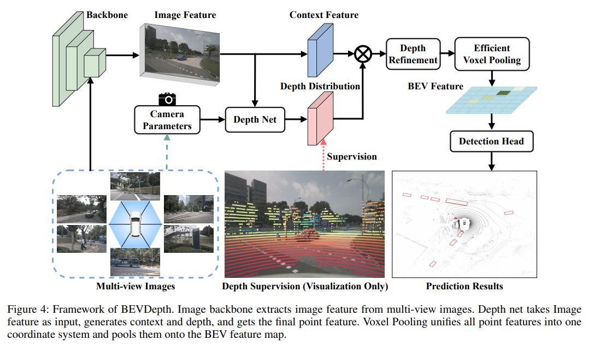

# BEVDepth

## BEVDet问题

**深度估计不准确**。虽然论文里列了3个点

1. Inaccurate Depth
2. Depth Module Over-fitting
3. Imprecise BEV Semantics

但实际上就是说 BEVDet 中使用的监督，无法让模型准确获得深度信息。因为监督信息仅由检测框给出，检测框所携带的深度信息很少

论文的实验论证了 BEVDet 中的 DepthNet 预测的深度很差

## BEVDepth解决方案

既然 DepthNet 没有深度监督，那就给它加入深度监督。关键在于如何构建监督信号。做法很简单：将点云投影到图像当中，如果点云落到了相同的像素里就进行平均。然后生成一个 one-hot 向量，作为深度的分类标签

除了深度监督外，论文还加了一些“补丁”：

1. 在 DepthNet 中加入 Camera Parameters

   具体来说，将 Camera 的内外参 flatten & concat，然后用 MLP 升维到与图像特征相同的维度。最后使用 SE (squeeze and excite) 的方法，做 channel attention
   $$
   D_i^{pred}=DepthNet(SE(F_i^{2d}|MLP(camera\_params)))
   $$
   
2. 在 BEV pooling 前加一些 BEV 视角下的卷积，类似于 Neck。论文里叫 Depth Refinement...

流程图如下

