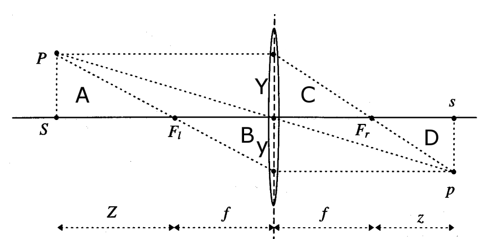
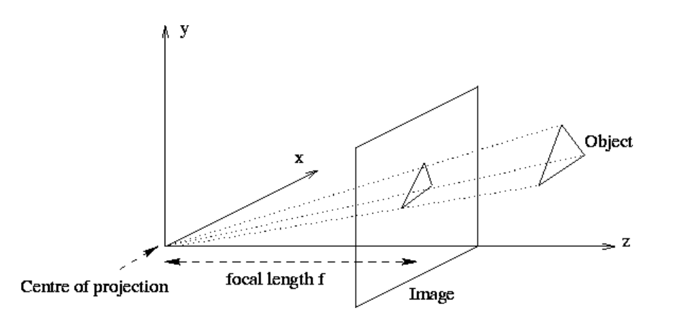
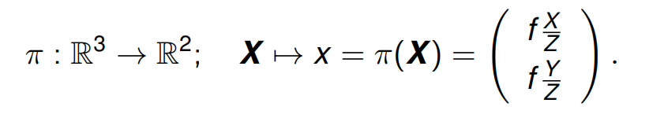
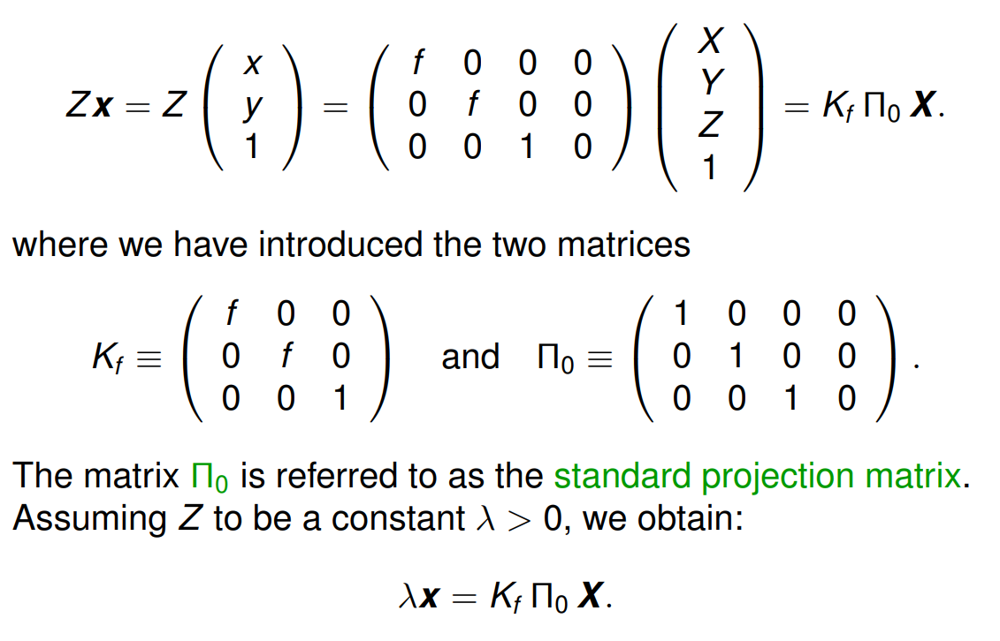
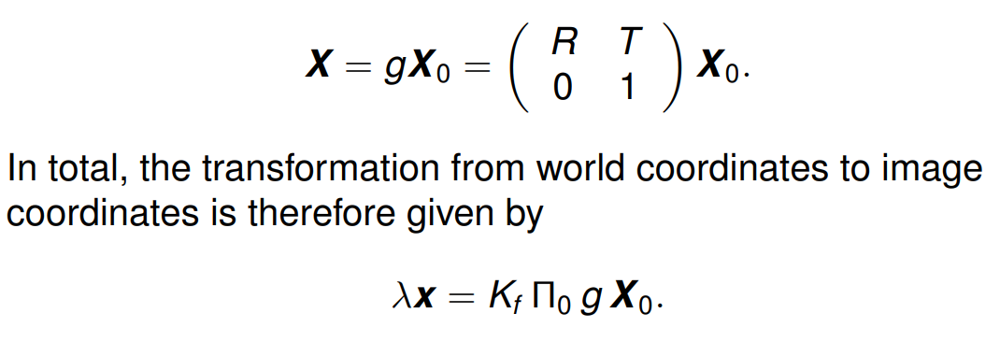
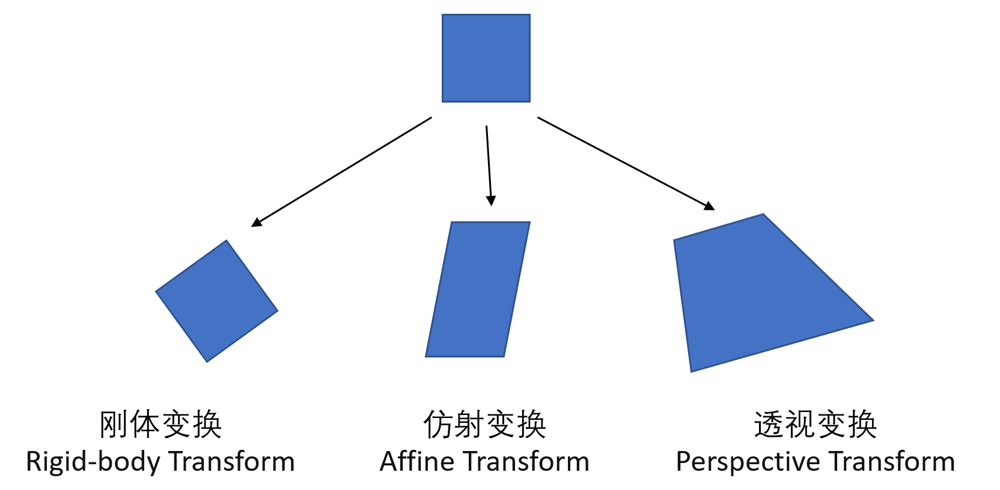
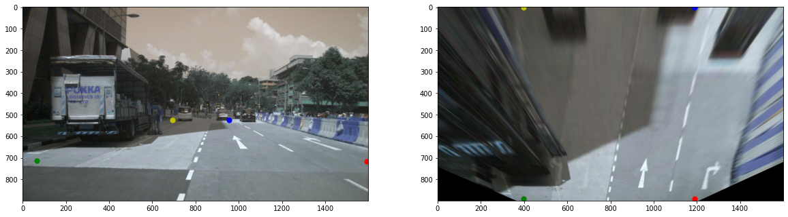

# BEVDet

## 相机内外参

关于相机内外参 [zhihu](https://zhuanlan.zhihu.com/p/389653208)，这篇博客写得已经非常清晰了，只需要记住小孔成像的一个比值公式就好。不同的项目可能会有不同的矩阵表达形式，但大体逃不出博客中的逻辑。小孔成像（已补偿翻转）的公式为
$$
\frac{Z}{f}=\frac{X}{X^{\prime}}=\frac{Y}{Y^{\prime}}
$$
这样就可以表示像素化坐标 $u, v$ 为：
$$
\begin{array}{l}
u=\alpha X^{\prime}+c_{x} \\
v=\beta Y^{\prime}+c_{y}
\end{array}
$$
其中 $\alpha,\beta, c_x, c_y$ 代表着对小孔成像的图像的缩放和平移。把上面的式子带入得
$$
\begin{array}{l}
u=\alpha f \frac{X}{Z}+c_{x}=f_{x} \frac{X}{Z}+c_{x} \\
v=\beta f \frac{Y}{Z}+c_{y}=f_{y} \frac{Y}{Z}+c_{y}
\end{array}
$$
使用更简洁的矩阵公式表达为
$$
Z\left(\begin{array}{l}
u \\
v \\
1
\end{array}\right)=\left(\begin{array}{ccc}
f_{x} & 0 & c_{x} \\
0 & f_{y} & c_{y} \\
0 & 0 & 1
\end{array}\right)\left(\begin{array}{c}
X \\
Y \\
Z
\end{array}\right)=\mathbf{K P}
$$
在像素坐标里加入一维，可以方便之后做矩阵运算

相机的位置由旋转矩阵 R 和平移向量 t 来描述
$$
\mathbf{P}=\mathbf{R} \mathbf{P}_{\mathbf{w}}+\mathbf{t}
$$
其中 $P_w$ 就是世界坐标。这个关系是比较一般性的，表达的是两个坐标系之间的相互转换

## BEVDet View Transformer

关于 lift splat shoot 的讲解视频 [bilibili](https://www.bilibili.com/video/BV16T411g7Gc)，基本上 BEVDet 就是使用这篇论文作为特征提取，然后接入一个检测头进行训练即可

直接贴一个前向方程，根据代码进行注释笔记

```python
    def forward(self, input):
        x, rots, trans, intrins, post_rots, post_trans = input
        # post_rots & post_trans 记录的是数据增强的操作，之后会逆转数据增强的效果，
        # 获得 frustum 在点云坐标系下的位置
        # rots & trans 应该是记录了 cam 到 lidar 坐标之间的变换
        # 使用 intrins 将像素坐标转换到 cam 坐标
        
        B, N, C, H, W = x.shape	# N 代表 cam 个数
        x = x.view(B * N, C, H, W)
        
        x = self.depthnet(x)
        # depthnet 输出维度为 self.D + self.numC_trans
        # self.D 代表离散化深度，self.numC_trans 代表预测的特征维度
        
        depth = self.get_depth_dist(x[:, :self.D])	# 等价于 softmax
        
        geom = self.get_geometry(rots, trans, intrins, post_rots, post_trans)
        # 获得 frustum 在 lidar 坐标系下的位置 (B, N, D, H, W, 3)
        img_feat = x[:, self.D:(self.D + self.numC_Trans)]

        # Lift
        # 升维，做 outer product，即 broadcast
        volume = depth.unsqueeze(1) * img_feat.unsqueeze(2)
        volume = volume.view(B, N, self.numC_Trans, self.D, H, W)
        volume = volume.permute(0, 1, 3, 4, 5, 2)

        # Splat
        # 把所有 cam 的 frustum 都转移到 lidar 体素坐标系中，
        # 并且落在相同 voxel 的特征将做 sum 操作
        bev_feat = self.voxel_pooling(geom, volume)
        if self.image_view_supervision:
            return bev_feat, [x[:, :self.D].view(B,N,self.D,H,W), x[:, self.D:].view(B,N,self.numC_Trans,H,W)]
        return bev_feat
```

这里我把 ego 坐标系换成了 lidar 坐标系便于理解，关于什么是 ego 可以看这个 [issue](https://github.com/nutonomy/nuscenes-devkit/issues/487)

## 可提升的地方

1. frustum 转移到 lidar 坐标系过后是近处稠密远处稀疏的，可以更针对地进行采样
2. 可以加入一些中间监督来对 view transformer 进行训练
3. 对经过 view transformer 过后的点云再次进行 BEV 增广（这在 BEVDet 中已经提出）
4. 做 `voxel_pooling` 的时候可以使用更好的 pooling 策略，而不是简单的 sum
5. 一定要使用更大的感受野去处理（deformable convolution, big kernel, transformer）
6. 可以加入时序信息

## Multiple View Geometry

[Persformer issue](https://github.com/OpenDriveLab/PersFormer_3DLane/issues/4) 这是为了解决我对 Persformer 代码的一些疑惑：为什么 Extrinsic 要求逆。论文里使用的投影变换公式也比较奇怪，不建议深究，但是原理就是透视变换，推荐下面的视频学习：

1. [极简多视图几何](https://www.bilibili.com/video/BV1AU4y1H7Nr)，教材 [4CV](https://www.robots.ox.ac.uk/~dwm/Courses/4CV_2015/index.html)

一个比较重要的思想是使用 homogeneous 的方式来表示坐标（齐次坐标），这样能很方便地表示投影和变换。齐次坐标就是比笛卡尔坐标多一个维度，这个维度可以通过归一化达到与笛卡尔等价的表示，即：对一个齐次坐标进行缩放是不改变这个点在空间中的位置的

### 透视投影

直接上课 [perspective projection](https://www.bilibili.com/video/BV1DM4y1c7gT/?p=5)，课件 [github](https://github.com/Nerdyvedi/Multiple-View-Geometry)。透视投影的目的就是将3D的坐标投影到image坐标 (H, W) 上

首先从凸透镜成像开始讲起



如果把所成的像换到另一侧，就变成了透视投影



而该透视投影 perspective projection 的数学表达式如下



该变换是一个非线性变换，我们通常将 Z 移到左侧，让这个式子看起来是一个线性变换，并且使用齐次坐标表示



这里 $K_f$ 就是我们所说的相机内参啦！但实际上这是理想的相机，真实的相机内参还需要进行校正，但本质也是一个 $3\times 3$ 矩阵。$\Pi_0$ 是一个简单的降维矩阵，本质上就是把齐次坐标的最后一维扔掉

再加入一个世界坐标系到相机坐标系的转换就是整个透视投影的全部内容啦🥳



### 透视变换

透视变换会稍微复杂一些，透视变换的本质是将图片投影到一个新的平面，区别于刚体变换与放射变换，透视变换后的物体变化更灵活 [CSDN](https://blog.csdn.net/m0_43609475/article/details/112847314)

只能对**单一平面**有准确的物理意义，而其他的平面则会产生非真实的形变，[CSND](https://blog.csdn.net/bby1987/article/details/106317354)



透视变化的一个理解方式就是将上述正方形的四个角点映射到任意四边形的四个角点，这样的变换方式可以用一个矩阵表示，[bilibili](https://www.bilibili.com/video/BV1C64y1d7ng)
$$
\begin{bmatrix}x'\\y'\\1\end{bmatrix}=\begin{bmatrix}m_{11}&m_{12}&m_{13}\\m_{21}&m_{22}&m_{23}\\m_{31}&m_{32}&m_{33}\end{bmatrix}\begin{bmatrix}x\\y\\1\end{bmatrix}
$$
看似有9个未知数，实际上透视变换的自由度仅为8个，所以通常指定 $m_{33}=1$，然后带入4个点求解变换矩阵  $M$，伪代码如下

 ```python
 def get_M(src, dst):
     # Compute the homography matrix H not using cv2.getPerspectiveTransform
     A = np.zeros((8, 8))
     for i in range(4):
         A[2*i] = np.array([src[i][0], src[i][1], 1, 0, 0, 0, -dst[i][0]*src[i][0], -dst[i][0]*src[i][1]])
         A[2*i+1] = np.array([0, 0, 0, src[i][0], src[i][1], 1, -dst[i][1]*src[i][0], -dst[i][1]*src[i][1]])
 
     # Define the b matrix
     b = dst.reshape((8,1))
 
     # solve linear equation
     H = np.linalg.solve(A, b)
     H = np.vstack((H, 1))
     M = H.reshape((3, 3))
     return M
 
 M = cv2.getPerspectiveTransform(src, dst)
 warped = cv2.warpPerspective(img, M, (H, W))
 
 # check the OpenCV version and my implementation
 print(M)
 print(get_M(src, dst))
 ```

#### IPM

之前一直在纠结 IPM，inverse perspective transform 到底是什么，其本质就是透视变换，经常是用在自动驾驶中的车道线检测，其目的是将前视图中的地面，映射为鸟瞰图。为了获得 IPM 需要人为设定一些区域：

1. 关注的地面范围，由 4 个地面点表示 `points = np.array(shape_4x3)`，这四个参考点就构成了一个平面，注意不能有3点共线的情况，该平面通常设定为一个矩形，方面定义后面的图像映射点
2. 映射到图像的范围，也由 4 个点表示 `dst = np.array(shape_4x2)`，这四个点就是上述区域变换过后**我们希望映射到新的图像中的位置**，显然当 `points` 定义为一个矩形时，`dst` 定义为一个相似的矩形是最好的，具体的值可以按你喜好

最近在看 nuScenes 数据集，不如就拿这个数据集练练手吧~数据集正好有所需要的相机内外参数

```python
# a sample of ipm using nuscenes dataset
import cv2
import numpy as np
import matplotlib.pyplot as plt
from nuscenes.nuscenes import NuScenes
from pyquaternion import Quaternion

nusc = NuScenes(version='v1.0-mini', dataroot='/github/The-Eyes-Have-It/data/nuscenes', verbose=False)

# get a sample
my_sample = nusc.sample[0]

# get CAM_FRONT image, and its intrinsic matrix
cam_front_data = nusc.get('sample_data', my_sample['data']['CAM_FRONT'])
data_path, box_list, cam_intrinsic = nusc.get_sample_data(cam_front_data['token'])
img = cv2.imread(data_path)
K = np.array(cam_intrinsic).reshape(3, 3)

# get CAM_FRONT calibrated sensor
cam_front_sensor = nusc.get('calibrated_sensor', cam_front_data['calibrated_sensor_token'])
cam2ego_R = Quaternion(cam_front_sensor['rotation']).rotation_matrix
cam2ego_T = np.array(cam_front_sensor['translation'])

def RT(points, R, T, inverse=False):
    """ Rotation and translation, note that inverse is different """
    if inverse:
        return np.dot(R.T, (points - T).T).T
    return np.dot(R, points.T).T + T
    
    
# define 4 points in the ego car coords
points = np.array([[10, -5, 0], [10, 5, 0], [50, -5, 0], [50, 5, 0]], dtype=np.float32)
p = points
# transform points to camera coords
points = RT(points, cam2ego_R, cam2ego_T, inverse=True)

# transform points to image plane
points = np.dot(K, points.T).T
points = points / points[:, 2].reshape(-1, 1)
homo_points = points
points = points[:, :2].astype(np.float32)
print(points)

# define bev points
# get the transform matrix
dst = np.float32([[1200,img.shape[0]],
                  [400, img.shape[0]],
                  [1200,0],
                  [400, 0]])
M = cv2.getPerspectiveTransform(points, dst)
# warp
warped = cv2.warpPerspective(img, M, (img.shape[1], img.shape[0]))
print(img.shape)    # shape is (H, W, 3)


def homo2cood(homo_points):
    # homo_points: (N, C)
    last = homo_points[:, -1:]
    homo_points = homo_points / last
    return homo_points

print(homo_points)
transformed = np.dot(M, homo_points.T).T
coords = homo2cood(transformed)
# show image in matplotlib
fig, ax = plt.subplots(1, 2, figsize=(20, 10))
ax[0].imshow(img)
# add points
colors = ['r', 'g', 'b', 'y']
for i, point in enumerate(points):
    ax[0].scatter(point[0], point[1], s=50, c=colors[i])
    
ax[1].imshow(warped)
for i, point in enumerate(dst):
    ax[1].scatter(point[0], point[1], s=50, c=colors[i])

plt.show()
```

最后映射出来的效果如图所示，感觉还不错🥳你可以看到原本在 front view 中相交的直线现在变成了平行线，但是地平面以外的图像就被拉伸成奇怪的样子了。正如前面所述，透视变换只能对**单一平面**有准确的物理意义，而其他的平面则会产生非真实的形变

