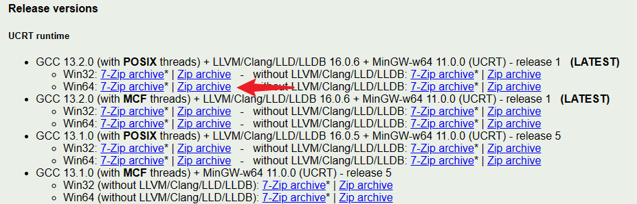
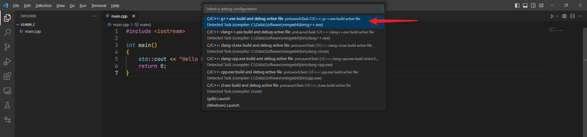

# C++ 基础

[zhihu](https://zhuanlan.zhihu.com/p/114543112)

[菜鸟教程](https://www.runoob.com/cplusplus/cpp-tutorial.html)

## Install

参考 [bilibili](https://www.bilibili.com/video/BV1Cu411y7vT) [youtube](https://www.youtube.com/watch?v=8jLOx1hD3_o)

### MinGW

前往链接下载 [WinLibs](https://winlibs.com/)，下载最新版本的 gcc 编译包



并把解压过后的 `bin` 其添加到环境变量中，完成后在 cmd 中输入以下内容的任意一行来验证是否安装成功

```cmd
gcc -v
clang -v
```

为什么需要编译包？编译包里包含了许多不同的编译器（例如 gcc 和 clang），任意一个编译器都可以对 C++ 代码进行编译，不同的编译器有各自的编译过程，其中对代码的运行可能有不同的优化，所以编译出来的程序有不同的运行速度

**编译器的本质就是将写好的 C++ 代码（txt），转换成二进制文件，这些二进制文件才能被计算机理解并执行**

### Linux

如果想要在 linux 进行学习的话，可以下载 `gcc & g++ & gdb`，`gdb` 一定要下载用于 debug，同时插件依赖于此，可能造成无法识别 task

```shell
sudo apt install gcc g++ gdb
# or, vscode doc recommends:
sudo apt install build-essential gdb
```

### VSCode

VSCode 是一个很好的**编辑器**，但其中并不内置任何**编译器**，所以我们需要告诉 vscode 如何使用我们上面下载好的编译器

首先下载 C++ 插件，为了方便我直接下载了 C++ Extension Pack


安装好插件过后，在你的 C++ 代码文件夹下创建 `.vscode/task.json` 文件，来**配置好 vscode 中使用的编译器**，但实际上最简单的方法就是直接 `Run C/C++ file`，如果你是第一次运行 C++ 代码，vscode 会引导你选择想使用的编译器，然后自动生成一个 `task.json` 配置文件。如下图所示，我直接选择 g++ 编译器



> gcc 和 g++ 的区别可以简单理解为 c 语言编译器和 c++ 语言编译器

更多的有关 `task.json` 的信息可以查看 [vscode-mingw](https://code.visualstudio.com/docs/cpp/config-mingw#_understanding-tasksjson)

我的 Config 如下

```json
{
    "tasks": [
        {
            "type": "cppbuild",
            "label": "Build with g++ compiler",
            "command": "C:\\Data\\Software\\mingw64\\bin\\g++.exe",
            "args": [
                "-fdiagnostics-color=always",
                "-g",	// generate debug info at debug console
                "${fileDirname}\\*.cpp",
                "-o",
                "${fileDirname}\\${fileBasenameNoExtension}.exe"
            ],
            "options": {
                "cwd": "${fileDirname}"
            },
            "problemMatcher": [
                "$gcc"
            ],
            "group": {
                "kind": "build",
                "isDefault": true
            },
            "detail": "Task generated by Debugger."
        },
    ],
    "version": "2.0.0"
}
```

对比默认的 `task.json` 修改了两个地方：

1. `label`，就是取一个自定义的名字，没什么特别的
2. `args`，`-g` 之后我选择编译当前文件夹下所有 cpp 文件

解读一下其他参数：

1. `group` 参数一般配置了该编译器能够被哪些接口调用。例如 `"kind": "build"`，表示使用 `Run build task` 的时候，就会使用该编译器；`"isDefault": true` 代表了使用 `Run C/C++ File` 时，就会使用该编译器
2. `detail` 参数就是在 select the task 时显示下方的小字 

之后就可以直接点击插件的 play button ▶️，之后会使用 `tasks.json` 中配置好的编译器与指令进行编译，然后会使用 `launch.json` 中的配置，运行编译好的文件，如果不存在 `launch.json` 一般会使用一个默认的配置，但是我们不可见

实际上 C++ 插件也能够支持 CUDA 编程，只需要我们修改一下编译器路径（compiler path）就可以享受 IDE 带来的自动提示功能，并且能够自动识别 CUDA 中特有的关键字而不报错。方法就是创建 `c_cpp_properties.json`，或者可以直接使用 ` C/C++: Edit Configurations (UI) ` 进行修改。我的配置如下

```json
{
    "configurations": [
        {
            "name": "NVCC: CUDA 11.8",	// any string
            "includePath": [
                "${workspaceFolder}/**"， // include all files in the workspace
                // ***** include torch C++/CUDA libs for extension development *****
                "/usr/include/python3.8",
                "/home/declk/miniconda3/envs/pytorch/lib/python3.8/site-packages/torch/include",
                "/home/declk/miniconda3/envs/pytorch/lib/python3.8/site-packages/torch/include/torch/csrc/api/include"
            ],
            "compilerPath": "/usr/local/cuda/bin/nvcc",
        }
    ],
    "version": 4
}
```

虽然 `c_cpp_properties.json` 配置了编译器路径，但是只提供 IntelliSense 功能，真正的编译器路径仍然由 `tasks.json` 配置

除了运行之外，插件当然也支持 debug，你可以在右上角的按钮中找到，这里不多赘述

## HelloWorld

```c++
// a hello world cpp

#include <iostream>

int main()
{
    std::cout << "Hello World!" << std::endl;
    return 0;
}
```

上面就是 C++ 的 Hello World 程序啦！这里咱们可以初步了解一些规则

结构：

1. 头文件，`<iostream>` 就是用于输入输出的，要用 `cin, cout, endl` 就必须要该头文件。头文件之前使用了 `#include`，这里有点像 python 的 import，但更准确的来说，这是一个**预处理器（preprocessor）**，所谓的预处理就是在编译开始之前，需要完成的工作。而这里的 `#include` 预处理器就是把文件中的文本，**原封不动地粘贴到当前文本中**
2. **main 函数**是一个 C++ 项目的入口（entry point），一个项目有且只能有一个 main 函数。当程序运行时，会从 main 函数开始逐行运行
3. `std::`，表示使用的 namespace

语法：

1. 分号为结束
2. 用大括号分隔语句块
3. 双斜杠表示注释

## How C++ Works

参考 [How-C++-Works](https://www.bilibili.com/video/BV1qh411p7Sa/?p=5)	[How-C++-Compiler-Works](https://www.bilibili.com/video/BV1qh411p7Sa/?p=6)

在开始讲解之前需要了解 C++ 是如何工作的。假设你有一个 C++ 项目，这个项目中包含了许多 cpp 文件，整个过程是怎么运行的呢？

首先，每一个 cpp 文件（translation unit）都会被编译（compilers），编译的过程中会产生一些 `.obj` 文件（on windows）或者是 `.o` 文件（on linux），这些文件为中间文件（intermediate binary files），最后将这些 obj 文件联系起来（linkers），组成一个 `.exe` 文件，这就是最终的可执行程序

编译器会将 `.cpp` 结尾的文件当作 C++ 代码，而 `.c` 结尾的文件当作 C 代码，而 `.h` 结尾的文件作为头文件，这些行为是可以被改变的，但默认的设置就是这样

上面讲 cpp 文件等价于 translation unit 不是特别准确，我将 translation unit 的定义写在下面以准确描述（Thanks to ChatGPT😎

> In C++, a "translation unit" refers to a single source file (a .cpp file) along with all the header files it includes, directly or indirectly. The translation unit is the basic unit of compilation in C++, and it represents the code that the compiler processes to generate an object file.

可以看到 translation unit 之间似乎是无法相互沟通的，这里就需要 linkers 将不同 unit 之间的功能联系起来，放到一个 main 程序当中

### Preprocess

实际上 Compile 的第一步不是直接就转换文本到二进制文件了，而是 **Preprocess**

在 preprocess 的过程中，编译器会检查所有的 preprocess 语句然后对代码**文本**进行处理。常见的有：

1. `#include`，之前讲过，该预处理语句就是打开指定文件，然后将文件里的所有文本 copy paste 到当前位置

2. `#define`，就是将某个字段，替换为另一个字段，例如下面就会将代码中的 `INTERGER` 全部替换为 `int`

   ```c++
   #define INTERGER int
   
   INTERGER a
   ```

3. `#if`，根据条件将代码文本包含或者剔除掉

   ```c++
   #if 1	// always true
   int Multiply(int a, int b):
   {
       int result = a * b;
       return result;
   }
   #endif
   ```

4. `#ifdef`，根据是否有存在某个 macro 或者 identifier，来对代码文本包含或者删除      

### Macro & Identifier

Macro 的定义如下

> In C++, a "macro" is a preprocessor directive that defines a simple text substitution. It allows you to create short, symbolic names (macros) for longer sequences of code, constants, or expressions.

其中提到的 preprocessor 就是 `#define` ，举个例子

```c++
#define PI 3.14159
```

这里的 `PI` 就是一个 macro

Identifier 的定义如下

> An "identifier" in C++ is a name given to an entity in the program, such as variables, functions, classes, or macros. Identifiers are used to uniquely identify these entities and provide a way to access and manipulate them within the code.

所以还是以上面的例子，`PI` 就是该 macro 的 identifier。这虽然很绕，但我理解的就是 macro 的名字就是 macro 本身...

macro 还可以作为函数使用，扩展了其应用空间

```c++
#define LOG(your_content) printf("%s\n", your_content)
```

这里的 `LOG` macro，就能够将你输入的 `your_content` 进行打印，但永远记住，本质上还是一个代码的替换。还可以使用 `#your_content` 来将你的**参数名**字符串化

```c++
#include <stdio.h>
#define LOG(your_content) printf(#your_content"\n")

int main() {
    int log_param = 10;
    LOG(log_param);
    return 0;
}
// output: log_param， not 10!
```

### Declaration & Definition

其实 **definition 定义** 是很好理解的，就是要把函数/对象的名字、主体等都写出来

但是 **declaration 声明** 是一个新的概念，ChatGPT 定义如下

> Declaration introduces a name and its associated type to the compiler, allowing you to use that name in your code without providing the actual implementation details. It tells the compiler that a variable, function, or class exists and will be defined later, either in the same file or another translation unit (source file). Declarations are necessary for the compiler to perform type-checking and ensure that you are using identifiers correctly.

简单来说，声明就是告诉编译器，“嘿，我这里有个东西存在，但是他的定义在别的文件，不过你可以调用他，没问题！”

下面是变量和函数的声明

```c++
// Declaration of the variable "myVariable" of type int
extern int myVariable;

// Declaration of the function "add" that takes two int parameters and returns an int
int add(int a, int b);
```

现在有另一个问题：为什么编译器知道真有一个 `add` 函数可调用呢？答案是编译器真不知道，他就是真信任我们，他是真的会调用这个声明的函数。要让这个函数能够被正常调用，就需要连接器（linkers）的帮忙，让这个声明的函数和其主题联系起来

### Command

vscode 中的 C++ 插件在执行 run task 之类的编译命令时，本质上就是在 terminal 中运行命令

```terminal
g++ files -o xxx.exe
```

而命令中的参数也是非常重要的，比如你有两个文件 `log.cpp & main.cpp`

```txt
- Learn_C++
	- log.cpp
	- main.cpp
```

`main.cpp` 中使用的代码包含了 `log.cpp`，尤其是使用的声明，而没有显式 include

```c++
#include <iostream>

//  declaration 
void log(const char* message);

int main()
{
    log("hello");
    return 0;
}
```

就需要将两个文件一起编译，这样 linkers 才能找到 `log`

```terminal
g++ main.cpp log.cpp -o out
```

## 输入输出

使用 `cin & cout & << >>` 来完成

```c++
cin >> name >> age;
// equal
cin >> name;
cin >> age;

cout >> name >> age >> endl;
```

二者的功能是接受一个字符串，遇到空格、tab、回车结束

## 数据类型

bool	char	int	float	double	void	string

上面就是 C++ 的基本类型，还可以加入一些修饰：signed, unsigned, short, long

typedef 声名，可以为一个已有的类型取一个新的名字

```c++
typedef type newname;
```

枚举变量的值只能取枚举常量表中所列的值，就是整型数的一个子集

枚举变量只能参与赋值和关系运算以及输出操作，参与运算时用其本身的整数值

```c++
enum color { red, green, blue } c;
c = blue;
```

以上语句完成了两个工作：

1. 让 color 成为了一个新类的名称，就像结构体一样。然后新建了一个 color 类型的变量 c
2. red green blue 作为符号常量，对应整数值 0 1 2

## 变量

变量是类型的实例，变量名称可由字母、数字、下划线组成

定义一个变量

```c++
type varialble_list;
type variable_name = value;

// examples
int    i, j=1, k;
char   c, ch;
float  f, s;
double d;
```

声明变量，区别于定义变量，仅用于向程序表明变量的类型和名字，声明不给变量分配空间。声明使用 extern 关键字完成

```c++
extern int a, b;
```

一个变量可声明多次，只能被定义一次

### 变量作用域

作用域是程序的一个区域，一般来说有三个地方可以定义变量：

- 在函数或一个代码块内部声明的变量，称为**局部变量**。它们只能被函数内部或者代码块内部的语句使用
- 在所有函数外部声明的变量（通常是在程序的头部），称为**全局变量。**全局变量的值在程序的整个生命周期内都是有效的
- 在函数参数的定义中声明的变量，称为**形式参数**

在程序中，局部变量和全局变量的名称可以相同，但是在函数内，局部变量的值会覆盖全局变量的值

### 常量

定义常量有两种方式

- 使用 **#define** 预处理器
- 使用 **const** 关键字

```c++
#define LENGTH 10   
#define WIDTH  5
#define NEWLINE '\n'
 
const int  LENGTH = 10;
const int  WIDTH  = 5;	
const char NEWLINE = '\n';
```

字符串常量是用双引号 `""` 表示，单个字符用单引号 `''`

### static, extern, mutable

C++ 程序中变量/函数的范围（可见性）和生命周期。这些说明符放置在它们所修饰的类型之前，我们进行分别介绍，最复杂的就是 static，剩余的两个比较简单

- static

  - 用于 global variable or function

    表明该全局变量/函数只在该 translation unit 中存在

  - 用于 function variable

    那么该变量在函数中会持续存在，不会每一次都初始化

    ```c++
    void foo() {
        // Static local variable
        static int count = 0;
        count++;
        std::cout << "Count: " << count << std::endl;
    }
    
    int main() {
        foo(); // Output: Count: 1
        foo(); // Output: Count: 2
    }
    ```

  - 用于 class

    在 class 中修饰变量时，这个变量会被所有该类的实例所共享

    在 class 中修饰方法时，这个方法将会属于该类，而不是任意实例，参考 python @staticmethod

- extern 用于 global variable

  表明该全局变量在另外的 translation unit 被定义，但也无法 link to static 修饰的变量

- mutable 用于 class member variable

  表示该变量即使被 const 修饰也能够修改

## 运算符

算数运算符基本是通用的：`+ - * / % ++ --`

关系运算符基本是通用的：`== != > < >= <=`

逻辑运算符：`&& || !`	分别表示与，或，非

位运算符基本是通用的：`& | ^` 分别表示与，或，异或

赋值运算符基本是通用的：`== += -= *= ...`

杂项运算符：

1. `sizeof` 返回变量大小
2. `condition ? X: Y` 如果 Condition 为真 ? 则值为 X : 否则值为 Y
3. `. & ->` 为成员运算符，用于引用类、结构和共用体的成员
4. `Cast` 强制转换运算符，把一种数据类型转换为另一种
5. `&, *` **指针运算符**，前者返回变量的地址，后者指向一个变量（访问变量）

## 循环与判断

循环有几种语法：

1. while & do while 循环 

   ```c++
   while(condition)
   {
      statement(s);
   }
   
   do
   {
      statement(s);
   }while( condition );
   ```

2. for 循环

   ```c++
   for ( init; condition; increment )
   {
      statement(s);
   }
   ```

使用 break & continue 可打破循环

判断语句有如下几种方式：

1. if & if else 语句

   ```c++
   if(boolean_expression 1)
   {	statement(s)
   }
   else if( boolean_expression 2)
   {	statement(s)
   }
   else 
   {	statement(s)
   }
   ```

## 函数

每个 C++ 程序都至少有一个函数，即主函数 **main()** 

C++ 中的函数定义的一般形式如下

```c++
return_type function_name( parameter list )
{
   body of the function
}
```

参数列表包括函数参数的类型、名称，参数的名称并不重要，只有参数的类型是必需的（但没有名称怎么调用呢🤣

这些参数称为函数的**形式参数**，形式参数就像函数内的其他局部变量，在进入函数时被创建，退出函数时被销毁

### 函数参数

三种传递参数：

1. 传值调用。不改变实际参数值
2. 指针调用和引用调用。会改变实际参数值

参数也可以指定默认值，成为可选参数

## 数组

在 C++ 中要声明一个数组，需要指定元素的类型和元素的数量

```c++
type arrayName [ arraySize ];

double balance[5] = {1000.0, 2.0, 3.4, 7.0, 50.0};
double balance[] = {1000.0, 2.0, 3.4, 7.0, 50.0};
```

C++ 支持多维数组。多维数组声明的一般形式如下

```c++
type name[size1][size2]...[sizeN];
```

数组名是指向数组中第一个元素的常量指针，仅在使用 sizeof 时区别于一般指针，此时将返回整个数组的长度

C++ 传数组给一个函数，数组类型自动转换为指针类型，因而传的实际是地址，一下三种方法都可以

```c++
void myFunction(int *param)
void myFunction(int param[10])
void myFunction(int param[])
```

## 指针

每一个变量都有一个内存位置，可使用连字号（&）运算符访问

**指针**是一个变量，其值为另一个变量的地址，指针变量声明的一般形式为

```c++
type* var-name;

int* ip;
double* dp;
float* fp;
char* ch;
```

所有指针的值的实际数据类型，**都是一个代表内存地址的长的十六进制数**，与类型无关！大小通常为 8 byte (64 bit)

```c++
0xd9603ff6d4	// 0x indicates Hexadecimal
```

尽管指针本身的大小是8个字节，但在输出指针地址时，输出的地址可能只显示了一部分。这是因为控制台输出通常只显示足够的位数来表示内存地址，而不会将完整的地址打印出来

**那么类型代表了什么呢？**

首先需要再次强调的是，**指针只是一个地址**，通过访问该地址能够帮助我们对内存进行各种操作。那么问题来了，内存相当于是一片连续的空间，我只是知道（起始）地址，我要如何操作这一整片空间呢？这里就需要 type 来诠释了，下面是 ChatGPT 的一段解释

> the type of a pointer is essential for correct memory manipulation and data interpretation when dereferencing the pointer or performing pointer arithmetic. 

上面的表明：类型能够帮助指针去操作和解释内存。从两个方面来举例子：

1. dereferencing，就是逆引用。对于某指针 `p`，我们获得他的逆引用 `*p` 即能获得指针所指的内容，这个内容如果都是 8 bit，那么他是个 int 还是个 float 呢？所以根据不同的类型，指针会对这段内存做不同的诠释，从而返回我们所期待的内容
2. pointer arithmetic。我们经常使用的 `p++`，也就是指针往下移动一个位置，那到底移动多少个 bit？这也是根据指针类型去决定的

不管是整型、浮点型、字符型，还是其他的数据类型，都是一样的，关于指针的几点：

1. NULL 表示空指针

2. 可对指针进行四种算数运算，`++, --, +, -`

3. 可以定义一个指针数组，即数组中的每一个值是一个指针

4. 可以定义多个 `**`，表示嵌套的指针，可用于存储指针的地址，即地址的地址

   ```c++
   #include <iostream>
    
   using namespace std;
    
   int main ()
   {
       int  var;
       int* ptr;
       int** pptr;
    
       var = 3000;
    
       ptr = &var;
    
       pptr = &ptr;
    }
   ```

5. 可定义返回指针的函数

   ```c++
   int* myFunction()
   ```

   也可定义指向函数的指针

   ```c++
   int (*p)(int, int) = & max; // & is not must
   int a;
   a = p(1, 2);
   // p is a pointer, which can point to a function
   // max is a function, and `max` identifier is an adress
   ```

## 引用

这是和指针非常相似的概念，引用的本质是在 C++ 内部实现的一个指针常量

```c++
Type& ref = val;

// understand the reference
Type* const ref_ = &val;
// ref equals *ref_
```

所以可以理解为，引用就是常量指针的dereference

C++ 编译器在编译过程中使用常量指针作为引用的内部实现，因此引用占用的空间大小与指针相同，只是这个过程是编译内部实现，用户不可见

所以引用与指针的区别可总结如下：

1. 一旦引用被初始化为一个对象，就不能被指向到另一个对象。指针可以在任何时候指向到另一个对象。
2. 引用必须在创建时被初始化。指针可以在任何时间被初始化。

引用的常用用法如下：

1. **把引用作为参数。**这比传一般的参数更安全，可更方便地对参数实现修改
2. 把引用作为返回值。当函数返回一个引用时，则返回一个指向返回值的隐式指针。这样，函数就可以放在赋值语句的左边

### const

既然上面出现了 const 关键字，这里在继续介绍一下 const 的用法。这里用三个例子来说明

1. `const int* x`，这表明无法修改 `*x`，也就是无法赋值于变量 `*x=1` ❌
2. `int* const x`，这表明无法修改 `x`，也就是无法赋值于指针 `x=&y` ❌
3. `int func() const`，这表明无法修改函数内的变量

所以说 const 的作用就是**限制赋值操作**

用 const 还可以有一些骚操作，比如

```c++
// within some class
const int* const GetX() const
{
    return m_X;
}
```

连续用了三个 const 这意味着：

1. 无法赋值函数返回指针
2. 无法赋值函数返回指针所指的变量值
3. 无法赋值函数内的变量

**但我们通常看到的使用情况如下**

```c++
void Function(const Entity& e)
{
    //can't assign to e or its member
    e = Entity()	// errors
    e.x = 1			// errors
}
```

我们给函数传入一个 const reference 常量引用，这样我们是不能够对该常量赋值，也不能够修改该常量的成员

## 数据结构

### struct

struct 语句定义了一个包含多个成员的新的数据类型

```c++
struct type_name {
member_type1 member_name1;
member_type2 member_name2;
member_type3 member_name3;
.
.
} object_names;
```

为了访问结构的成员，我们使用**成员访问运算符（.）**

结构指针访问成员则必须使用箭头 `->`，这也是 `->` 唯一用途

```c++
struct Books
{
   char  title[50];
   char  author[50];
};

void printBook( struct Books *book )
{
   cout << "title: " << book->title <<endl;
   cout << "author: " << book->author <<endl;
}
```

### typedef

可以使用它来为类型取一个新的名字。**typedef** 仅限于为类型定义符号名称，**#define** 不仅可以为类型定义别名，也能为数值定义别名，比如您可以定义 1 为 ONE

```c++
typedef long int *pint32;
 
pint32 x, y, z;
```

x, y 和 z 都是指向长整型 long int 的指针
