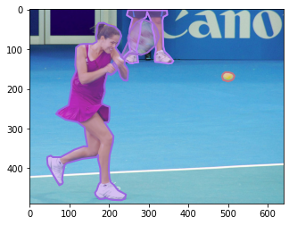

# COCO

目的有俩：

1. 熟悉对图像的预处理
2. 熟悉 COCO api 以及 evaluation

参考 [CSDN](https://blog.csdn.net/qq_29051413/article/details/103448318) 非常完整

## COCO

COCO 数据集包括两大部分：Images 和 Annotations
**Images：**“任务+版本”命名的文件夹（例如：train2014），里面为 `xxx.jpg` 的图像文件
**Annotations：**文件夹，里面为 `xxx.json` 格式的文本文件（例如：instances_train2014.json）
**使用COCO数据集的核心就在于利用 API 对 `xxx.json` 文件的读取操作**

### 下载 COCO

虽然百度网盘极其🐶，但是这里我依然使用了百度网盘下载，需要开启一下闲置带宽优化下载。只要是热门资源下载速度都会比较快的

这里下载 coco2017 train/val images & train/val annotations

下载完后，解压放在如下位置

```txt
mmdetection
├── mmdet
├── tools
├── configs
├── data
│   ├── coco
│   │   ├── annotations
│   │   ├── train2017
│   │   ├── val2017
│   │   ├── test2017
```

下载完 coco 数据集然后解压

### Annotations

COCO 有五种注释类型对应五种任务:目标检测、关键点检测、实物分割、全景分割和图像描述

通用字段主要有 `images & annotations`，其中 images 是一个 list，其核心关键字如下

```python
image{
	"id"			: int, 	# 图像id
	"width"			: int, 	# 图像宽度
	"height"		: int, 	# 图像高度
	"file_name"		: str, 	# 图像文件名
	"license"		: int, 	# 许可证
	"date_captured"	: datetime,	# 拍摄时间
}
```

而 annotations 根据不同的任务有各自的关键字段，保存于不同的 json 文件当中：

1. `instances_train2017.json`，对应**目标检测、分割任务的训练集标注文件**
2. `captions_train2017.json`，对应图像描述的训练集标注文件
3. `person_keypoints_train2017.json`，对应人体关键点检测的训练集标注文件

对于目标检测/实例分割而言，其核心字段如下

```python
annotation{
	"id"			: int,	# annotation的id，每个对象对应一个annotation
	"image_id"		: int, 	# 该annotation的对象所在图片的id
	"category_id"	: int, 	# 类别id，每个对象对应一个类别
	"segmentation"	: RLE or [polygon], 
	"area"			: float, 	# 面积
	"bbox"			: [x,y,width,height], 	# x,y为左上角坐标
	"iscrowd"		: 0 or 1,	# 0时segmentation为REL，1为polygon
}

categories[{
	"id"			: int,	# 类别id 
	"name"			: str, 	# 类别名称
	"supercategory"	: str,	# 类别的父类，例如：bicycle的父类是vehicle
}]
```

对于关键点检测而言，其核心字段如下，这里做几点说明：

1. keypoints 的 value 是一个长度为 3k 的数组，其中 k 是类别定义的关键点总数（例如人体姿态关键点的 k 为17）
2. 每个关键点都有一个0索引的位置 x、y 和可见性标志 v（v=0 表示未标记，此时 x=y=0；v=1 时表示标记，但不可见，不可见的原因在于被遮挡了；v=2 时表示标记且可见）
3. [cloned] 表示从上面定义的 **Object Detection** 注释中复制的字段

```python
annotation{
	"keypoints"		: [x1,y1,v1,...], 
	"num_keypoints"	: int, 	# v=1，2的关键点的个数，即有标记的关键点个数
	"[cloned]"		: ...,	
}

categories[{
	"keypoints"	: [str], 	# 长度为k的关键点名字符串
	"skeleton"	: [edge], 	# 关键点的连通性，主要是通过一组关键点边缘队列表的形式表示，用于可视化.
	"[cloned]"	: ...,
}]
```

### pycocotools

`pip install pycocotools` 下载即可，其中的 api 如下

1. COCO：加载COCO注释文件并准备数据结构的COCO api类
2. decodeMask：通过运行长度编码解码二进制掩码M
3. encodeMask：使用运行长度编码对二进制掩码M进行编码
4. **getAnnIds**：得到满足给定过滤条件的annotation的id:
   1. 可通过 image ids 获得 anns ids
   2. 可通过 cat ids 获得 anns ids
   3. **如果什么参数都不传，则没有过滤要求，返回全部 anns ids**
   4. 返回一个 list of ids，注意没有嵌套的 list
5. **loadAnns**：使用指定的id加载annotation
6. getCatIds：获得满足给定过滤条件的category的id:
   1. 可通过 cat names 获得 cat ids，例如 tennis racket
   2. 可通过 super cat names 获得
   3. 如果什么参数都不传，返回全部 cat ids
7. loadCats：使用指定的id加载category
8. getImgIds：得到满足给定过滤条件的imgage的id
   1. 可通过 catids 返回 image ids
   2. 如果什么参数都不传，返回全部 imgae ids
9. loadImgs：使用指定的id加载image
10. annToMask：将注释中的segmentation转换为二进制mask
11. showAnns：显示指定的annotation，常用于可视化
12. loadRes：加载算法结果并创建访问它们的API
13. download：从mscoco.org服务器下载COCO图像

###  Example

```python
# a minimum example to learn COCO api
from pycocotools.coco import COCO
import numpy as np

import matplotlib.image as mpimg
import matplotlib.pyplot as plt
import pylab
pylab.rcParams['figure.figsize'] = (8.0, 10.0)

# path settings
dataDir='/datasets/coco'
dataType='train2017'
annFile='{}/annotations/instances_{}.json'.format(dataDir,dataType)

# initialize COCO api for instance annotations
coco=COCO(annFile)

# load tennis racket ids, return a list of ids
catIds = coco.getCatIds(catNms=['tennis racket'])
# get image ids, return a list image ids 
imgIds = coco.getImgIds(catIds=catIds)
# load image inofs, return a list of `image` infos in json like:
# {'file_name': '000000352257.jpg', ... 'height': 489, 'width': 640, 'id': 352257}
img = coco.loadImgs(imgIds[0])[0]

I = mpimg.imread('%s/%s/%s'%(dataDir,dataType,img['file_name']))
annsIds = coco.getAnnIds(imgIds=img['id'])
anns = coco.loadAnns(annsIds)

plt.imshow(I)
coco.showAnns(anns)
```



## COCO in MMDet

最后呈现在 Model 中的输入如下，来则 detrex

```python
dict_keys(['file_name', 'height', 'width', 'image_id', 'image', 'instances'])
```

所以 COCO 中需要关键数据是比较少的，`image & image_size & instances` 就是最重要的，不过要弄清各个数据的表达形式，例如 box 的形式是 `xyxy` 还是 `xywh`，一般来讲是前者

### DINO 数据增强

在 mmdetection 中的配置如下

```python
    dict(type='RandomFlip', prob=0.5),
    dict(
        type='RandomChoice',
        transforms=[	# 在多个 transforms 中随机选择一个
            [
                dict(
                    type='RandomChoiceResize',
                    scales=[(480, 1333), (512, 1333), (544, 1333), (576, 1333),
                            (608, 1333), (640, 1333), (672, 1333), (704, 1333),
                            (736, 1333), (768, 1333), (800, 1333)],
                    keep_ratio=True)
            ],
            [
                dict(
                    type='RandomChoiceResize',
                    # The radio of all image in train dataset < 7
                    # follow the original implement
                    scales=[(400, 4200), (500, 4200), (600, 4200)],
                    keep_ratio=True),
                dict(
                    type='RandomCrop',
                    crop_type='absolute_range',
                    crop_size=(384, 600),
                    allow_negative_crop=True),
                dict(
                    type='RandomChoiceResize',
                    scales=[(480, 1333), (512, 1333), (544, 1333), (576, 1333),
                            (608, 1333), (640, 1333), (672, 1333), (704, 1333),
                            (736, 1333), (768, 1333), (800, 1333)],
                    keep_ratio=True)
            ]
        ]),
```

可以看到实际上是比较简单的增强，[issue](https://github.com/IDEA-Research/detrex/issues/96) 也说了，YOLO 中的数据增强并不会提升表现

### MMEval

如果要在自己的项目中使用 evaluation 的话可以考虑使用 [MMEval](https://mmeval.readthedocs.io/en/latest/api/metrics.html) 的接口，这就不用考虑遵从各个项目自己的标准了。MMEval 有给出具体的 examples 比较友好
