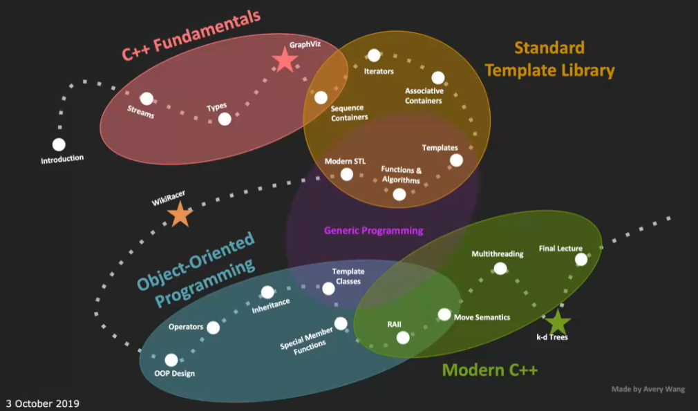

# CS106L 01

## Why C++?

- C++ is still a very popular language

  并且最近有一些更新，使得 C++ 更好用了

- C++ is high performace

- Why 106L?

  **106B**

  - programming abstractions
  - barely enough C++ to learn programming abstractions
  - C++ 98*
  - Stanford libraries abstract away messy details, also buggy

  **106L**

  - standard C++ programming
  - enough C++ for a job, internship, or research
  - C++17
  - Deep dive into messy C++ details

## Goals of CS 106L

- Learn what features are out there in C++ and why they exist

- Become comfortable with reading C++ documentation

  C++ doc is not beginner friendly

- Become familiar with the design philosophy of modern C++

- **NOT** memorize the syntax of C++

 Content

- C++ Fundamentals
- Standard Template Library
- Object-Oriented Programming
- Modern C++

Assignments

- The purpose is not to tackle a hard problem, but to hands on practice of C++
- 3 assignments in total

IDE

- qt creator

  106B has a good setup tutorial

- A overview graph

  

## C++ History

- C++ cares about backward compatible very much, which makes it sometimes really messy!!!

  - backward to C language
  - backward to assembly

- Assembly 汇编

  - Benifits
    - Unbelievably simple instructions
    - Extremly fast (when well written)
    - Complete control over the program
  - Drawbacks
    - Hard to code
    - Hard to understand
    - Extremely unportable

- Invention of C

  写汇编实在是太难了，但是计算机只理解汇编语言，所以说！有了以下的 Idea:

  - source code can be written in a more intuitive language
  - an additional program can convert it into assembly **(This is called a compiler!!!)**

  如此一来 C 就诞生了，相比汇编有了三个特点：Fast, Simple, Cross-platform

  Learn C in CS107!

  但是 C 没有面向对象，来写复杂程序仍然不够用，所以诞生了 C++，面向对象的好处：

  1. 有了封装、继承、多态、模块化等好处，能够让代码复用性提高，可读性提高
  2. 对数据的管理和保护更加方便

- Evolution of C++

  

## Design Philosophy of C++

- **full control, full responsibiity of your code**
- express ideas directly in code
- enforce safety at compile time whenever possible
- **do not waste time and space**
- **compartmentalize messy constructs**

## Hello world

永不过时的 Hello world

```c++
// ==================== C++ way ==================== 
#include <iostream>

int hello_cpp(){
  std::cout << "Hello world" << std::endl;
  return 0;
}

// ==================== C way ====================
#include <stdio.h>
#include <stdlib.h>

int hello_c(){
  printf("Hello world\n");
  return EXIT_SUCCESS;
}

// ==================== assembly way ====================
// ...

int main() {
  hello_cpp();
  hello_c();
  return 0;
}
```

助教让学生提出一些问题，第一次见里面的代码，有什么奇怪的地方：

1. 为什么要 return 0

   main 其实不用返回 0

2. 什么是 std？

   这是 standard library 的缩写

3. `<<` 很奇怪

   这是流操作符 (stream operator)

4. `::` 很奇怪

    `::` 是域解析符 (namespace resolver)，类似于 python 中的 `.`

   在 python 中使用 `import numpy as np` 然后使用 `np.xxx` 来调用 numpy 中的函数

   在 C++ 中使用 `std::xxx` 来调用 std 中的函数

   但是二者还是有着显著的区别。在 python 中一旦 import 了过后就能使用 np 中的全部功能。但是要使用 std 中的函数，还得 #include 相应的 library
   
   之前的课程可能用 using namespace std，但是这门课可能不太推荐

提问环节：

1. iostream 是 std 的一部分？

   是的

2. Are all standard library header files part of the std name space？

   是的。之后的课程会展示哪些是 standard library，哪些不是