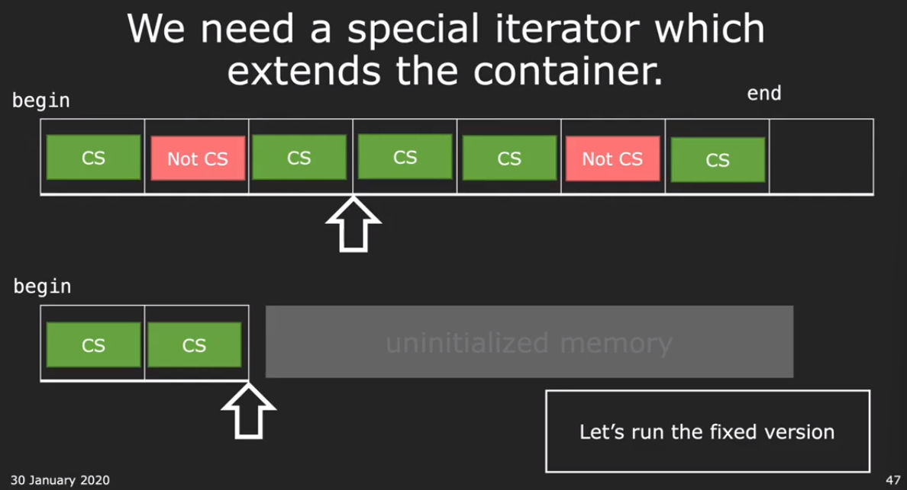

# CS106L 05

我看的 [video](https://www.bilibili.com/video/BV1K8411b7AU/?p=9) 是 2020 winter 录制的，似乎这个合集既有 2020 又有 2019 的录制视频

## Algorithm

the STL algorithm library has a highly optimized version of what we wrotes

```c++
std::count
std::count_if
```

Algorithm we will explore!

- `std::sort`

  ```c++
  std::sort(container.begin(), container.end(), /*optional*/ compare_lambda_function)
  ```

- `std::nth_element`

  用于寻找第 n 个 element，时间复杂度 O(N)

  ```c++
  std::nth_element(v.begin(), v.begin() + n, v.end())
  ```

  该方法会对元素进行重新排布，排序过后的第 n 个元素，就是 container 中第 n 大的元素。仅保证第 n 大的元素在第 n 个位置，不保证其他元素是按照顺序排布的

- `std::stable_partition`

  根据条件将 container 分为两个部分，满足条件的在前半部分，不满足的在后半部分，并且 relative order 保持不变

  ```c++
  std::stable_partition(v.begin(), v.end(), condition_lambda_function)
  ```

- `std::copy_if`

  copy if 将一个 vector 中满足条件的元素拷贝到另一个 vector 当中。在拷贝的过程中，要求另一个 vector 是可扩展的，因为当拷贝元素数量超过了 vector 的容量就会引发错误。**于是就需要 interator adapter**，这是第一次在课程中提到此概念

  

  ```c++
  std::copy_if(vec1.begin(), vec1.end(), std::back_inserter(vec2), condition_labmda_func)
  ```

  此时 `vec2` 最好是一个 empty container，不然会直接在 `vec2` 末尾进行 copy [geeks](https://www.geeksforgeeks.org/stdback_inserter-in-cpp/)

  课程还举了一个例子，使用 `std::copy` 来将数据复制到 output stream 当中，我这里询问了一下 chatGPT，因为我不太理解使用 `std::ostream_iterator<Course>` 是什么意思，看来 `Cousre` 实现了自己的 stream 输出方式，`ostream_iterator` 也是一种 adapter

  ```c++
  #include <iostream>
  #include <vector>
  #include <algorithm>
  #include <iterator>
  
  // Example definition of the Course struct
  struct Course {
      std::string name;
      int credits;
  
      // Overloading the stream insertion operator
      friend std::ostream& operator<<(std::ostream& os, const Course& course) {
          os << "Course Name: " << course.name << ", Credits: " << course.credits;
          return os;
      }
  };
  
  int main() {
      std::vector<Course> vec = {
          {"Math", 3},
          {"History", 4},
          {"Science", 5}
      };
  
      // The code snippet in question
      std::copy(vec.begin(), vec.end(), std::ostream_iterator<Course>(std::cout, "\n"));
  
      return 0;
  }
  ```

- `std::remove_if`

  remove does not change the size of vector, just move the element to the back of the vector!

  如果真的要 Remove，则要使用 `vector.erase`

- `std::find`

  查找在 vector 中是否包含某个元素，返回一个 iterator

  ```c++
  auto iter = std::find(vec.begin(), vec.end(), value);
  if (if != vec.end()) {
      std::cout << "Found: " << *iter << std::endl;
  }
  ```

除此之外我还查询了一下，如何将一个 lambda funtion 作为 parameter 输入到函数当中

```c++
#include <iostream>
#include <functional>  // For std::function
// This function takes a lambda (or any callable) that returns void and takes an int
void applyToNumber(int num, std::function<void(int)> func) {
    func(num);  // Call the lambda with num as the argument
}
```

## Wrapping up the STL

Game Plan

- STL Conslusion
- Let's put it all together!

助教简单对之前的内容进行了总结，看来我没有任何内容😎


除了上课介绍的 library 之外还有很多有用的 library:

- regex library
- multi-processing
- boost, linear algebra, not part of STL, but extremely useful

分割线---

- Abstraction in STL

  首先介绍了一下”抽象“ 的作用：能够解决一类问题，而不关心具体的实现

  在 STL 中有多层抽象：

  1. Containers can abstract away basic types, 可以接受各种各样的数据类型
  2. Iterator can abstract away container types，可以操作不同的 container
  3. Algorithms can abstract awary iterator types, 可以操作不同的 iterator

  template 也是 abstraction 当中的一种

  此时，助教发出贺电！Congratulations! 恭喜完成了 C++ 学习的一大步！

  

- 有同学问：为什么 STL 使用的是 `std` 作为 namespace，而不是 `stl` 🤣确实！

- 助教说了一个游戏：WikiRace! 那就是只通过 wikepedia 的链接去跳转到指定的网站，而不是通过搜索引擎🤔有点搞笑哈哈哈，但不是白介绍这个游戏，而是要通过代码去完成这个功能！这是 Assignment 2 

- Lol 这课越来越好笑了，助教又发布了一个任务：如何通过文字来判断，这是谁写的内容。有人说：通过文字频率来分析 writing style ，助教：good；有人说：machine learning，助教：thank you, the class is over😂just kidding

- Let's get coding!!!

  How to write a program from scratch?

  `std::transform` 类似于 python 中的 `map`，会将 function 映射到 container 中的每一个元素上，然后使用新的 container `dest` 来保存

  ```c++
  std::transform(iter.begin(), iter.end(), dest.begin(), function)
  ```

  助教只是把整个代码的框架以及如何读取文件写出来了，需要自己完成剩下的代码

  甚至留下了悬念！使用什么去替代 `std::count` 来统计出现的次数，因为使用 `std::count` 会出现问题：因为它是去寻找 container 中单个 item 出现的个数。根据 [github](https://github.com/averywang21/CS106L-spr20) 上的代码来看，是使用了 `std::search` 的方式来完成子串的搜索

  ```c++
  std::search(iter.begin(), iter.end(), sub_str.begin(), sub_str.end())
  ```
  
  我们也可以直接根据 `std::string::find` 的方法直接搜索子串位置，然后迭代向前
  
- 13:00 助教在 ep 11 中实现了完整的功能，其中还使用了一个新的 library `numeric`，调用了其中的 `inner_product`，这也是 STL 中的其中一个。在写代码的过程中，如果你不知道某个函数来自哪个 library，只有手动 google 一下 cpp reference，cpp reference 是真的有用

## Question

- 我发现我在往回复习的时候，想要寻找视频中对应的部分，这会很花费时间🤔之后记录的时候应该要考虑加上视频的时间戳

