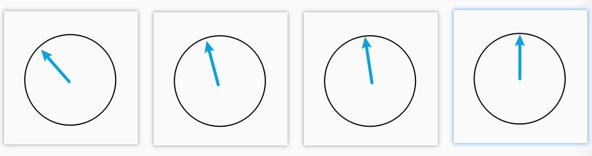

# D2L 10 注意力机制

555终于可以开始看注意力机制了😆Transformer 我来啦！

## 注意力提示

### 生物学中的注意力提示

主要有两个概念：

1. **非自主性提示/非随意线索**（non-volitional cue），基于环境中物体的突出性和易见性
2. **自主性提示/随意线索**（volitional cue），受主观意愿推动

### 查询、键和值

教材对于这三个概念的解释并不清晰，还是看沐神的讲解吧 [bilibili](https://www.bilibili.com/video/BV1264y1i7R1?p=1&t=447)

卷积、全连接、池化层都只考虑不随意线索，注意力机制则显式地考虑随意线索：

1. 随意线索被称之为查询（query）
2. 每个**输入**是一个键值对 (key, value)，其中 key 可视为非随意线索，（下面这句是我自己乱想的）value 可以视为该线索的相关属性
3. 通过注意力池化层来有偏向性的选择某些输入

### 非参数注意力汇聚：Nadaraya-Watson 核回归

实际上一个数学表达的例子能够更清楚展示这三个概念。给定数据 $(x_i, y_i), i=1,...,n$

给定查询 $x$，平均池化将获得输出
$$
f(x) = \frac{1}{n}\sum_{i}{y_i}
$$
这就是没有注意力机制的情况，与查询值无关，全凭非随意线索获得输出。而更好的方案是60年代提出来的 Nadaraya-Waston 核回归
$$
f(x)=\sum_{i=1}^{n} \frac{K\left(x-x_{i}\right)}{\sum_{j=1}^{n} K\left(x-x_{j}\right)} y_{i}
$$
其中 K 可以看作一个核函数，例如一个高斯核，用于衡量两点之间的距离
$$
K(u)=\frac{1}{\sqrt{2 \pi}} \exp \left(-\frac{u^{2}}{2}\right)
$$
这就将注意力机制显式地用于输出，也就是给各个 value 加入相关权重。现在再来看这个图示可能会更好


### 带参数注意力汇聚

非参数的Nadaraya-Watson核回归具有一致性（consistency）的优点：如果有足够的数据，此模型会收敛到最优结果。尽管如此，我们还是可以轻松地将可学习的参数集成到注意力汇聚中
$$
\begin{aligned}
f(x) &=\sum_{i=1}^{n} \alpha\left(x, x_{i}\right) y_{i} \\
&=\sum_{i=1}^{n} \frac{\exp \left(-\frac{1}{2}\left(\left(x-x_{i}\right) w\right)^{2}\right)}{\sum_{j=1}^{n} \exp \left(-\frac{1}{2}\left(\left(x-x_{j}\right) w\right)^{2}\right)} y_{i} \\
&=\sum_{i=1}^{n} \operatorname{softmax}\left(-\frac{1}{2}\left(\left(x-x_{i}\right) w\right)^{2}\right) y_{i} .
\end{aligned}
$$
注意这里 $w$ 只是一个标量，如果 $w$ 越大说明越注意近距离的键值。这里提一下，一个训练样本的输入都会和**除自己以外**的所有训练样本的“键－值”对进行计算，如果加入自己的 key 那么训练结果可想而知，就是给自己的 key 加入很大的权重

### 注意力可视化

平均池化可以被视为输入的加权平均值，只是权重相等。而注意力池化则是真正的加权平均，其中权重是在给定的查询 query 和不同的键 key 之间计算得出的。教材这里写了一些代码，在之后用于注意力可视化，以描绘图像 $weight = f(query, key)$ ，这里直接看看上一小节中的非参 N-W 核回归（左侧） & 带参 N-W 核回归（右侧）的图像


可以明显看到注意力权重在 $query = key$ 的时候加重了

## 注意力评分函数

我们可以将上一节中的高斯核指数部分视为注意力评分函数（attention scoring function），简称评分函数（scoring function），然后把这个函数的输出结果输入到 softmax 函数中进行运算（这样就能使评分以概率分布形式展现，换句话说就是使权重的和为一）

让 score function 表示更加数学化
$$
\alpha\left(\mathbf{q}, \mathbf{k}_{i}\right)=\operatorname{softmax}\left(a\left(\mathbf{q}, \mathbf{k}_{i}\right)\right)=\frac{\exp \left(a\left(\mathbf{q}, \mathbf{k}_{i}\right)\right)}{\sum_{j=1}^{m} \exp \left(a\left(\mathbf{q}, \mathbf{k}_{j}\right)\right)} \in \mathbb{R}
$$
此时注意力汇聚函数 $f$ 就被表示为
$$
f\left(\mathbf{q},\left(\mathbf{k}_{1}, \mathbf{v}_{1}\right), \ldots,\left(\mathbf{k}_{m}, \mathbf{v}_{m}\right)\right)=\sum_{i=1}^{m} \alpha\left(\mathbf{q}, \mathbf{k}_{i}\right) \mathbf{v}_{i} \in \mathbb{R}^{v}
$$
在本节中，我们将介绍两个流行的评分函数，稍后将用他们来实现更复杂的注意力机制

### 掩蔽 softmax 操作

在某些情况下，并非所有的 **key** 都应该被纳入到注意力汇聚中。例如，为了高效处理小批量数据集，某些文本序列被填充了没有意义的特殊词元。为了仅将有意义的词元作为值来获取注意力汇聚，我们可以指定一个有效序列长度，以便在计算 softmax 时过滤掉超出指定范围的位置

```python
def masked_softmax(X, valid_lens):
    """Perform softmax operation by masking elements on the last axis.
    Params:
        - X: 3D (B, N, M) tensor
        - valid_lens: 1D (B,) or 2D (B, N) tensor
        B for batch size, N for query nums, M for key & val nums
    """
    if valid_lens is None:
        return nn.functional.softmax(X, dim=-1)
    else:
        shape = X.shape
        if valid_lens.dim() == 1:
            valid_lens = torch.repeat_interleave(valid_lens, shape[1])  # (BxN)
        else:
            valid_lens = valid_lens.reshape(-1) # (BxN)
        # On the last axis, replace masked elements with a very large negative
        # value, whose exponentiation outputs 0
        X = d2l.sequence_mask(X.reshape(-1, shape[-1]), valid_lens,     # (BxN, M)
                              value=-1e6)
        return nn.functional.softmax(X.reshape(shape), dim=-1)
    
# 当输入 mask 为一维时，同一个 batch 的 query 使用相同的 mask
masked_softmax(torch.rand(2, 2, 4), torch.tensor([2, 3]))

# tensor([[[0.4527, 0.5473, 0.0000, 0.0000],
#          [0.3458, 0.6542, 0.0000, 0.0000]],

#         [[0.4151, 0.3528, 0.2321, 0.0000],
#          [0.2604, 0.2631, 0.4765, 0.0000]]])

# 当输入 mask 为二维时，batch 内部的 query 也可以有不同的 mask
masked_softmax(torch.rand(2, 2, 4), torch.tensor([[2, 3], [1, 2]]))

# tensor([[[0.5879, 0.4121, 0.0000, 0.0000],
#          [0.2180, 0.3672, 0.4149, 0.0000]],

#         [[1.0000, 0.0000, 0.0000, 0.0000],
#          [0.5511, 0.4489, 0.0000, 0.0000]]])
```

### 加性注意力

当查询和键是不同长度的矢量时， 我们可以使用加性注意力（additive attention）作为评分函数
$$
a(\mathbf{q}, \mathbf{k})=\mathbf{w}_{v}^{\top} \tanh \left(\mathbf{W}_{q} \mathbf{q}+\mathbf{W}_{k} \mathbf{k}\right) \in \mathbb{R}
$$
其思想就是将其投影到相同的维度上，这样就能进行相加，然后再计算其权重 a。由于平时遇到的不多，这里就不详细说了

###  缩放点积注意力

使用点积可以得到计算效率更高的评分函数，但是点积操作要求查询和键具有相同的长度 d

假设查询和键的所有元素都是独立的随机变量， 并且都满足零均值和单位方差， 那么两个向量的点积的均值为0，方差为 d。为确保无论向量长度如何，点积的方差在不考虑向量长度的情况下仍然是1，我们将点积除以 $\sqrt d$
$$
a(\mathbf{q}, \mathbf{k})=\mathbf{q}^{\top} \mathbf{k} / \sqrt{d}
$$
查询 $Q\in R^{n\times d}$，键 $K \in R^{m \times d}$ ，值 $V \in R^{m \times v}$ 的缩放点积注意力（scaled dot-product attention）是：
$$
\operatorname{softmax}\left(\frac{\mathbf{Q K}^{\top}}{\sqrt{d}}\right) \mathbf{V} \in \mathbb{R}^{n \times v}
$$
它的代码就相对简单一些

```python
#@save
class DotProductAttention(nn.Module):
    """缩放点积注意力"""
    def __init__(self, dropout, **kwargs):
        super(DotProductAttention, self).__init__(**kwargs)
        self.dropout = nn.Dropout(dropout)

    def forward(self, queries, keys, values, valid_lens=None):
        """
        queries:	(B, N, C)
        key:		(B, M, C)
        values:     (B, M, C)
        valid_lens: (B,) or (B, N)
        """
        d = queries.shape[-1]
        scores = torch.bmm(queries, keys.transpose(1,2)) / math.sqrt(d)
        self.attention_weights = masked_softmax(scores, valid_lens)
        return torch.bmm(self.dropout(self.attention_weights), values)
```

## Bahdanau 注意力

之前教材讨论了机器翻译问题：通过编码器-解码器架构，用于序列到序列学习。具体来说，编码器将长度可变的序列转换为固定形状的上下文变量，然后解码器根据生成的词元和上下文变量按词元生成输出（目标）序列词元。然而，即使并非所有输入（源）词元都对解码某个词元都有用，但我们在每个解码步骤中仍使用编码相同的上下文变量

有什么方法能在不同解码步骤中，**使用不同的上下文变量**呢？这个时候可以用 Bahdanau 注意力机制，其上下文变量任意解码时间步 $t'$ 会被替换为 $c_{t'}$

$$
\mathbf{c}_{t^{\prime}}=\sum_{t=1}^{T} \alpha\left(\mathbf{s}_{t^{\prime}-1}, \mathbf{h}_{t}\right) \mathbf{h}_{t}
$$
其中，$h_t$ 为**编码器** t 时间步的隐状态，它即使 key 又是 value；$s_{t'-1}$ 为**解码器** $t'-1$ 时刻步的隐状态；注意力权重 $\alpha$ 可以用任意的注意力评分函数计算

## 多头注意力

多头注意力这一部分的视频讲解是在 Transformer 中进行的 [bilibili](https://www.bilibili.com/video/BV1Kq4y1H7FL?p=1&t=1256)

在实践中，当给定相同的查询、键和值的集合时， 我们希望模型可以**基于相同的注意力机制学习到不同的行为**，然后将不同的行为作为知识组合起来，捕获序列内各种范围的依赖关系（例如，短距离依赖和长距离依赖关系）

对于其中一个头 $i$ 的操作简述如下：是对 query, key, value 先使用全连接层进行维度转换，转换到一个相同的维度 $p_v$，然后再使用缩放点积注意力。每一个头都将进行这样的操作，假设有 $m$ 个头，那么就会得到 $m$ 个注意力汇聚输出 $h_i, i=1,...,m$，最后将所有的 $h_i$ 连接起来，使用一个全连接层进行特征组合得到最终的输出，数学形式如下：
$$
\mathbf{h}_{i}=f\left(\mathbf{W}_{i}^{(q)} \mathbf{q}, \mathbf{W}_{i}^{(k)} \mathbf{k}, \mathbf{W}_{i}^{(v)} \mathbf{v}\right) \in \mathbb{R}^{p_{v}}
\\
\mathbf{W}_{o}\left[\begin{array}{c}
\mathbf{h}_{1} \\
\vdots \\
\mathbf{h}_{h}
\end{array}\right] \in \mathbb{R}^{p_{o}}
$$
这里 $W_0$ 是一个 $p_0 \times p_0$ 的矩阵，$p_0 = \text{number of heads} \times p_v$，图示如下


在使用代码实现的时候发现，可以把 `num_heads` 个 $W_{i}q$ 使用一个大的 $W_q$ 代替，然后将特征通过 reshape 分成 `num_heads` 个即可。这样可以将多头并行处理，可以理解为 batch 变为 `num_heads` 倍后的注意力 $(B\times \text{num heads}, N, C)$ 。做完多头注意力过后又 reshape 回去就行啦

```python
#@save
class MultiHeadAttention(nn.Module):
    """多头注意力"""
    def __init__(self, key_size, query_size, value_size, num_hiddens,
                 num_heads, dropout, bias=False, **kwargs):
        super(MultiHeadAttention, self).__init__(**kwargs)
        self.num_heads = num_heads
        self.attention = d2l.DotProductAttention(dropout)
        self.W_q = nn.Linear(query_size, num_hiddens, bias=bias)
        self.W_k = nn.Linear(key_size, num_hiddens, bias=bias)
        self.W_v = nn.Linear(value_size, num_hiddens, bias=bias)
        self.W_o = nn.Linear(num_hiddens, num_hiddens, bias=bias)

    def forward(self, queries, keys, values, valid_lens):
        queries = transpose_qkv(self.W_q(queries), self.num_heads)
        keys = transpose_qkv(self.W_k(keys), self.num_heads)
        values = transpose_qkv(self.W_v(values), self.num_heads)

        if valid_lens is not None:
            # 在轴0，将第一项（标量或者矢量）复制num_heads次
            valid_lens = torch.repeat_interleave(
                valid_lens, repeats=self.num_heads, dim=0)

        # output的形状:(batch_size*num_heads，num_query,
        # num_hiddens/num_heads)
        output = self.attention(queries, keys, values, valid_lens)

        output_concat = transpose_output(output, self.num_heads)
        return self.W_o(output_concat)

#@save
def transpose_qkv(X, num_heads):
    """为了多注意力头的并行计算而变换形状"""
    X = X.reshape(X.shape[0], X.shape[1], num_heads, -1)

    X = X.permute(0, 2, 1, 3)

    # 最终输出的形状:(batch_size*num_heads, num_query or num_keys,
    # num_hiddens/num_heads)
    return X.reshape(-1, X.shape[2], X.shape[3])


#@save
def transpose_output(X, num_heads):
    """逆转transpose_qkv函数的操作"""
    X = X.reshape(-1, num_heads, X.shape[1], X.shape[2])
    X = X.permute(0, 2, 1, 3)
    return X.reshape(X.shape[0], X.shape[1], -1)
```

## 自注意力和位置编码

在深度学习中，我们经常使用卷积神经网络（CNN）或循环神经网络（RNN）对序列进行编码。想象一下，有了注意力机制之后，我们将词元序列输入注意力池化层中，同一组词元同时充当查询、键和值。每个查询都会关注所有的键－值对并生成一个注意力输出。由于查询、键和值来自同一组输入，因此被称为 自注意力（self-attention）在本节中，我们将使用自注意力进行序列编码，以及如何使用序列的顺序作为补充信息

### 自注意力

给定一个由词元组成的输入序列，其中任意 $x_i \in R^ d$。该序列的自注意力输出为一个长度相同的序列：
$$
\mathbf{y}_{i}=f\left(\mathbf{x}_{i},\left(\mathbf{x}_{1}, \mathbf{x}_{1}\right), \ldots,\left(\mathbf{x}_{n}, \mathbf{x}_{n}\right)\right) \in \mathbb{R}^{d}
$$

### 比较卷积神经网络、循环神经网络和自注意力

下图为三者计算的图示


现在让我们比较这三个架构，目标都是将由 n 个词元组成的序列映射到另一个长度相等的序列，其中的每个输入词元或输出词元都由 d 维向量表示。具体来说，我们将比较的是卷积神经网络、循环神经网络和自注意力这几个架构的计算复杂性、顺序操作和最大路径长度。请注意，**顺序操作会妨碍并行计算，而任意的序列位置组合之间的路径越短，则能更轻松地学习序列中的远距离依赖关系**

下面这个表依然来自于沐神视频 [bilibili](https://www.bilibili.com/video/BV19o4y1m7mo)，非常清晰地对比了三者的关系，其中 k 是一维卷积核的 kernel size


稍微解释一下：

1. 最长路径中的路径为：两个词元进行信息传递的计算次数
2. 循环神经网络的隐状态时， d×d 权重矩阵和 d 维隐状态的乘法计算复杂度为 $O(d^2)$
3. 在自注意力中，查询、键和值都是 n×d 矩阵。 并且使用缩放点积注意力，故自注意力计算复杂度为 $O(n^2d)$，并且由于使用的是矩阵乘法，而矩阵乘法的并行度为 $O(n)$

总而言之，卷积神经网络和自注意力都拥有并行计算的优势，而且自注意力的最大路径长度最短。但是因为其计算复杂度是关于序列长度的二次方，所以在很长的序列中计算会非常慢

### 位置编码

不同于 CNN 和 RNN，以上得到的自注意力计算结果是不包含位置（顺序）信息的。也就是说换个输入顺序，得到的结果还是那些结果，这显然不是我们想要的，接下来，我们描述的是基于正弦函数和余弦函数的固定位置编码（不得不吐槽一下这个编码真的略微抽象

以下是我的个人理解：对于一个序列 `range(n)`，我需要使用 d 个维度对其位置进行编码，采取如下编码形式， $p_{i,j}$ 即是第 i 个位置的第 j 个维度的编码数
$$
\begin{aligned}
p_{i, 2 j} &=\sin \left(\frac{i}{10000^{2 j / d}}\right) \\
p_{i, 2 j+1} &=\cos \left(\frac{i}{10000^{2 j / d}}\right)
\end{aligned}
$$
第一次看这个编码真的太蒙圈了，不过教材举了一个例子：绝对位置信息。也就是我们使用 d 位二进制对序列 `range(n)` 的位置进行编码，这样来看是不是就简单不少了

```python
# d = 5
0的二进制是：00000
1的二进制是：00001
2的二进制是：00010
3的二进制是：00011
4的二进制是：00100
5的二进制是：00101
6的二进制是：00110
7的二进制是：00111
```

越高位的数字变化得越慢，一共能够编码 $2^n$ 个数。那如果我们用 d 维 (0, 1) 之间的数去对位置进行编码是不是也可以呢？教材中的位置编码就属于其中一种。还可以从平面空间的角度来进行理解，假设有 d 个维度，此时我们画出 d/2 个平面



旋转角度就是对应着 (cos, sin)，随着位数越高每次 i 进一时，旋转的幅度越小。下面是 position 和 endoding dimension 的热力图


我已经尽力去理解了...但是还是有点云里雾里，不过还是先继续前行吧

## Transformer

与 CNN 和 RNN 比较，自注意力同时具有并行计算和最短的最大路径长度这两个优势，因此，使用自注意力来设计深度架构是很有吸引力的。尽管 transformer 最初是应用于在文本数据上的序列到序列学习，但现在已经推广到各种现代的深度学习中，例如语言、视觉、语音和强化学习领域

我认为这里贴英文的图示比较好，第一次看这个图肯定是一头雾水，可以先看代码，了解每个模块的结构，然后再拼起来


### 基于位置的前馈网络 （Positionwise FFN）

名字很酷，实际上是两个全连接层

```python
#@save
class PositionWiseFFN(nn.Module):
    """基于位置的前馈网络"""
    def __init__(self, ffn_num_input, ffn_num_hiddens, ffn_num_outputs,
                 **kwargs):
        super(PositionWiseFFN, self).__init__(**kwargs)
        self.dense1 = nn.Linear(ffn_num_input, ffn_num_hiddens)
        self.relu = nn.ReLU()
        self.dense2 = nn.Linear(ffn_num_hiddens, ffn_num_outputs)

    def forward(self, X):
        return self.dense2(self.relu(self.dense1(X)))
```

### 残差连接和层规范化（add & norm）

残差连接是很常见的网络结构，这里主要讲讲 [LayerNorm](https://pytorch.org/docs/stable/generated/torch.nn.LayerNorm.html)。由于 batch 中每个样本的时间步可能不一样，使用 BatchNorm 是不太合理的，而 LayerNorm 就不会受到这样的限制，其统计量是在 sample 内计算的
$$
y=\frac{x-\mathrm{E}[x]}{\sqrt{\operatorname{Var}[x]+\epsilon}} * \gamma+\beta
$$

> The mean and standard-deviation are calculated over the last D dimensions

举个例子，假如输入的形状为 $(B, N, C)$ 那么统计量的计算将在后两个维度进行，最后得到形状为 $(B,)$ 的统计量。所以 LayerNorm 的初始化参数为一个 `normalized_shape, in this case (N, C)`

下面来看看 `AddNorm` 代码

```python
#@save
class AddNorm(nn.Module):
    """残差连接后进行层规范化"""
    def __init__(self, normalized_shape, dropout, **kwargs):
        super(AddNorm, self).__init__(**kwargs)
        self.dropout = nn.Dropout(dropout)
        self.ln = nn.LayerNorm(normalized_shape)

    def forward(self, X, Y):
        return self.ln(self.dropout(Y) + X)
```

### 编码器（Encoder）

#### EncoderBlock

有了以上两个模块：FFN & AddNorm，再加上之前介绍的多头注意力模块，就能够构建一个完整的 transformer 编码器模块

```python
#@save
class EncoderBlock(nn.Module):
    """transformer编码器块"""
    def __init__(self, key_size, query_size, value_size, num_hiddens,
                 norm_shape, ffn_num_input, ffn_num_hiddens, num_heads,
                 dropout, use_bias=False, **kwargs):
        super(EncoderBlock, self).__init__(**kwargs)
        self.attention = d2l.MultiHeadAttention(
            key_size, query_size, value_size, num_hiddens, num_heads, dropout,
            use_bias)
        self.addnorm1 = AddNorm(norm_shape, dropout)
        self.ffn = PositionWiseFFN(
            ffn_num_input, ffn_num_hiddens, num_hiddens)
        self.addnorm2 = AddNorm(norm_shape, dropout)

    def forward(self, X, valid_lens):
        Y = self.addnorm1(X, self.attention(X, X, X, valid_lens))
        return self.addnorm2(Y, self.ffn(Y))
```

transformer 一个很好的性质是：**编码器中的任何层都不会改变其输入的形状！**

```python
X = torch.ones((2, 100, 24))
valid_lens = torch.tensor([3, 2])
encoder_blk = EncoderBlock(24, 24, 24, 24, [100, 24], 24, 48, 8, 0.5)
encoder_blk.eval()
encoder_blk(X, valid_lens).shape
# torch.Size([2, 100, 24])
```

#### TransformerEncoder

有了单个模块之后，就可以将它们堆叠起来获得更强大编码器，当然这里还有两个需要注意的点：

1. Positional encoding，给每一个序列使用之前所将的三角函数位置编码
2. 由于 embedding 的数值是经过归一化的，也就是说除以了 $\sqrt{d}$，而 Positional encoding 的值是 (-1, 1) 之间的三角函数，为了让两个数相加（加入位置信息），并且让二者的数值大小相差更小，则需要将 embedding 再乘以长度 $\sqrt{d}$ 以还原

代码如下

```python
#@save
class TransformerEncoder(d2l.Encoder):
    """transformer编码器"""
    def __init__(self, vocab_size, key_size, query_size, value_size,
                 num_hiddens, norm_shape, ffn_num_input, ffn_num_hiddens,
                 num_heads, num_layers, dropout, use_bias=False, **kwargs):
        super(TransformerEncoder, self).__init__(**kwargs)
        self.num_hiddens = num_hiddens
        self.embedding = nn.Embedding(vocab_size, num_hiddens)
        self.pos_encoding = d2l.PositionalEncoding(num_hiddens, dropout)
        self.blks = nn.Sequential()
        for i in range(num_layers):
            self.blks.add_module("block"+str(i),
                EncoderBlock(key_size, query_size, value_size, num_hiddens,
                             norm_shape, ffn_num_input, ffn_num_hiddens,
                             num_heads, dropout, use_bias))

    def forward(self, X, valid_lens, *args):
        X = self.pos_encoding(self.embedding(X) * math.sqrt(self.num_hiddens))
        self.attention_weights = [None] * len(self.blks)
        for i, blk in enumerate(self.blks):
            X = blk(X, valid_lens)
            self.attention_weights[
                i] = blk.attention.attention.attention_weights
        return X
```

下面我们指定了超参数来创建一个两层的 transformer 编码器。Transformer 编码器输出的形状是（批量大小，时间步数目，`num_hiddens`）

```python
encoder = TransformerEncoder(
    200, 24, 24, 24, 24, [100, 24], 24, 48, 8, 2, 0.5)
encoder.eval()
encoder(torch.ones((2, 100), dtype=torch.long), valid_lens).shape
# torch.Size([2, 100, 24])
```

### 解码器（Decoder）

#### DecoderBlock

同样的，先实现单个解码器模块。其实基本的模块之前已经全部实现了，细节上的不同是：

**与 encoder 相比，decoder 先使用 masked multi-head self-attention 对输入进行编码得到 query。然后将该 query、与 encoder 输出的 key & value 进行 cross attention 计算**

其中 mask 保留的是一个下三角矩阵权重，这样在进行自注意力计算的时候，某个时间步的特征向量是不会与在其之时间不的向量产生注意力权重的。这就保留了其自回归属性

评论区指出教材中的 transformer 代码有误（实际上没有），但是其代码更简洁，所以这里贴的是评论区提供的代码

```python
class DecoderBlock(nn.Module):
    """解码器中第i个块"""
    def __init__(self, key_size, query_size, value_size, num_hiddens,
                 norm_shape, ffn_num_input, ffn_num_hiddens, num_heads,
                 dropout, i, **kwargs):
        super(DecoderBlock, self).__init__(**kwargs)
        self.i = i
        self.attention1 = d2l.MultiHeadAttention(
            key_size, query_size, value_size, num_hiddens, num_heads, dropout)
        self.addnorm1 = AddNorm(norm_shape, dropout)
        self.attention2 = d2l.MultiHeadAttention(
            key_size, query_size, value_size, num_hiddens, num_heads, dropout)
        self.addnorm2 = AddNorm(norm_shape, dropout)
        self.ffn = PositionWiseFFN(ffn_num_input, ffn_num_hiddens,
                                   num_hiddens)
        self.addnorm3 = AddNorm(norm_shape, dropout)

    def forward(self, X, state):
        enc_outputs, enc_valid_lens = state[0], state[1]
        
        batch_size, num_steps, _ = X.shape
        # dec_valid_lens的开头:(batch_size,num_steps),
        # 其中每一行是[1,2,...,num_steps]
        dec_valid_lens = torch.arange(
            1, num_steps + 1, device=X.device).repeat(batch_size, 1)

        # 自注意力 encode query
        X2 = self.attention1(X, X, X, dec_valid_lens)
        Y = self.addnorm1(X, X2)
        # 编码器－解码器注意力 cross attention, query ask encode key and value
        Y2 = self.attention2(Y, enc_outputs, enc_outputs, enc_valid_lens)
        Z = self.addnorm2(Y, Y2)
        return self.addnorm3(Z, self.ffn(Z)), state
```

编码器和解码器的特征维度都是 `num_hiddens`，依旧是不改变数据的形状

```python
decoder_blk = DecoderBlock(24, 24, 24, 24, [100, 24], 24, 48, 8, 0.5, 0)
decoder_blk.eval()
X = torch.ones((2, 100, 24))
state = [encoder_blk(X, valid_lens), valid_lens, [None]]
decoder_blk(X, state)[0].shape
# torch.Size([2, 100, 24])
```

#### TransformerDecoder

下面将多个 decoder 组合起来，并保存注意力权重用于可视化

```python
class TransformerDecoder(d2l.AttentionDecoder):
    def __init__(self, vocab_size, key_size, query_size, value_size,
                 num_hiddens, norm_shape, ffn_num_input, ffn_num_hiddens,
                 num_heads, num_layers, dropout, **kwargs):
        super(TransformerDecoder, self).__init__(**kwargs)
        self.num_hiddens = num_hiddens
        self.num_layers = num_layers
        self.embedding = nn.Embedding(vocab_size, num_hiddens)
        self.pos_encoding = d2l.PositionalEncoding(num_hiddens, dropout)
        self.blks = nn.Sequential()
        for i in range(num_layers):
            self.blks.add_module("block"+str(i),
                DecoderBlock(key_size, query_size, value_size, num_hiddens,
                             norm_shape, ffn_num_input, ffn_num_hiddens,
                             num_heads, dropout, i))
        self.dense = nn.Linear(num_hiddens, vocab_size)

    def init_state(self, enc_outputs, enc_valid_lens, *args):
        self.seqX = None
        return [enc_outputs, enc_valid_lens]

    def forward(self, X, state):
        if not self.training:
            self.seqX = X if self.seqX is None else torch.cat((self.seqX, X), dim=1)
            print(self.seqX.shape)
            X = self.seqX

        X = self.pos_encoding(self.embedding(X) * math.sqrt(self.num_hiddens))
        self._attention_weights = [[None] * len(self.blks) for _ in range (2)]
        for i, blk in enumerate(self.blks):
            X, state = blk(X, state)
            # 解码器自注意力权重
            self._attention_weights[0][
                i] = blk.attention1.attention.attention_weights
            # “编码器－解码器”自注意力权重
            self._attention_weights[1][
                i] = blk.attention2.attention.attention_weights
        
        if not self.training:   # 只取最后一个输出词
            return self.dense(X)[:, -1:, :], state
        
        return self.dense(X), state
```

把握几个重点：

1. **一定要记住 X 是作为 Query 输入 decoder**

2. **key (is also value) 是 encoder 的输出，保存在 state 中。除此之外 state 还保存了 encode valid length**

3. **可以看到 state 作为 cross attention 的 key & value，在 decoder 中是不会改变的**
4. **训练和测试的时候 decoder 的流程是不一样的：**
   1. 训练时，输入是整个 label 序列一起输入 decoder，输出也是一整个序列
   2. 测试时，没有 label，初始输入是特殊词元 `<bos>`，然后得到一个输出词，再和之前的输入 `<bos>` concat，作为新输入再送入 decoder 中，如此循环...直到输出的是 `<eos>` 或者到达最大时间步。可以用 RNN + 自回归这样的概念来理解这个过程

### 编码器-解码器（Encoder-Decoder）

把上面的 encoder 和 decoder 封装起来就是完整的变形金刚了！

```python
class EncoderDecoder(nn.Module):
    """The base class for the encoder-decoder architecture.
    """
    def __init__(self, encoder, decoder, **kwargs):
        super(EncoderDecoder, self).__init__(**kwargs)
        self.encoder = encoder
        self.decoder = decoder

    def forward(self, enc_X, dec_X, enc_valid_lens, *args):
        enc_outputs = self.encoder(enc_X, enc_valid_lens)    # (B, N, C)
        dec_state = self.decoder.init_state(enc_outputs, enc_valid_lens)
        return self.decoder(dec_X, dec_state)
```

### Attention 可视化

下面来看看三个 Multi-attention 的可视化结果，主要是体会 valid_len 的效果

1. Encoder self-attention weights

   

   可以看到在某个 key positions 过后是没有注意力权重的，是因为之后的 key 都是 <pad> 词元，不需要进行注意力计算

2. Decoder self-attention weights

   

   由于 decoder 的每个 valid_len 是随着时间步逐渐增加的，所以可以看到 self-attention weights 似乎整体是呈下三角形状

3. Decoder cross attention weights

   

   依然是 encoder self-attention 中的情况，超过某个 encoder valid length 就没有权重了

## 补充

### nn.Embedding

关于 `nn.Embedding`，整理几个点：

1. Embedding 层将每个词元转化为 embed_size 维度的向量（也称为词向量）
2. Embedding layer 存储了一个参数矩阵 (vocab_size, embed_size) 是可以随着训练更新的
3. 经过训练之后相似词元的词向量可能会变得更接近

### 自回归模型

在 decoder 的前向方程中，会使用 label 作为输入，使用历史 label 信息来预测当前的输出。这就是一种自回归模型，但为什么要使用自回归的方式训练，我的理解是为了训练的稳定，我们不使用模型自己回归的 query，而是直接用真实的 query，相当于加入先验，让模型搜索空间变小

### 感言

可算是完成了总结😭😭虽然看得还是比较粗糙，但是总归是有些概念了。在沐神读论文的视频 [bilibili](https://www.bilibili.com/video/BV1pu411o7BE) 中讲到：虽然 transformer 论文叫做 `Attention Is All You Need`，但事实上各个结构都是很重要的，例如：残差连接和层规规范化在训练深度网络时是非常重要的。Transformer (attention) 整体来看仍是一个发展初期的架构，在未来或许有更多的架构出现，一起期待吧

题外话，看到沐神使用 jupyter notebook 讲解代码的方式非常方便，可以使用 [rise](https://blog.csdn.net/ruizhiwang2015/article/details/115445514) 插件
