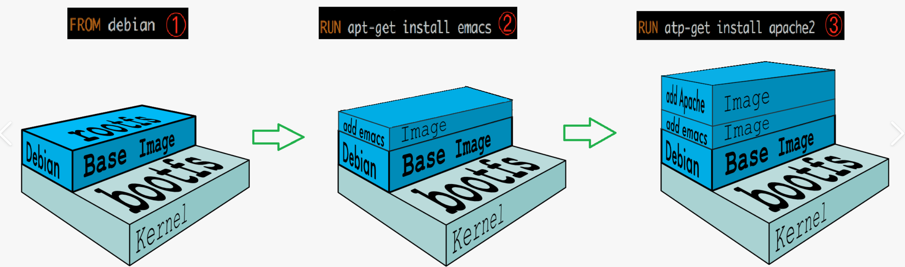
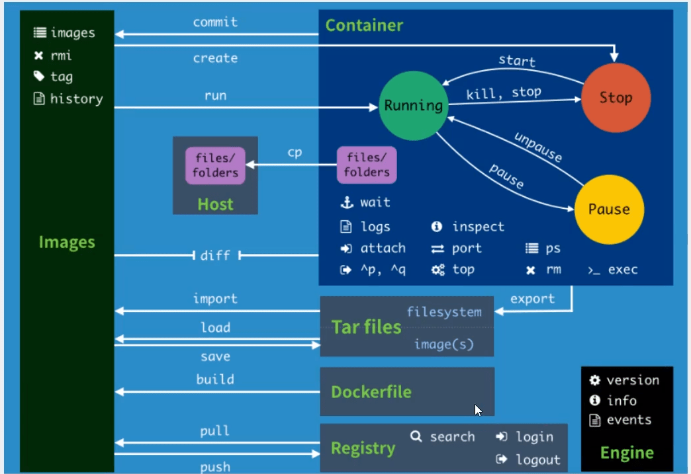

# Docker

很早之间就听说 docker 了，最近在 bilibili 上还看到了这么一个视频：[为什么我不用 Docker？](https://www.bilibili.com/video/BV163411C7jE) 着实把我笑拉了。而且在看 MMDetection3D 的时候发现可以通过 docker 安装，那么就尝试一下这个工具吧！也许又打开了新世界大门呢？更多关于科普的知识可以看这篇 [知乎](https://zhuanlan.zhihu.com/p/187505981)，这里引用其中一句话

>docker是一个用Go语言实现的开源项目，可以让我们方便的创建和使用容器，docker将程序以及程序所有的依赖都打包到docker container，这样你的程序可以在任何环境都会有一致的表现，这里程序运行的依赖也就是容器就好比集装箱，容器所处的操作系统环境就好比货船或港口，**程序的表现只和集装箱有关系(容器)，和集装箱放在哪个货船或者哪个港口(操作系统)没有关系**。

整个笔记参考 [狂神说 Docker](https://www.bilibili.com/video/BV1og4y1q7M4)，打算整理一些基本逻辑和命令，方便之后复习与查看

Link: [Docker Cheat Sheet](https://dockerlabs.collabnix.com/docker/cheatsheet/)

## 安装 Docker

这一步就不多说了，直接上 [官网](https://www.docker.com/) 下载，只需要下载 [docker engine](https://docs.docker.com/engine/install/ubuntu/)。如果下载慢可以考虑使用镜像，这里贴个本家 [NJU Mirror docker-ce](https://mirror.nju.edu.cn/help/docker-ce)

如果 docker hub 下载很慢的话依旧考虑使用镜像，[NJU Mirror docker hub](https://mirror.nju.edu.cn/help/docker-ce)

其中 Windows 安装 desktop 可能遇到报错 `WSL 2 installation is incomplete`，根据提示下载 [WLS_update_x64.msi](https://wslstorestorage.blob.core.windows.net/wslblob/wsl_update_x64.msi) 安装即可

## Docker 基本组成

1. 镜像（image）

   >When running a container, it uses an isolated filesystem. This custom filesystem is provided by a **container image**. Since the image contains the container’s filesystem, it must contain everything needed to run an application - all dependencies, configuration, scripts, binaries, etc. The image also contains other configuration for the container, such as environment variables, a default command to run, and other metadata.

2. 容器（container）

   >A container is a sandboxed process on your machine that is isolated from all other processes on the host machine. 

   一种形象的说法时，镜像是类 class，容器是类的实例 object

3. 仓库（repository）

   就像 github 一样，仓库 dockerhub 可以存放各种开源镜像以供大家下载，如果下载 dockerhub 的速度慢，依然可以使用国内镜像源进行下载，[NJU Mirror](https://mirror.nju.edu.cn/help/docker-hub)

## Docker 的常用命令

[官方参考文档](https://docs.docker.com/reference/)

### Basic

```shell
docker version						# 查看版本信息
docker info							# 显示 docker 的系统信息，包括镜像和容器的数量
docker [command] --help
```

### Image

```shell
# 查看镜像
docker images						# 查看 images
docker images -aq					# 查看所有 images id.
									# a for all, q for quiet
# 搜索镜像
docker search img_name				# 搜索镜像
docker search -f					# filter

# 下载镜像
docker pull name:tag				# 下载镜像，可以指定标签/版本

# 删除镜像
docker rmi img_name					# 移除镜像
docker rmi -f img_name				# 强制删除镜像
docker rmi -f $(docker images -aq)	# 强制删除全部镜像
docker image prune -a				# 清理没有使用的镜像

# 给镜像打标签
docker tag src_img dst_img:tag		# 创造新的镜像及新标签
```

### Container

有了镜像 image 过后才能创建容器 container，这一部分的命令是最核心的也是最多的

```shell
# 创建容器
docker run [opt] img
# 常用参数
--name string						# 给容器命名
-d, --detached						# 后台运行
-it									# 交互终端 interactive terminal
-p host_port:ctn_port				# 指定暴露端口
--rm								# 退出后删除容器
--hostname name						# 指定主机名

# 查看容器
docker ps							# 查看运行中的容器
docker ps -a						# 查看所有容器
docker ps -q						# 查看运行中的容器id
docker ps -n int					# 限制显示数量
docker logs --tail 10 ctn_id		# 查看容器操作日志
docker top ctn_id					# 查看容器进程
docker inspect ctn_id				# 查看容器元数据

# 退出容器
exit								# 完全退出
ctrl + P + Q						# 容器在后台仍运行

# 启动和停止容器
docker start ctn_id
docker start -ai ctn_id				# 启动并进入容器交互
docker restart ctn_id
docker stop ctn_id
docker kill ctn_id					# 强制停止

# 进入运行中的容器
docker exec -it ctn_id /bin/bash	# 进入容器并开启新终端
docker attach ctn_id				# 进入正在执行的终端

# 删除容器
docker rm ctn_id					# 删除指定容器
docker rm -f $(docker ps -aq)		# 强制删除所有容器

# 拷贝容器文件至主机
docker cp ctn_id:src_path dst_path	# 之后使用卷技术 -v 可以实现文件共享
```

以上的 `ctn_id` 指的时容器 id，也可以用容器名替代，如果有的话

补充：自己担心下载的镜像太多了会占用 C 盘，所以使用目录连接，将 docker appdata 移到了 D 盘

```cmd
# 管理员权限
mklink /j Docker D:\AppData\Docker
mklink /j target source
```

## Docker 镜像讲解

### 镜像加载原理

UnionFS 是一种分层、轻量级并且高性能的文件系统。支持对文件系统的修改作为一次提交来一层层的叠加，同时可以将不同目录挂载到同一个虚拟文件系统下。在这种层级结构下，如果有涉及到相同的文件，那么层与层间就可以共用了，极大节省资源

docker 的镜像实际上由一层一层的文件系统组成，这种层级文件系统就是上述的 UnionFS。接着，在内部又分为2部分：

- boot file system （bootfs）：docker镜像的最底层是bootfs，主要包含 bootloader（加载器）和 kernel（内核）。bootloader 主要是引导加载 kernel。注意 kernel 是与宿主机共享的，而且不用像虚拟机一样模拟硬件，所以 docker 加载很快，是秒级的
- root file system （rootfs）：包含典型的目录结构，包括 /dev, /proc, /bin, /etc, /lib, /usr, and /tmp 等再加上要运行用户应用所需要的所有配置文件，二进制文件和库文件。这个文件系统在不同的Linux 发行版（Ubuntu, CentOS...）中是不同的。而且用户可以对这个文件进行修改，对比之下，用户就不会修改 bootfs



Docker 镜像都是只读的，当启动容器时，一个新的可写层被加载到镜像的顶部，这一层就是通常说的容器层，容器之下的都叫镜像层

### Commit image

当你在容器中完成了你的应用，想要将该容器生成镜像，就可以使用 `docker commit ` 命令。本质上就是把你的容器层变为镜像层，加入到原来的镜像层中（root file system）再打包保存起来。因为是分层文件管理系统，所以这样的操作很方便

```shell
docker commit -a "author" -m "message" ctn_id img_name:tag
```

这样就可以打造自己的个性化镜像了，但之后还会有更高级的方法 Dockerfile 来创造镜像

### Save & load image

有时候不希望从网络下载镜像，可以使用 `docker save` 命令打包镜像，然后把镜像传输给需要的人，别人再用 `docker load` 将镜像加载即可

```shell
docker save -o xxx.tar img
docker save -i xxx.tar 
```

## 容器数据卷

这是一种将**数据持久化/共享数据**的技术。数据卷可以将容器与宿主机，容器与容器之间连接一个通道，进行数据共享，可同步修改。并且删掉其中一个容器的数据（不是修改），其他容器的共享数据并不会损坏，这就达到了持久化的效果

### 使用数据卷

```shell
# 在创建容器时通过参数 -v 挂载
-v, --volume=[host-src:]container-dest[:<options>]
# The 'host-src' is an absolute path or a name value.
# 通过多次 -v 参数挂载多个卷

# 指定路径挂载
# 如果不存在路径则自动创造
docker run -v host_dir:ctn_dir ctn_id

# 匿名挂载
# 仅传入容器内路径
docker run -v ctn_dir ctn_id

# 具名挂载
# 给卷添加名字，注意这区别于指定路径挂载
docker run -v name:ctn_dir ctn_id 

# 指定读写权限，如 ro 指容器只能读卷
docker run -v ctn_dir:ro ctn_id
docekr run -v ctn_dir:rw ctn_id

# 容器之间的共享卷
# 可以其他容器的卷挂载到当前容器下
docker run --volumes-from ctn_list ctn_id

# 查看所有卷的情况
docker volume ls
docker volume inspect volume_id
```

”挂载“的本质是在宿主机创造了一个数据卷 volume（如果实现没有该 volume 的话），可以把这个卷看作为一个共享文件夹，通过指定命令大家都可以来访问和修改

数据卷还可以使用 `docker inspect ctn_id` 查看详情，在 `Mount` 字段下记录有 `Source & Destination` 分别对应宿主机和容器内目录

除了通过 `-v` 命令挂载卷之外，还可以使用 Dockerfile 进行挂载，通过指定 VOLUME 字段，确定容器内挂载路径

```shell
VOLUME ["DIR_1","DIR_2",...]
```

以上的操作都是在创建容器时挂载卷，如果在创建好容器之后想要挂载卷应该怎么办呢？事实上也没有一个优雅的办法能解决，可以选择将该容器 commit 为镜像，然后再进行创建

## Dockerfile

在上一节首次提到了使用 dockerfile 挂载卷。Dockerfile 是用来构建 docker 镜像的文件，本质为一个命令参数脚本。先来看看一些官方的 dockerfile 是怎么写的😀

```dockerfile
FROM scratch
ADD ubuntu-focal-oci-amd64-root.tar.gz /
# 假设该压缩文件已经预先下载到后面指定的目录
CMD ["bash"]
```

这三行就创建了一个 Ubuntu 20.04 dockerfile，一般官方所给的都是最基础的，很多功能都没有，所以有时候需要自己创建 dockerfile 以及对应的镜像。简单介绍一下基础知识：

1. 所有命令都是大写
2. 命令按照顺序从上到下执行
3. 注释使用井号 #
4. 每个命令都会形成一个新的镜像层

### Dockerfile 命令

Dockerfile 的常用命令及其作用

- FROM：基于哪个基础镜像
- WORKDIR：指定shell命令运行在哪个目录下。为后续的 RUN、CMD、COPY、ADD 等命令配置工作目录。接下来的 COPY 和 ADD 命令中的相对路径就是相对于 WORKDIR 指定的路径
- COPY：将当前宿主机的文件拷贝到镜像中去（**copy的文件必须在build命令最后指定的路径内**）
- ADD：和COPY一样，并且还可以解压缩，或者从 url 拷贝文件到镜像中。**COPY 和 ADD 命令具有相同的特点：只复制目录中的内容而不包含目录自身**。
- RUN：构建镜像时运行的shell命令
- CMD：容器运行时执行的shell命令（**多个CMD只有最后一个生效，要想都执行可以使用&&连接多个命令**）（**如果容器run时，后面指定了shell版本，Dockerfile中的CMD也会被覆盖**）
- ENTRYPOINT：和CMD一样，但是可以追加（必须使用exec格式，即：ENTRYPOINT [./entrypoint.sh，参数1，参数2……]）
- EXPOSE：指定镜像暴露出来的端口
- VOLUMU：数据容器卷，指定映射文件，用于数据持久化
- ENV：指定环境变量
- LABEL：指定容器运行时标示
- SHELL：指定shell
- MAINTAINER：镜像维护者的姓名和邮箱地址
- ONBUILD：当构建一个父镜像时，父镜像被子镜像继承时，ONBUILD被触发

这里贴一个 mmdetection 3D 写的 dockerfile

```dockerfile
ARG PYTORCH="1.6.0"
ARG CUDA="10.1"
ARG CUDNN="7"

FROM pytorch/pytorch:${PYTORCH}-cuda${CUDA}-cudnn${CUDNN}-devel
# 如果预先没有下载该镜像，猜测会自动装，类似 docker run
ENV TORCH_CUDA_ARCH_LIST="6.0 6.1 7.0+PTX"
ENV TORCH_NVCC_FLAGS="-Xfatbin -compress-all"
ENV CMAKE_PREFIX_PATH="$(dirname $(which conda))/../"

RUN apt-get update && apt-get install -y ffmpeg libsm6 libxext6 git ninja-build libglib2.0-0 libsm6 libxrender-dev libxext6 \
    && apt-get clean \
    && rm -rf /var/lib/apt/lists/*

# Install MMCV, MMDetection and MMSegmentation
RUN pip install mmcv-full==1.3.8 -f https://download.openmmlab.com/mmcv/dist/cu101/torch1.6.0/index.html
RUN pip install mmdet==2.17.0
RUN pip install mmsegmentation==0.18.0

# Install MMDetection3D
RUN conda clean --all
RUN git clone https://github.com/open-mmlab/mmdetection3d.git /mmdetection3d
WORKDIR /mmdetection3d
ENV FORCE_CUDA="1"
RUN pip install -r requirements/build.txt
RUN pip install --no-cache-dir -e .
```

使用 dockerfile 生成镜像的常用命令

```shell
docker build -t name:tag -f dockerfile_name FILE_PATH
```

## 发布镜像

### DockerHub

1. 注册 dockerhub 账户

2. 登录，直接输入 `docker login` 就会提示进程，也可以带参数

   ```shell
   docker login -u username
   # Password:
   docker logout
   # 退出登录
   ```

3. 发布镜像 `docker push img:tag`

也可以选择国内仓库进行发布，例如阿里云，这里不过多介绍了

## 以图片小结 Docker




## 补充

1. Nvidia Docker。需要使用 GPU 的话必须安装 [nvidia-docker](https://github.com/NVIDIA/nvidia-docker)，安装方法参照 [install](https://docs.nvidia.com/datacenter/cloud-native/container-toolkit/install-guide.html#setting-up-nvidia-container-toolkit)，或者直接输入下面命令（参考 [zhihu](https://zhuanlan.zhihu.com/p/336429888)）

   ```shell
    ##首先要确保已经安装了nvidia driver
    # 1. 添加源
    distribution=$(. /etc/os-release;echo $ID$VERSION_ID)
    curl -s -L https://nvidia.github.io/nvidia-docker/gpgkey | sudo apt-key add -
    curl -s -L https://nvidia.github.io/nvidia-docker/$distribution/nvidia-docker.list | sudo tee /etc/apt/sources.list.d/nvidia-docker.list
    ​
    # 2. 安装并重启
    sudo apt-get update && sudo apt-get install -y nvidia-container-toolkit
    sudo systemctl restart docker
    # sudo service docker restart
   ```

   如果使用了 WSL 没有 `systemctl` 命令，可以使用 `sudo service docker restart` 完成服务重启

   安装完成后可以通过 `docker run --gpus all` 来让容器使用 GPU 

2. Docker pull 镜像。由于 docker pull 需要保持网络的通常，所以使用好的镜像站是不错的选择，各个镜像站应该都有，比如 [南大镜像](https://mirror.nju.edu.cn/help/docker-hub)，使用 docker info 检查是否更新成功

3. Docker 与权限。为了不每次都用 sudo，可以将自己的用户加入到 docker group，这个操作我记录在 vscode 笔记中

4. 我个人常用的操作是：

   ```shell
   docker run -it --gpus all --shm-size 8g -v /data:/data -v /project:/project --net host --name name image_id
   ```

    做了这几个事情：

   1. 打开交互终端
   2. 配置 GPU
   3. 配置容器内存
   4. 挂载数据和项目
   5. 配置网络，使得容器能够使用 host 网络。除了使用网络外，还能够让 docker 与 host X server 进行交流，使得像 matplotlib 这样的画图能够直接呈现在显示器上 
   6. 并给容器取名
   7. 指定 image id
   
   如果是使用 wsl，这么配置甚至能够直接使用 matplotlib，直接在 window 中弹出可视化窗口
