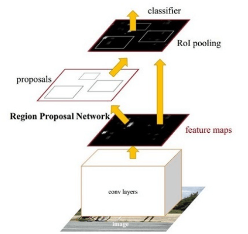
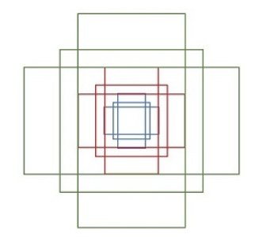
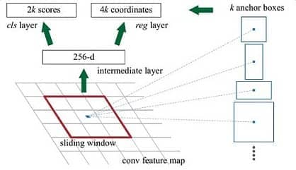
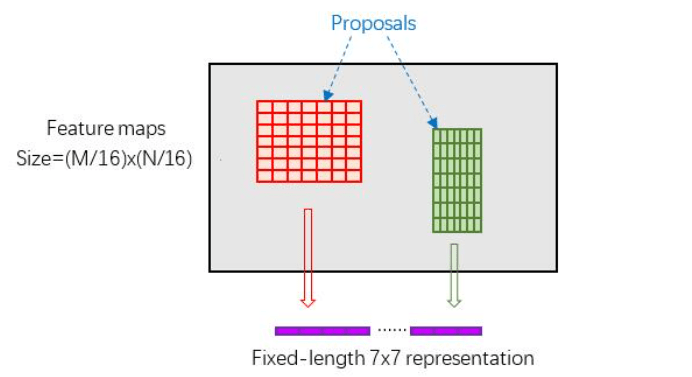
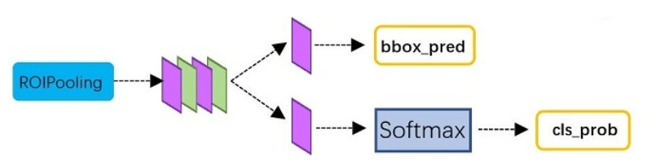

# Faster RCNN note

参考 [知乎链接](https://zhuanlan.zhihu.com/p/31426458)

## 整体思路

Faster RCNN其实可以分为4个主要内容：

1. Conv layers 

   Faster RCNN首先使用一组基础的conv+relu+pooling层提取image的feature maps。该feature maps被共享用于后续RPN层和全连接层。

2. Region Proposal Networks

   该层通过softmax判断anchors属于positive或者negative，再利用bounding box regression修正anchors获得精确的proposals。

3. Roi Pooling

   该层收集输入的feature maps和proposals，综合这些信息后提取proposal feature maps，送入后续全连接层判定目标类别。

4. Classification

   利用proposal feature maps计算proposal的类别，同时再次bounding box regression获得检测框最终的精确位置。



## Conv Layers

Conv layers部分共有13个conv层，13个relu层，4个pooling层 

1. 所有的conv层都是：kernel_size=3，pad=1，stride=1
2. 所有的pooling层都是：kernel_size=2，pad=0，stride=2

那么，一个MxN大小的矩阵经过Conv layers固定变为(M/16)x(N/16)

## Region Proposal Networks

### Anchors

提到RPN网络，就不能不说anchors。所谓anchors，实际上就是一组由程序生成的矩形。直接运行作者demo中的generate_anchors.py可以得到以下输出 (不要被这些数字吓到了，没有具体意义)

```python
[[ -84.  -40.   99.   55.]
 [-176.  -88.  191.  103.]
 [-360. -184.  375.  199.]
 [ -56.  -56.   71.   71.]
 [-120. -120.  135.  135.]
 [-248. -248.  263.  263.]
 [ -36.  -80.   51.   95.]
 [ -80. -168.   95.  183.]
 [-168. -344.  183.  359.]]
```

每行有4个值，代表了矩形左上角和右下角两个点$(x_1, y_1, x_2, y_2)$ 

一共9个矩形，来组于不同长宽比和不同大小的组合：长宽比有3种，1:1, 1:2, 2:1



那么这9个anchors是做什么的呢？借用Faster RCNN论文中的原图，如图7，遍历Conv layers计算获得的feature maps，为每一个点都配备这9种anchors作为初始的检测框



简单解释一下上图：

1. conv feature map中，每一个点都是256-dimensions

2. intermidiate layer为 3x3 卷积，out put dimension为256，得到新的conv feature map

3. 在新的conv feature map上，我们对每一个点预先设定的k个anchor做bounding box regression和softmax分类(positive, nagetive两类)，分别对应4k coordinates，2k scores

   换句话说，就是把某一anchor区域中的特征向量拿去做prediction，预测内容为该点的分类和该点/anchor对应的bounding box参数

4. 由于anchor数量是巨大的，训练程序会在合适的anchors中**随机**选取128个postive anchors+128个negative anchors进行训练

### Bounding box regression原理

怎样在anchor的基础上回归得到ground truth标签呢？

给定anchor $(A_x, A_y, A_w, A_h)$ ，给定ground truth $(G_x, G_y, G_w, G_h)$

我们只要去预测中心点的位置偏移，以及矩形长宽的缩放即可

个人觉得这样的回归方法有点麻烦，这样来看CenterNet中的bounding box回归是相当直接的

### Proposal 

1. 生成anchors，得到对应的confidence score & bounding box regression，形成最初的proposal
2. 对所有anchors，根据positive score进行排序，取前6000个anchor proposals
3. 去除较小和超出边界的proposal
4. NMS

## ROI Pooling

Rol pooling层有2个输入：

1. 原始feature maps
2. RPN输出的proposals

这一个Pooling操作还要有一个功能，就是需要处理不同大小的proposal (kernel)。经典的pooing操作是使用相同大小的kernel，这里我们要预先对 proposal (region of interest) 进行统一的分割，使得pooling结果是相同的表示(如下图)



## Classification

Classification部分利用已经获得的proposal feature maps，通过full connect层与softmax计算每个proposal具体属于那个类别（如人，车，电视等），输出cls_prob概率向量；同时再次利用bounding box regression获得每个proposal的位置偏移量bbox_pred，用于回归更加精确的目标检测框



## Training

Faster R-CNN的训练，是在已经训练好的model（如VGG，ZF）的基础上继续进行训练，实际训练过程为以下：

1. 在已经训练好的model(e.g. VGG)，训练RPN
2. 用步骤1中得到的RPN提出proposal
3. 用提出的Proposal训练Fast RCNN
4. 用步骤4中训练好的Fast RCNN继续训练RPN
5. 重复2
6. 重复3

可以看出这是一种类似迭代的过程，但只循环了2次，文章提出更多的循环并不会带来相应的提升

## 现代 Faster RCNN

经过多年的目标检测发展，Faster R-CNN 也不是从前的模样了，变得更加强大，现在的 Faster R-CNN 更想是一种两阶段目标检测器的范式思想，而不仅局限于模型的细节

参考：[Faster R-CNN](https://www.bilibili.com/video/BV1af4y1m7iL) [FPN](https://www.bilibili.com/video/BV1dh411U7D9) [Faster R-CNN code](https://www.bilibili.com/video/BV1of4y1m7nj)

实际上现在的 Faster R-CNN 的结构已经和最初提出来的结构不太一样了，下面逐点介绍：

1. **加入了 FPN 结构**，需要对每一个尺度的特征层做单独的处理。这也是增加整个模型复杂度的一个步骤，在不同分辨率上的特征图谱生成对应的 anchors，获得 proposals，这些 proposals 将统一生成 rois。不同大小的 rois 将分配到不同本编率的特征图谱进行 refine，即第二阶段的预测
2. 训练的方式不再是分开训练，而是**使用端到端训练**
3. **使用 [RoI Align](https://paperswithcode.com/method/roi-align) 去替代 RoI Pooling**。简单来讲利用了 bilinear interpolation 更方便获得采样点特征

参考链接建议阅读 [pytorch vision reference](https://github.com/pytorch/vision/tree/main/references/detection) [pytorch vision model](https://github.com/pytorch/vision/tree/main/torchvision/models/detection) 中实现的源码，顺便吐槽一下 mmlab 的代码实属封装太多，不建议新手直接硬冲

### GeneralizedRCNNTransform

对图像进行归一化，缩放（包括 gt），并将 batch 进行打包（因为缩放过后各个 sample 大小都不一样），方法是使用该 batch 中最大的长宽作为对齐形状，空余部分填零。最终返回 `ImageList` 类用于存储打包后的图片以及它们 transform 后的 `image_sizes`

由于进行了缩放操作，所以在后处理中需要对缩放进行还原

### RPN

#### RPNHead

通常来讲网络的结构是非常简单的，但是在分配目标和计算损失函数才是最核心的部分

```python
    def forward(self, x):
        # type: (List[Tensor]) -> Tuple[List[Tensor], List[Tensor]]
        logits = []
        bbox_reg = []
        for feature in x:
            t = F.relu(self.conv(feature))
            logits.append(self.cls_logits(t))
            bbox_reg.append(self.bbox_pred(t))
        return logits, bbox_reg
```

可以看到这里的前向方程非常的简单，并且考虑了 FPN 的多尺度特征图谱，且共用的 RPN

#### Anchor

而其中最复杂的当然要属 `AnchorGenerator`，先看其重要的参数

```python
            anchor_sizes = ((32,), (64,), (128,), (256,), (512,))
            aspect_ratios = ((0.5, 1.0, 2.0),) * len(anchor_sizes)
```

`anchor_sizes` 就是 anchor 在特征图谱上的大小（pixel），该变量是由多个元组组成一个大元组。每个元组可以有多个 `sizes` 上面只列出一个，并且每个元组对应着一个 FPN layer，所以有多少个元组，FPN layer 就有多少个。上面配置的 `anchor_sizes` 的大小是不合理的，因为其值在不断地变大，大分辨率的特征图谱还用大的 anchor 就是去意义了

`aspect_ratios` 代表 anchor 的长宽比，每个大小的 anchor 有多个长宽比以增加多样性

总结对每个分辨率的特征图谱生成的 anchor 形状为 $(H\times W \times sizes\times ratios,4)$ ，而且 anchor 的中心是在 grid point，也就是格点处，而不是在 pixel center 像素中心（根据 pytorch 官方代码来看）

在生成类似格点的张量时可以使用 `torch.meshgrid` 方法，并且充分利用广播机制

#### Proposal

直接上前向方程代码

```python
    def forward(self,
                images,       # type: ImageList
                features,     # type: Dict[str, Tensor]
                targets=None  # type: Optional[List[Dict[str, Tensor]]]
                ):
        # type: (...) -> Tuple[List[Tensor], Dict[str, Tensor]]
        # RPN uses all feature maps that are available
        features = list(features.values())
        objectness, pred_bbox_deltas = self.head(features)
        anchors = self.anchor_generator(images, features)

        num_images = len(anchors)
        num_anchors_per_level_shape_tensors = [o[0].shape for o in objectness]
        # get number of anchors for each FPN level, used in filter_proposals
        num_anchors_per_level = [s[0] * s[1] * s[2] for s in num_anchors_per_level_shape_tensors]
        # flatten each FPN level's prediction, and concat and reshape them as (Bx(N1+N2+...), C)
        objectness, pred_bbox_deltas = concat_box_prediction_layers(objectness, pred_bbox_deltas)
        # apply pred_bbox_deltas to anchors to obtain the decoded proposals
        # note that we detach the deltas because Faster R-CNN do not backprop through
        # the proposals
        proposals = self.box_coder.decode(pred_bbox_deltas.detach(), anchors)
        proposals = proposals.view(num_images, -1, 4)
        boxes, scores = self.filter_proposals(proposals, objectness, images.image_sizes, num_anchors_per_level)	# boxes & scores are a list of tensor, length is batch size

        losses = {}
        if self.training:
            assert targets is not None
            labels, matched_gt_boxes = self.assign_targets_to_anchors(anchors, targets)
            regression_targets = self.box_coder.encode(matched_gt_boxes, anchors)
            loss_objectness, loss_rpn_box_reg = self.compute_loss(
                objectness, pred_bbox_deltas, labels, regression_targets)
            losses = {
                "loss_objectness": loss_objectness,
                "loss_rpn_box_reg": loss_rpn_box_reg,
            }
        return boxes, losses
```

用语言总结：

1. 将 FPN features 输入到 RPN 中获得 dense proposals
2. 将多尺度的 proposals concat，并利用 anchors 解码获得真正的 boxes
3. 将 proposals 进行过滤，保留最多 2000 个用于之后的两阶段细化，过滤后的结果都是以 list of tensor 存在
4. 如果为训练阶段，为每个 anchor 分配 target 并为预测的 dense proposals 计算损失

这里再说一下正负样本匹配。有两个阈值 `hight & low`，如果 anchor 和 IoU 超过 `high` 则是正样本，如果低于 `low` 则是负样本，如果在两者之间则不参与损失计算，除此之外和 gt IoU 最大的 anchor 也是正样本。并且由于正负样本的不平衡，还使用了正负样本 1:1 的采样方法，总个数为 256。但如果使用了 Focal Loss 就不需要采样

### RoI

上代码

```python
    def forward(self,
                features,      # type: Dict[str, Tensor]
                proposals,     # type: List[Tensor]
                image_shapes,  # type: List[Tuple[int, int]]
                targets=None   # type: Optional[List[Dict[str, Tensor]]]
                ):
        # type: (...) -> Tuple[List[Dict[str, Tensor]], Dict[str, Tensor]]
        """
        Arguments:
            features (List[Tensor])
            proposals (List[Tensor[N, 4]])
            image_shapes (List[Tuple[H, W]])
            targets (List[Dict])
        """
        if self.training:
            proposals, matched_idxs, labels, regression_targets = self.select_training_samples(proposals, targets)
        else:
            labels = None
            regression_targets = None
            matched_idxs = None

        box_features = self.box_roi_pool(features, proposals, image_shapes)
        box_features = self.box_head(box_features)
        class_logits, box_regression = self.box_predictor(box_features)

        result = torch.jit.annotate(List[Dict[str, torch.Tensor]], [])
        losses = {}
        if self.training:
            assert labels is not None and regression_targets is not None
            loss_classifier, loss_box_reg = fastrcnn_loss(
                class_logits, box_regression, labels, regression_targets)
            losses = {
                "loss_classifier": loss_classifier,
                "loss_box_reg": loss_box_reg
            }
        else:
            boxes, scores, labels = self.postprocess_detections(class_logits, box_regression, proposals, image_shapes)
            num_images = len(boxes)
            for i in range(num_images):
                result.append(
                    {
                        "boxes": boxes[i],
                        "labels": labels[i],
                        "scores": scores[i],
                    }
                )
```

`self.select_training_samples` 依然会使用 1:1 的正负样本采样策略，采样最多 512 个。无所谓是否每个 sample 的采样数量都是一样的，因为最终能够通过 proposals 的长度将 concat 后的预测结果分配到每个 sample

`self.box_roi_pooling` 利用 `image_shapes` 可以推断每个 feature map 的缩放大小 scale，然后将 proposals 分配到对应尺度的 feature map 上进行 roi pooling，最后输出一个大的 tensor，形状是 $(N_1+N_2+..., C)$。可以注意到这里是将 batch cancat 起来的，但有时候 batch 是要分开的，具体什么时候 concat 什么时候分开为 list，没有办法进行整理，具体情况具体分析，基本原则是如果方便与批量处理就可以进行 concat

### FPN

参考 [bilibili](https://www.bilibili.com/video/BV1dh411U7D9)

FPN 主要是用在 RoI Pooling 模块里，即不同的 proposal 在不同尺度的 feature map 上进行特征提取

### SSD

参考 [bilibili](https://www.bilibili.com/video/BV1fT4y1L7Gi)

由于我一开始入坑的是点云目标检测，所以我对于 SSD 最开始的理解就是源于 SECOND 网络，但是一直没有去了解图像中的 SSD 模型是什么样的。现在回过头来看，模型之间的差异并没有那么大，理解起来也比较轻松

个人认为差异最大的地方来自于类 FPN 结构，虽然点云目标检测中也有类似 FPN 结构存在，但是最终的预测都是基于单个尺度的 BEV 特征图谱进行，而没有在多个尺度的特征图上进行。FPN 的思想简单来讲：就是将不同大小的物体分配到不同尺度的特征图上，分别进行预测
