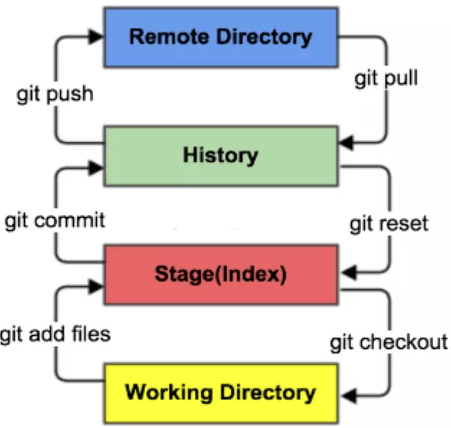
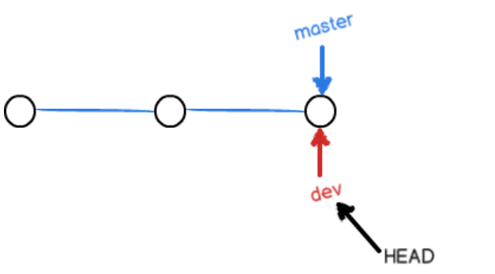
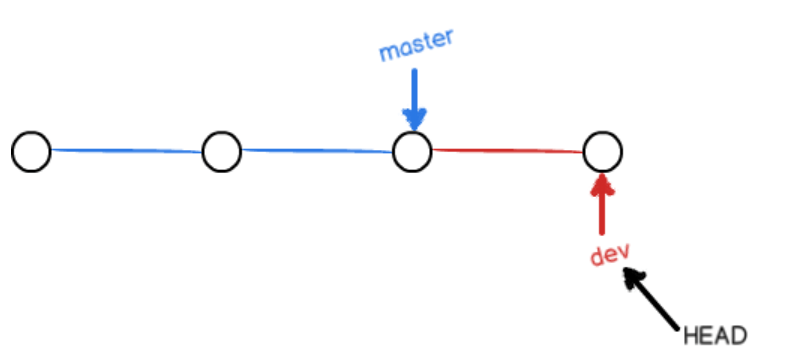
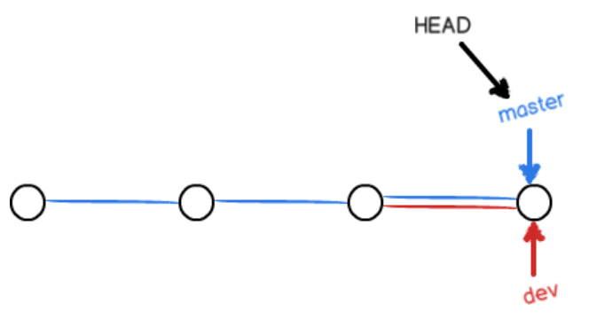
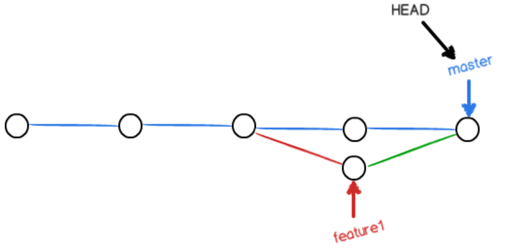

# Git reorganiszed note

重新整理了 git 的常用操作命令，能够覆盖大部分版本管理场景，适合作为提纲进行复习

整理来自：[bilibili](https://www.bilibili.com/video/BV1FE411P7B3?from=search&seid=1905221215711628694) [廖雪峰教程](https://www.liaoxuefeng.com/wiki/896043488029600)

## 下载

当遇到国外资源下载很慢的时候，可以考虑使用镜像资源

视频里使用了淘宝镜像安装 windows 版本 https://npm.taobao.org/mirrors/

ubuntu 直接使用 `apt install git` 使用阿里云镜像

## Git 配置

首先要理解的是，在windows 中 git bash 的基本操作命令和 Linux  terminal 是一样的。在 Linux 中 git 是集成到 terminal 当中的

### git config

配置用户名和邮箱

```shell
git config --global user.name 'DeclK'
git config --global user.email '***@qq.com'
```

之后的所有提交都会使用你的用户和邮箱

还可以根据需求配置代理

```shell
# 设置代理
git config --global http.proxy http://127.0.0.1:1080
# 查看代理
git config --global --get http.proxy
# 取消代理
git config --global --unset http.proxy
```

## Git 基本理论

直接上图，重点关注左侧命令



从工作区 -> 暂存区：`git add`

从暂存区 -> 本地仓库：`git commit`

从本地仓库 -> 远程仓库：`git push`

这三个命令就能够让你感受到 git 版本控制的基本流程

## Git 仓库搭建

### git init & git clone

生成仓库(master 分支)的两种方法

1. `git init` 初始化，生成 .git 文件
2. `git clone url` 克隆远程仓库，默认克隆所有分支，但是仅将 master 分支检出到本地，可通过 git switch 切换分支
3. `git clone -b branch_name url` 克隆指定分支，还可加上 `--single-branch` 这样将不会保留其他分支的记录

删除仓库则只需要删除 .git 文件夹即可

### git proxy 代理

如果在 clone 项目的时候发现速度很慢，推荐使用国内的镜像源，如：[gitclone](https://gitclone.com/) [fastgit](https://doc.fastgit.org/zh-cn/)

```shell
git config --global url."https://gitclone.com/".insteadOf https://
```

可以使用 `git config --list` 查看当前的配置，如果需要重新配置的话，可以编辑 `~/.gitconfig`

下载 release 时可以使用 [github proxy](https://ghproxy.com/)，或者使用油猴插件 [github 增强](https://greasyfork.org/zh-CN/scripts/412245-github-%E5%A2%9E%E5%BC%BA-%E9%AB%98%E9%80%9F%E4%B8%8B%E8%BD%BD) 非常好用👍

有时候在 clone 自己的私密仓库的时候也非常慢，出现错误 `port 22: Connection timed out`，可以使用换一个 port，在 `~/.ssh/config` 中加入下面设置，[link](https://docs.github.com/en/authentication/troubleshooting-ssh/using-ssh-over-the-https-port)

```.ssh/config
Host github.com
Hostname ssh.github.com
Port 443
```

## Git 文件基本操作

### git status

`git status` 查看 git 文件状态，`git status file_name` 可指定文件

文件的几种状态：

1. untracked 文件在文件夹中，从没有 add 过
2. unmodify 文件已经 commit 且库中最新版本和当前文件是一致的，可以通过 `git rm` 将其移出版本库管理
3. modified 文件在 commit 或者 add 过后有过修改，可以使用 `git checkout` 丢弃修改
4. staged (文件在之前 commit 过后有过修改) 经过 add，没有 commit

当存在文件为中文命名时 git status 会显示为转义数字串形如 \351\237... 这样的乱码解决方法如下

```shell
git config --global core.quotepath false
# core.quotepath的作用是控制路径是否编码显示的选项, 当字符为中文时会转义输出
```

### .gitignore

有些时候我们不想把某些文件纳入版本控制中，可在主目录下建立 .gitignore 文件，常用规则如下

1. 以斜杠"/"开头表示忽略根目录下的某个文件夹下的内容，不会忽略子文件夹；以"/"结束的模式，会忽略任意位置的某个文件夹，子文件夹也会忽略。如果一个模式不包含斜杠，则它匹配那么将会同时忽略同名的文件和目录

2. 以星号"*"通配多个字符，即匹配多个任意字符；使用两个星号表示匹配任意中间目录，比如a/**/z可以匹配 a/z, a/b/z 或 a/b/c/z等

    ```gitignore
    /node_modules	# 忽略根目录下的 node_modules 文件夹
    node_modules	# 忽略 node_modules 文件和文件夹
    *.log			# 不提交包含后缀名为log的文件
    ```

3. 我们有时候希望忽略大部分文件，但仅对小部分文件进行保留，可以使用反选操作 `!`

   采用下面的文件结构作为例子

   ```txt
   - root dir
   	- folder
   		-file_1
   		-file_2
   		-subfolder
   			-file_3
   	file_0
   ```

   下面是一些常见用法

   ```gitignore
   # ignore all files, folders and subfolders
   *
   # do not ignore file in the root folder
   !file_0
   
   # do not ignore the folder in the root folder 
   !folder
   
   # do not ignore the folder and the file
   !folder
   !folder/*
   
   # do not ignore the folder and the subfolder files
   !folder
   !folder/**
   ```

   反选操作有一个规则：当所选文件或者文件夹的父文件没有被忽略时，反选操作才会有效，例如下面的操作是不会有效的

   ```gitignore
   # won't work, because folder is ignored
   !folder/file
   ```

   也告诉我们，folder 和 file 的跟踪是分开来看的

### git add

`git add file_name` 将文件加入暂存区，文件成为 staged 状态

`git add .` 将当前文件夹 add，比较方便快捷

### git commit

`git commit -m 'message content'` 将暂存区所有文件加入到版本库中，并留下此次提交的 message

`git commit -am 'message content'` 将同时完成 `git add all`（即将所有改动文件加入暂存区）和 `git commit` 操作

`git commit --amend` 可以修改上一次提交的 commit message

当你想要将最近的多个 commit 融合为一个 commit 时，就需要 git rebase

`git rebase -i HEAD~n` 这里 `-i` 代表 interactive 模式，你需要将最后 n 个 `pick` 替换为 `squash`，仅保留一个 `pick` 即可，然后保存退出，git 会再提示你输入新的 commit message，输入完成后保存退出 

修改默认的 git commit editor 为 vscode，`git config --global core.editor "code --wait"`

### git rm

`git rm --cached file_name` 将已经 commit 的文件从版本库中移除变为 untracked 文件

`git rm file_name` 不使用参数则代表彻底删除该文件

## Git 版本回退

### git log & git reflog

`git log` 查看 commit 历史记录，id，作者等信息

`git reflog` 查看所有的操作

### git reset

`git reset --hard commit_id` 将回退到某一个 commit 版本，id 只用写前几位，git 自动识别

`git reset --hard HEAD^` 将回退到上一个 commit 版本，如果回退两个则是 HEAD^^

`--hard` 参数其实代表回退到某个 commit 后，该 commit 之后的记录都会被丢弃。但 git 永远都有后悔药吃，如果回退到以前的版本想要再回来，使用 git reflog 查看所有命令

`git reset --soft commit_id` 回退到之前的版本，并不改变工作区和暂存区

### git checkout

`git checkout filename` 能够让文件回到最近一次 add 或者 commit 时的状态

`git checkout commit_id` 能够直接将工作区切换到指定版本。这是一种 detached head 状态，git 会将 HEAD 指针指向该 commit_id，你可以对文件做一些修改，然后提交一个新的 commit，最后通过 `git switch -c new_branch` 生成一个新的分支。所以 git checkout commit_id 类似于创建一个临时的分支，相比于 `git reset --hard` 是一种更安全的切换版本命令

### git stash

git stash 使用场景：当你正在某个分支进行开发，忽然想要切换到其他分支，但是当前分支的工作区的开发并未完成，你不想要提交一个 commit，这个时候就需要使用 stash

`git stash` 可以直接将工作区的修改存储到暂存区，经过 stash 过后你会发现之前修改的文件都变回了未更改的内容。并且，你可以进行多次的存储：stash -> modify -> stash again -> modify again ->...

`git stash save 'message'` 可以给每一次 stash 进行命名

`git stash list` 可以查看所有的 stash

`git stash pop` 会释放最近一次的 stash 所存储的更改，你会看到最前保存的更改又回到了文件当中

`git stash apply stash@{index}` 会将指定 index stash 所存储的内容释放

`git stash drop stash@{index}` 会删除指定 index stash 所存储的内容

### git rebase

rebase 一种较危险的 merge 操作，会更换节点的基底

```txt
# before rebase
--A--B--M (master branch)
     |
     C--D (feature branch)

#(at feature branch) git rebase master
--A--B--M--C'--D'
```

在 rebase 的过程中需要处理 C, D 与 M 之间的提交冲突。由于在变基过后无法追溯代码分支与合并过程，所以增加了追溯问题的难度

## 分支与冲突

### git branch

从这里我们可以更加深入理解 git 的工作形象，working tree

除了 master 分支，我们还可以创建其他分支，HEAD 所指的就是 working tree “生长”的地方，然后我们将分支合并，也即让 master “赶上来”，再删除 dev 分支。git 分支还有一个一般规则是，master 分支永远是最稳定的分支，开发都在 dev 或其他分支上进行







`git branch` 可以查看分支情况，使用 `git branch --all` 查看所有分支，包含远程分支

`git branch -d branch_name` 用于删除分支

### git switch

`git switch -c branch_name` 使用 git switch 来创建分支

`git switch branch_name` 使用 git switch 来切换分支

`git switch --guess branch_name` 切换到远程分支，因为 git clone 默认只显示主分支，其他远程分支被隐藏起来了。实际上 `--guess` 其实是默认选项，所以只使用 `git swtich branch_name` 就足够了

但是有时候 remote 分支没有被拉到本地来，我们需要使用 `git fetch origin branch_name` 来获取远端分支

### git merge

`git merge branch_name` 将某个分支合并到当前分支

如果发生了冲突：两个 branch 中在同一个文件中有不同的修改而无法合并，那么需要解决冲突。（判断文件是否有修改，是根据 commit id 之类的标记节点来判断的，但是否存在冲突则是根据文件的内容）



先使用 `git status` 查看哪个文件发生冲突，然后使用 vim 编辑，git 会自动在文档中标明冲突的地方。怎样修改无所谓，只要你 add & commit 过后，git 就会默认冲突解决，并将你的文件作为最新的版本加入版本库中，更新 working tree

如果对于 git 中 recursive 3-way merge 算法感兴趣，可以参看 [维基百科](https://en.wikipedia.org/wiki/Merge_(version_control))

可以使用 `git diff HEAD` 来查看哪些文件有改变，或者有冲突，查看单个文件的话可以直接 `git diff (--staged) file`

## 远程仓库

### 添加远程仓库 github or gitee

gitee 为国内网站，传输速度更快。通过以下步骤将本机与远程连接（以 github 为例）：

1. 注册 github 账号

2. 生成 ssh 公钥

   1. 在本机 user 目录下找到 ssh 文件夹（安装 git 过后这个文件夹会自动生成）

   2. 在 shell 中运行以下命令生成 ssh 密钥，其中 rsa 是一种加密算法 

      `ssh-keygen -t rsa`

      之后你就能在 .ssh 文件中找到 id_rsa 和 id_rsa.pub 文件

3. 添加 id_rsa.pub 到 github 账户设置中

这样就把本机和远程仓库连接起来了，具体的说是将本机与你的 github 账号通过 ssh 连接起来了

### git remote

你的账号里可以有很多的仓库，我们想要将本地仓库与某一个指定仓库链接使用以下命令即可

`git remote add origin [url]`

远程仓库的名字叫 origin，这是 git 的默认叫法，url 是仓库的 https 或者 ssh

`git remote -v` 查看添加的远程仓库，`-v` 代表 verbose 模式，该不带参数仅返回远程仓库的名字 `origin` 

`git remote remove origin` 移除与远程仓库的链接

### git push

把本地库的内容推送到远程仓库，使用下面命令

`git push -u orgin master`

这样就把本地 master 分支内容推送到了远程的 master 分支。-u 参数为 set upstream 的意思，在推送的同时将我们的本地 master 分支和远程 master 分支联系起来（相当于作了 `git branch -u origin/master` ），今后则可以直接输入 git push 来简化推送命令，强烈建议在第一次 push 的时候带上 -u 参数

其他本地分支与远程分支的 push 和连接也是一样的，把上面命令的 master 改为对应分支的名字（例如：dev 分支）即可，前提是本地要切换到那个分支，且远程存在同名的分支

个人认为 `git push` 一般是在同名的本地分支和远程分支之间进行

### git pull

文件冲突不仅出现在本地的 merge 当中，也存在在 push 操作当中。push 的本质也是将本地和远程这两个 branch 进行融合。当这个远程仓库只有你一个人在 push 时，是不会有冲突的，因为远程的 working tree 只会一直往前延伸；当有多个人都在对某一个文件进行修改，working tree 就相当于有了多个分支，在 push 的时候就会形成冲突。如果有远端的冲突形成，就需要使用 `git pull`

`git pull` 有两个作用，一个是拉取代码到本地，另一个是尝试与本地代码合并，如果不能使用 fast forward 合并，则需要自己来修改冲突部分，这部分和 `git merge` 是一样的

### 搭建自己的远程仓库

> 远程仓库实际上和本地仓库没啥不同，纯粹为了7x24小时开机并交换大家的修改。GitHub就是一个免费托管开源代码的远程仓库。但是对于某些视源代码如生命的商业公司来说，既不想公开源代码，又舍不得给GitHub交保护费，那就只能自己搭建一台Git服务器作为私有仓库使用。

依旧是参考 [廖雪峰教程](https://www.liaoxuefeng.com/wiki/896043488029600/899998870925664)，不过自己在实现时有一些区别。在进行 git clone 操作时，克隆的链接不应该使用绝对路径 `git clone git@server:/srv/sample.git` 应该去掉第一个斜杠 `git clone git@server:srv/sample.git`

### 仅保留当前 commit

随着 commit 的数量越来越多，可能我们只想保留最新的代码，不想再做历史版本的管理了。可以使用如下方法

```shell
# 1. 切换分支
git checkout --orphan latest_branch
# 2. 添加到暂存区
git add -A
# 3. 提交更改
git commit -am "commit message"
# 4. 删除分支
git branch -D master
# 5. 重命名分支
git branch -m master
# 6. 强制提交到远程仓库
git push -f origin master
```

## Git + IDE

现在 git 和很多 IDE 都有联动，可以直接在 IDE 中方便的操作 git，甚至将 git 可视化，可以直观看到你对文件的修改

以 pycharm 和 vscode 为例，只要在你的项目文件夹下有 .git 文件即可，如果没有则使用 git init 新建 
