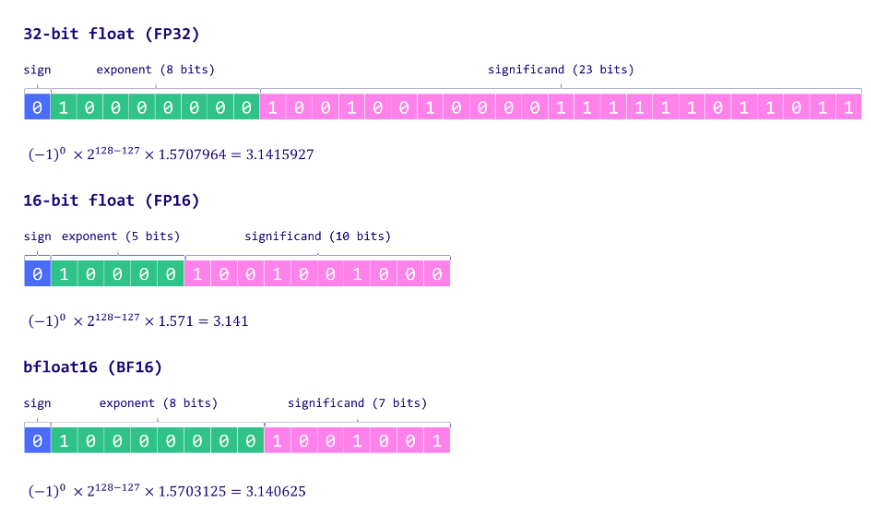
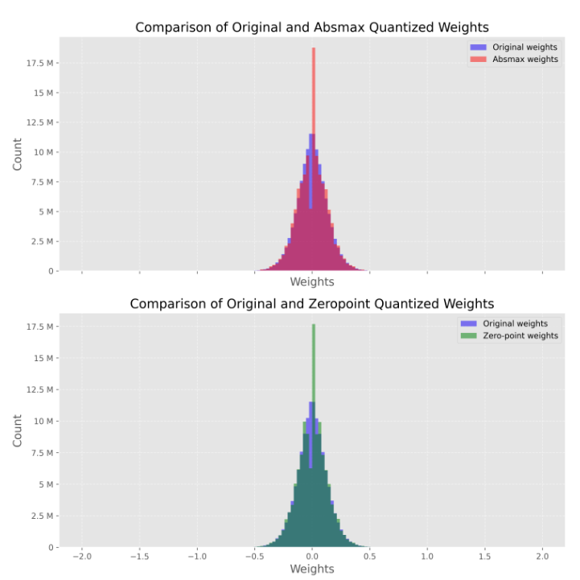

## LLM 1

学习 LLM 量化相关的知识，这是基础知识篇

学习内容：[Introduction to Weight Quantization](https://mlabonne.github.io/blog/posts/Introduction_to_Weight_Quantization.html) [llm-course](https://github.com/mlabonne/llm-course)

## Concept

- 什么是量化？为什么需要量化

  store weight using lower-precision data types, save memory

- 如何表示一个浮点

  fp32 单精度，全精度

  fp16 半精度

  bf16 半精度

  

  ```python
  # fp32 number
  import torch
  sign = 1
  expoent = 2. ** 127
  mantissa = 1. - 2. ** -23   # 0.11111111111111111111111 in binary
  # max_num is normalized number
  max_num = torch.tensor([sign * expoent * (1 + mantissa)]).float()
  num2 = max_num - 1
  print(f'max_num: {max_num}')
  print(num2==max_num)
  # max_num: tensor([3.4028e+38])
  # tensor([True])
  
  sign = 1
  expoent = 2. ** -126
  mantissa = 2. ** -23    # 0.00000000000000000000001 in binary
  # min_num is denormalized number
  min_num = torch.tensor([sign * expoent * mantissa]).float()
  num2 = min_num + 1
  print(f'min_num: {min_num}')
  print(num2==1)
  # min_num: tensor([1.4013e-45])
  # tensor([True])
  ```

  fp32 的表示范围在 **1.4013e-45到3.4028e+38**，显然有一些数字是无法用 fp32 表示出来的，即使这个数字在 fp32 的表示范围内

  normalized & denormalized

  inf & NaN

- **absolute maximum (absmax) quantization**, also it is a symmetric quantization

  ```python
  import torch
  
  def absmax_quantize(X):
      # Calculate scale
      scale = 127 / torch.max(torch.abs(X))
  
      # Quantize
      X_quant = (scale * X).round()
  
      # Dequantize
      X_dequant = X_quant / scale
  
      return X_quant.to(torch.int8), X_dequant
  ```

  symmetric: 0 in X is also 0 in quantized X

- **zero-point quantization**, also it is an asymmectric quantization

  simple linear projection

  solving a linear equation

  ```python
  def zeropoint_quantize(X):
      # Calculate value range (denominator)
      x_range = torch.max(X) - torch.min(X)
      x_range = 1 if x_range == 0 else x_range
  
      # Calculate scale
      scale = 255 / x_range
  
      # Shift by zero-point
      zeropoint = (-scale * torch.min(X) - 128).round()
  
      # Scale and round the inputs
      X_quant = torch.clip((X * scale + zeropoint).round(), -128, 127)
  
      # Dequantize
      X_dequant = (X_quant - zeropoint) / scale
  
      return X_quant.to(torch.int8), X_dequant
  ```

  

- Quantize GPT2 in huggingface, test results, weight distribution, perplexity computation

  spike problem

  

- Save in int8, run in fp16 is common, because pytorch does not support int8 matrix multiplication, but can be solved by `bitsandbytes`

- 8-bit quantization: a paper called LLM.int8() [arxiv](https://arxiv.org/abs/2208.07339)

  solving the outlier problem, using fp16 + int8, fp16 to deal with outlier vector

  it's a mixed precision quantization method

  performace degration is negligeble <1%, but 20% slower for large models

- GPTQ, a 4-bit quantization method

  AutoGPTQ is a good library to do it

  LLaMA-30B 通过 4 bit 量化可以在 3090 上跑

  - Optimal Brain Quantization

    basis of GPTQ

    OBD & OBS are the basis of OBQ

  - Cholesky Reformulation

## Layout

## Question

- 量化除了省内存外，有加速的功效吗？
- Optimal Brain Quantizer 其中的 Hessian 的具体计算方法，难道不是要计算梯度吗？
- 为什么在使用了 Arbitrary Order 过后，复杂度是降低了 $min(d_{row}, d_{col})$，而不是直接降低 $d_{row}$ 倍