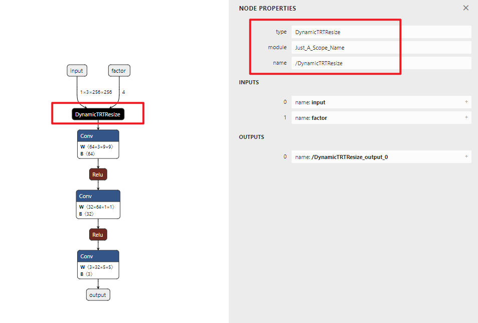

# MMDeploy Tutorial

学习 [mmdeploy tutorial](https://github.com/open-mmlab/mmdeploy/tree/main/docs/zh_cn/tutorial)

目的：

1. 能够自行撰写 C++/CUDA 算子
2. 能够部署市场上的大部分模型（终极目标）

主线：

ONNX -> TRT 的转换

问题：

1. 如何处理 ONNX 模型，注册 op ✅
2. 如何将 onnx 转换到 trt 并进行推理

本篇笔记主要清晰地介绍了自定义算子的概念，与 Plugin 的概念区别开。并且简单介绍了一下 pytorch C++ 扩展的用法

## Intro

这一节就不过多介绍了，仍然是以超分辨率模型为例子，简单介绍了一下模型的导出以及 ONNX 是什么，最用使用了  ONNXRuntime 将 ONNX 模型推理起来

```python
import onnxruntime

ort_session = onnxruntime.InferenceSession("srcnn.onnx")
ort_inputs = {'input': input_img}
ort_output = ort_session.run(['output'], ort_inputs)[0]
```

**onnxruntime.InferenceSession** 用于获取一个 ONNX Runtime 推理器，其参数是用于推理的 ONNX 模型文件。推理器的 run 方法用于模型推理，**其第一个参数为输出张量名的列表，第二个参数为输入值的字典**

## 自定义 ONNX 算子

ONNX 部署难点：

1. 模型动态化。动态化问题目前主要存在于输入尺寸，目前使用 `dynamic_axes` 基本解决
2. 新算子实现。复杂算子通常不被 ONNX 支持，尤其是使用 C++/CUDA 实现的

仍然是以超分辨率模型为例，如果我们需要将某图像放大 N 倍，具体多少是可以指定的，这样的超分辨率模型在 pytorch 中是很好实现的，但是却无法直接使用 `torch.onnx.export` 导出

**TODO: 什么是自定义 ONNX 算子，我们要做的是什么事情？这件事情和 plugin 有什么区别**

现有实现插值的 PyTorch 算子有一套规定好的映射到 ONNX Resize 算子的方法，这些映射出的 Resize 算子的 scales 只能是常量，无法满足我们的需求。我们得自己定义一个实现插值的 PyTorch 算子，然后让它映射到 ONNX Resize 算子上

实现新算子其实很简单（这里一同贴上了转 ONNX 代码，可能会有点长

```python
import torch
from torch import nn
from torch.nn.functional import interpolate
import torch.onnx


class NewInterpolate(torch.autograd.Function):

    @staticmethod
    def symbolic(g, input, scales):
        return g.op("Resize",
                    input,
                    g.op("Constant",
                         value_t=torch.tensor([], dtype=torch.float32)),
                    scales,
                    coordinate_transformation_mode_s="pytorch_half_pixel",
                    cubic_coeff_a_f=-0.75,
                    mode_s='cubic',
                    nearest_mode_s="floor")

    @staticmethod
    def forward(ctx, input, scales):
        scales = scales.tolist()[-2:]
        out = interpolate(input, scale_factor=scales, mode='bicubic', align_corners=False)
        return out


class StrangeSuperResolutionNet(nn.Module):

    def __init__(self):
        super().__init__()

        self.conv1 = nn.Conv2d(3, 64, kernel_size=9, padding=4)
        self.conv2 = nn.Conv2d(64, 32, kernel_size=1, padding=0)
        self.conv3 = nn.Conv2d(32, 3, kernel_size=5, padding=2)

        self.relu = nn.ReLU()

    def forward(self, x, upscale_factor):
        x = NewInterpolate.apply(x, upscale_factor)
        out = self.relu(self.conv1(x))
        out = self.relu(self.conv2(out))
        out = self.conv3(out)
        return out


# model and dummy input
model = StrangeSuperResolutionNet()
x = torch.randn(1, 3, 256, 256)
factor = torch.tensor([1, 1, 3, 3], dtype=torch.float32)

# export onnx model
with torch.no_grad():
    torch.onnx.export(model, (x, factor),
                      "srcnn2.onnx",
                      input_names=['input', 'factor'],
                      output_names=['output'])

# test onnx model
import onnxruntime
import numpy as np
# build session
sess = onnxruntime.InferenceSession("srcnn2.onnx")
input_name = sess.get_inputs()[0].name
output_name = sess.get_outputs()[0].name
# build numpy input
x = np.random.randn(1, 3, 256, 256).astype(np.float32)
factor = np.array([1, 1, 3, 3], dtype=np.float32)
# run session
out = sess.run(['output'], {'input': x, 'factor': factor})[0]
print(out.shape)

# test pytorch model
x = torch.randn(1, 3, 256, 256)
factor = torch.tensor([1, 1, 3, 3], dtype=torch.float32)
out = model(x, factor)
print(out.shape)

```

下面仔细分析代码里的作用

1. **算子的推理行为由算子的 `forward` 方法决定**

   该方法的第一个参数必须为 `ctx`，后面的参数为算子的真实输入。`ctx` 在 `forward` 中可用于保存一些中间结算结果，这些计算结果可以在 `backward` 中计算梯度，由于我们不需要进行梯度计算所以 `backward` 没有实现

2. **算子映射到 ONNX 是由 `symbolic` 方法决定**

   > A “symbolic function” is a function that decomposes a PyTorch operator into a composition of a series of ONNX operators.

   在进行 export 过程中会去访问每一个 pytorch 算子，然后将这个 pytorch 算子分解成为 ONNX 算子，从而将其转换为 ONNX 格式

实际上这里并没有使用 `forward` 中的方法，如果你使用 ONNX Runtime 来检查的话就会发现，不管你的 `forward` 是怎样实现的，导出的 ONNX 模型表现是一致的。这说明 ONNX 模型中的前向路径并不由 pytorch 决定！

我尝试了直接使用 interpolate 方法，问题在于 interpolate 不接受 `scale_factor` 类型为 tensor 的变量，只能接受 int types，这就麻烦了

 `symbolic` 方法可能有两种用法：

1. torch 中的算子无法正确映射到 ONNX 中，但是 ONNX 中实际上**定义**了该算子。这种情况，我们需要手动指定 ONNX 算子，即手动实现了 `symbolic` 方法

   上面我加粗了“定义”，因为之前写的是“实现”，**我想强调的是，ONNX 只是一种中间格式，而不会实现真正的计算**，这是推理框架做的事情

2. torch 中的算子无法正确映射到 ONNX 中，并且 ONNX 中没有实现该算子。这种情况通常发生于你实现了 C++/CUDA 算子，这样的话我们只用给这个算子取一个名字，让 ONNX 知道：“嘿，我们实现了一个算子，想要导出为 ONNX！我会给你一些这个算子的基本信息，但是你不必纠结这个算子会怎么计算！之后会有 TensorRT 或者其他的推理框架来解析如何运行！你只需要导出一个节点就好啦👌”这也再次证明了，**ONNX 只是一中格式，只要符合其格式标准即可**

对于第一种用法需要自己查询 ONNX 算子的定义，根据定义，写好你算子的映射方式

但实际上 torch 中的使用可能和 onnx 定义不太一样，例如 `Constant` 这一个算子，一般传入使用的是 `value_t` 而不是 `value`，这里 `_t` 代表传入的是 tensor，而如果是 `_i` 则代表是 int，`_f` 则是 float

TODO：介绍如何根据定义写 `symbolic` 映射

TODO：第二种方式的映射

TODO: how pytorch register onnx: register_custom_op_symbolic

## C++ 扩展

### C++ 算子

我们来学习一种简单的为 PyTorch 添加 C++ 算子实现的方法。同样的，我们也会用 `torch.autograd.Function` 封装这个新算子，将其继承到 pytorch 的自动微分框架中。这是我们比较推荐的为算子添加 ONNX 支持的方法

我们定义一个简单 C++ 算子，文件名为 `my_add.cpp`

```c++
// my_add.cpp

#include <torch/torch.h>

torch::Tensor my_add(torch::Tensor a, torch::Tensor b)
{
    return 2 * a + b;
}

PYBIND11_MODULE(my_lib, m)
{
    m.def("my_add", my_add);
}
```

解释一下代码：

1. `<torch/torch.h>` 包含了所有的 torch 功能，换句话说，你在 python 中使用的

   ```python
   import torch
   
   torch.xxx
   ```

   都能够用 C++ 进行表达

   ```python
   torch::xxx
   ```

   实际上还能经常看到另外一种头文件 `<torch/extension.h>`，个人理解这个头文件实际上是 `<torch/torch.h>` 的超集，除了 torch 的功能外还包含了 python 和 C++ 的交互代码，例如 `PYBIND11_MODULE` 就是被包含在 `extension.h` 中

   实际上你可看下两个头文件，就会发现区别仅在于 `<torch/python.h>`

   ```c++
   // <torch/torch.h>
   #pragma once
   
   #include <torch/all.h>
   
   #ifdef TORCH_API_INCLUDE_EXTENSION_H
   #include <torch/extension.h>
   
   #endif // defined(TORCH_API_INCLUDE_EXTENSION_H)
   
   
   // <torch/extension.h>
   
   #pragma once
   
   // All pure C++ headers for the C++ frontend.
   #include <torch/all.h>
   // Python bindings for the C++ frontend (includes Python.h).
   #include <torch/python.h>
   ```

   也就是说在编译 C++ extension 的时候，`<torch/torch.h>` 也会自动导入 `<torch/extension.h>`，此时二者没有任何差别

2.  `PYBIND11_MODULE` 来为 C++ 函数提供 Python 调用接口

   这里的 `my_lib` 是我们未来要在 Python 里导入的模块名。双引号中的 `my_add` 是 Python 调用接口的名称

### setup.py

之后需要写好 `setup.py` 来将我们的 C++ 代码编译完成，这里额外补充了 CUDA extension 的内容

```python
from setuptools import setup
from torch.utils.cpp_extension import CppExtension, CUDAExtension, BuildExtension

setup(name='my_add',
      ext_modules=[CppExtension('my_lib', ['my_add.cpp'])],
      cmdclass={'build_ext': BuildExtension})

# cuda extension
setup(name='my_add',
        ext_modules=[CUDAExtension(name='my_lib', 
                                   sources=['my_add.cpp', 'my_add_cuda.cu'],
                                   include_dirs=['./include'],
                                   extra_compile_args={'cxx': ['-O2'],
                                                       'nvcc': ['-O2']})],
        cmdclass={'build_ext': BuildExtension})
```

解释一下代码：

1. 通过指定 `ext_modules` 来设定一些基本信息，如模块名、文件位置

   你需要将你想导入的 `CppExtension` 填入，其参数为 `name & sources`，前者就是模块名，该名称必须要与 `*.cpp` 中 `PYBIND11_MODULE` 定义的一致。为了保证二者的名字一致，pytorch 也提供了宏 `TORCH_EXTENSION_NAME` 来自动填入

   ```c++
   PYBIND11_MODULE(TORCH_EXTENSION_NAME, m) {
   // the same with former content
   }
   ```

2. 通过指定 `include_dirs` 来指定需要包含的头文件位置

3. 通过指定 `extra_compile_args` 来指定编译时需要加入的指令，这里加入了一些优化等级参数

4. 通过 `cmdclass` 来指定编译 extension 的命令

写好 `setup.py` 过后，使用 `python setup.py install` 就可以编译好 C++ 拓展了！之后就是使用 C++ 算子，正如之前所说，我们要用 `torch.autograd.Function` 来包装

```python
import torch
import my_lib
class MyAddFunction(torch.autograd.Function):

    @staticmethod
    def forward(ctx, a, b):
        return my_lib.my_add(a, b)

    @staticmethod
    def symbolic(g, a, b):
        two = g.op("Constant", value_t=torch.tensor([2]))
        a = g.op('Mul', a, two)
        return g.op('Add', a, b)
```

同样，我们只写了前向，没有写反向。这里可以看到 `symbolic` 并不是之前简单的定义 `g.op` 就行了，而是调用了多个 ONNX 算子来构成，使得 ONNX 算子与我们构建的算子等价

## Plugins

那么问题来了，如果我们不熟悉 ONNX 算子，对于复杂的 C++ 算子，我们不就写不出来 `symbolic` 函数了吗！之前不是说告诉 ONNX 一个名字就可以吗？

实际上这种做法我们叫做**插件（Plugins）**，即我们定义的 `symbolic` 函数没有映射到任何的 ONNX 算子上，而是凭空捏造了一个符合 ONNX 格式的算子。这样定义的好处就是：ONNX 导出特别方便，坏处就是：得到的 ONNX 模型只有特定的推理框架能够解析和运行（没错儿，特定的推理框架说的就是 TensorRT🤣也没有其他推理框架有这个说法了...

实际上捏造一个这样的 ONNX 节点非常简单！还是以之前的超分辨率模型为例，我们只需要把算子的 `symbolic` 函数返回一个简单 `g.op` 即可

```python
import torch
from torch import nn
from torch.nn.functional import interpolate
import torch.onnx
from torch._C import Graph

class NewInterpolate(torch.autograd.Function):

    @staticmethod
    def symbolic(g, input, scales):
        """Symbolic function for creating onnx op."""
        return g.op(
            'Just_A_Scope_Name::DynamicTRTResize',
            input,
            scales)

    @staticmethod
    def forward(ctx, input, scales):
        scales = scales.tolist()[-2:]
        out = interpolate(input, scale_factor=scales, mode='bicubic', align_corners=False)
        return out


class StrangeSuperResolutionNet(nn.Module):

    def __init__(self):
        super().__init__()
        # modules, exact in the former content

    def forward(self, x, upscale_factor):
        x = NewInterpolate.apply(x, upscale_factor)
        # statements, exact in the former content
        return out


# model and dummy input
model = StrangeSuperResolutionNet()
x = torch.randn(1, 3, 256, 256)
factor = torch.tensor([1, 1, 3, 3], dtype=torch.float32)

# export onnx model
with torch.no_grad():
    torch.onnx.export(model, (x, factor),
                      "srcnn3.onnx",
                      input_names=['input', 'factor'],
                      output_names=['output'])
```

以上内容将能够难以置信的顺利导出😂但是你会看到如下警告

```shell
UserWarning: The shape inference of Just_A_Scope_Name::DynamicTRTResize type is missing, so it may result in wrong shape inference for the exported graph. Please consider adding it in symbolic function. 
```

这是因为我们添加的算子，并不存在于标准的 ONNX 算子库中，但是这并不妨碍其导出！再次喊出我们的口号，ONNX 只是格式，不是实现

现在通过 netron 就可以看到我们定义的 `DynamicTRTResize` 节点啦😎



虽然导出成功了，但是路途还非常遥远，因为我们根本没有定义 `DynamicTRTResize` 的任何具体内容

那么到底该怎么实现 C++/CUDA 代码，然后将这个算子与 ONNX 格式关联起来，以便于推理框架的解析，就留到之后整理吧