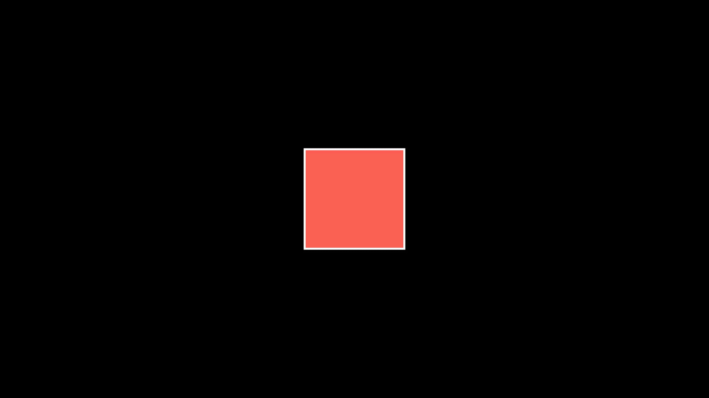

# Manim note

manim 有多个版本，推荐使用 community edition，这个版本更稳定，更容易上手，下面是几个参考链接

1. [ManimCE github](https://github.com/ManimCommunity/manim/)

2. [ManimCE documentation](https://www.manim.community/)

3. [3b1b manim](https://github.com/3b1b/manim)

强烈推荐根据官方文档进行学习，因为网上的很多资源都是过时的，包括我这篇笔记也会可能会很快过时。这篇笔记主要记录如何安装 ManimCE，以及其代码逻辑，更多实用的动画方法另外再做整理

## Install

### Install dependencies

ManimCE 需要预先下载两个软件 ffmpeg 和 LaTex。我自己的电脑上本来就安装了 LaTex 和 ffmpeg，关键是要确保 ManimCE  能够调用这些 dependencies，具体来说就是让 ffmpeg 和 LaTex 命令加入环境变量，能够在 cmd 中使用其命令。安装成功可用下面命令测试

```cmd
ffmpeg -version
tex -v
```

给两个参考链接：[ffmpeg 知乎教程](https://zhuanlan.zhihu.com/p/118362010)  [LaTex简介 bilibili](https://www.bilibili.com/video/BV11h41127FD?from=search&seid=5330798070960440671)

### Install ManimCE

一步到位

```shell
pip install manim
```

## Tutorials

### Quickstart

下面是一段简单的代码，能够实现从矩形到圆形的变换


代码如下

```python
# scene.py

from manim import *


class SquareToCircle(Scene):
    def construct(self):
        circle = Circle()  # create a circle
        circle.set_fill(PINK, opacity=0.5)  # set color and transparency

        square = Square()  # create a square
        square.rotate(PI / 4)  # rotate a certain amount

        self.play(Create(square))  # animate the creation of the square
        self.play(Transform(square, circle))  # interpolate the square into the circle
        self.play(FadeOut(square))  # fade out animation
```

在 terminal 中执行文件

```shell
manim -pql scene.py SquareToCircle
```

从上面的代码能够看出 Manim 的一些基本框架，首先要有一个 class 继承 `Scene` 作为场景，在这个 class 中定义 construct() 函数来实现动画效果，最后通过命令行渲染出动画

解释其中的几个关键方法：

1. `self.add` 可以将对象加入到场景中
2. `self.play` 可以将图像序列渲染成为视频
3. `manim -pql` 命令中 `p` 代表渲染后立即播方，`ql` 代表 quality low，即低质量渲染 480 p + 15 fps 的视频

### A deeper look

主要来分析一下上面的命令

```shell
manim -pql scene.py SquareToCircle
```

下面是几个常见的参数：

1. `-ql, -qm, -qh, -qk` 分别代表不同分辨率，从低到高，再到4k
2. `-a` 渲染所有的 Scene
3. `-f` 渲染完成后打开所在文件夹
4. `-t` 渲染的背景为透明

### Manim’s building blocks

Manim 中有3个重要概念

1. **mathematical object** (or **mobject** for short)
2. **animation**
3. **scene**.

#### Mobject

`Mobject` 是所有对象的基类，如果你想要展示一个最基本的 `Mobject` 实例什么也不会发生。事实上使用的最多的是 `VMobject`, Vectorized Moject，下面的内容里我们使用 `Mobject` 来指代 `VMobject`。更多功能可查询文档 [Mobject](https://docs.manim.community/en/stable/reference/manim.mobject.mobject.Mobject.html#manim.mobject.mobject.Mobject)，下面叙述常用功能

1. **加入和移除物体**。通过方法 `self.add`, `self.remove` 来在场景中加入/移除 mobject，默认会加入到场景原点位置（图像中心）

2. **放置物体**。使用下面四个方法

   ```python
   mobject.shift(*vectors)
   mobject.move_to(point_or_mobject)
   mobject.align_to(point_or_mobject, direction)
   mobject.next_to(point_or_mobject, direction, buff)
   ```

3. **风格化物体**。使用下面两个方法

   ```python
   mobject.set_stroke(color, width)
   mobject.set_fill(color, opacity)
   ```

   这里的颜色可以使用 manim 中定义的许多颜色，也可以使用十六进制颜色码

4. **获得坐标**。使用下面的方法

   ```python
   mobject.get_center()
   mobject.get_left()
   mobject.get_right()
   mobject.get_top()
   mobject.get_bottom()
   
   mobject.points # all points
   ```

5. **加入顺序**。后添加的物体会覆盖到图层的上方，可通过修改 `z_index` 来改变图层顺序

   ```python
   mobject.set_z_index()
   ```

#### Animation

动画的基本原理可以理解为，使用不同的函数在两个关键帧之间进行插值，然后使用 `play()` 方法进行播放。Manim 实现了许多动画方法 `FadeIn, Rotate, Transform, Write`...

除此之外，任何 `Moject` 的可变的属性，都可以通过 `Mobject.aminate` 实现动画

```python
from manim import *

class ApplyMethodExample(Scene):
    def construct(self):
        square = Square().set_fill(RED, opacity=1.0)
        self.add(square)

        # animate the change of color
        self.play(square.animate.set_fill(WHITE))
        self.wait(1)

        # animate the change of position
        self.play(square.animate.shift(UP))
        self.wait(1)
```



动画播方时间通过 `run_time` 参数设置

```python
self.play(..., run_time=3)
```

#### Scene

所有的 mobject 和 animation 都必须加入到 `Scene` 中才能被展现出来，并且必须包含 `construct` 方法

### Configuration

可以通过修改 [`ManimConfig`](https://docs.manim.community/en/stable/reference/manim._config.utils.ManimConfig.html#manim._config.utils.ManimConfig) 来配置参数，实际上所有的配置都可以通过该类来修改，个人最常用就是修改背景了

```python
from manim import *
config.background_color = WHITE
config.pixel_width = 1920
config.pixel_height = 1080
config.frame_height = 8
config.frame_width = 14.222	# frame和pixel的比例要满足
config.output_file = 'name.png'
config.preview = False
config.quality = 'high_quality'
```

### Text

有两种字体可以使用

1. Using Pango ([`text_mobject`](https://docs.manim.community/en/stable/reference/manim.mobject.svg.text_mobject.html#module-manim.mobject.svg.text_mobject))
2. Using LaTeX ([`tex_mobject`](https://docs.manim.community/en/stable/reference/manim.mobject.svg.tex_mobject.html#module-manim.mobject.svg.tex_mobject))

一般如果不用公式的话，直接使用 text_mobject 就可以了

```python
from manim import *

class HelloWorld(Scene):
    def construct(self):
        text = Text('Hello world').scale(3)
        self.add(text)
```


使用 tex_mobject 的话，如下

```python
from manim import *

class HelloLaTeX(Scene):
    def construct(self):
        tex = Tex(r"\LaTeX").scale(3)
        self.add(tex)
```


注意需要使用 raw string `r('...')` 因为 Latex 中很多特殊字符需要进行转义

还有不同的方法都能返回 text_mobject & tex_mobject，比如 MarkupText, MathTex 

这篇笔记就到这里了，还有好多好玩的功能就请自行探索吧 😎
