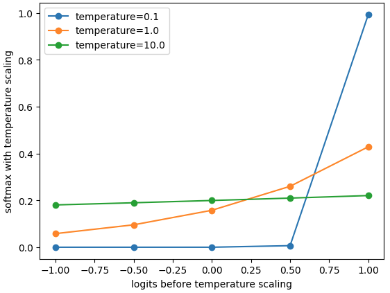
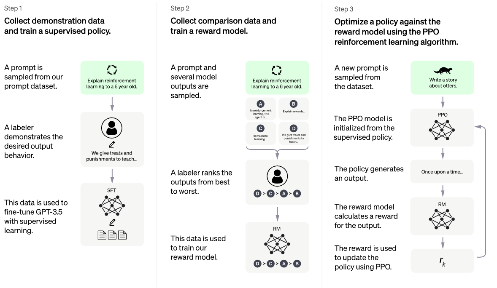
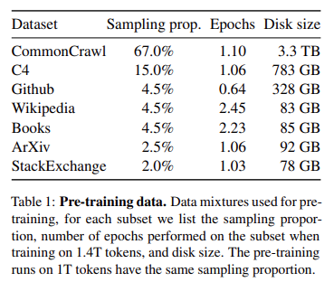
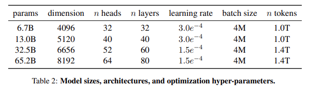

# NanoGPT

学习笔记 [NanoGPT](https://github.com/karpathy/nanoGPT)

除了学习 GPT 以外还计划学习：1. Llama & Llama2 论文以及模型，在这个过程中应该就把 Causal Language Model 给学了；2. Mistral 模型

TODO: minBPE

TODO: Scaling laws from OpenAI & Chinchilla

## Concept

### NanoGPT

- Tokenize

  nanoGPT 选择了最简单的 tokenization，以单个字母作为 token。对于其他的 tokenization 方法，Andrej 只提到了两个库用于 tokenize：sentencepiece & tiktoken

- Dataset，Andrej 使用了一个简单的莎士比亚集文本

- 在 Training 的时候不会将所有的文本全部输入到模型中，而是随机采样一段文本，文本长度为 `block_size` 个字母，这样也很方便定义 `batch_size`

  生成的 input & targets 都为 `(batch_size, block_size)` 形状的张量，其元素为 token id。targets 即为 next token id，为了让 targets 的形状对上 inputs，在获得文本数据时需要多获得一个 token，也就是 `block_size + 1`

- `BigramLanguageModel`

  Andrej 首先使用了一个最简单的 Bigram 模型来说明 GPT 的整个流程，包含训练和生成

  ```python
  import torch
  import torch.nn as nn
  import torch.nn.functional as F
  
  class BigramLanguageModel(nn.Module):
      def __init__(self, vocab_size):
          super(BigramLanguageModel, self).__init__()
          self.embeddings = nn.Embedding(vocab_size, vocab_size)
      
      def forward(self, idx, targets):
          """ Bigram language model only considers the previous token
          and predicts the next token.
          Args:
              - idx: (B, T) tensor of token idx, T is time (seq length)
              - targets: (B, T) tensor of token idx
          """
          logits = self.embeddings(idx)   # (B, T, vocab_size)
          loss = F.cross_entropy(logits, targets)
          return logits, loss
  
      @torch.no_grad()
      def generate(self, idx, max_new_tokens, temperature=1.0, top_k=None):
          """ Generate the sequence max_new_tokens times.
          Args:
              - idx: (B, T)
              - max_new_tokens: int
          """
          for _ in range(max_new_tokens):
              #get the logits for the index in the sequence
              logits, _ = self(idx)
  
              # pluck the logits at the final step and scale by desired temperature
              logits = logits[:, -1, :] / temperature
              
              # optionally crop the logits to only the top k options
              if top_k is not None:
                  v, _ = torch.topk(logits, min(top_k, logits.size(-1)))
                  logits[logits < v[:, [-1]]] = -float('Inf')
  
              # get the probabilities and sample
              probs = F.softmax(logits, dim=-1)
              idx_next = torch.multinomial(probs, num_samples=1)
              idx = torch.cat((idx, idx_next), dim=1)
  
          return idx
  ```

- 接下来花了大量时间介绍了 self-attention with mask，为的就是让当前 token 不看见未来的 token

- Tempreture 展示

  ```python
  # A demostration on temperature
  import torch
  import matplotlib.pyplot as plt 
  
  temperature = [0.1, 1.0, 10]
  temperature = torch.tensor(temperature) # (5,)
  
  x = torch.linspace(-1, 1, 5)   # (N,)
  x_with_temp = x / temperature[:, None]  # (5, 10)
  y = torch.softmax(x_with_temp, dim=-1)  # (5, 10)
  y = y.numpy()
  
  # draw the plot
  fig, ax = plt.subplots()
  for i in range(len(temperature)):
      ax.plot(x, y[i], label=f'temperature={temperature[i]:.1f}', marker='o')
  ax.legend()
  # label x and y
  ax.set_xlabel('logits before temperature scaling')
  ax.set_ylabel('softmax with temperature scaling')
  plt.show()
  
  ```

  

  温度越高，越倾向于平均采样，温度越低越倾向于最大值

- 接下来逐步完成 transformer block：

  - self attention，loss single head 2.4, loss multi head 2.28

  - feed forward，loss 2.24

  - residual，loss 2.08

  - layer norm，loss 2.06

  - more blocks & dropout, loss 1.49 (reproduced is the same)

    ```txt
    Clown:
    So is sweetest lay the
    backed but our savegred my dagged
    heard it is unquiet.
    
    PAULIXENES:
    I will we have stars, I must be spring it.
    ```

  Andrej 在这里强调了，**在过去几年时间里，大家对原始 transformer 的结构改变非常少，只有一个改变：将 layer norm 提前，即：使用 pre-norm**。在输出到 `lm_head` 之前也使用了 layer norm

- 最后的输出结果

- Positional encoding 采用简单的 nn.Embedding

- 简单介绍 encoder-decoder 架构，因为 GPT 是 decoder-only 架构，K & V comes from side。Decoder Only 架构不需要 encoder，这是因为 encode 部分也可以通过 prompt + decode 完成，可以认为 encode & decoder 融合了🤔让整个 transformer architecture 变成了一个通用机器，通过不同的 prompt 完成无限的可能性

- 和 ChatGPT 联系起来

  简单的 GPT 模型只能够续写文字，为了让 GPT 成为更有用的工具，在通过第一阶段的 pre-train (predict next token) 过后，需要进行第二阶段的微调，这个微调阶段也分为三个步骤

  1. 收集样本数据，这些数据不会很多 (1e3 量级)，通过在这些样本上进行有监督微调 (Supervised-Fine-Tuning)，这也是最简单的 align 过程，让所训练的 GPT 回答倾向于你所收集的数据样式
  2. 训练一个 Reward model 来评估哪个生成结果是更好的
  3. 训练一个 PPO model 来生成更好的采样策略使得采样结果更符合 reward model 喜好 

  

### Llama

通过 NanoGPT 可以对 GPT 的整个训练和推理过程有清晰的认知，但是随着技术的发展，还诞生了不少新的结构，包括 KVCache, GQA, RoPE, RMSNorm, SwiGLU。可从下图获得简单对比


- 在给定计算资源 (training budget) 的条件下，最好表现的模型不是参数量最大的模型，而是较小模型在更多的数据上训练后，效果更好。结果出自 Chinchilla

  These efforts are based on the assumption that more parameters will lead to better performance. However, recent work from Hoffmann et al. (2022) shows that, for a given compute budget, the best performances are not achieved by the largest models, but by smaller models trained on more data.

- 基于 Chinchilla 的启发，Llama 想要训练对推理更友好的模型，所以选择了更高效的推理结构和“较小”的模型，从而训练更多的 tokens，达到更好的效果

- Tokenizer: BPE from sentencepiece

- Dataset: 包含 1.4T tokens 开源数据集

  

- Archetecture

  相比于原始 Transformer 结构，Llama 的改动只有3点：

  1. Pre-norm，inspired from GPT-3，用于改善训练稳定性，并且使用 RMSNorm 而不是 LayerNorm，因为 RMSNorm 在计算上更加简单所以更快（unverified, no ablation），并且精度上没有改变

  2. SwiGLU，inspired from PaLM

     [GELU](https://kexue.fm/archives/7309) [大模型基础｜激活函数｜从ReLU 到SwiGLU](https://zhuanlan.zhihu.com/p/650237644) [GLU Variants](https://arxiv.org/abs/2002.05202v1)

     Swish function，$\sigma$ is sigmoid function, also called SiLU
     $$
     Swish_\beta (x)=x·\sigma(\beta x)
     $$
     GLU (Gated Linear Unit)
     $$
     GLU(x,W_1,b_1,W_2,b_2)=\sigma(xW_1+b_1)·(xW_2+b_2)
     $$
     简单来说是一个门控单元有两个线性层

     ```python
     class GLU(nn.Module):
         def forward(self, x):
             return  torch.sigmoid(self.linear_1(x)) * self.linear_2(x)
     ```

     而 SwiGLU 就是把 sigmoid 函数换成了 Swish
     $$
     SwiGLU(x,W_1,b_1,W_2,b_2)=Swish_{\beta}(xW_1+b_1)·(xW_2+b_2)
     $$

     ```python
     def swish(x, beta=1.):
         return x * torch.sigmoid(beta * x)
     
     class SwiGLU(nn.Module):
         def forward(self, x):
             return  swish(self.linear_1(x)) * self.linear_2(x)
     ```

     但一般大家说的 SwiGLU 其实还要加一层 linear 一层 norm，以替换 Transformer 中的 FFN

     ```python
     class SwiGLU(nn.Module):
         def forward(self, x):
             x_gate = self.fc1_g(x)
             x = self.fc1_x(x)
             x = self.act(x_gate) * x	# silu
             x = self.drop1(x)
             x = self.norm(x)
             x = self.fc2(x)
             x = self.drop2(x)
             return x
     
     class FFN(nn.Module):
         def forward(self, x):
             x = self.fc1(x)
             x = self.act(x)	# relu
             x = self.drop1(x)
             x = self.norm(x)
             x = self.fc2(x)
             x = self.drop2(x)
             return x
     ```

     also, it seems dropout should be in front of norm

  3. Rotary Embedding, inspired from RoFormer

     [Transformer升级之路：2、博采众长的旋转式位置编码](https://zhuanlan.zhihu.com/p/359502624)

     Needs more time

     > 这是一种配合Attention机制能达到“绝对位置编码的方式实现相对位置编码”的设计。而也正因为这种设计，它还是目前唯一一种可用于线性Attention的相对位置编码

- Optimizer

  AdamW + Cosine learning rate schedule with warm up + grad clip

  

- Training Infra

  为了让训练更加高效，Llama 使用了 xformers 实现的 flash attention，并且使用 checkpointing 技术保留那些重计算很费时的 activations (output of linear)，并且还使用了一些 auto parallel 技术增大 GPU 利用率

  Llama 使用了 2048 A100 训练 1.4T tokens，总共花费 21 天

### Llama 2

[一文读懂Llama 2（从原理到实战）](https://www.zhihu.com/tardis/zm/art/653303123)

- 在结构上只有一个区别：使用了 GQA (Group Query Attention)

  先了解 [MQA](https://zhuanlan.zhihu.com/p/634236135)，其本质就是所有的 head 共用一套 key & value，之前是各个 head 都有不同的 key & value，这大大减少 kv 的存储

  而 GQA 相当于是过度，也就是不是所有的 head 共享一套，而是 group 个 head 共享一套

  在实现上是通过指定 `num_key_value_heads` 控制 kv head 数量：如果该值为 1，则为 MQA，如果该值为 `num_head` 那就是普通的 Multi-Head Attention

- 在训练上数据多了 40%，上下文长度也翻倍（Credit to GQA）

### Qwen

- Architecture

  1. untied embedding

     在语言模型中，通常会将 word embedding layer 和最后的 `lm_head` 共享参数，这是非常自然的想法，因为他们构成逆映射，在 Llama 中就是这样做的

     - (N, ) token idx -> (nn.Embed) -> (N, C) token emb
     - (N, C) token emb -> (nn.Embed.T) -> (N, N) logits -> sample and generate

     ```python
     class LlamaForCausalLM(LlamaPreTrainedModel):
         _tied_weights_keys = ["lm_head.weight"]
     
         def __init__(self, config):
             super().__init__(config)
             ...
             self.lm_head = nn.Linear(config.hidden_size, config.vocab_size, bias=False)
     
     ```

     而 untied embedding 其实就是 `lm_head` 采取相同单独的权重，不和 word embedding 共享

  2. 在进行 rotary positional embedding 时使用 fp32 精度，完成后再转为 fp16

  3. 在 attention qkv linear 中加入 bias，利于 rotary embedding 做外推

  其余模型配置和 Llama 一致

### Qwen-2

- [Qwen2 huggingface](https://huggingface.co/docs/transformers/main/en/model_doc/qwen2) [Qwen1.5-0.5B](https://huggingface.co/Qwen/Qwen1.5-0.5B/tree/main)

  似乎 Qwen1.5 和 Qwen2 是一回事

  几乎没有在模型上进行更改，支持了 sliding window attention & GQA
  
  关于 [Sliding Window Attention](https://paperswithcode.com/method/sliding-window-attention) [zhihu](https://zhuanlan.zhihu.com/p/659105978) 是对 K,V 进行滑动注意力计算，query 是全部输入

### Prefill & Decode

[LLM Inference Series: 2. The two-phase process behind LLMs’ responses](https://medium.com/@plienhar/llm-inference-series-2-the-two-phase-process-behind-llms-responses-1ff1ff021cd5)

[Mastering LLM Techniques: Inference Optimization](https://developer.nvidia.com/blog/mastering-llm-techniques-inference-optimization/) 这一篇博客几乎涵盖了目前(2023/11/17)大部分的模型推理优化策略

- Prefill is encode phase in GPT

  但是由于 GPT 是 decoder only 架构，所以 encode phase 也是由 decoder 完成的。更具体的来说 pre-fill 所指的：**就是从 prompt 输入到 GPT 中生成第一个 token 的过程**
  
  > Generating the first token of the completion by running the tokenized prompt through the network.
  
  这个过程也会叫做 initiation phase
  
  核心：在处理 prompt 的时候，会天然地生成第一个 token。因为 GPT 做的就是 next token prediction，在进行前向运算的过程中就会获得最后一个 token 的 next token。需要注意的是：这个 token 没有隐藏状态的 (hidden state) 的
  
- Decode phase

  decode 过程非常清晰：从第一个 token 开始，不断地通过自回归生成新文本，直到遇到结束 token 的整个过程

### KV-Cache

[Transformers KV Caching Explained](https://medium.com/@joaolages/kv-caching-explained-276520203249)

KV-Cache 能够存在的根本原因：GPT 是一个 Causal 模型，即：当前生成结果仅取决于过去，不与未来交互。更具体的来说 attention mask 将以上三角的形式存在，消除对未来 token 的注意力。所以对于 Causal 模型，我们就可以把过去的状态 (key & value) 给保存下来，因为他们是不会改变的，于是就有了 KV-Cache 诞生

有了 KV-Cache 过后，我们就不必要每一次将所有的 token 输入到 GPT 当中，而是只用将新 token 输入 GPT 当中，新 token 和过去的 KV-Cache 进行注意力交互，预测下一个 token，循环往复

Paged KV Cache 是对 KV Cache 存储方式的改进，我个人理解为一种动态的存储方式。KV Cache 会预先申请一块空间来存储，但这样会导致内存利用率不高，而 Paged KV Cache 就是来多少申请多少，将这些 KV Cache 存储在不连续的地方，在需要使用的时候通过查表获得 cache 地址

### Forward & generate

对于 Huggingface Model 的完整前向过程以及生成过程进行整理，从 load -> tokenize/template -> forward -> generate

### Mistral

在模型结构上和 llama 区别不大，只是使用了 GQA & Sliding window attention 而已 

## Code Implementation

因为大家都使用相似的实现，所以深入掌握代码是非常有必要而且很有收益的事情。由于大家都使用 huggingface，所以选择直接看 huggingface transformers 代码，一共有 1500 行，如果浓缩下来的话，估计只有一半左右

- LlamaRMSNorm

  非常常规的 pytorch 实现
  $$
  \bar{a}_i=\frac{a_i}{\text{RMS} (A)}g_i  \\
  \text{RMS}(A)=\sqrt[]{\frac{1}{n}\sum_{i=1}^na_i^2 + \epsilon} 
  $$

- LlamaRotaryEmbedding

  看了一篇关于位置编码的讲解，以01位置编码开始，推导到绝对位置编码，整个过程非常清晰 [zhihu](https://zhuanlan.zhihu.com/p/352233973)

  takeaway: 最高维度的周期决定了所能编码的最大长度
  $$
  \begin{aligned}
  p_{i, 2 j} &=\sin \left(\frac{i}{10000^{2 j / d}}\right) \\
  p_{i, 2 j+1} &=\cos \left(\frac{i}{10000^{2 j / d}}\right)
  \end{aligned}
  $$
  

  选取底数为 10000，则最大周期为 $2\pi·10000$，也就是说最大编码长度为 6w 多

  旋转位置编码从位置编码的目的出发，从数学原理推导出了更好的相对位置编码形式

  实现旋转位置编码实际上是实现了一个 cache, 在实际使用的时候取所需要的位置即可，下面是简化的伪代码

  ```python
  import torch
  
  class RotaryEmbed(nn.Module):
      def __init__(self, dim, max_length, base=10000):
          # inverse of frequency (d // 2,), which is the denominator of fracition
          inv_freq = 1.0 / (self.base ** (torch.arange(dim, step=2) / dim))
          
          # token positions (N,)
          t = torch.arange(max_length)
          
          # outer product, (N, d // 2)
          freqs = torch.outer(t, inv_freq)
          # freqs = torch.einsum(i, j -> i j) is the same
          
          # sin & cos cache, (N, d)
          emb = torch.cat([freqs, freqs], dim=1)
          self.sin = emb.sin()
          self.cos = emb.cos()
          
      def forward(self, x, seq_len):
          # x is not useful, 
          return self.sin[:seq_len], self.cos[:seq_len]
  ```

  代码里使用 `t` 来代表位置，从上述描述，`t` 也有周期的含义，所以用来作为标识也很合适

  获得位置编码过后需要将位置编码加入到 query 和 key 里面去

  ```python
  def rotate_half(x):
      """Rotates half the hidden dims of the input."""
      x1 = x[..., : x.shape[-1] // 2]
      x2 = x[..., x.shape[-1] // 2 :]
      return torch.cat((-x2, x1), dim=-1)
  
  def apply_rotary_pos_emb(q, k, cos, sin, position_ids):
      """
      q: (B, N, H, C)
      k: (B, N, H, C)
      cos: (max_length, C)
      sin: (max_length, C)
      position_ids: (N,)
      """
      cos = cos[position_ids].unsqueeze(1)	# (N, 1, C)
      sin = sin[position_ids].unsqueeze(1)
      q_embed = (q * cos) + (rotate_half(q) * sin)
      k_embed = (k * cos) + (rotate_half(k) * sin)
      return q_embed, k_embed
  ```

  `position_ids` 是一个非常重要的参数，代表了我们需要取哪些位置。为什么不直接从 q & k 的长度直接生成 `position_ids`？因为 q, k 的位置不一定是从零开始的，有时候新输入的 q & v 前已经有了其他内容，这在多轮对话以及使用 kv cache 的时候很有用

- `update_causal_mask`

  需要分为两种情况：prefill or decode，换句话说是否是第一次输入

  ```python
  import torch
  
  def _update_causal_mask(attention_mask, inputs_embeds):
      """
      Args:
      - attention_mask: (B, M), indicating padding situation
      - inputs_embeds: (B, N, C)
          M == N if it's first input (prefill)
          N == 1, if it's decoding, M is all input tokens (past and newly generated)
      Returns:
      - causal_mask: (B, 1, N, M)
      	(B, 1, N, N) if prefill
      	(B, 1, 1, M) if decode
      """
      N = inputs_embeds.shape[1]
      M = attention_mask.shape[1]
      seq_len = N
      target_len = M
      min_value = torch.finfo(torch.float32).min
      
      # fill the minimum value (N, M), M=N if it's first prompt
      causal_mask = torch.full((seq_len, target_len), min_value)
      
      if seq_len != 1:
          # prefill, (N, M=N) causal attend
          causal_mask = torch.triu(calsual_mask, diagonal=1)
      else:
          # decode, (N=1, M) attend all previous tokens
          causal_mask *= 0
          
      causal_mask = rearange('N M -> B 1 N M', causal_mask)
      # process padding
      padding_mask = (attention_mask == 0.0)
      padding_mask = rearange('B M -> B 1 N M', padding_mask)
      causal_mask.masked_fill(padding_mask, min_value)
      
      return causal_mask
  ```

  这里的 causal mask 无法应对像 medusa 一样，在 decode 一次输入多个 token 的情况，这也是为什么在 medusa 里面单独处理了 causal mask 的情况

- Llama Attention

  attention 已经再熟悉不过了，不过 llama attention 相比于 vanilla attention 还有不少额外功能：

  1. Group Query Attention

  2. KV Cache

     在 Llama 中是使用一个 List of Tensor 来实现的，list 中第 i 个元素代表第 i 个 transformer layer 的 kv cache，其形状为 `(B, M', H, C)`，其中 `M'` 即代表存储的历史 token 数量

  3. Causal Mask

  4. Rotary Embedding

  ```python
  def forward(hidden_states, attention_mask, position_ids, past_key_value):
      """
      Args:
      - hidden_states: (B, N, C) or (B, N=1, C)
      	N=1 means when decoding, only 1 new token is given
      - attention_mask: (B, 1, N, N) or (B, 1, N=1, M)
      	M is the number of all input tokens: past + N=1
      	This is the causal_mask introduced above
      - position_ids: (N,) or (1,)
      - past_key_value: KV Cache
      """
      # get q k v
      q = self.q_proj(hidden_states)	# (B, N, head_dim * num_head)
      k = self.k_proj(hidden_states)	# (B, N, head_dim * kv_head)
      v = self.v_proj(hidden_states)	# (B, N, head_dim * kv_head)
      
      q = rearange(q, 'B N (H C) -> B H N C', H=num_head)
      k = rearange(k, 'B N (H C) -> B H N C', H=kv_head)
      v = rearange(v, 'B N (H C) -> B H N C', H=kv_head)
      
      # get q k position embedding
      cos, sin = self.rotary_emb(position_ids)
      # apply pos emb
      q, k = apply_rotary_pos_emb(q, k, cos, sin, position_ids)
      
      # repeat kv if kv_head < num_head
      groups = num_head // kv_head
      k = repeat(k, 'B H N C -> B (H G) N C', G=groups)
      v = repeat(v, 'B H N C -> B (H G) N C', G=groups)
      
      # update current kv to cache, return cated prev + current kv
      # now KV shape is (B H M C), M = M' + N
      K, V = past_key_value.update(k, v, self.layer_idx)
      
      # scale dot product attention, (B H N C)
      attn_output = F.scale_dot_product_attention(
      	q, K, V,
          attention_mask,
          self.attn_drop # 0.
      )
      
      # view back
      attn_output = rearange(attn_output, 'B H N C -> B N (H C)', H=num_head)
      
      # out project
      attn_output = self.out_proj(attn_output)
      
      return attn_output, past_key_value
      
  ```

- LlamaDecoderLayer

  生下来就是将组建串接起来就行

  ```python
  def forward(hidden_states, attention_mask, position_ids, past_key_value):
      residual = hidden_states
      
      # pre-norm
      hidden_states = self.norm1(hidden_states)
      
      # attention
      hidden_states, past_key_value = self.self_attn(
      	hidden_states = hidden_states,
          attention_mask = attention_mask,
          position_ids = position_ids,
          past_key_value = past_key_value
      )
      
      # residual
      hidden_states = residual + hidden_states
      
      # norm + FFN + add
      residual = hidden_states
      hidden_states = self.norm2(hidden_states)
      hidden_states = self.mlp(hidden_states)
      hidden_states = hidden_states + residual
      
      return hidden_states, past_key_value
  ```

- 再之后就是堆叠 decode layer，并且进行一些前后处理，这就是 `LlamaModel` 的实现 

  ```python
  def forward(input_ids, attention_mask, position_ids, past_key_values, labels):
      # embed token
      input_embeds = self.embed_tokens(input_ids)
      
      # init past_key_value
      past_key_values = DynamicCache.from_legacy_cache(past_key_value)
      
      # create causal_mask according to attention_mask & number of input tokens
      causal_mask = self._update_causal_mask(attention_mask, inputs_embeds)
      
      # decode
      hidden_states = input_embeds
      for decode_layer in self.layers:
          hidden_states, past_key_value = decode_layer(
          		hidden_states,
              	attention_mask = causal_mask,
              	position_ids = position_ids,
              	past_key_value = past_key_value,
          )
          
      return BaseModelOutputWithPast(
      	last_hidden_state = hidden_states,
          past_key_value = past_key_value
      )
  ```

- 最后就是简单的将 LlamaModel 和 `lm_head` 进行组合，完成整个预测过程。如果传入标签的话，还进行一下 loss 计算

  ```python
  def forward(input_ids, attention_mask, position_ids, past_key_value, labels=None):
      outputs = self.model(input_ids,
                          attention_mask,
                          position_ids, 
                          past_key_value)
      
      # logits, (B, N, C)
      logits = self.lm_head(outputs.hidden_states)
      
  	# loss
      if labels:
          shift_logits = logits[:, :-1, :] # (B, N - 1, C)
          shift_labels = labels[:, 1:]	# (B, N - 1)
          loss = CrossEntropy(shift_logits, shift_labels)
          
  	return CausalLMOutpuWithPast(
      	loss=loss,
          logits=logits,
          past_key_value=outputs.past_key_value,
          hidden_states=outputs.last_hidden_state
      )
  ```

  初始的 `attention_mask` 其实是由 tokenizer 提供的，以及 `position_ids` 的生成过程是在 `model.generate` 里面进行

- ModelOutput

  实际上是一个 dataclass 但同时能够使用字典的关键字获得其中的数据

## Question

- Swish 使用了 $x·\sigma(x)$，这样的话量纲就变了啊，GLU 门控单元前后的量纲没有变化，但是 SwiGLU 量纲变成了 $x^2$​​，看来我对 ReLU or 激活值的理解不够正确

  > From GPT4: Using ReLU or Swish in a gating unit might initially seem counterintuitive because they lack the inherent [0, 1] gating range of the sigmoid. However, if the learning process can benefit from the unbounded activation values or from the different slopes in positive and negative regions (as is the case for Swish), these functions can still be effective. Essentially, they provide new mechanisms to control the information flow that can lead to better model performance in some tasks.
  >
  > Moreover, the potential issue of having unbounded values can sometimes be mitigated by learned model parameters (in the affine transformations) or subsequent layers that can scale these activations appropriately.

- 旋转位置编码的数学原理以及如何进行外推，这部分可能先去把数学基础弄扎实，然后再来看会有更好的效果。这是一个长期项目

- scale dot product attention 相比 vanilla attention 来说是更加 memory efficent，另外 flash attention 更需要一些改动，学习他们的用法和区别可能需要半天时间

  但是 vanilla attention 与 scale dot product attention 之间区别不大，mask 也是一致的
