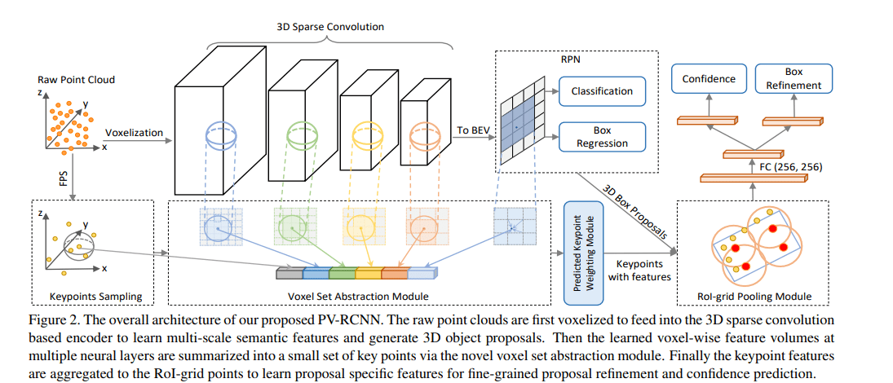
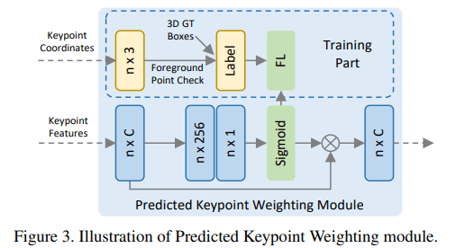
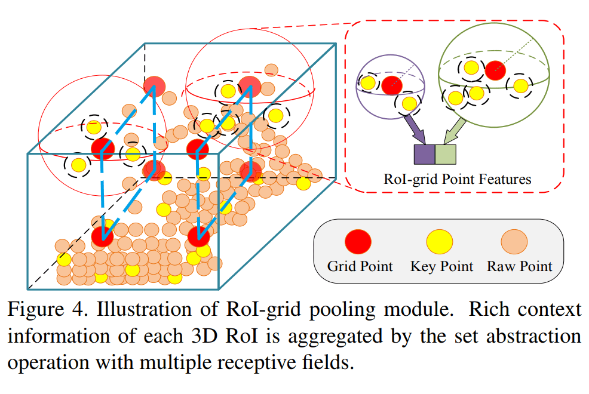
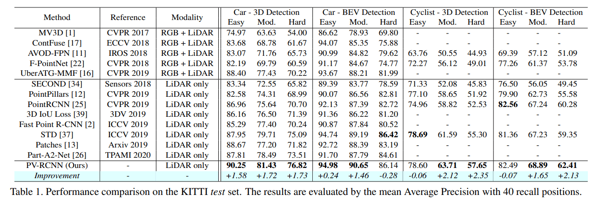
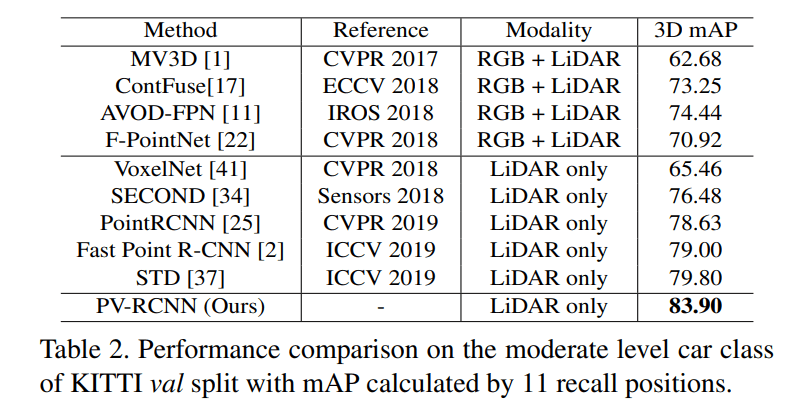
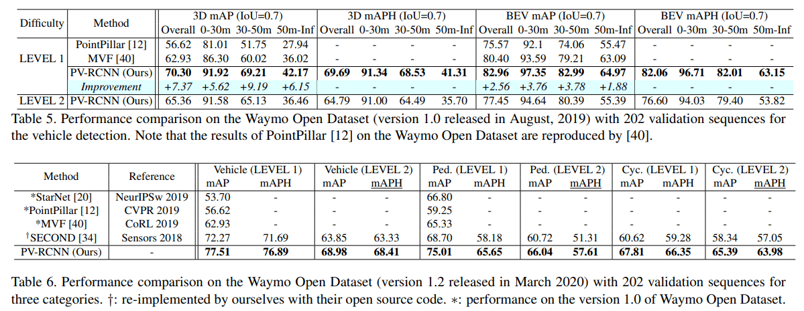
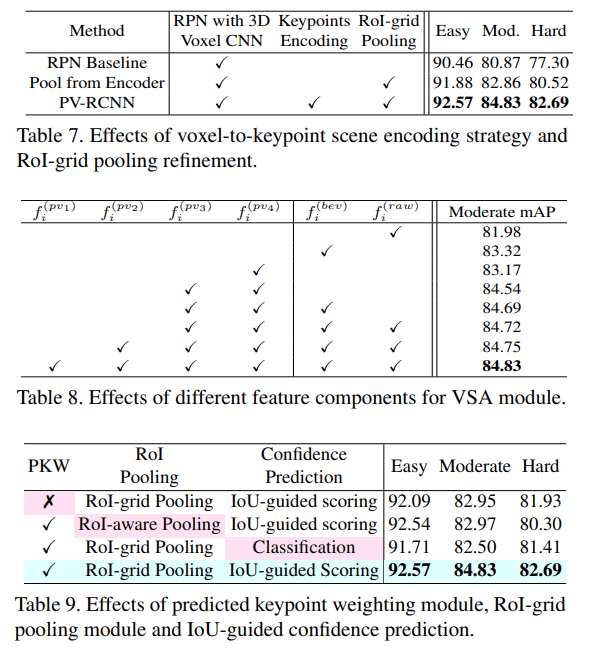

# PV-RCNN

---

Shi, Shaoshuai, Chaoxu Guo, Li Jiang, Zhe Wang, Jianping Shi, Xiaogang Wang, and Hongsheng Li. “PV-RCNN: Point-Voxel Feature Set Abstraction for 3D Object Detection.” *ArXiv:1912.13192 [Cs, Eess]*, April 9, 2021. http://arxiv.org/abs/1912.13192.

Comment: Accepted by CVPR 2020. arXiv admin note: substantial text overlap with arXiv:2102.00463

---

## Introduction

大多数现有的 3D 检测方法在点云表示方面可以分为两类：

1. 基于体素化的表示，the grid-based methods (e.g. VoxelNet)
2. 基于点的表示，the point-based methods (e.g. Point R-CNN)

这两种方法各有优缺点：

1. 基于体素化的操作有效地编码多尺度特征 multi-scale feature representations，并可以生成高质量的 3D proposals
2. 基于 PointNet 的 set abstraction 操作，保留了更准确的位置信息，并且可以有更加灵活的感受野

而 PV-RCNN 就是受这两类表示的启发，将这两类方法有效结合起来，使得点云特征既有体素化的多尺度信息，又增加了 set abstraction 的精准度与灵活度

论文总结了4个贡献点：

1. 结合了两种点云表示的优点：基于体素的表示和基于点的表示
2. 提出了 **voxel-to-keypoint scene encoding scheme**，将体素类的特征编码转化为点云类特征
3. 提出了 **multi-scale RoI feature abstraction layer**，将 RoI 中的点云特征编码转化为栅格点特征 RoI-grid pooling via set abstraction

4. PV-RCNN 以显著的优势在当时的 KITTI & Waymo 榜单上排名第一

中间两点提得比较笼统，需要具体看看 PV-RCNN 的结构才能有一个形象的了解

## PV-RCNN Architecture

### 3D voxel CNN

首先将输入点云 P 划分为空间分辨率为 $L × W × H$ 的小体素/栅格，其中非空体素的特征直接计算为所有内部点的逐点特征的平均值。常用的特征是 3D 坐标 coordinate 和反射强度 reflectance intensity。Voxel CNN 能够在多个下采样分辨率下 (1x, 2x, 4x, 8x) 进行特征提取，得到不同 level 的 voxel-wise feature vectors，这就是体素化方法的好处，可以直接采用成熟的卷积方法

但是使用 voxel CNN 也会有一定的局限性：

1. 这些特征通常为低分辨率的空间特征，损失了大量的空间信息，阻碍了对象的准确定位
2. 即使通过上采样 upsample 这些特征图谱都会是比较稀疏的，传统的池化方法可能得到许多零特征向量

### Proposal generation

将提取的 3D 特征转换 reshape 为 2D 俯视特征图 bird-view feature maps，按照基于锚 anchor 的方法生成高质量的 3D proposal (e.g. PointPillars)。这里可以尝试使用其他的生成算法，例如将 anchor-based 换为 anchor-free，提升效率和准确率

### Voxel-to-keypoint encoding

了解了 voxel CNN 的一些局限性，是否有方法去补偿损失的空间信息呢？这里论文将提出一种全新的 encoding 方法 **voxel set abstraction (VSA)**，来将整个场景的编码从 voxel-like 转换为 point-like，具体来说 voxel set abstraction 使用 PointNet++ 网络中的 set abstraction 思想，将 voxel 特征聚合到场景中的关键点集 $K$上，这些关键点由 FurthestPoint-Sampling (FPS) 算法采样得出。这一操作我认为是整个论文里最具创意的操作，将 set abstraction 的操作进行了更广的拓展，从原来的 point-to-point 特征聚合操作，到这里为 voxel-to-point。更详细的动机可以参考原作者在 [知乎](https://zhuanlan.zhihu.com/p/148942116) 上的回答

现在以更加数学化的语言来表达 **voxel set abstraction (VSA)**。关键点集合 $K=\{p_1,...,p_n\}$，对于每个关键点 $p_i$ ，我们在多个半径 $r_k$ 内寻找其相邻的非空体素 $v_j^{(l_k)}$ 其对特征为 $f_j^{(l_k)}$，$l_k$ 代表的是在 voxel CNN 阶段中的不同分辨率阶段
$$
S_{i}^{\left(l_{k}\right)}=\left
\{\left[f_{j}^{\left(l_{k}\right)} ; v_{j}^{\left(l_{k}\right)}-p_{i}\right]^{T}
\middle|\ \ \begin{array}{ll}\left\|v_{j}^{\left(l_{k}\right)}-p_{i}\right\|^{2}<r_{k}, \\
\forall v_{j}^{\left(l_{k}\right)} \in \mathcal{V}^{\left(l_{k}\right)} \\
\forall f_{j}^{\left(l_{k}\right)} \in \mathcal{F}^{\left(l_{k}\right)}
\end{array}\right\}
$$

然后使用 PointNet++ 中的 set abstraction 操作，将这些特征聚合为一个特征向量
$$
f_{i}^{\left(p v_{k}\right)}=\max \left\{G\left(\mathcal{M}\left(S_{i}^{\left(l_{k}\right)}\right)\right)\right\}
$$
其中 $M(·)$ 表示从相邻集合 $S^{(l_k)}_i$ 中随机采样最多 $T_k$ 个体素以节省计算，$G(·)$ 表示一个多层感知器网络 MLP（区别于 PoinNet 中的 Shared MLP）。将多个半径的特征向量连接起来就能得到多尺度的特征，类似于 PointNet++ 中的 multi-scale grouping (MSG)

现在将不同分辨率的特征连接起来，原论文有4个不同的分辨率
$$
f_{i}^{(p v)}=\left[f_{i}^{\left(p v_{1}\right)}, f_{i}^{\left(p v_{2}\right)}, f_{i}^{\left(p v_{3}\right)}, f_{i}^{\left(p v_{4}\right)}\right], \text { for } i=1, \cdots, n
$$
再添加一些特征：原点云数据 raw point feature 和对应点的俯视图特征 bird-eye view feature，得到最终的整个点云的特征集合
$$
f_{i}^{(p)}=\left[f_{i}^{(p v)}, f_{i}^{(r a w)}, f_{i}^{(b e v)}\right], \text { for } i=1, \cdots, n
$$
再进行一些权重调整，权重依据为该点是否为前景点，如果为背景点则权重降低，这将给模型带来更好的注意力机制。使用得到的点云特征，送入到三层的 MLP $A(·)$ 中去预测该点的权重，然后再与原特征相乘
$$
\tilde{f}_{i}^{(p)}=\mathcal{A}\left(f_{i}^{(p)}\right) \cdot f_{i}^{(p)}
$$
这里的权重调整机制论文称为 **predicted key weighting (PKW)**，其图示如下

### Keypoint-to-grid RoI feature abstraction

给定每个 3D RoI/proposal，论文提出 RoI-grid pooling，将关键点特征聚合到具有多个感受野的 RoI-grid 点，特征聚合方法依旧类似于 PointNet++ MSG，图示如下，蓝色虚线是我自己画的，方便体现出 grid

其数学表达也是类似的
$$
\begin{array}{l}
\tilde{\Psi}=\left\{\left[\tilde{f}_{j}^{(p)} ; p_{j}-g_{i}\right]^{T} \Biggl|\ \begin{array}{l}
\left\|p_{j}-g_{i}\right\|^{2}<\tilde{r}, \\
\forall p_{j} \in \mathcal{K}, \forall \tilde{f}_{j}^{(p)} \in \tilde{\mathcal{F}}
\end{array}\right\} \\

\tilde{f}_{i}^{(g)}=\max \{G(\mathcal{M}(\tilde{\Psi}))\}
\end{array}
$$
为什么这里还要再次进行编码，而不是直接使用选框内的所有点进行聚合，得到一个全局的表达？一个重要原因是因为使用 roi pooling 能够将特征聚合到一个固定的形状，便于之后输入到 MLP。同时也可能是为了获得多尺度的特征

### Refinement and confidence prediction

采用2层 MLP，去做置信度预测和选框细化两个任务。采用 3D RoI/proposal 与其对应的真实选框 ground truth 之间的 3D IoU 作为训练目标，并采用二元交叉熵损失函数
$$
y_{k}=\min \left(1, \max \left(0,2 \mathrm{IoU}_{k}-0.5\right)\right)
\\
L_{\mathrm{iou}}=-y_{k} \log \left(\tilde{y}_{k}\right)-\left(1-y_{k}\right) \log \left(1-\tilde{y}_{k}\right)
$$
这种  quality-aware 置信度预测策略比传统分类标签实现了更好的性能（这种损失函数是否还能进一步改进呢？比如通过简单的平滑过渡操作，使得学习曲线更平缓）对于细化 refinement 的目标和损失函数论文没有完整列出，整体思想是预测其残差，并使用 smooth-L1 loss，具体请参考 SECOND, Part-A^2
$$
L_{\mathrm{rcnn}}=L_{\mathrm{iou}}+\sum_{\mathrm{r} \in\{x, y, z, l, h, w, \theta\}} \mathcal{L}_{\text {smooth-L1 }}\left(\widehat{\Delta \mathrm{r}^{p}}, \Delta \mathrm{r}^{p}\right)
$$
在 voxel CNN 阶段，region proposal 和 classification 的损失函数也没有完整列出，如下
$$
L_{\mathrm{rpn}}=L_{\mathrm{cls}}+\beta \sum_{\mathrm{r} \in\{x, y, z, l, h, w, \theta\}} \mathcal{L}_{\text {smooth-L1 }}\left(\widehat{\Delta \mathrm{r}^{a}}, \Delta \mathrm{r}^{a}\right)
$$
其中分类任务和分割任务都使用的是 focal loss

## Experiment

### KITTI

PV-RCNN 在 KITTI 数据集上的准确率和召回率

### Waymo

### Ablation study

消融实验针对 voxel set abstraction, RoI-grid pooling, PKW, IoU-guided scoreing 进行深入研究，这些结构能将最终表现提升 1-3 mAP

## Conclusion

PV-RCNN 中的一个巨大启发是对于特征的 aggregation 不需要被数据实际的形式给限制，结合多种数据提取特征的优势，创造其中的桥梁，能够更好地进行局部和全局的把控，又将点云表示带到了一个新的高度，即使接近两年过去了，该方法仍在 KITTI 榜单排名前50。该网络的推理速度在 80ms 左右，依旧还有提升的空间，项目开源在了 OpenMMLab，现在 OpenMMLab 又提出了新的网络 Voxel R-CNN，推理速度减少了一半，达到了 40ms 左右，而且准确度也上升了，可以进一步进行学习

## TO READ

1. SECOND
2. Part-A^2
3. Voxel R-CNN