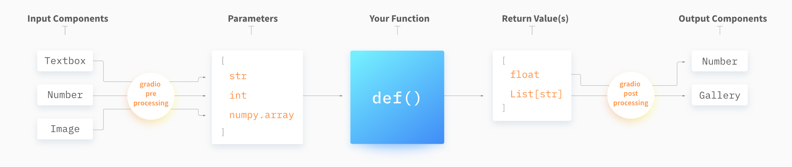
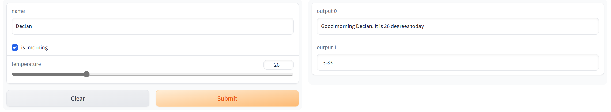

# PoseMatcher 学习

在完成整个项目中涉及到了不少知识，但是需要尽快推进项目，所以来不及深入和整理。我认为整理这些知识是必要的，不进行整理将会是重大的损失

## Learn Metaclass with MMEngine

### metaclass

首先要解决的问题：什么是元类 metaclass？元类是一种特殊的类，用于控制**类的创建**、类的属性和方法、类的初始化。在 python 中默认使用的元类是 `type`

一个恰当的比喻说法是，**每一个类都是元类的实例**。即我们在定义类 `class Test` 的时候，实际上是将 `Test` 相关信息传入到元类的 `__init__` 当中，并为 `Test` 类创建一个新的 `namespace`。下面来看一个例子

```python
class MyMeta(type):
    def my_method(cls):
        print(f"MyMeta method called in class {cls.__name__}")

class MyClass(metaclass=MyMeta):
    pass

class MyClass2(MyMeta):	# wrong to inherit a metaclass and use it like a normal class
    pass

# Using the metaclass
MyClass.my_method()  # This will work, as MyClass is an instance of MyMeta

# Using inheritance
my_instance = MyClass2()
my_instance.my_method()  # This will not work!
```

这里对比了两种继承：

1. `metaclass` “继承”。给这里的继承打个引号，因为这甚至不太能说是继承，**而是一个指定元类的动作**。所指定的元类，必须继承于 `type` 这个类，即 `MyMetacalss(type)`
2. 普通继承，即 `MyClass2(MyMeta)`

可以看到当我们想用一般的方法去继承一个元类时，不会得到希望的效果，会报错！而 `MyClass.my_method()` 可以看成实例去使用类里面的方法，而这样的形式你可以在 `@classmethod` 中看到

如果说上述的 类是元类的实例 不太好理解，这里还有另一个方法来理解：python 中万物都是对象。用**对象**的思路来理解也是可以的。元类 `type` 是**一个**对象，使用元类来生成 `Test` 类，`Test` 类也是**一个**对象，使用 `Test` 类可以生成**多个**实例，这些实例是**多个**对象！这样就能把元类、类、实例给统一起来了看待

### classmethod

这里可以更加清晰地认识 `@classmethod` 这个装饰器了！一般来说类里定义的方法是被类的实例所调用，而 `@classmethod` 方法则让该方法被这个类所调用！我甚至理解为（但没有查证），`@classmethod` 方法就是让这个所装饰的方法，成为元类中的方法😎

```python
class MyClass:
    def __init__(self, seconds) -> None:
        self.seconds = seconds

    @classmethod
    def test(cls, minute):
        # use cls to express cls is actually the Class Object itself
        # and self to express the Instance Object itself
        print('using the classmethod')
        # use the Class Object to create instance
        seconds = minute * 60
        return cls(seconds)

obj = MyClass.test(1)
obj.seconds
```

我之前认为 `@classmethod` 的功能仅仅是提供不同的初始化方法，现在又前进了一大步，**并且解决了很久的疑问：为什么有的时候是用 `cls` 而有的时候用 `self`**

### ManagerMeta in MMEngine

这是一个 mmengine 中实现的元类，可以用于管理类的实例，其本质就是为类加入一个字典，这个字典记录了该类所创建的实例！

但是这样的方式有一个特别之处：即必须使用 `@classmethod` 来创建类，这样才能保证所创建的实例能够被保存到类的字典当中，因为这样才能同时在 `cls & self` 层面上进行操作

### Registry and Scope

scope 是由 DefaultScope 这个类来控制的，该类别继承了 `ManagerMixin`，所以可以进行全局的管理。使用 `init_default_scope` 方法来控制当前的 scope

**实际上 scope 可理解为 package name (mmdet, mmcls, ...)，告诉 python 去哪个 package 找模块**。在初始化 registry 时，可以不去定义 scope，由 registry 自己推断得出，本质上就是去判单该 registry 存在于哪个模块，`frame-0, frame-1, frame-2` 倒过来看就是 `Registry` 运行 `infer_scope` 的过程

```python
    @staticmethod
    def infer_scope() -> str:
        """Infer the scope of registry.
        """
        from ..logging import print_log
        # `sys._getframe` returns the frame object that many calls below the
        # top of the stack. The call stack for `infer_scope` can be listed as
        # follow:
        # frame-0: running `infer_scope` of a registry
        # frame-1: `__init__` of `Registry`
        # frame-2: Where the `Registry(...)` is called
        module = inspect.getmodule(sys._getframe(2))
        if module is not None:
            filename = module.__name__
            split_filename = filename.split('.')
            scope = split_filename[0]
        else:
            scope = 'mmengine'
```

一般来说如果只在一个 mmlab 项目中是不太会切换 scope 的。只有使用多个 mmlab 项目时才会遇到

目前 mmengine 还在更新挡在 `0.7.2` 的版本中是按照如下逻辑去导入模块：

1. 调用 `build_from_cfg(cfg, registry)`

2. 调用 `registry.switch_scope_and_registry(scope)`，将 registry 切换到当前的 scope。具体来说，这一个步骤会去 `import scope.registry` 例如 ` import mmdet.registry`

3. 调用 `registry.get` 来获得类，该方法会先 import from location 来注册相应模块：

   1. 如果 Registry 在创建时有 locations 参数，则直接 `import locations`
   2. 如果没有 locations 参数，则 `import scope.utils` 并运行 `register_all_modules()`

   注册完成后就可以直接从 `registry._module_dict` 获得该类了。如果 `_module_dict` 没有该类，则尝试去 `parent registry` 中获得，一般只有 `mmengine` 一个 parent

## Learn Python

### with xxx as

这个语法在学习 python 之初就遇到了，在这个项目中也频繁遇到。既然有了例子，那么理解起来就更顺畅了。在之前的整理中我知道，`with obj` 语法需要对象包含 `__enter__ & __exit__` 方法，这两个方法在进入 `with` 语句块 **前、后** 分别进行工作，简单例子如下

```python
class MyContextManager:
    def __enter__(self):
        print("Entering context")
        return self

    def __exit__(self, exc_type, exc_value, traceback):
        # exit method requires 3 specific parameters to handle the exceptions
        # that may have occurered inside the with blcok
        print("Exiting context")

with MyContextManager() as obj:
    print("Inside context")

### output
Entering context
Inside context
Exiting context
```

实际上 `torch.no_grad()` 方法的最外层也是比较简单的，类似于上面的写法

在项目过程中还看到了一个 `@contextmanager`，来快速构建符合 `with` 的对象，简单例子如下

```python
from contextlib import contextmanager

@contextmanager
def my_context_manager():
    print("Entering context")
    yield "Hello, world!"
    print("Exiting context")

with my_context_manager() as obj:
    print(obj)
    
    
### output
Entering context
Hello, world!
Exiting context
```

可以看到使用 `@contextmanager + generator` 就可以快速完成 `with` 语句。`yield` 等价于 `__enter__` 所返回的对象，而 `yield` 之后的语句就是 `__exit__` 执行的内容

### tempfile and shutil

tempfile 在创建临时文件时非常有用！而配合 shutil 能够发挥更大的作用。下面分别介绍二者的基本用法

```python
import tempfile

# Create a temporary file with a custom prefix and suffix
with tempfile.NamedTemporaryFile(prefix='mytemp-', suffix='.txt', dir='./', delete=False) as temp_file:
    # Write some data to the file
    temp_file.write(b'Hello, world!')

    # Read the data from the file
    temp_file.seek(1)
    data = temp_file.read()

    # Print the data
    print(data)

    # Print the name of the temporary file
    print(temp_file.name)
    
### output
b'ello, world!'
/github/Tennis.ai/mytemp-d0s32sdr.txt
```

你可以看到当前目录下出现了一个文件，该文件就是按照我们指定的方式 `mytemp-xxxx.txt` 去创造，并且指定了 `delete=False` 所以不会删除。在平常的使用时可以不指定任何参数，直接使用 `tempfile.NamedTemporaryFile()` 在系统默认的 `\tmp` 文件夹下创建临时文件，比较常用的就是 `tempt_file.name` 来获得临时文件的位置

通常 tmpfile 搭配了 shutil 一起使用，shutil 可以实现对文件的复制、移动，删除文件需要使用 `os.remove`，删除文件夹需要使用 `shutil.rmtree`

```python
import shutil

shutil.copy2(src_file, tgt_file or tgt_dir)
shutil.copytree(src_dir, tgt_dir)
shutil.rmtree(dir)
```

### warnings

warnings 在使用过程中可以方便定位警告代码。虽然 logger 中有设置 warning 信息，但无法跳转代码位置

```python
from mmengine import MMLogger
import warnings
logger = MMLogger('TEST')
logger.warning('warning from logger')

warnings.warn('test warning 000')

# warn the same message once
warnings.simplefilter('once')
warnings.warn('test warning 001')
warnings.warn('test warning 001')

# always warn after this
warnings.simplefilter('always')
warnings.warn('test warning 002')
warnings.warn('test warning 002')

# do not warn after this
warnings.simplefilter('ignore')
warnings.warn('test warning 003')
warnings.warn('test warning 003')
```

以上的 `warnings.simplefilter` 都可以对指定的 warning 类别进行限制，这里不做进一步整理

## Gradio

Gradio 搭建前端真的太方便了！只额外增加了几行代码就完成了前端的搭建。Gradio 中一个重要的概念就是 **Componet**，通过 Component 可以让数据顺利地从网页端接入，并经过处理进入到主程序，然后将输出提供到网页端



各个 Component 通过 Interface 连接起来，与你的主程序共同提供应用的运行。下面举一个例子 [link](https://huggingface.co/spaces/gradio/hello_world_3)

```python
import gradio as gr

def greet(name, is_morning, temperature):
    salutation = "Good morning" if is_morning else "Good evening"
    greeting = f"{salutation} {name}. It is {temperature} degrees today"
    celsius = (temperature - 32) * 5 / 9
    return greeting, round(celsius, 2)

demo = gr.Interface(
    fn=greet,
    inputs=["text", "checkbox", gr.Slider(0, 100)],
    outputs=["text", "number"],
)
if __name__ == "__main__":
    demo.launch()

```

展现出来的网页前端如下



可以看到输入由好几个 Component 组成，有文本，有 checkbox，有 Slider，这里 gradio 提供了仅用文本的快速组件，即 `'text & checkbox'` 来替代 `gr.Text(), gt.Checkbox()`

我在项目中使用的是视频输入，所以是用的 `gr.Video()` 组件

在项目里我额外使用了几个功能：

1. 使用 `gr.Interface.queue()`，因为视频处理时间太长了，参考 [queue](https://gradio.app/key-features/#queuing)
2. 使用 `gr.Progress(track_tqdm=True)`，来方便实现进度条功能，参考 [progess bar](https://gradio.app/key-features/#progress-bars)
3. 去除了 flagging，因为我不希望保留 flag 数据，参考 [flag](https://gradio.app/key-features/#flagging)
4. 尝试了 `demo.launch(share=True)`，但发现对于视频数据并不友好

## OpenCV & PIL

项目中使用 MMCV 来处理视频流，比 OpenCV 的接口更友好

```python
import cv2, mmcv

video = mmcv.VideoReader(video_path)
# slice to get image
frame_0 = video[0]	

# iter to get image
for frame in video:
    print(frame.shape)
    
# get video attr
video.fps
video.width
video.height
video.current_frame
video.fourcc
```

项目中 OpenCV 使用到的部分是比较少的。只有在将 `np.array` 图片输入到视频流，这一操作是必须要用 OpenCV 完成，其能够将生成的 `np.array` 写入到视频流当中

```python
import cv2

fourcc = cv2.VideoWriter_fourcc(*'mp4v')	# video encoder
video_writer = cv2.VideoWriter('video.mp4', 
                               fourcc, v1.fps, (w, h))
video_writer.write(frame)
video_writer.release()
```

其余对于图片的操作，用 PIL 以及 skimage 能更好地完成，在实验过程中使用 OpenCV 即使画方块都有毛刺...此外 OpenCV 和 MMCV 都是默认 `bgr` 的读取和展示图片，但是 PIL 和 matplotlib 都是默认 `rgb` 顺序，在 `img.show()` 的时候需要注意调整

1. 使用 skimage 来绘制方块区域以及指定其颜色

   ```python
   from skimage import draw
   
   def draw_rectangle(box_coord, color=(25, 113, 194), alpha=1.0):
       xmin, ymin, xmax, ymax = box_coord
       rr, cc = draw.rectangle((ymin, xmin), (ymax, xmax))
       draw.set_color(self.image, (rr, cc), color, alpha=alpha)
   ```

2. 使用 PIL 对 image 进行方便操作

   1. 打开图片

      ```python
      from PIL import Image, ImageDraw, ImageFont
      
      img = Image.open(image_file)
      img = Image.fromarray(img_np_array, mode='RGB')
      
      img_np_array = np.array(img)	# conver Image object to np.array
      ```

      使用 PIL 打开图片兼容性会非常好，能够处理 RGBA 图片

   2. 缩放与裁剪图片

      ```python
      img.resize((width, height))
      img.crop((left, upper, right, lower))
      ```

   3. 转换图片格式

      ```python
      img.convert('RGB')
      img.convert('BGR')
      img.convert('RGBA')
      
      img.mode	# check the format
      ```

   4. 处理字符

      ```python
      pil_image = Image.open(image_file)
      
      # Load the font (default is Arial)
      font = ImageFont.truetype(font_path, font_size)
      # Create a drawing object
      draw = ImageDraw.Draw(pil_image)
      # Add the text to the image
      draw.text(position, text, font=font, fill=text_color)
      # Convert the PIL image back to a NumPy array
      result = np.array(pil_image)
      ```

   5. alpha blend

      ```python
      img.alpha_composite(pil_img, dest_coord, source_coord)
      # dest_coord is the left corner of pil_img in the dest img
      # source_corrd is to choose area of pil_img to composite
      # can be the left top corner, and can be a 4 tuple box
      ```

      alpha composite 本质上就是两个 RGBA 的图像相加

## 学习

- [x] Minxin 全局类
- [x] Registry Import location
- [x] python with xxx as
- [x] tmpfiles
- [x] gradio
- [x] Warings
- [x] OpenCV & PIL Operations
- [x] MMDeploy convert to ONNX and what is onnxsim 
- [ ] PPT skills 2.0
- [ ] Friday toolbox update

## 后续可能的更新

- [x] windows app 测试
- [x] 突破 detection model 的速度瓶颈。实现方式为 mmdeploy sdk，我估计是 C++ 接口更快
