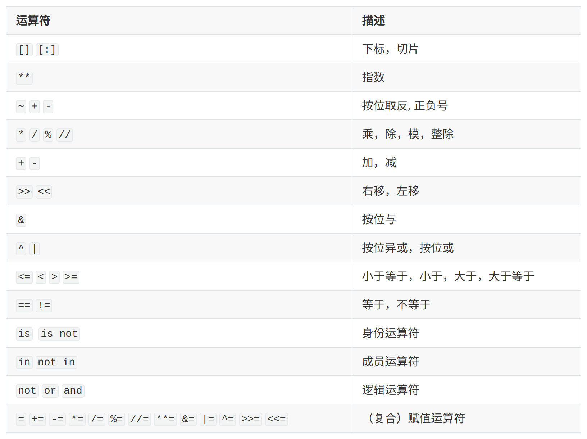

# Python Basic

在进行深度学习的实践中，越发感觉到自己的 python 理论不足，想要重新快速整理一下 python，建立一个比较完整但不细致的框架供自己之后复习。整理资源来自于 [python 100 days](https://github.com/jackfrued/Python-100-Days) 和 [菜鸟教程](https://www.runoob.com/python3/python3-tutorial.html) 

## 什么是 python?

一种编程语言，以缩进分块，有着活跃的社区和丰富的三方库，在人工智能、网络爬虫、自动运维、Web开发等领域都有广泛应用

在我的狭隘理解当中 python = python.exe。当我在使用 anaconda 时，会有不同的环境，一般每一个环境都有自己的 python.exe，如果我想要运行一个 python 脚本，那么需要选择一个 python.exe/解释器 /interpreter 来执行这个脚本

## 安装 python

强烈建议直接安装 anaconda，简称 conda。这是一个流行的包管理工具，其管理奥义就是创建”环境“。环境中可以下载包，管理包，且每个环境都可以安装自己的 python 解释器。这就意味着如果你想要使用不同版本 python 解释器，conda 可以做到，只需要创建多个 conda 环境，想用哪个版本就切到哪个版本的 conda 环境，同时不同的环境可以下载不同的包，实现不一样的功能

## python 开发工具

1. python.exe，直接双击打开就可以开始写 python 代码了，最原生的交互式开发工具，懂我意思？
2. ipython，比原生开发工具好一点
3. pycharm，专业软件，非常好用
4. vscode，宇宙第一开发工具，懂？

## 变量与类型

现在正式开始对 python 脚本进行了解

介绍几个基础数据类型：

1. int 
2. float
3. string
4. bool
5. complex，很少用

### 变量命名

规则：以字母，下划线，数字构成，数字不能开头，字母大小写敏感

PEP 8要求：

- 一般用小写字母拼写，多个单词用下划线连接
- 受保护的实例属性用单个下划线开头（后面会讲到）
- 私有的实例属性用两个下划线开头（后面会讲到）

### 变量的使用

python 中变量的创建不需要声明，直接赋值即创建。**还可以使用内置函数，对变量类型进行转换：int(), float(), str()...使用 type() 查看变量类型**

**再介绍两个基础函数，print() & input()，前者用于打印，后者用于接收键盘输入字符串**

#### 运算符

下表大致按照优先级从高到低的顺序列出了所有的运算符



比较陌生的是位运算符，身份运算符，成员运算符，需要重点理解一下，参考 [菜鸟教程](https://www.runoob.com/python/python-operators.html)

## 分支与循环

分支使用 if...elif...else 形式实现分支

循环有两种形式：for-in 和 while，重点提一下 for-in，用来对一个容器进行迭代非常方便，这个容器可以是列表，字典，元组等具有迭代功能的容器。使用 `break & continue` 来跳出循环

## 函数

python 使用 def 关键字声明函数，以 return 结束，如果没有 return 默认返回 None。在 python 中，函数的参数可以有默认值，也支持使用可变参数 \*args, **kwargs

### 函数参数

#### 可更改对象与不可更改对象

由于 python 中的变量不像 C 语言一样需要声明，所以 python 函数参数是传值还是引用，也和 C 语言不一样。由于 python 的变量不需要声明，那么 python 的变量与 C 语言变量有着本质的区别，举个例子

```python
a = 1
b = 1
print(a is b)	# True
```

可以看到 a 和 b 其实是来自同一个对象，更改了 a 的值，b 也一起被更改了，就好像 a 和 b 的“指针”都指向了1

参考这个 [博客](http://winterttr.me/2015/10/24/python-passing-arguments-as-value-or-reference/)， “类型是属于对象的，而不是变量的”，python 中的变量更像是一个“指针”，是对对象的引用，一个变量可以指向任意的对象。1是属于 int 对象的，而不是属于 a, b 变量的

现在回到参数传递这个话题，我认为可以认为是“引用”传递，但情况分为两种：

1. 传递参数为可更改对象 (mutable)，例如 list, dict, np.array，在函数中**修改**参数值时，会改变原变量；**赋值**新值时，不会改变原变量
2. 传递参数为不可更改对象 (immutable)，例如 strings, numbers, tuples，在函数中**赋值**新值时，不会改变原变量，即原变量所指对象不变

举个例子来理解一下

```python
a = 1
b = [1, 2, 3]
c = ['this is c']

def test(a, b, c):
    a = -1
    b[0] = -1
    c = 0
    print(a, b, c)	# -1 [-1, 2, 3] 0
    
test(a, b, c)
print(a, b, c)	# 1 [-1, 2, 3] ['this is c']
```

#### 参数类型

这里参考 [python 参数，腾讯云](https://cloud.tencent.com/developer/article/1640717) 进行整理。python 函数的形参分为四种：

- 必需参数：平时最常用的，必传确定数量的参数
- 缺省参数：在调用函数时可以传也可以不传，如果不传将使用默认值
- 可变参数：可变长度参数，通常用 `*args` 表示
- 关键字参数：长度可变，但需要以 key=value 对形式传递，通常用 `**kwargs` 表示

对于定义函数时，参数位置的强制要求有以下两点：

1. 缺省参数必须在必须参数之后
2. 关键字参数必须在最后

在给函数传入参数时，可以传入两种类型：

- 位置参数：直接传入实参，传入位置与函数定义时的参数位置相同
- 关键字参数：以 `param=value` 形式出现，可以忽略函数定义时参数的位置

python 强制要求位置参数必须在关键字参数之前

```python
def test(a: str, b: str, c='c', d='d', *args, **kwargs) -> None:
    print('必须参数: %s, %s' % (a, b))
    print('缺省参数: %s, %s' % (c, d))
    print('可变参数:', args)
    print('关键字参数:', kwargs)
    
test('a', 'b', 1, 2, 3, 4, 5, e='e')
print('--------------------------')
test('a', b=1, c='C', e='e')
# 上面过早传入了关键字参数，导致无法传入可变参数 *args
```

上面冒号 `:` 之后表示的是作者建议的传入参数类型，箭头 `->` 之后为建议的函数返回类型

### 解包

当需要传入的多个参数被打包在了一个元组/字典中，可以通过解包的方式，直接把元组/字典作为可变参数/关键字参数，传入到函数当中

```python
args = (1, 2, 3)
kwargs = dict(b='b', a='a', c='c')

def test(a, b, c):
    print(a, b, c)

test(*args)
# 1 2 3
test(**kwargs)
# a b c
```

从上面的代码中可以看到，解包元组用  `*`，解包字典用 `**`

### lambda 匿名函数

lambda 只是一个表达式，函数体比 def 简单很多，所以只能封装有限的逻辑。lambda 函数的语法只有一句

```python
lambda [args_list]: expression
```

`expression` 可以是表达式，也可以是一个函数。下面举一个例子来使用 lambda 函数

```python
add = lambda a, b: a + b
print(add(1, 2))

def exp(a, b):
    return a**b
# expression can be a function
exp_of_2 = lambda x: exp(2, x)
print(exp_of_2(3))
```

所谓匿名，意即不再使用 def 语句这样标准的形式定义一个函数，故没有函数名！

### 模块化管理 import

通过模块管理 python 文件/函数将会变得非常方便，需要使用的函数，使用关键字 `import` 导入即可，导入方法有如下：

1. `import module`：导入模块，以 `module.func` 使用模块中的函数等内容
2. `import module ad md`：导入模块，命名为 md，使用方法类似1
3. `from module import func`：直接从模块中导入函数，可直接使用 func()

当我们使用 import 语句的时候，Python解释器是怎样找到对应的文件的呢？这就涉及到 Python 的搜索路径，搜索路径是由一系列目录名组成的，Python 解释器就依次从这些目录中去寻找所引入的模块。搜索路径被存储在 sys 模块中的 path 变量，此变量为一个列表

```python
import sys
for path in sys.path:
	print(path)
# d:\VScodeProjects\TestProj
# D:\LenovoSoftstore\Anaconda\python38.zip
# D:\LenovoSoftstore\Anaconda\lib\site-packages
# ...MORE
```

一般 `sys.path` 列表的第一个即为执行 python 文件时所在的目录 (pwd)

#### if \_\_name\_\_ = '\_\_main\_\_'

需要说明的是，如果导入的模块中有可执行的代码，那么在导入模块时就会执行。但事实上，我们可能不希望执行这些代码，只想要导入这个函数，例如下面的模块

```python
# module.py
def module_func():
	print('this is a module')
	
module_func()
```

此时如果在另一个 python 文件中 `import module` 将会看到输出 `this is a module`。为了避免这种情况，需要在模块中限定这些可执行代码，仅在该模块直接运行的时候运行，而不在导入的时候运行。可采取如下形式

```python
# module.py
def module_func():
	print('this is a module')

# __name__是Python中一个隐含的变量它代表了模块的名字
# 只有被Python解释器直接执行的模块的名字才是__main__
if __name__ = '__main__':
	module_func()
```

这里提到了一个隐含变量 `__name__`，是由 python 自动生成的变量，不需要人为定义。在 python 中有其他的隐含变量，例如 `__doc__` 用于保存对象的说明性文档，通过关键字 `?` 就能调出文档，[CSDN doc参考](https://blog.csdn.net/u011699626/article/details/107981264)

