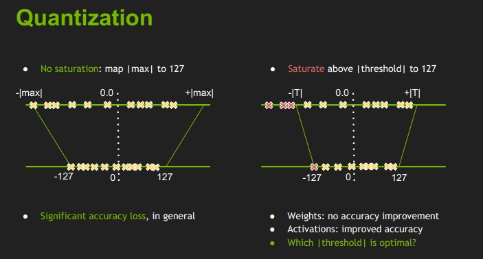
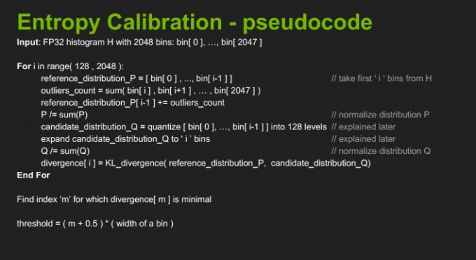
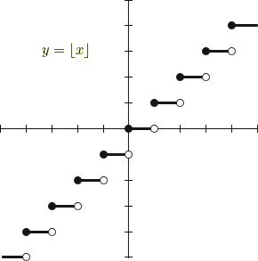

# Pytorch Quantization

参考 [Pytorch Blog](https://pytorch.org/blog/quantization-in-practice/)	[Pytorch Quantization](https://pytorch.org/docs/stable/quantization.html)	[Pytorch Fx Mode](https://pytorch.org/docs/stable/quantization.html#prototype-fx-graph-mode-quantization)	[FakeQuant-zhihu](https://zhuanlan.zhihu.com/p/404445525)	[量化入门-zhihu](https://zhuanlan.zhihu.com/p/149659607) 

## General Quantization Flow

1. 准备 Observer/FakeQuantize 模型
2. 校正 calibration train，使用一些数据让模型学习量化参数
3. 把校正后的模型转换为量化模型

上面其实是属于后训练量化（Post Training Quantization, PTQ），而 QAT 把量化过程模拟到校正训练当中

量化方法又可以简单分为两种：

1. dynamic quant，权重静态量化，激活值动态量化
2. static quant，权重和激活值都静态量化

什么是动态量化？

> The key idea with dynamic quantization as described here is that we are going to determine the scale factor for activations dynamically based on the data range observed at runtime.

这里 activations 翻译过来就是激活值，个人理解是网络中各个层的输出，不仅仅是与激活层相关。因为我们不仅需要 weight 量化，对于计算的数值更需要量化

对称量化和非对称量化，非对称量化会带来什么影响 zero point 的值，个人理解非对称量化计算量更大，或许会更精确一丢丢

校正数据正是为了计算 activation 的量化参数，且只在 static quant 中进行

## Example

以 static quantization 来讲，准备一个模型 `M`，将其量化一般需要如下5个步骤

```python
import torch

# define a floating point model where some layers could be statically quantized
class M(torch.nn.Module):
    def __init__(self):
        super(M, self).__init__()
        # QuantStub converts tensors from floating point to quantized
        self.quant = torch.quantization.QuantStub()
        self.conv = torch.nn.Conv2d(1, 1, 1)
        self.relu = torch.nn.ReLU()
        # DeQuantStub converts tensors from quantized to floating point
        self.dequant = torch.quantization.DeQuantStub()

    def forward(self, x):
        # manually specify where tensors will be converted from floating
        # point to quantized in the quantized model
        x = self.quant(x)
        x = self.conv(x)
        x = self.relu(x)
        # manually specify where tensors will be converted from quantized
        # to floating point in the quantized model
        x = self.dequant(x)
        return x
# create a model instance
model_fp32 = M()
# model must be set to eval mode for static quantization logic to work
model_fp32.eval()


# 1. 设置 default config，通常就设置一下 backend，也可以设置对称/非对称量化，校正策略等
model_fp32.qconfig = torch.quantization.get_default_qconfig('fbgemm')

# 2. 融合网络层
model_fp32_fused = torch.quantization.fuse_modules(model_fp32, [['conv', 'relu']])

# 3. 准备模型，插入 observer
model_fp32_prepared = torch.quantization.prepare(model_fp32_fused)

# 4. 校正
input_fp32 = torch.randn(4, 1, 4, 4)
model_fp32_prepared(input_fp32)

# 5. 转为量化模型
model_int8 = torch.quantization.convert(model_fp32_prepared)

# run the model, relevant calculations will happen in int8
res = model_int8(input_fp32)
```

QAT 在两处有些许不同：

1. 设置 default config

   ```python
   model_fp32.qconfig = torch.quantization.get_default_qat_qconfig('fbgemm')
   ```

3. 准备模型，插入 observer，并且把 tensor 转换为 fake quant 形式

    ```python
    model_fp32_prepared = torch.quantization.prepare_qat(model_fp32_fused)
    ```

个人理解 QAT 将直接使用数据集进行训练，在训练的过程中更新 weight 使得网络能考虑量化的影响，并且在训练过程中仍然计算 scale & zero point

使用 [fx mode](https://docs-preview.pytorch.org/76223/fx.html) 可以把融合激活函数和插入 observer 两步合为一步，不需要人为指定哪些层需要融合，但要求模型本身是 [symbolic traceable](https://docs-preview.pytorch.org/76223/fx.html#limitations-of-symbolic-tracing) 也就是不能出现动态结构，例如 if 分支或者 for 循环这些可能由输入决定而动态执行的环节

## 实践

参考 [QAT-github](https://github.com/leimao/PyTorch-Quantization-Aware-Training) 使用 Eager Mode 实现了 QAT 训练流程。模型为 ResNet18，数据集为 cifar-10

（Not Important）配合地平线工具链，一般需要5个开发过程

1. 浮点模型准备，指正常的 pretrain model
2. 模型验证，为了确保模型中的算子能够正常在地平线平台上运行，可以使用 `hb_mapper checker` 工具验证
3. **模型转化**，将模型转换成地平线平台接受的模型结构，使用 `hb_mapper makertbin` 工具完成，量化将在此步骤完成
4. 性能评估，可以借助 `hb_perf` 工具获得模型的性能，通常包括推理速度，使用内存两部分
5. **精度评估**，对量化后的模型表现进行评估，可以使用 QAT 继续调优

可结合[地平线开发工具链](https://developer.horizon.ai/resource) [社区QAT](https://developer.horizon.ai/forumDetail/98129538025877648) (来源 [CSDN](https://blog.csdn.net/i6101206007/article/details/108385825)) 进行实践

## 理论

### [基本原理](https://zhuanlan.zhihu.com/p/149659607)

量化本质上只是对数值范围的重新调整，可以「粗略」理解为是一种线性映射。量化过后我们就能够将浮点运算转移到定点运算，达到减小模型加速计算的效果

这里我们用 r 表示浮点实数，q 表示量化后的定点整数，映射公式为
$$
r=S(q-Z)
$$
$S, Z$ 是映射参数或者称为量化参数。当我们确定了 $r, q$ 的取值范围后，就能够算出映射参数，公式如下
$$
S=\frac{r_{\max }-r_{\min }}{q_{\max }-q_{\min }} \\
Z=\operatorname{round}\left(q_{\max }-\frac{r_{\max }}{S}\right)
$$
$Z$ 的计算使用了 round 操作，是为了让 $q$ 的零点和 $r$ 的零点对应起来。当 $r, q$ 的取值范围都是对于0对称时就称为对称量化，否则称为非对称量化。对称量化时，根据公式可算得零点 $Z=0$

相对于非对称量化，对称量化损失了一定的准确度，但是获得了更快的计算速度。一般对于权重可使用对称量化，对于激活值使用非对称量化。下图为对称量化时，使用不同的 $|max|$ 可能的影响



### 矩阵运算

以矩阵乘法的例子来简要说明量化计算流程，如何将计算转移为定点计算

假设 $r_1$、$r_2$ 是浮点实数上的两个 $N×N$ 的矩阵，$r_3$ 是 $r_1$、$r_2$ 相乘后的矩阵，矩阵运算表示如下
$$
r_{3}^{i, k}=\sum_{j=1}^{N} r_{1}^{i, j} r_{2}^{j, k}
$$
带入量化公式得到
$$
S_{3}\left(q_{3}^{i, k}-Z_{3}\right)=\sum_{j=1}^{N} S_{1}\left(q_{1}^{i, j}-Z_{1}\right) S_{2}\left(q_{2}^{j, k}-Z_{2}\right)
$$
将左侧整理为只有 $q_3$ 的形式
$$
q_{3}^{i, k}=\frac{S_{1} S_{2}}{S_{3}} \sum_{j=1}^{N}\left(q_{1}^{i, j}-Z_{1}\right)\left(q_{2}^{j, k}-Z_{2}\right)+Z_{3}
$$
可以看到使用该公式获得 $q_3$ 已经将大部分运算转换到定点当中，只有 $\frac{S_1S_2}{S_3}$ 是浮点表示。而通过定点数+位移的方法可以解决这一问题（这不就是浮点的本质定义） 
$$
M = \frac{S_1S_2}{S_3} \simeq 2^{-n}M_0
$$
其中 $M_0$ 是一个定点数，$2^{-n}$ 可以通过位运算完成。这样所有的运算都将在定点完成，可将公式简化如下
$$
q_{3}^{i, k}=M \sum_{j=1}^{N}\left(q_{1}^{i, j}-Z_{1}\right)\left(q_{2}^{j, k}-Z_{2}\right)+Z_{3}=M P+Z_{3}
$$
但是，以上的过程的存在有一个假设：**所有的映射参数都是已知的**，包括 $S_3, Z_3$ 都必须提前得到。这就带来一个问题：映射参数 $S_3,Z_3$ 是根据 $r_3,q_3$ 的范围计算得到。$q_3$ 的范围是很好确定的，通常采用 int8 或者 uint8 变量表示。而 $r_3$ 本来就是我们需要算的数，我们不太可能**准确**知道 $r_3$ 的范围

解决方法：虽然不能准确知道**每个** $r_3$ 的范围，但是通过一些数据实验，我们可以知道**统计情况下** $r_3$ 的范围是多少。具体来说，我们使用多个 $r_1, r_2$ 进行计算获得多个 $r_3$，我们统计这些 $r_3$ 的值域，选择合适的范围来计算 $S_3, Z_3$，这就是 post train quantization 后训练量化的简单描述

上面只说明了矩阵乘法的量化过程，而不同的运算在量化后都需要重新设计，例如 [Add Concat](https://zhuanlan.zhihu.com/p/336682366)，这里不继续整理了，大致的思路是从浮点等式开始，推导映射后的量化值 $q$ 是多少

### [Post Training Quantization](https://zhuanlan.zhihu.com/p/156835141)

如上所说，后训练量化需要多个样本，把这些挑选出来的样本称为 calibration set 校正集。在挑选 calibration set 时可以参考以下准则：1. 具有**代表性**的样本；2. 保持样本**多样性**；3. 理想情况是验证集的子集；4. 大约1000张就足够

有了样本后，可以使用不同的策略计算浮点数的范围。这里介绍三种训练策略：

1. MinMax 策略。这是最简单的后训练量化策略，直接记录数据集中浮点数的最大值最小值。这样的方法对于离群值非常不友好

2. Mean Square Error 策略。利用 Frobenius 范数 $\|A\|_{F}=\sqrt{\operatorname{tr}\left(A^{T} A\right)}=\sqrt{\sum_{i, j} a_{i j}^{2}}$，直接计算真实矩阵与估计矩阵之间的差值
   $$
   \underset{r_{\min }, r_{\max }}{\arg \min }\left\|\mathbf{X}-\hat{\mathbf{X}}\left(r_{\min }, r_{\max }\right)\right\|_{F}^{2}
   $$
   其中 $\mathbf X$ 代表浮点矩阵，$\hat{\mathbf{X}}\left(r_{\min }, r_{\max }\right)$ 表示量化后的矩阵

3. KL Divergence 策略，下图为 Nvidia TensorRT 中 KL Divergence/Entropy 策略的伪代码

   

   从伪代码中看到 $r_{min}$ 其实是固定的，遍历采样点，计算 KL 散度获得最合适的 $r_{max}$。简单来说就是计算浮点和定点 histogram 分布 $\psi$ 的 KL 散度
   $$
   \underset{r_{\min }, r_{\max }}{\arg \min }\ KLD\left(\psi(\mathbf{X}), \psi\left(\hat{\mathbf{X}}\left(r_{\min }, r_{\max }\right)\right)\right)
   $$

### [Quantization Aware Training](https://zhuanlan.zhihu.com/p/158776813)

后训练量化虽然操作简单，但有时候这种并不能保证足够的精度。此时可以使用量化感知训练进行微调，从而让网络参数能更好地适应量化带来的信息损失。具体来说，QAT 使用 FakeQuant 模块来模拟量化过程，但是所有的计算过程都是使用浮点计算，最后通过损失函数更新模型参数以适应量化带来的偏差

需要注意的是，由于量化过程中必须要使用 round 方法，这个方法是不可导的，或者说其可导的部分倒数为0，在这种情况下是无法使用梯度更新参数的



解决方法是 Straight Through Estimatro (STE)，即我们的梯度是绕过 round 操作，直接传到 weight 上。STE 需要重新定义反向传播的梯度，借助 pytorch 中的 `Function` 来重新定义伪量化 weight

```python
from torch.autograd import Function

class FakeQuantize(Function):

    @staticmethod
    def forward(ctx, x, qparam):
        x = quantize_tensor(x)
        x = dequantize_tensor(x)
        return x

    @staticmethod
    def backward(ctx, grad_output):
        return grad_output, None
```

### [Conv BN ReLU](https://zhuanlan.zhihu.com/p/176982058)

ConvBNReLU 在量化模型中通常是融合的到一个节点上进行。融合的好处不仅是计算更快，而且省略了中间层的量化参数

ConvBN 融合过程可用下面公式表示
$$
\text{BatchNorm can be noted  as:}\\\hat x = W_{BN}·x+b_{BN}
\\\\
\text{Conbined with conv:}\\\hat{\mathbf{f}}_{i, j}=\mathbf{W}_{B N} \cdot\left(\mathbf{W}_{\text {conv }} \cdot \mathbf{f}_{i, j}+\mathbf{b}_{\text {conv }}\right)+\mathbf{b}_{B N}
$$
而 ReLU 的实现可用下面公式表示
$$
q_{2}=\left\{\begin{array}{ll}
q_{1} & q_{1}>=Z_{1} \\
Z_{1} & q_{1}<Z_{1}
\end{array}\right.
$$

另外补充一点：BN 可以用一个 1x1 depth wise conv 来表示，用代码表示为 `nn.Conv1d(in_dim, in_dim, 1, groups=in_dim)`

在 Conv 类中，groups 参数有两个要求：

1. `in_dim` 必须能整除 groups，即 `in_dim % groups == 0`
2. `out_dim` 必须能整除 groups

使用了 groups=2 的卷积过程如下：

1. 对于`in_dim` 的特征向量，其将分为 groups=2 个部分，即每个部分的向量形状为 `in_dim // groups`
2. 每个部分将分别使用 `out_dim // groups` 个卷积核计算输出结果，最后 cat 起来得到最终输出

groups 参数能够显著减少 conv 层的参数量，但实测下来并不会显著减少计算时间，参考 [link](https://zhuanlan.zhihu.com/p/448854623)

```python
# test group conv
import torch
import torch.nn as nn

input = torch.randn(1, 4, 10, 10)
conv1 = nn.Conv2d(4, 8, 3, 1, 1, bias=False, groups=1)
conv2 = nn.Conv2d(4, 8, 3, 1, 1, bias=False, groups=2)
# doc groups: https://pytorch.org/docs/stable/generated/torch.nn.Conv2d.html

print(conv1.weight.shape)
print(conv2.weight.shape)
# torch.Size([8, 4, 3, 3])
# torch.Size([8, 2, 3, 3])

print(conv1(input).shape)
print(conv2(input).shape)
# torch.Size([1, 8, 10, 10])
# torch.Size([1, 8, 10, 10])
```

## TensorRT/ONNX 量化

参考 [paddle](https://aistudio.baidu.com/aistudio/projectdetail/3924447)	[ONNX doc](https://onnxruntime.ai/docs/performance/quantization.html)	[TensorRT doc](https://docs.nvidia.com/deeplearning/tensorrt/index.html)	[bilibili](https://www.bilibili.com/video/BV15Y4y1W73E)

这里不作任何整理，下面是 trt 的一些简介

### 什么是 TensorRT

1. 用于高效实现已训川练好的深度学习模型的推理过程的 SDK
2. 内含推理优化器和运行时环境
3. 使DL模型能以更高吞吐量和更低的延迟运行
4. 有 C++ 和 python 的 API，完全等价可以混用

TensorRT 做的工作：模型解析/建立，计算图优化，节点消除，多精度支持，调入 plugin，显存优化

### Workflow

现在最常用的是使用 Parser 的方法，比较兼顾开发效率和性能。遇到不支持的算子可以写 plugin 完成

基本流程

1. 构建期
   1. 建立 Logger
   2. 建立 Builder (引擎构建器)
   3. 创建 Network (计算图内容)
   4. 生成 SerializedNetwork (网络的TRT内部表示)

2. 运行期
3. 建立 Engine 和 Context
4. Buffer 相关准备 (Host 端 + Device 端 + 拷贝操作)
5. 执行推理 (Execute)
