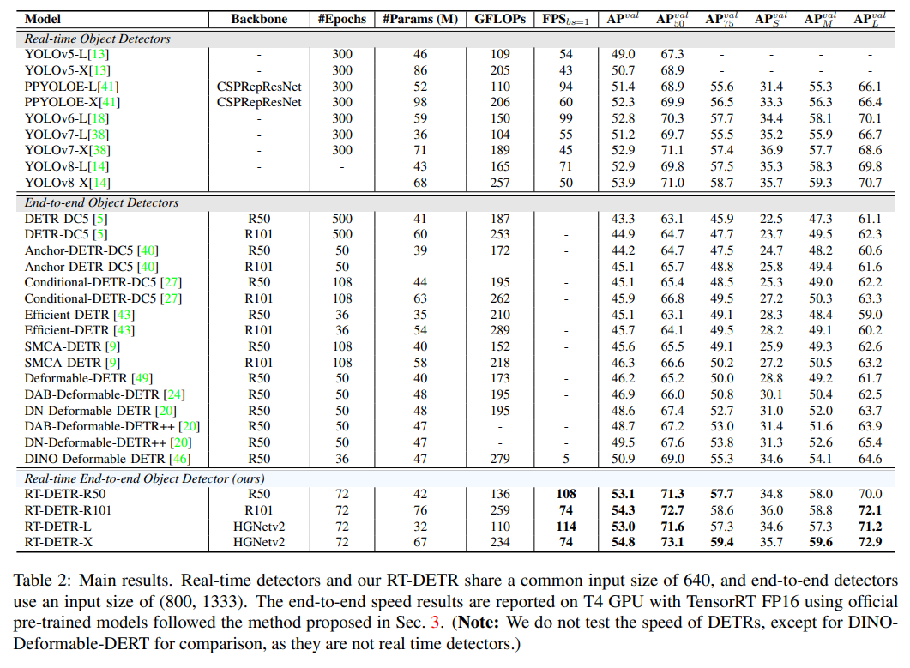
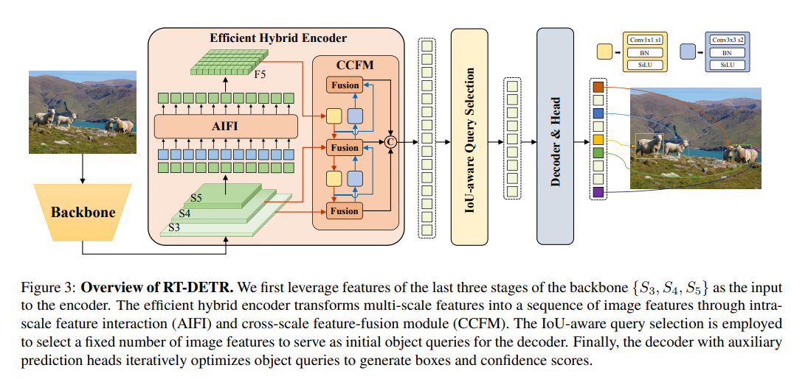
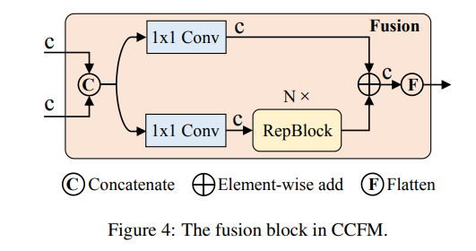
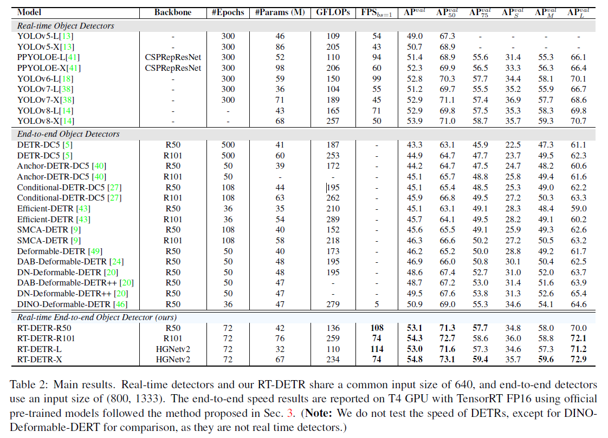

# RT-DETR

[Ultralytics-RT-DETR](https://docs.ultralytics.com/models/rtdetr/)	[Official-RT-DETR](https://github.com/lyuwenyu/RT-DETR)	[arxiv](https://arxiv.org/abs/2304.08069)

## 总览

**问题1**

之前的检测器都需要使用 NMS 后处理，NMS 是一个比较耗时的算子。这个问题在 DETR 中已经得到了解决，现在能够形成端到端的目标检测器

这是 YOLOv8 官方数据


下面是 RT-DETR 计算后处理过后的 benchmark



**问题2**

DETR 系列都有着非常高的计算量，虽然不需要后处理，但是前向过程也非常耗时。论文分析了 multi-scale features 虽然很有用，但是对于 encoder 来说负担太重，即使使用了 deformable attn 来减少计算量，也仍是计算的瓶颈

解决方法：论文使用了 intra-scale interaction 以及 cross-scale fusion 模块来生成多尺度特征

**亮点**

RT-DETR 对 decoder 的层数进行了实验，发现只使用前几层的 decoder 可以获得稍差的结果，带来的收益是速度的提升。这是得益于 DETR decoder 的特性，每一层都有预测，所以不需要重新训练，就能满足不同的速度需求

RT-DETR **最大的亮点**就是能够超越 YOLO 系列的速度，在 T4 GPU 能够以 114 FPS 运行，并且保持了高精度

## 方法

模型的结构图可以用以下示意图简要表示



其中：

1. AIFI 就是 intra-scale feature interaction，另一个 fancy name for attention...
2. CCFM 中的 fusion 运行方式如下，整个 CCFM 论文中说如 PAN-like 方式，简单来说就是先上采样，然后再下采样（先看红色路径，然后再看蓝色路径），并且图中省略了上采样模块 `nn.Upsample`



可以看到 intra-scale interaction (AIFI) 只在低分辨率上的特征层进行，原因有二：

1. 节省计算量
2. **低分辨率代表更高语义，在语义上做 attention 更有效，反之在低分辨率上做 attention 很难获得有效信息。论文也用实验验证了这一设计，不仅更快，而且更好**

这感觉和 ViTDet 有异曲同工之妙，挖坑

## 实验



## 代码

这里只对 CCFM 的实现有些模糊，查看了 ultralytics 的实现，首先是其 yaml

```yaml
# Ultralytics YOLO 🚀, AGPL-3.0 license
# RT-DETR-l object detection model with P3-P5 outputs. For details see https://docs.ultralytics.com/models/rtdetr

# Parameters
nc: 80  # number of classes
scales: # model compound scaling constants, i.e. 'model=yolov8n-cls.yaml' will call yolov8-cls.yaml with scale 'n'
  # [depth, width, max_channels]
  l: [1.00, 1.00, 1024]

backbone:
  # [from, repeats, module, args]
  - [-1, 1, HGStem, [32, 48]]  # 0-P2/4
  - [-1, 6, HGBlock, [48, 128, 3]]  # stage 1

  - [-1, 1, DWConv, [128, 3, 2, 1, False]]  # 2-P3/8
  - [-1, 6, HGBlock, [96, 512, 3]]   # stage 2

  - [-1, 1, DWConv, [512, 3, 2, 1, False]]  # 4-P3/16
  - [-1, 6, HGBlock, [192, 1024, 5, True, False]]  # cm, c2, k, light, shortcut
  - [-1, 6, HGBlock, [192, 1024, 5, True, True]]
  - [-1, 6, HGBlock, [192, 1024, 5, True, True]]  # stage 3

  - [-1, 1, DWConv, [1024, 3, 2, 1, False]]  # 8-P4/32
  - [-1, 6, HGBlock, [384, 2048, 5, True, False]]  # stage 4

head:
  - [-1, 1, Conv, [256, 1, 1, None, 1, 1, False]]  # 10 input_proj.2
  - [-1, 1, AIFI, [1024, 8]]
  - [-1, 1, Conv, [256, 1, 1]]   # 12, Y5, lateral_convs.0

  - [-1, 1, nn.Upsample, [None, 2, 'nearest']]
  - [7, 1, Conv, [256, 1, 1, None, 1, 1, False]]  # 14 input_proj.1
  - [[-2, -1], 1, Concat, [1]]
  - [-1, 3, RepC3, [256]]  # 16, fpn_blocks.0
  - [-1, 1, Conv, [256, 1, 1]]   # 17, Y4, lateral_convs.1

  - [-1, 1, nn.Upsample, [None, 2, 'nearest']]
  - [3, 1, Conv, [256, 1, 1, None, 1, 1, False]]  # 19 input_proj.0
  - [[-2, -1], 1, Concat, [1]]  # cat backbone P4
  - [-1, 3, RepC3, [256]]    # X3 (21), fpn_blocks.1

  - [-1, 1, Conv, [256, 3, 2]]   # 22, downsample_convs.0
  - [[-1, 17], 1, Concat, [1]]  # cat Y4
  - [-1, 3, RepC3, [256]]    # F4 (24), pan_blocks.0

  - [-1, 1, Conv, [256, 3, 2]]   # 25, downsample_convs.1
  - [[-1, 12], 1, Concat, [1]]  # cat Y5
  - [-1, 3, RepC3, [256]]    # F5 (27), pan_blocks.1

  - [[21, 24, 27], 1, RTDETRDecoder, [nc]]  # Detect(P3, P4, P5)

```

简单一下 yaml 参数含义，每一个模块有4个参数 `[from, number, module, args]`，意思是：

1. feature 来自那一层的输出
2. 模块重复数量
3. 模块名称
4. 模块实例化参数

这样一看其实就很明了了，只需要查看 RepC3 的实现就能掌握 CCFM 的实现，其中 RepC3 是 RepVGG 中的实现，特点在于能够融合 ConvBN 层，从而加速计算，这里就不完全粘贴代码了，省略了不少

```python
class RepC3(nn.Module):
    """Rep C3."""

    def __init__(self, c1, c2, n=3, e=1.0):
        super().__init__()
        c_ = int(c2 * e)  # hidden channels
        self.cv1 = Conv(c1, c2, 1, 1)
        self.cv2 = Conv(c1, c2, 1, 1)
        self.m = nn.Sequential(*[RepConv(c_, c_) for _ in range(n)])
        self.cv3 = Conv(c_, c2, 1, 1) if c_ != c2 else nn.Identity()

    def forward(self, x):
        """Forward pass of RT-DETR neck layer."""
        return self.cv3(self.m(self.cv1(x)) + self.cv2(x))
    
    
class RepConv(nn.Module):
    """RepConv is a basic rep-style block, including training and deploy status
    This code is based on https://github.com/DingXiaoH/RepVGG/blob/main/repvgg.py
    """
    default_act = nn.SiLU()  # default activation

    def __init__(self, c1, c2, k=3, s=1, p=1, g=1, d=1, act=True, bn=False, deploy=False):
        super().__init__()
        assert k == 3 and p == 1
        self.g = g
        self.c1 = c1
        self.c2 = c2
        self.act = self.default_act if act is True else act if isinstance(act, nn.Module) else nn.Identity()

        self.bn = nn.BatchNorm2d(num_features=c1) if bn and c2 == c1 and s == 1 else None
        self.conv1 = Conv(c1, c2, k, s, p=p, g=g, act=False)
        self.conv2 = Conv(c1, c2, 1, s, p=(p - k // 2), g=g, act=False)

    def forward_fuse(self, x):
        """Forward process"""
        return self.act(self.conv(x))

    def forward(self, x):
        """Forward process"""
        id_out = 0 if self.bn is None else self.bn(x)
        return self.act(self.conv1(x) + self.conv2(x) + id_out)

    def get_equivalent_kernel_bias(self):
        pass
    def _avg_to_3x3_tensor(self, avgp):
        pass
    def _pad_1x1_to_3x3_tensor(self, kernel1x1):
        pass
    def _fuse_bn_tensor(self, branch):
        pass

    def fuse_convs(self):
        if hasattr(self, 'conv'):
            return
        kernel, bias = self.get_equivalent_kernel_bias()
        self.conv = nn.Conv2d(in_channels=self.conv1.conv.in_channels,
                              out_channels=self.conv1.conv.out_channels,
                              kernel_size=self.conv1.conv.kernel_size,
                              stride=self.conv1.conv.stride,
                              padding=self.conv1.conv.padding,
                              dilation=self.conv1.conv.dilation,
                              groups=self.conv1.conv.groups,
                              bias=True).requires_grad_(False)
        self.conv.weight.data = kernel
        self.conv.bias.data = bias
        for para in self.parameters():
            para.detach_()
        self.__delattr__('conv1')
        self.__delattr__('conv2')
        if hasattr(self, 'nm'):
            self.__delattr__('nm')
        if hasattr(self, 'bn'):
            self.__delattr__('bn')
        if hasattr(self, 'id_tensor'):
            self.__delattr__('id_tensor')
```

## 补充

1. RT-DETR 是优于 DINO 的目标检测器，不管是速度还是精度。我认为原因在于 DINO 的 encoder 使用了 deformable attention，这样的 attention 缺少全局特征的交互，所以在 epoch 增加后，DINO 就不再涨点了，但是 RT-DETR 仍然能够涨。在 issue 中也发布了 RT-DETR 的训练日志 [log](https://github.com/lyuwenyu/RT-DETR/issues/8)，可以发现，在 epoch 12 的时候，RT-DETR 的效果和 DINO 12 epoch 的效果相同 (49.2 v.s. 49.5)，在 24 epoch 的时候就能大幅超越了 (51.3 v.s. 50.6)，并且 RT-DETR 在单个 epoch 运行时间上有着显著的优势（大概只要 DINO 一半的时间）。随着 epoch 达到 72 时，达到了 53.1 的 AP

   事实上 RT-DETR 的出现恰好证明了 DINO 的 encoder 是低效的，而另一个证明 DINO 的 encoder 差的论文就是 VitDet

   VitDet 所使用的 Backbone 其效果大概跟 IN-22K 预训练的 backbone 差不多。在 DINO 中使用了 ViTDet 的 backbone，所获得的效果为 55.0 & 57.5 (ViT-B &  ViT-L)，在 VitDet 论文当中所获得结果为 51.6 & 55.6，但是 ViTDet 使用 cascade mask rcnn 结构过后结果为 56.0 & 59.6，基本上就是全面超过了 ViTDet-DINO，而这个结果大概和 Swin-L-DINO 对齐 (55.8 & 58.5)。而在 ViTDet 中是没有使用 transformer encoder 这样的结构的，FPN 的多尺度特征直接由 ViT 输出，没有进一步的学习。这说明 DINO transformer encoder 对于小 backbone 而言是有效的（例如 r50），这能补充一些语义信息，但是对于大的 backbone 而言（或者说学特征比较鲁棒的 backbone 而言），这些信息已经自足，不需要进一步的多尺度交互。但是训练时间上二者有很大的区别，DINO 在收敛速度上极快，因为有了 denoising & dynamic anchor 等技术加持，让训练更好的检测网络成为大众可上手的事情

   MAE 是一个训练门槛“不高”的技术 [MAE Finetune](https://github.com/facebookresearch/mae/blob/main/FINETUNE.md) [a100 train vit-base](https://github.com/facebookresearch/mae/issues/113#issuecomment-1214301372)

2. R50 在 transformer 中大概是 Tiny 的大小 (25M)，R101 是 Small (50M)，而 Base 一般为 100M 左右的参数量，Large 为200~300M 左右的参数量
3. 另一个理解：为什么两阶段是有效的。我的结论是，两阶段中，第一阶段为第二阶段提供了更好的先验，能够将集中注意力去处理前景框。这些集中的注意力应该能够提供更高的召回率，尤其对小样本的召回率更好。并且由于 RT-DETR 的存在，两阶段的速度问题也都被解决了
