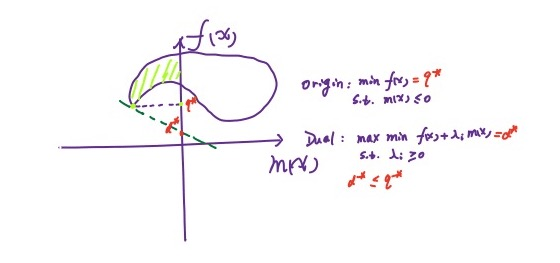

## SVM

支撑向量机（SVM）算法在分类问题中有着重要地位，其主要思想是最大化两类之间的间隔

数据集可分为以下三类：

1. 线性可分
2. 线性不可分，但在去掉少量噪声点后线性可分
3. 线性不可分，完全不可分！

针对以上三种数据集，发展出来三种 SVM：

1. Hard-margin SVM
2. Soft-margin SVM
3. Kernel method

SVM 的求解中，大量用到了 Lagrange 乘子法，首先对这种方法进行介绍

## 优化问题

### 约束优化与无约束优化

一般地，约束优化问题（原问题）可以写成
$$
\begin{align}

&\min_{x\in\mathbb{R^p}}f(x)\\
&s.t.\ m_i(x)\le0,i=1,2,\cdots,M\\
&\ \ \ \ \ \ \ \ n_j(x)=0,j=1,2,\cdots,N

\end{align}
$$
定义 Lagrange 函数：
$$
L(x,\lambda,\eta)=f(x)+\sum\limits_{i=1}^M\lambda_im_i(x)+\sum\limits_{i=1}^N\eta_in_i(x)
$$
那么原问题可以等价于无约束形式：
$$
\min_{x\in\mathbb{R}^p}\max_{\lambda,\eta}L(x,\lambda,\eta)\ s.t.\ \lambda_i\ge0
$$
这二者等价的证明，可以去看一下原视频，讲得非常清楚。如果可以将函数图像画出来，可以发现，当约束条件不满足的时候，下面这个函数将可以趋近于无穷大👇
$$
f'(x) = \max_{\lambda,\eta}L(x,\lambda,\eta)\ s.t.\ \lambda_i\ge0
$$
再对上面这个函数取最小值时，显然我们不会取到不满足约束条件的 $x$，这就天然过滤了不符合约束条件的 $x$。那么此时可以认为
$$
f'(x) = \max_{\lambda,\eta}L(x,\lambda,\eta)=f(x)
\\s.t.\lambda_i\ge0,m(x_i) \le 0
$$
因为一个数减去一个非负函数肯定小于等于其本身，但是等号是可以取得的，所以其最大值必定等于其本身。再对以上求最小值就得到了原问题了，可以认为以上的推导是双箭头，所以原问题和无约束问题等价

### 原问题与对偶问题

原问题
$$
\min_{x\in\mathbb{R}^p}\max_{\lambda,\eta}L(x,\lambda,\eta)\ s.t.\ \lambda_i\ge0
$$
对偶问题
$$
\max_{\lambda,\eta}\min_{x\in\mathbb{R}^p}L(x,\lambda,\eta)\ s.t.\ \lambda_i\ge0
$$
可以看到把 max & min 的位置交换了一下，是不是非常简单！

可以证明对偶问题的解 ≤ 原问题的解，原视频用了鸡头凤尾形象的比喻，数学语言也很简单

> 显然有 $\min\limits_{x}L\le L\le\max\limits_{\lambda,\eta}L$，于是显然有 $\max\limits_{\lambda,\eta}\min\limits_{x}L\le L$，且 $\min\limits_{x}\max\limits_{\lambda,\eta}L\ge L$。

### 强弱对偶性

定义强弱对偶性如下：

1. 弱对偶性：对偶问题的解 ≤ 原问题的解
2. 强对偶性：对偶问题的解 = 原问题的解

弱对偶性也可以通过一种几何方法表示

对于一个凸优化问题，如果满足 Slater 条件，则强对偶性满足

>   Slater 条件为：
>   $$
>   \exist\hat{x}\in Relint\mathcal{D}\ s.t.\ \forall i=1,2,\cdots,M,m_i(x)\lt0
>   $$
>   其中 Relint 表示相对内部（不包含边界的内部）

对于大多数凸优化问题，Slater 条件都是成立的，但是 Slater 条件也只是一个充分条件。常用的另一个充分条件是 Linearity constraint qualification，即约束等式和不等式都是线性的

### KKT 条件

在凸优化情况下，强对偶性满足和 KKT 条件成立是等价关系。我们通常使用 KKT 条件进行原问题的数值求解。[KKT条件在使用的时候有什么要求吗？是否要求强对偶](https://www.zhihu.com/question/49754458)

>KKT 条件可分为三个部分
>
>1. 可行域：
> $$
>   \begin{align}
>   m_i(x^*)\le0\\
>   n_j(x^*)=0\\
>   \lambda^*\ge0
>   \end{align}
> $$
>
>2. 互补松弛 $\lambda^*m_i(x^*)=0,\forall m_i$，对偶问题的最佳值为 $d^*$，原问题为 $p^*$
>
>3. 梯度为0：$\frac{\partial L(x,\lambda^*,\eta^*)}{\partial x}|_{x=x^*}=0$
>
>粗糙证明如下：
>$$
>\begin{align}
>d^*&=\max_{\lambda,\eta}g(\lambda,\eta)=g(\lambda^*,\eta^*)\nonumber\\
>&=\min_{x}L(x,\lambda^*,\eta^*)\nonumber\\
>&\le L(x^*,\lambda^*,\eta^*)\nonumber\\
>&=f(x^*)+\sum\limits_{i=1}^M\lambda^*m_i(x^*)\nonumber\\
>&\le f(x^*)=p^*
>\end{align}
>$$
>由强对偶性得，两个不等式必须成立，于是，对于第一个不等于号，可得在 $x^*$ 处有梯度为0成立，对于第二个不等于号需要满足互补松弛条件

## Hard-margin SVM

现在正式提出 SVM 模型并计算出最优解！在 SVM 中，我们引入**最大化间隔**这个概念，**间隔指的是数据和直线的距离的最小值**

那么最大化间隔的表达如下
$$
\mathop{argmax}_{w,b}[\min_i\frac{|w^Tx_i+b|}{||w||}]\ s.t.\ y_i(w^Tx_i+b)>0\\
\Longrightarrow\mathop{argmax}_{w,b}[\min_i\frac{y_i(w^Tx_i+b)}{||w||}]\ s.t.\ y_i(w^Tx_i+b)>0
$$
对于约束  $y_i(w^Tx_i+b)>0$，不妨固定其最小值为1，即
$$
\min y_i(w^Tx_i+b)=1>0
$$
原因在于给超平面 $w^Tx + b = 0$ 乘以一个常数进行缩放是不会改变超平面的。函数的角度来讲，$g(w,b) = \min_i\frac{y_i(w^Tx_i+b)}{||w||}$ 这个函数在超平面缩放过后是没有改变的，所以固定上式的最小值为1并不改变原始问题的最优解。于是约束问题转化为
$$
\mathop{argmin}_{w,b}\frac{1}{2}w^Tw\ s.t.\ \min_iy_i(w^Tx_i+b)=1\\
\Rightarrow\mathop{argmin}_{w,b}\frac{1}{2}w^Tw\ s.t.\ y_i(w^Tx_i+b)\ge1,i=1,2,\cdots,N
$$
这就是一个包含 $N$ 个约束的凸优化问题，有很多求解这种问题的软件。现在我们通过引入 Lagrange 函数并使用 KKT 条件进行求解，原问题等价于
$$
L(w,b,\lambda)=\frac{1}{2}w^Tw+\sum\limits_{i=1}^N\lambda_i(1-y_i(w^Tx_i+b))
\\
\mathop{argmin}_{w,b}\max_{\lambda}L(w,b,\lambda_i)\ s.t.\ \lambda_i\ge0
$$
该问题满足强对偶性，所以可以直接求对偶问题的最优解。因为强对偶性和 KKT 条件等价，所以最优解也必定满足 KKT 条件

>$$
>\begin{align}
>&\frac{\partial L}{\partial w}=0,\frac{\partial L}{\partial b}=0
>\\&\lambda_k(1-y_k(w^Tx_k+b))=0\\
>&\lambda_i\ge0\\
>&1-y_i(w^Tx_i+b)\le0
>\end{align}
>$$

根据以上条件获得最佳参数的表达式
$$
\hat{w}=\sum\limits_{i=1}^N\lambda_iy_ix_i\\
\hat{b}=y_k-w^Tx_k=y_k-\sum\limits_{i=1}^N\lambda_iy_ix_i^Tx_k\\\exist k,1-y_k(w^Tx_k+b)=0
$$
比较难以理解的是参数 $\hat b$ 的表达式。首先要理解为什么必定存在支撑向量 $x_k$（也就是离超平面最近的向量）。这是因为必定存在一个超平面将向量分离，否则原问题就不是线性可分了。所以给定参数 $w$ 必然能够找到其支撑向量，并计算 $b$

将 KKT 条件得到的表达式代入到对偶问题中有
$$
\max_{\lambda}-\frac{1}{2}\sum\limits_{i=1}^N\sum\limits_{j=1}^N\lambda_i\lambda_jy_iy_jx_i^Tx_j+\sum\limits_{i=1}^N\lambda_i,\ s.t.\ \lambda_i\ge0
$$
接下来怎么解这个问题，还需要进一步对凸优化进行学习...暂时放在这里，我就是挖坑的神😎

最后再拔高一下对 SVM 超平面的理解：该超平面就是支撑向量的线性组合

## Soft-margin SVM

当有少量数据不可分的时候应该怎么做呢？我们的基本想法是在损失函数中加入错误分类的惩罚项。线性不可分意味着某些点，不能满足函数间隔大于等于1的约束条件，所以对每个样本点引入一个松弛变量 $\xi_i$，此时将约束变为 $y_i(w^Tx+b)\ge1-\xi_i$。对于每一个松弛变量，将支付一个代价 $\xi_i$，所以原问题变为
$$
\mathop{argmin}_{w,b}\frac{1}{2}w^Tw+C\sum\limits_{i=1}^N\xi_i
\\s.t.\ y_i(w^Tx_i+b)\ge1-\xi_i
\\\xi_i\ge0,i=1,2,\cdots,N
$$
原问题依然是一个凸二次规划问题，可以按照之前的方法再进行分析，但 $b$ 可能没有唯一解

松弛变量可表达为：$\xi_i = 1-y_i(w^Tx_i+b)$，也可以使用 hinge loss function 来表示损失 $loss = max(0, \xi_i)$

## Kernel Method

核方法可以应用在很多问题上，在分类问题中，对于严格不可分问题，我们引入一个特征转换函数将原来的不可分的数据集变为可分的数据集，然后再来应用已有的模型。往往将低维空间的数据集变为高维空间的数据集后，数据会变得可分（数据变得更为稀疏）：

>   Cover TH：高维空间比低维空间更易线性可分。

TODO

## TODO 补充：凸优化基础

建议查看原来做的笔记《最优化原理》约束优化部分

1. KKT 条件为什么要加入原始定义域
2. KKT 条件是充分条件还是必要条件，还是充要条件
3. KKT 条件在解题中充当了什么样的角色？因为使用 KKT 条件并不能完全将最优解得出
