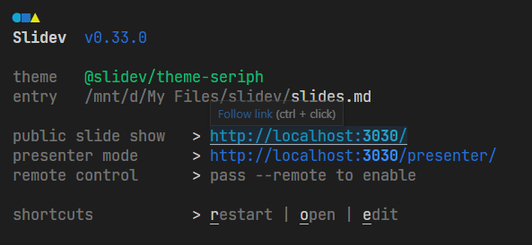

# Slidev

偶然看到这个视频 [Markdown也能做精美PPT? Slidev不容错过!](https://www.bilibili.com/video/BV1w94y1U73y)，赶紧来试一试

github: [slidev](https://github.com/slidevjs/slidev), [ducument](https://cn.sli.dev/guide/)

## 安装

1. 安装 Nodejs。因为使用 WSL2，可以直接使用 [nvm](https://github.com/nvm-sh/nvm#installing-and-updating) or 使用 [nvm for windows](https://github.com/coreybutler/nvm-windows) 在 windows 环境中进行安装（推荐）。下面介绍在 WSL2 的安装过程

   ```shell
   curl -o- https://raw.githubusercontent.com/nvm-sh/nvm/v0.39.1/install.sh | bash
   ```

   如果网络不好就先把 `install.sh` 保存下来，然后 `bash install.sh` 即可。下载好后更新 shell `source ~/.bashrc`，输入 `command -v nvm` 输出 `nvm` 就代表下载成功了

   下载最新的 nodejs，或者下载指定版本

   ```shell
   # "node" is an alias for the latest version
   nvm install node
   nvm install latest
   
   # or 16.3.0, 12.22.1, etc
   nvm install 14.7.0
   
   # uninstall a version
   nvm uninstall <version>	
   ```

   使用 node

   ```shell
   # use the latest version
   nvm use node
   nvm use latest
   
   # use the latest available 8.0.x release
   nvm use 8.0		
   ```

   使用 `nvm ls` 查看已经安装的版本，进行切换

2. 使用 npm 安装 slidev。我一开始尝试了全局安装，但似乎 slidev 此时还正在发展中，在 wsl2 中有一些 bug...建议直接在 windows 安装，并且使用手动安装（局部安装）

   ```shell
   mkdir slidev && cd slidev
   npm install @slidev/cli @slidev/theme-default
   ```

   如果下载慢的话可以使用镜像 [简书](https://blog.csdn.net/weixin_45182409/article/details/117981169) [阿里云](https://developer.aliyun.com/mirror/NPM)

3. 安装好过后启动 slidev

   ```shell
   npx slidev
   
   # or just slidev, if installed global
   slidev
   ```
   
   第一次打开的话会默认下载一个 `slides.md` 作为简易 demo
   
   在浏览器打开所示网址即可，或者按 `o` 键也能打开
   
   

## Slidev Command

这里把 slidev 当成一个命令来看待

1. `slidev [entry]` 为 slidev 启动本地服务器。`entry` 为所写的 markdown 文件
2. `slidev export [entry]` 导出为其他格式，默认为 pdf，使用 `--base`  参数指定格式
3. `slidev --help` 获得更多信息

## Markdown 语法

1. 使用 `---` 来分割页面

2. 使用 frontmatter 来指定页面分布，主题等。frontmatter 用两个分隔符 `---` 包围起来即可

   ```yaml
   ---
   layout:	# 列举常用 layout
   	default
   	center
   	image-left	# 需要搭配 image 字段指定图片
   	image-right
   	cover		# 用来展示演讲稿的封面页，可以包含演讲的标题、演讲者、时间等
   	two-cols	# 两列，需要搭配 ::right:: 语法糖标注
   theme: academic	# 指定主题
   title: name
   canvasWidth: 800	# 画布大小, 通常用于整体缩放
   ---
   ```

3. 每一页最后的注释将被作为备注 <!-- content -->
4. 可以使用 latex 公式
5. 可以使用 mermaid 画图

调整字体可以直接使用 html 语法 `<font color=silver size=6> red</font` <font color=silver size=6> red</font>

高亮字体 `<mark> content </mark>` <mark> content </mark>

图片的排列也可以通过 html 语法调整，例如 align 调整左右，zoom 调整大小

## Slidev-theme-academic

这个主题是所有尝试过的最好用的 [github](https://github.com/alexanderdavide/slidev-theme-academic)

### layout

1. cover

   ```yaml
   layout: cover
   coverAuthor: me
   corverAuthorUrl: hongkun.space
   coverDate: date	# if not specified, use today
   
   coverBackgroundUrl: url
   coverBackgroundSource: source_name
   coverBackgroundSourceUrl: url
   ```

2. figure & figure-side

   ```yaml
   layout: figure or figure-side
   figureCaption: caption
   figureUrl: url
   figureFootnoteNumber: number
   
   figureX: 'l' or 'r'	# figure-side only
   ```

### 分页数

使用 `themeConfig` 在 frontmatter 里配置，就能在每个 PPT 里显示分页进度

```yaml
themeConfig:
	paginationX: 'l' or 'r'
	paginationY: 'b' or 't'
	paginationPagesDisabled: [1]
```

### Footnotes

添加脚注模块，直接在 markdown 里写就行了

```markdown
<Footnotes separator>
  <Footnote :number=1>Footnote content</Footnote>
</Footnotes>
```

