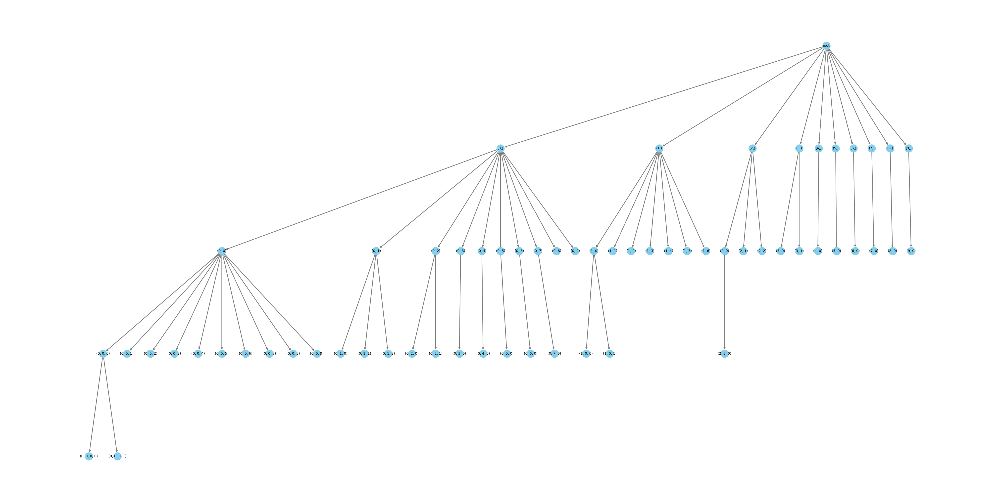

# Speculative Decoding

[Fast Inference from Transformers via Speculative Decoding](https://arxiv.org/abs/2211.17192)

[Medusa](https://github.com/FasterDecoding/Medusa)

## Concept

### Speculative decoding

- Observations

  > At the heart of our approach lie the observations that **(1) hard language-modeling tasks often include easier subtasks that can be approximated well by more efficient models, and (2) using speculative execution and a novel sampling method, we can make exact decoding from the large models faster**

- Speculative execution

  > Speculative execution (Burton, 1985; Hennessy & Patterson, 2012) is an optimization technique, common in processors, where a task is performed in parallel to verifying if it’s actually needed

- speculative sampling

  > maximize the probability of these speculative tasks to be accepted, while guaranteeing that the outputs from our system have the same distribution as those from the target model alone. 

  采样算法：

  1. 先根据小模型分布采样 $x\sim p(x)$​
  2. 如果采样结果 $q(x)\le p(x)$ 则接受采样结果，反之则以 $1-\frac{p(x)}{q(x)}$ 的概率拒绝采样结果
  3. 拒绝采样结果后以新概率 $p'(x)=norm(max(0,p(x)-q(x)))$ 重新进行采样

  以这样的采样算法，能够保证结果等价于使用 $p(x)$ 分布进行采样

- Problem Statement

  原始模型 $M_p$，小模型 $M_q$

  next token distribution $p(x_t|x_{<t})$，其中 $x_{<t}$ 代表前缀，即前 t-1 个 tokens

  核心思想就是要使用小模型生成 $\gamma$ 个 completions (tokens)，然后使用大模型去评估这 $\gamma$ 个 tokens 是否为可接受的，这个评估过程是并行化的，所以在一定程度上解决了 memory bound 问题（原来是单个 token 处理）。最后寻找被原始模型接受的最大前缀词，在不接受处的 token 位置，重新用原始模型生成一个新的 token 从而修正小模型的预测，如此循环，以达到加速目的

- 论文计算了理论接受率
  $$
  \alpha = E(min(p, q))
  $$
  这里 E 为期望

- 在给定了大小模型的计算量比 $c$，以及接受率 $\alpha$，可以获得最优的生成 $\gamma$ 数量，但实际应用中还是靠实验多一些，因为接受率不好衡量

  

### Medusa

- Medusa 使用的是 auxiliary head 来替代上述方案中的小模型。

- 使用 Tree-Attention 来同时处理多个 continuations，但这样所带来的问题是：随着 head 的增长，Tree 的数量会指数增加，attention mask 会变得非常稀疏，这不会引起问题吗？
  $$
  \text{number of continuations}=\sum_{k=1}^{K}\prod_{i=1}^{k}s_i
  $$
  其中 $s_i$ 代表的是第 i 个头将选择 top-$s_i$ 个预测结果

- 需要使用 calibration dataset 来对树结构进行筛选，这个树结构在推理过程中是确定的

- Run the notebook of `medusa_introduction`

  - Initial inferecne with Medusa Head

    当给定 prompt

    ```python
    prompt = "A chat between a curious user and an artificial intelligence assistant. The assistant gives helpful, detailed, and polite answers to the user's questions. USER: Hi, could you share a tale about a charming llama that grows Medusa-like hair and starts its own coffee shop? ASSISTANT:"
    ```

    我们会获得如下结果
    
    <table border="1">
    <thead>
        <tr>
            <th> </th>
            <th>Model's head</th>
            <th>Medusa head 1</th>
            <th>Medusa head 2</th>
            <th>Medusa head 3</th>
            <th>Medusa head 4</th>
        </tr>
    </thead>
    <tbody>
        <tr>
            <th> Prediction </th>
            <td>'Once'<br>&#9989</td>
            <td>'upon'<br>&#10067</td>
            <td>'ly'<br>&#10067</td>
            <td>'time'<br>&#10067</td>
            <td>','<br>&#10067</td>
        </tr>
    </tbody>
    </table>
    其中 `Once` 是由模型本身推理出的 next token，而剩余的其他词为 Medusa head 推理出的结果。这里为了理解做了一些简化：每一个 Medusa head 只输出了一个词，但实际上每一个 head 可以输出多个词
    
    将这些预测结果 `Once upon ly time ,` 输入到大模型中进行验证
    
    <table border="1">
        <thead>
            <tr>
                <th>Input</th>
                <td>'Once'</td>
                <td>'upon'</td>
                <td>'ly'</td>
                <td>'time'</td>
                <td>','</td>
            </tr>
        </thead>
        <tbody>
            <tr>
                <th>Model output</th>
                <td>'upon'<br>&#9989</td>
                <td>'a'<br>&#9989</td>
                <td>'a'<br>&#x274C</td>
                <td>','<br>&#x274C</td>
                <td>'in'<br>&#x274C</td>
            </tr>
        </tbody>
    </table>
    
    正常的 LLM 输出结果是一个 shifted results，model output 为下一个 input。按照这样的验证方式，我们可以知道：（在 greedy sample 下，温度为0）如果 model input 不为上一个 output，那就说明这个生成的 input 不符合模型的推理结果，我们就使用 ❌ 来表示
    
    可以看到我们的 upon 是推理正确的结果！恭喜🎉！说明我们起码有一个词猜对了，并且我们还获得了 upon 的下一个词 a，因为这也是由大模型本身推理得到的
    
    我们通过一次验证，获得了两个新词，这就是加速的原理。多的一个词就是由 Medusa head 猜测得到。及时我们一个词都没有猜对，我们也能通过验证获得一个新词，这也保证了推理能够持续向前推进 
    
    从整个推理过程来看，我们运行了两次大模型：
    
    1. 获得第一个词 `Once`
    2. 验证 Medusa head 结果
    
    而我们最终生成了3个词：`Once upon a`，此时加速比就为 1.5 倍
    
    为了进一步熟悉这个过程，我们继续使用 4 个 Medusa head 继续推理 next 4 tokens，并进行验证
    
    <table border="1">
        <thead>
            <tr>
                <th>Input</th>
                <td>'a'</td>
                <td>'time'</td>
                <td>','</td>
                <td>'there'</td>
                <td>'a'</td>
            </tr>
        </thead>
        <tbody>
            <tr>
                <th>Model output</th>
                <td>'time'<br>&#9989</td>
                <td>','<br>&#9989</td>
                <td>'in'<br>&#9989</td>
                <td>'was'<br>&#x274C</td>
                <td>'ll'<br>&#x274C</td>
            </tr>
        </tbody>
    </table>
    
    可以看到这次猜对了两个词 `time` 和 `,`，算上验证获得的新词，总共获得了 3 个词
    
    此时我们一共推理了3次大模型，获得了 6 个词，加速比为 2 倍
  
- Tree Attention

  Tree attention 的目的是为了一次处理多个猜测结果，与正常 attention 的区别仅仅是 attention mask 不一样。Tree attention mask 使得模型前向只注意自己句子中的 token，即自己路径上的 token
  
  
  
- Code Implementation

  Medusa 的代码实现和原理是等价的，但是稍微变换了一下 Medusa head 前向的位置：Medusa head 前向是紧跟在大模型前向之后的，每一次 `model.forward` 都会得到 medusa logits & normal logits 两个部分 
  
  - introduction of medusa choices
  
    假设 medusa 有 4 个 head，每一个 head 都将对 next $i^{th}$ token (i~[1, 4]) 进行预测。我们需要每个 head 中挑选一些 token，并用这些 token 来组成多个句子，从而提高命中概率（相比单个句子来说）
  
    medusa 构造了一个 medusa choices 来从这些预测中组合出更有可能预测成功的句子。这个 medusa choices 本质上就是一个树，树中的每一个节点代表一个 token，相同层的 token 由相同 head 预测。每一个叶节点代表了一条路径，该路径就是我们组合出来的句子
  
    ```python
    medusa_choices = [[0], [0, 0], [1], [0, 1], [2], [0, 0, 0], [1, 0], [0, 2], [3], [0, 3], [4], [0, 4], [2, 0], [0, 5], [0, 0, 1], [5], [0, 6], [6], [0, 7], [0, 1, 0], [1, 1], [7], [0, 8], [0, 0, 2], [3, 0], [0, 9], [8], [9], [1, 0, 0], [0, 2, 0], [1, 2], [0, 0, 3], [4, 0], [2, 1], [0, 0, 4], [0, 0, 5], [0, 0, 0, 0], [0, 1, 1], [0, 0, 6], [0, 3, 0], [5, 0], [1, 3], [0, 0, 7], [0, 0, 8], [0, 0, 9], [6, 0], [0, 4, 0], [1, 4], [7, 0], [0, 1, 2], [2, 0, 0], [3, 1], [2, 2], [8, 0], [0, 5, 0], [1, 5], [1, 0, 1], [0, 2, 1], [9, 0], [0, 6, 0], [0, 0, 0, 1], [1, 6], [0, 7, 0]]
    ```
  
    
  
    
  
    放大来看下这个树里面的标识
  
    
  
    每一个树节点由一个 tuple 表示，tuple 中的内容代表着该节点的路径，以三个节点为例简单说明：
  
    1. `(x,)` 该节点的 token 为第 1 个 head 概率第 x 的 token，其父节点为 root，root 为模型之前所得的最后一个 token
    2. `(x, y)` 该节点的 token 为第 2 个 head 概率第 y 的 token，其父节点为 `(x,)`
    3. `(x, y, z)` 该节点的 token 为第 3 个 head 概率第 z 的 token，其父节点为 `(x, y)`
  
  - medusa buffer
  
    medusa buffer 是由 medusa choices 生成的一个字典：
  
    - `medusa_attn_mask`，shape `(1, 1, N, N)`，其中 `N = num_tree_nodes + 1`，加 1 为根节点，`num_tree_nodes = len(medusa_choices)`
  
    - `tree_indices`，shape `(N,)`，用于在 candidates 中获得 tree node
  
      ```python
      # candidates (1 + num_heads *topk,)
      tree_candidates = candidates[tree_indices]	#(N,)
      
      # tree_indices look like this
      tensor([ 0,  1,  2,  3,  4,  5,  6,  7,  8,  9, 10, 11, 12, 13, 14, 15, 16, 17,
              18, 19, 20, 11, 12, 13, 14, 15, 16, 17, 11, 12, 13, 11, 12, 11, 11, 11,
              11, 11, 11, 21, 22, 23, 24, 25, 26, 27, 28, 29, 30, 21, 22, 23, 21, 22,
              21, 21, 21, 21, 21, 21, 22, 21, 31, 32])
      ```
  
    - `medusa_position_ids`，shape `(N,)`，用于标记各个 token 的位置，在之后的位置编码将根据这个 id 计算
  
      ```python
      tensor([0, 1, 1, 1, 1, 1, 1, 1, 1, 1, 1, 2, 2, 2, 2, 2, 2, 2, 2, 2, 2, 2, 2, 2,
              2, 2, 2, 2, 2, 2, 2, 2, 2, 2, 2, 2, 2, 2, 2, 3, 3, 3, 3, 3, 3, 3, 3, 3,
              3, 3, 3, 3, 3, 3, 3, 3, 3, 3, 3, 3, 3, 3, 4, 4])
      ```
  
    - `retrieve_indices`, shape `(leave_nodes_num, num_medusa_heads)`，用于在 `tree_candidates` 中获得多个句子
  
      ```python
      cart_candidates = tree_candidates_ext[retrieve_indices]
      
      # retrieve_indices look like this
      tensor([[ 0,  1, 11, 39, 63],
              [ 0,  1, 11, 39, 62],
              [ 0,  3, 28, 61, -1],
              [ 0,  2, 21, 60, -1],
              [ 0,  2, 21, 59, -1],
              ...
      ```
  
      `tree_candidates_ext` 在 `tree_candidates` 末尾 append 了一个0，作为 padding index 所取的 tree candidates
  
      第一个 index 永远都是0，因为是根节点，也就是 model logits 所预测的 next token

- Medusa forward pseudo code

  假设我们有 4 个 medusa head

  ```python
  model				# medusa model
  input_ids 			# (1, N), N tokens
  medusa_choices 		# a list of tuple, length is 63
  temperature = 0. 	# we only discuss greedy decoding
  
  medusa_buffers = generate_medusa_buffers(medusa_choises)
  
  medusa_buffers.attention_mask		# (1, 1, 64, 64)
  medusa_buffers.tree_indices			# (64,)
  medusa_buffers.medusa_position_ids	# (64,)
  medusa_buffers.retrieve_indices		# (42, 5)
  
  # move buffers to model
  model.medusa_buffers = medusa_buffers
  model.medusa_choices = medusa_choices
  
  # initialze past key values (kv-cache)
  past_key_values,
  past_key_values_data,
  current_length_data = initialzie_past_key_values(model)
  
  # set medusa mask to None
  model.base_model.model.medusa_mask = None
  
  # pre-fill, also the first inference
  # medusa_logits (5, 1, N, 32000)
  # logits (1, N, 32000)
  medusa_logits, logits = model(input_ids, past_key_values)
  
  # set back medusa mask
  model.base_model.model.medusa_mask = medusa_buffers.attention_mask
  
  # ------------- LOOP -----------------#
  # generate candidates
  # candidates (42, 5)
  # tree_candidates (1, 64)
  candidates, tree_candidates = generate_candidates(medusa_logits, logits, medusa_buffers)
  
  #### how to create candidates ###
  candidate_ori = torch.argmax(logits[:, -1]).unsqueeze(0)	# (1,)
  candidates_medusa = torch.topk(medusa_logits[:, 0, -1], TOPK, dim = -1).indices	# (4, topK=10)
  
  candidates = torch.cat([candidate_ori, candidate_medusa.view(-1)], dim=-1)		# (1 + 4 *topK)
  
  tree_candidates = candidates[tree_inidces]	# (64,)
  tree_candidates_with_zero = torch.cat([tree_candidates, torch.zeros((1), dtype=torch.long,)], dim=0)
  
  candidates = tree_candidates_with_zero[retrieve_indices] # (42, 5)
  ##################################
  
  # use tree decoding, just forward
  medusa_logits, logits = model(tree_candidates, past_key_values, position_ids)
  # restore to tree
  medusa_logits = medusa_logits[:, 0, retrieve_indices]
  logits = logits[0, retrieve_indices]
  # medusa_logits (5, 42, 5, 32000)
  # (42, 5, 32000)
  
  # evaluate, get the longest match (best candidates)
  posterior_mask = (candidates[:, 1:] == torch.argmax(logits[:, :-1], dim=-1)).int()
  candidates_accept_length = (torch.cumprod(posterior_mask dim=1)).sum(dim=1)
  accept_length = candidates_accept_length.max()
  # best candidates
  best_candidate = torch.argmax(candidates_accept_length).to(torch.long)
  
  # update the input to restart the loop
  candi = candidates[None, best_candidatt, : accecpt_length + 1]
  input_ids = torch.cat([input_ids, candi], dim=-1)
  logits = logits[None, best_candidate, accept_length : accept_length + 1]
  medusa_logits = medusa_logits[:, None, best_candidate, accept_length : accept_length + 1]
  # logits (1, 1, 32000)
  # medusa_logits (5, 1, 1, 32000)
  ```

  

  

  model forward pseudo code

  ```python
  def forward(input_ids, past_key_values, position_ids):
      # attn mask is used in attention, not passed here
      hidden_states = self.base_model.model(input_ids, past_key_values)
      
      medusa_logits = []
      for i in range(self.medusa):
      	medusa_logits.append(self.medusa_head[i](hidden_states))
  	medusa_logits = torch.stack(medusa_logits, dim=0)
      
      logits = orig = self.base_model.lm_head(hidden_states)
      
      return medusa_logits, logits
  ```

  

  

### EAGLE

- LookAHead
- EAGLE 对之前的 Speculative decoding 有一个精妙的图总结

## Question

- 使用大模型进行验证以及生成新 token 应该只使用了单词前向