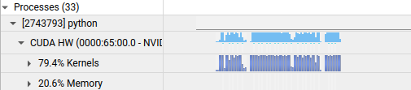

# TensorRT Tutorial 8.6.1

学习路径：

1. 根据 [TensorRT-tutorial bilibili](https://www.bilibili.com/video/BV1jj411Z7wG) 建立 TensorRT 基本概念认知
2. 根据 [TensorRT github](https://github.com/NVIDIA/trt-samples-for-hackathon-cn/tree/master) 进行 TensorRT 基本功能实践
3. 重新熟悉项目中的 TensorRT 使用方式
4. 查漏补缺

## Outlines

1. 简介
   - TensorRT 基本特性和用法 
   - Workflow：使用 TensorRT API 搭建 
   - Workflow：使用 ONNX-Parser 
   - Workflow：使用框架内 TensorRT 接口

2. 开发辅助工具
   - trtexec
   - Netron
   - polygraphy 
   - onnx-graphsurgeon
   - Nsight System
3. 插件
   - 使用 Plugin 的简单例子 
   - 关键 API 
   - 结合使用 Parser 和 Plugin
   - Plugin 高级话题
   - 使用 Plugin 的例子

4. 高级用法
   - 多 Optimization Profile
   - 多 Stream
   - 多 Context
   - CUDA Graph
   - Timing Cache
   - Algorithm Selector 
   - Refit 
   - Tactic Source 
   - 硬件兼容+版本兼容 (NEW)
   - 更多工具

5. 常见优化策略 (NEW)
   - 概述
   - 性能分析工具
   - 性能优化实例

## 简介

### 基本特性

**什么是 TensorRT？**

TensorRT 是高效实现模型的推理过程的 SDK

什么是 SDK？

> SDK (Software Development Kit): An SDK is a comprehensive set of software tools, resources, and libraries provided by a software vendor or platform to help developers build applications for a specific framework, platform, or operating system.

我简单理解就是：SDK = Environment + APIs，以下三点是对 SDK 进行具体的展开：

1. 内含推理优化器和运行时环境
2. 使DL模型能以更高吞吐量和更低的延迟运行
3. 有 C++ 和 python 的 API，完全等价可以混用

**TensorRT 做的工作**

1. 模型解析/建立

   加载 ONNX 格式模型 or 使用原生 API 搭建

2. 计算图优化

   图融合（连续 Conv 的融合，Conv add ReLU 融合），去除无用层

3. 多精度支持

   fp32 fp16 int8，在多精度计算时可能插入 reformat 节点

4. 优选 kernel/format：硬件有关优化

   kernel 是一个抽象概念，代表着某种特定计算操作的实现方式。这些操作通常包括卷积、池化、归一化等基本的神经网络计算

   TensorRT 根据模型的计算图来构建网络，并选择适当的kernel来执行每个操作

   TensorRT 提供了对不同架构和计算能力的 GPU 优化的 kernel 函数，以确保在各种硬件平台和设备上获得最佳的性能。

5. 调入 Plugin

   可理解为自定义 kernel 操作

6. 显存优化

   显存池复用

7. 运行时环境

   对象生命期管理，内存显存管理，异常处理

8. 序列化反序列化

   推理引擎保存为文件或从文件中加载。在 TensorRT 中，"推理引擎"（Inference Engine）这个概念指代了优化后的模型表示形式，它是由 TensorRT 库通过对模型进行优化和转换生成的，即一般我们看到的 `.engine/.plan` 文件

TensorRT 8.6.0 版本目前已经对很多 Plugin 进行了原生支持！对 Stable Diffusion & ChatGLM 模型都有显著的加速（2~4x）

### Install

TensorRT installation guide 8.5.1 [installation guide](https://docs.nvidia.com/deeplearning/tensorrt/archives/tensorrt-851/install-guide/index.html#installing-tar)	[download-link](https://developer.nvidia.com/tensorrt-download)

安装 CUDA/CUDNN/TensorRT 通常都有几种选项：deb 安装，RPM 安装，tar/zip 安装

通常大家都选择 tar/zip 安装，即下载一个软件包，然后添加环境变量

pre-request:

1. py-cuda or cuda-python

2. cuda 11.4

   根据平台选择任一安装方式，[cuda nvidia install](https://developer.nvidia.com/cuda-11-4-4-download-archive?target_os=Linux&target_arch=x86_64&Distribution=Ubuntu)，设置环境变量

   ```shell
   export PATH=$PATH:/usr/local/cuda-11.4/bin
   export LD_LIBRARY_PATH=/usr/local/cuda-11.4/lib64
   ```

3. cudnn 8.6.0

   在 [cudnn archive](https://developer.nvidia.com/rdp/cudnn-archive) 中选择合适的版本下载，根据 [tar file install](https://docs.nvidia.com/deeplearning/cudnn/install-guide/index.html#installlinux-tar) 将其复制到 cuda 中

### Workflow of TensorRT

这一部分讲解了如何使用 TensorRT 原生 API 来从零开始搭建网络，这样的开发效率是比较低的，不推荐

但是从一个简单的例子，我们可以窥探整个 TensorRT 的工作流程：从输入 -> 模型推理 -> 输出

教程以一个 MNIST 手写识别模型为例子进行说明，[code link](https://github.com/NVIDIA/trt-samples-for-hackathon-cn/tree/master/cookbook/03-BuildEngineByTensorRTAPI/MNISTExample-pyTorch)

代码基本流程：

1. 使用 pytorch 训练一个网络，并保存其权重为 `para.npz`
2. 在 TensorRT 中逐层重建网络，并加载 `para.npz` 中的权重
3. 生成推理引擎，并进行推理

更详细的流程为下面这个流程图


下面对每一个流程进行介绍

#### Logger

```python
logger = trt.Logger(trt.Logger.VERBOSE/INFO/WARNING...)
```

通常出现在代码最开头，用于产生日志。多个 builder 可以共享一个 logger

#### Builder & BuilderConfig

```python
builder = trt.Builder(logger)
```

 Builder 用于构建和优化神经网络模型，生成推理引擎

```python
# build TensorRT network object
network = builder.create_network(...)

# build optimization profile, for dynamic shape
profile = builder.create_optimization_profile()
...
profile.set_shape(inputTensor.name, [1, 1, 1], [3, 4, 5], [6, 8, 10])
```

优化配置文件（Optimization Profile），用于在 TensorRT 中对不同输入大小或批大小的情况进行优化

在一些老版本的 TensorRT 中，builder 还被用于配置 `batch size, fp16_mode, int8_mode` 等，现在这些配置将全部被废弃，推荐使用 `BuilderConfig` 来进行设置。`BuilderConfig` 是 builder 中专门用于设置网络属性的对象

```python
# builder config
config = builder.create_builder_config()

# add optimization profile
config.add_optimization_profile(profile)

# set flag
config.set_flag(trt.BuilderFlag.FP16)  
config.set_device_type(identityLayer, trt.DeviceType.DLA) 
...
```

以后 builder 仅作为构建引擎的入口，而不再用于设置这些网络属性

#### Network

network 是计算图的具体描述。通过 builder 生成初始的 network 过后，可以对其进行详细的构建，构建方法即可以是使用原生 API 搭建，也可以从 ONNX 模型中直接生成

教程中还重点强调了使用 Explicit Batch 模式，不推荐使用 Implicit Batch，因为前者能够使用更多的 TensorRT 特性，例如 batch norm, dynamic shape, loop 等

常用方法

```python
# Explicit Batch
flag = 1 << int(tensorrt.NetworkDefinitionCreationFlag.EXPLICIT_BATCH)
builder.breate_network(flag)

# use TensorRT API to direct build model

# add input tensor
network.add_input( 'oneTensor' ,trt.float32, (3,4,5)) 
# add layer
convLayer = network.add_convolution_nd(XXX) 
# add output tensor
network.mark_output(convLayer.get_output(0)) 
```

##### Dynamic Shape

Dynamic shape 适用于输入张量形状在推理时才决定的网络，需要有几个设置：

1. 按上述方法打开 Explicit Batch

2. 配置 optimization profile

   ```python
   # give the input shape range
   profile.set_shape(tensorName, minShape, commonShape, maxShape)
   # add profile to config
   config.add_optimization_profile(profile) 
   ```

3. 在推理时绑定实际输入的数据形状

   ```python
   # context = engine.create_execution_context()
   context.set_input_shape(input_name, shape)
   ```

##### Int8 模式

这部分教程还简单介绍了 int8 模式应遵循的步骤：

1. 准备校准集

2. 自己实现 Calibrator

3. 在 builder config 中设置 int8 flag

   ```python
   config.set_flag(trt.BuilderFlag.INT8)
   ```

4. 在 builder config 中设置 int8 calibrator

   ```python
   # class MyCalib
   config.int8_calibrator = MyCalib
   ```

通过 int8 模式也可以实现 QAT，但需要在 pytorch 网络中提前插入 Quantize & Dequantize 层

##### ONNX Parser

可以直接 `trt.OnnxParser` 来创建 network，下面是一个简单例子

```python
parser = trt.OnnxParser(network, logger)
if not os.path.exists(onnxFile):
    print("Failed finding ONNX file!")
    exit()
print("Succeeded finding ONNX file!")
with open(onnxFile, "rb") as model:
    if not parser.parse(model.read()):
        print("Failed parsing .onnx file!")
        for error in range(parser.num_errors):
            print(parser.get_error(error))
        exit()
    print("Succeeded parsing .onnx file!")
```

#### SerializedNetwork & engine

SerializedNetwork 和 engine 本质上就是一回事，engine 就是 SerializedNetwork 的反序列化。我们通过 builder 将 network 进行序列化方便存储，就像使用 pkl 存储一些 python 变量一样（个人猜测：构建序列化模型的过程也是对模型进行深度优化，例如之前提到的图融合，不然我真找不到在哪一步进行图优化了）

> **What is *engine***
>
> In TensorRT, an engine refers to a compiled and optimized representation of a neural network model that is ready for efficient inference on a specific hardware platform.

```python
# build serialized network
serializedNetwork = builder.build_serialized_network(network, config)

# build engine
engine = trt.Runtime(logger).deserialize_cuda_engine(serializedNetwork)
```

常用的 engine 属性与方法

```python
# attr
---
# total nubmers of input & output binded in engine
engine.num_io_tensors
# total engine layers (after optim)
engine.num_layers

# method
---
# get tensor name given input/output index
engine.get_tensor_name(i) 
# get tensor type given name
engine.get_tensor_dtype(iTensorName[i])
# get tensor shape given name, -1 for dynamic axis
engine.get_tensor_shape(iTensorName[i])
# get tensor mode, i.e. it's input or output
engine. engine.get_tensor_mode(iTensorName[i])
```

**注意：**engine 的序列化和反序列化包含了特定硬件，不能跨平台使用，也不能跨 TensorRT 版本使用，并且同平台同环境多次生成的 engine 也可能不同（这是因为在优化过程中面临外部扰动，TensorRT 对同一个算子选择了不同的 kernel 实现）

#### Context

>The *ExecutionContext* interface, created from the engine is the main interface for invoking inference. 

当我们拥有了 engine 过后，需要实际地去调动硬件资源来进行推理。这时就需要使用 context 来分配和管理这些资源，**是推理实际发生的步骤**

```python
# create context from engine
context = engine.create_execution_context()
```

##### input & output buffer

简单介绍 CUDA 异构计算：计算机同时准备 CPU 内存和 GPU 显存，开始计算前把数据从内存拷贝到显存中，所有计算在 GPU 端进行，计算完成后要把结果拷贝回 CPU 内存

了解了上述过程就不难理解，为什么要构建 input & output buffer，因为需要在 CPU 和 GPU 之间进行数据的读写

我们要做的事情如下：

1. 创建 CPU 上的 input & output 对象
2. 创建 GPU 显存来存储 input & output
3. 告知 context，我们在 GPU 上分配的空间在哪里。这样 context 在进行 GPU 推理的时候就能去指定地址读写 input & output 数据
4. 除了以上3点，我们还需要在推理之前将 CPU 上的 input 数据送到 GPU 上，在推理完成后将 GPU 上的 output 返回到 CPU 中
5. 在程序最后释放 GPU 显存

```python
# prepare CPU & GPU input/ouput buffer
# Host: CPU, Device: GPU

# CPU
inputHost = np.ascontiguousarray(inputData) # Don't forget ascontiguousarray！
# Here, 0 is the input name, 1 is the output name
outputHost = np.empty(context.get_tensor_shape(iTensorName[1]), trt.nptype(engine.get_tensor_dtype(iTensorName[1])))

# GPU, inputDevice is the pointer to allocate device memory
inputDevice = cudart.cudaMalloc(inputHost.nbytes)[1]
outputDevice = cudart.cudaMalloc(outputHost.nbytes)[1]

# Set memory addresses for the given input or output tensor, a bridge between CPU and GPU
context.set_tensor_address(iTensorName[0], inputDevice)
context.set_tensor_address(iTensorName[1], outputDevice)

# copy data between CPU & GPU
cudart.cudaMemcpy(inputDevice, inputHost.ctypes.data, inputHost.nbytes, cudart.cudaMemcpyKind.cudaMemcpyHostToDevice)
cudart.cudaMemcpy(outputHost.ctypes.data, outputDevice, outputHost.nbytes, cudart.cudaMemcpyKind.cudaMemcpyDeviceToHost)

# release GPU memory
cudart.cudaFree(inputDevice)
cudart.cudaFree(outputDevice)
```

其中 `inputData` 就是一个 `np.array`，而 `iTensorName` 即为输入输出的名字列表

```python
iTensorName = [engine.get_tensor_name(i) for i in range(engine.num_io_tensors)]
```

##### execute

当完成准备工作过后，就可以愉快通过 context 进行推理

```python
context.execute_async_v3(0)	# 0 means using default CUDA steams to executes
```

### TensorRT 开发环境推荐

推荐使用 NVIDIA-optimized Docker [安装步骤](https://docs.nvidia.com/datacenter/cloud-native/container-toolkit/install-guide.html#docker)	[镜像列表](https://docs.nvidia.com/deeplearning/frameworks/support-matrix/index.html)

推荐镜像：

1. nvcr.io/nvidia/pytorch:23.03-py3（pyTorch1.14+TRT8.5.2）
2. nvcr.io/nvidia/pytorch:23.04-py3（pyTorch2.0+TRT8.6.1）

推荐 python 库（见 cookbook requirements.txt）

nvidia-pyindex，cuda-python（python≥3.7），onnx，onnx-surgeon，onnxruntime-gpu，opencv-python，polygraphy 

推荐使用最新的 TensorRT8，图优化内容更多，优化过程和推理过程显存使用量更少

推荐使用 builderConfig API，功能覆盖旧版 builder API，旧版 builder API 将被废弃 

推荐使用 explicit batch 模式 + dynamic shape 模式，ONNX 格式默认模式，灵活性和应用场景更广，使模型适应性更好 

推荐使用 cuda-python 库，完整的 CUDA API 支持，修复 pycuda 库可能存在的问题（如与其他框架交互使用时的同步操作等）

## 开发辅助工具

开发辅助工具一览：

1. **trtexec** 
   - TensorRT 命令行工具，主要的 End2End 性能测试工具 
2. Netron 
   - 网络可视化 
3. onnx-graphsurgeon 
   - onnx 计算图编辑 
4. **polygraphy** 
   - 结果验证与定位，图优化 
5. **Nsight Systems** 
   - 性能分析

### trtexec

打包了几乎所有的 TensorRT 脚本可以完成的工作，扩展了丰富的推理测试功能。通常用来完成3个工作

1. 由 ONNX 文件生成 TensorRT 引擎并序列化为 Plan 文件（Plan 文件和之前一直提到的 `.engine` 文件是一个东西）
2. 查看 ONNX 文件或 Plan 文件的网络逐层信息
3. 模型性能测试（测试 TensorRT 引擎基于随机输入或给定输入下的性能）

常见的选项

```shell
## Convert ONNX to TensorRT engine
trtexec
--onnx=			# onnx model path
--saveEngine=	# output engine name
--minShapes=, --optShapes=, --maxShapes= # dynamic shapes
--verbose		# print detailed log
--memPoolSize=	# max memo size at optimizing
--fp16, --int8, --best, --sparsity=		# precision and sparsity

## Run TensorRT engine
trtexec
--loadEngine=	# engine path
--shapes=		# input tensor shape
--warmUp=		# minimum warm-up time, unit is ms
--duration=		# minimum test time, unit is s
--iteration=	# minimum iteration
--verbose
--dumpProfile, --exportProfile=	# save per-layer latency info
```

### onnx-graphsurgeon

ONNX 模型的编辑器，包含 python API（下面简称 ogs） ，其功能如下：

1. 修改计算图：图属性 / 节点 / 张量 / 节点和张量的连接 / 权重 
2. **修改子图**：添加 / 删除 / 替换 / 隔离 
3. **优化计算图**：常量折叠 / 拓扑排序 / 去除无用层（onnx-simplifier 也可以）
4. 功能和 API 上有别于 onnx 库

因为整个 workflow 中都是使用 ONNX parser 一键生成，所以不过多介绍

### polygraphy

深度学习模型调试器，其功能如下

1. 使用多种后端运行推理计算，包括 TensorRT，onnxruntime，TensorFlow 

2. 比较不同后端的逐层计算结果 

3. 由模型文件生成 TensorRT 引擎并序列化为 .plan 

4. 查看模型网络的逐层信息 

5. 修改 Onnx 模型，如提取子图，计算图化简 

6. **分析 Onnx 转 TensorRT 失败原因，将原计算图中可以 / 不可以转 TensorRT 的子图分割保存** 

   ```shell
   polygraphy inspect model model.plan --mode=full > result.txt
   ```

7. 隔离 TensorRT 中的错误 tactic

### nsight systems

性能调试器，随 CUDA 安装或独立安装，位于 `/usr/local/cuda/bin/` 下的 nsys 和 nsys-ui，建议使用最新版，因为其不是向前兼容的

nsys 也是一个命令行工具，可以用于分析运行时耗时，我们通常说的 profile a model，就是指分析一个模型的运行速度

```shell
nsys profile -o myProfile -f true trtexec --loadEngine=model.plan
```

上面的命令就可以分析 engine 运行时各个网络层的耗时，可以按需要设置 

```python
config.profiling_verbosity = trt.ProfilingVerbosity.DETAILED
```

nsys 其原理是去追踪程序运行时的一些 API，根据这些 API 调用时间来计算运行时，上面的命令有以下作用

> Effect: Launch the application using the given arguments. Start collecting immediately and end collection when the application stops. Trace CUDA, OpenGL, NVTX, and OS runtime libraries APIs. Collect CPU sampling information and thread scheduling information. 

同时 `-o` 代表输出文件名，`-f` 代表强制输出，都可以不加。最终会生成一个 `.nsys-rep` 文件，把其放入 nsys-ui 中就能方便查看运行时，通常这部分会折叠起来，寻找 CUDA HW 应该能看到



在默认参数中 `--trace` 被设置为跟踪 `cuda, opengl, nvtx, osrt` 这四个 API，一般足够用了

之前 nvidia 使用 nvprof 来对程序进行测速，但现在随着版本迭代更新，nvprof 也不再支持。从 nvprof 迁移到 nsys 也很简单，只需要加入 `--stats true` 就可以在 terminal 输出耗时信息。我们主要关注 `gpukernsum` & `gpumemtimesum`，分别关注核函数以及内存时间

```shell
nsys profile --stats=true ./a.out

[6/8] Executing 'gpukernsum' stats report

 Time (%)  Total Time (ns)  Instances   Avg (ns)     Med (ns)       GridXYZ           BlockXYZ              Name
 --------  ---------------  ---------  -----------  -----------  ----------------  --------------  -----------------------
    100.0       39,654,920         11  3,604,992.7  3,473,411.0  781250    1    1   128    1    1  add()

[7/8] Executing 'gpumemtimesum' stats report

 Time (%)  Total Time (ns)  Count    Avg (ns)       Med (ns)      Min (ns)     Max (ns)    StdDev (ns)      Operation     
 --------  ---------------  -----  -------------  -------------  -----------  -----------  -----------  ------------------
     67.0      347,475,859      1  347,475,859.0  347,475,859.0  347,475,859  347,475,859          0.0  [CUDA memcpy DtoH]
     33.0      170,811,302      2   85,405,651.0   85,405,651.0   85,208,819   85,602,483    278,362.5  [CUDA memcpy HtoD]

```

## 插件（Plugins）

主要介绍使用 Plugin 的流程，不对如何构建 Plugin 做深入介绍

Plugin 的功能：以 `.so` 的形式插入到网络中实现某些算子，以替代 TensorRT 不原生支持的层或结果，以及性能较低的层或结果

Plugin 的缺点：Plugin 与其他 layer 无法融合，并且需要自己实现 CUDA C++ kernel，实现难度大，且要保证 kernel 性能。建议直接使用官方实现的 [Plugin](https://github.com/NVIDIA/TensorRT/tree/main/Plugin)

下面简单解释 `.so` 文件

> A `.so` file, also known as a Shared Object file, is a binary file format used in Unix-like systems for dynamic linking.
>
> Static Linking: In static linking, the object code of libraries or modules is directly incorporated into the executable binary at compile-time. 
>
> Dynamic Linking: Dynamic linking, on the other hand, refers to the process of linking libraries or modules at runtime. Instead of incorporating the entire code into the executable, dynamic linking keeps the library code separate in shared object files (such as .so files in Unix-like systems or .dll files in Windows). These shared objects are then loaded and linked dynamically by the executable when it runs. 

### Plugin 关键问题 

- 怎么从头开始实现一个 Plugin？ 要写哪些类和函数 
- 怎么把 Plugin 接到 TensorRT 网络中去？ 要怎么包装 kernel 以便 TensorRT 识别
- TensorRT 怎么参与 Plugin 的资源管理？ 两者之间要交换些什么信息 
- Plugin 有些什么扩展性？ FP16/INT8，Dynamic Shape，data-dependent-shape，… 
- Plugin 与原生 Layer 相比性能怎么样？

下面逐一介绍

### 实现 Plugin 流程

以下流程将回答前两个问题

1. **继承** `IPluginV2DynamicExt` 类实现一个Plugin 类

   `enqueue` 是真正调用 CUDA C++ kernel 计算的地方，注意不要在 `enqueue` 中使用 cudaMalloc* 等显存相关函数，这会造成巨大开销 

2. **继承** `IPluginCreator` 类实现一个 PluginCreator 类 

   继承上面两个类有一部分原因：`IPluginV2DynamicExt` 负责序列化，`IPluginCreator` 负责反序列化

3. 实现用于计算的 CUDA C++ kernel 

4. **将 Plugin 编译为 .so 保存** 

5. 在 TenorRT 中加载和使用 Plugin

   - **加载编译好的 .so** 
   - 在 Plugin Registry 里找到需要的 Plugin 
   - 通过 Plugin Creator 构造需要的 Plugin  
   - **ONNX Parser 自动识别，将其加载**

### TensorRT 与 Plugin 交互

这将解决第三个问题

- TensorRT 向 Plugin 传输**参数**和**权重**，并在运行时提供输入输出张量的地址，workspace 地址，以及所在的 stream
- Plugin 向 TensorRT 报告其**输入输出张量信息**以及其**需要的 workspace 大小** 
- TensorRT 尝试各种允许的组合，选择性能最佳的输入输出组合（可能在 Plugin 前后插入 reformat 节点）

### Plugin 扩展性

Plugin 是支持 FP16/Int8 模式的，但要多做一些额外工作

1. 为了支持 FP16 模式，Plugin 要允许 float16 的输入输出张量类型，并实现 float16 的 CUDA C++ kernel
2. 为了支持 Int8 模式下的 calibration 过程，Plugin 需要实现 FP32 的支持，否则要手工指定所有输入输出张量的 `dynamic_range`
3. Int8 模式下，Plugin 内部张量的 `dynamic_range` 也要手工指定（为什么需要指定？）

## 高级话题

### 多 OptimizationProfile

Dynamic Shape 模式在 min-opt-max 跨度较大时性能下降。min-opt-max 就是输入形状的最小、最优、最大值，当其跨度太大时，TensorRT 很难选择一个较好的 kernel 来加速模型运行。这时需要建造多个 OptimizationProfile 来缓解这这个问题，这里不进行过多整理

> a binding is a way to associate a specific memory allocation with a specific input or output tensor.

### 多 Stream

使用多 Stream 来实现重叠计算和数据拷贝，增加 GPU 利用率

### 多 Context

一个 engine 可以创建多个 context，同时供多个线程进行推理计算

> TensorRT runtime can define multiple execution contexts for the same model. This allows multiple executions to be queued at once – without the model inputs and outputs being overwritten by the different contexts.

### CUDA Graph

降低 CPU Launch cost，即降低 CPU 端调用 GPU 的开销，**原理是将大部分的 launch 工作提前完成**。能够提前静态地统筹 kernel 调用，充分利用 GPU 资源，比手工控制 Stream 有更好的加速效果

但是对于新形状的输入，仍然需要重新生成 CUDA graph 进行初始化，然后再推理（TensorRT 也一样）

### TimingCache

Engine 构建时间太长了，可以通过 TimingCache 来减少重复构建 Engine 的时间。原理是记录相同 layer/kernel 的优化结果，在之后构建 engine 时进行复用。TimingCache 本质上就是一个查表过程，构建了一张庞大的哈希表，遇到某个 kernel，直接查询最优的结果。这也能解决之前：同一设备同一模型但是构建的 engine 不同的问题

但是 TimingCache 也不能跨平台跨版本的

### Algorithm Selector

在 TensorRT 中 kernel 选择似乎是一个黑箱操作，当某个 kernel 选择不符合我们的要求时，需要将其替换掉（通常是选择屏蔽掉该种 kernel）

TensorRT 这里可以实现一个自己的 `AlgorithmSelector` 即可

```python
class MyAlgorithmSelector(trt.IAlgorithmSelector):

    def __init__(self, keepAll=True):  # initialize with a number of our customerized strategies to select algorithm
        super(MyAlgorithmSelector, self).__init__()
        self.keepAll = keepAll

    def select_algorithms(self, layerAlgorithmContext, layerAlgorithmList):
        # return a index list, represents which algorithms will be kept for kernel selection
        return result

    def report_algorithms(self, modelAlgorithmContext, modelAlgorithmList):  
        # report the tactic of the whole network, no return
```

### Tactic Source

实际上在选择 kernel 实现时，还会从一些加速库中去筛选最优实现，如 `cuBLAS, cuDNN` 等，有时为了节省构建 engine 的空间和时间，会排除一些加速库，但也有可能会降低 engine 的运行效率。方法同样是在 BuilderConfig 中标记

```python
config.set_tactic_sorces(1<< int(trt.TacticSource.CUBLAS) | 
                        1<< int(trt.TacticSource.CUDNN))
```

在后续 TensorRT 版本中将彻底断开对外部 Library 的依赖

## TODO

1. 需要一个具体的例子来说明层融合，为什么下方的融合可以奏效

   

2. What is CUDA Steam？

