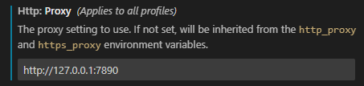
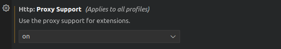
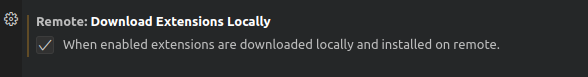
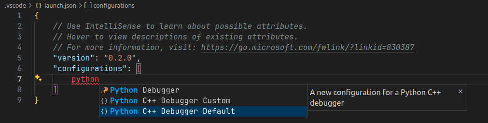

# VSCode note

学习视频 [bilibili](https://www.bilibili.com/video/BV1ty4y1S7mC?p=1)

## 安装

直接在官网一键下载，宇宙第一开发工具，而且还是免费的:laughing: 使用最新版本的 vscode，有时出现一些莫名其妙的 bug:cry:，可以使用前几个版本的，如果用熟了某一个版本那暂时不要更新了吧。如果想要完整卸载的话需要删除 `usr/.vscode` 和 `AppData/Code` 文件，感觉整体来看 vscode 依然是在发展当中的开发工具

### Getting started

1. vscode 支持更换主题皮肤

2. vscode 支持插件扩展，能够实现多种功能来提高编程效率，如下载不同语言，高亮代码等等，推荐的插件：Python, Gitlens, Remote SSH

3. 通过快捷键 palette 查找文件 Ctrl + P，查找命令 Ctrl + Shift + P，折叠左侧工具栏 Ctrl + B

   可以修改一些你常用命令的快捷键，我修改了如下命令：

   1. Run in python file: Ctrl + enter
   2. Start debugging: Shift +enter
   3. Close panels: Ctrl + Alt + P
   4. Insert Line Above/Below: Ctrl + Shifg + \\ or Enter
   5. Collapse folders: Ctrl + Shift + F

4. 设置面板快捷键 Ctrl + ,

5. 新建一个文件 Ctrl + N

## 交互式演练场 Interactive Playground

一些编辑的小技巧

1. 同时选中同名字段 Ctrl + Shift + L，但这个功能没有 Refactoring 智能

2. IntelliSense 自动补全 api 功能 Ctrl + space
3. 行操作
   1. 复制行，在没有任何东西选中的时候直接 Ctrl + C
   2. 上下移动行，Alt + 上下键
   3. 删除行 Ctrl + Shift + K

4. Formatting 规范代码，需要自己定义 format

5. 使用 Alt + Z 来使得文本能够自适应窗口大小，就像 typora 一样

## 一些推荐的设置

打开 settings

1. 在熟悉之后关闭 welcome/startup 界面
2. 建议使用英文界面
3. 设置字体 JetBrains Mono，还可以顺便设置一下字号。安装字体[教程](https://blog.csdn.net/HUSTHY/article/details/104023077)
4. 设置是否显示缩略图 minimap
5. 设置 restore windows 是否直接恢复上一次的项目
6. 设置开启 Trims final newlines 自动消除文件末尾多余的空行

## Python

下载 Python 插件

### Get Started

1. 在底部的 status bar 添加 python 解释器，也可以使用 palette 来添加 interpreter。会自动检测到电脑上的 python interpreter (包括 anaconda 中创建的环境)

2. 建立 debug 环境 craete a launch.json file，直接使用默认值就好，详细说明在 [知乎](https://zhuanlan.zhihu.com/p/142642410)

   补充：默认配置只 debug 当前 folder 下的代码（“自己”的代码），如果是 pip/conda install 安装的代码（“别人”的代码），是不会进行 debug 的。如果想要 debug 所有代码则配置文件需要加上 `"justMyCode": false` [CSDN](https://blog.csdn.net/g534441921/article/details/102743393)

   补充：对于需要传参数的 python 脚本调试可以参考 [知乎](https://www.zhihu.com/question/50700473)

3. Jupyter notebook 是插件里自带的功能，直接打开 ipynb 文件就可以运行代码块！通过选择 notebook 中的 kernel (具体一点说就是选择 conda 中的环境) 就能在你想要的环境中运行了，非常方便

4. 当 workspace 比较大的时候 Pylance 可能加载得很慢，参考 [Stack Overflow](https://stackoverflow.com/questions/50389852/visual-studio-code-intellisense-not-working) 在 Folder 下新建 pyrightconfig.json 进行配置（注意不是在 .vscode/ 下新建，而是直接在 workspace root 下！

   ```json
   {
     "exclude": [
       "**/data",
       ".git"
     ]
   }
   ```
   
5. **开启 Sticky Scroll**，这对长代码非常友好，能够直接看到当前的类和函数是哪个

### 将注释设置为斜体

在不经意间看到了这个技巧，可以更改 user `settings.json` 文件如下

```json
    "editor.tokenColorCustomizations": {
      "textMateRules": [
          {
              "scope": "comment",
              "settings": {
                  "fontStyle": "italic",
                  "foreground": "#7f8c8d"
              }
          }
      ]
  }
```

如果需要设置任何字段的高亮，可以通过在 control pannel 中使用 `Inspect Editor Tokens and Scopes` 查看高亮字段，将上方的 `scope` 填为信息中的 `textmate scopes` 中的第一行一般就可以了


```json
    "editor.tokenColorCustomizations": {
        "textMateRules": [
            {
                "scope": "comment",
                "settings": {
                    "fontStyle": "italic",
                    "foreground": "#7f8c8d"
                }
            },
            {
                "scope": "storage.type.class.doxygen.cpp",
                "settings": {
                    "foreground": "#7f8c8d",
                    "fontStyle": "bold"
                }
            },
            {
                "scope": "variable.parameter.cpp",
                "settings": {
                    "foreground": "#7f8c8d",
                    "fontStyle": "underline"
                }
            }
        ]
    },
    "editor.semanticTokenColorCustomizations": {
        "[Default Dark Modern]": {
            "enabled": true,
            "rules": {
                "parameter": {
                    "bold": false,
                    "fontStyle": "",
                    "foreground": "#8CDCFC"
                },
            }
        }
    },
```

### 连接到远程服务器

由于要跑一些模型，自己的电脑显卡根本跑不动，那就~~白嫖~~连接到实验室的服务器​

通过 vscode Extensions: `Remote-SSH` 完成，[知乎](https://zhuanlan.zhihu.com/p/141205262)

在 Remote Expolorer -> SSH TARGETS -> config 中添加配置

```config
# Read more about SSH config files: https://linux.die.net/man/5/ssh_config
Host random_name
    HostName host_ip
    User user_name
```

遇到了报错 `Resolver error: Error: Running the contributed command: '_workbench.downloadResource' failed.` 无法连接到服务器。原因可能在于服务器是在内网，没有办法在服务器上自动下载好 vscode-server，于是只能本地下载，然后上传

参考 [CSDN](https://blog.csdn.net/ibless/article/details/118610776) 解决问题

## 其他技巧

### Remote Development

Remote Development 是一个 VSCode 远程开发全家桶，强烈推荐😀！不仅方便于远程服务器开发，也可以连接到本地 WSL 当中。在 WSL 中开发体验非常好，对于图形化界面也有充分的支持

### VSCode with container

想要 vscode 编辑 docker 容器中的文件，可以按照以下方法 

1. 下载 docker 和 remote-container 插件，或者直接下载 **remote development** 一步到位！

2. 在 side bar 中可以看到 docker 工具栏，可以轻松启动容器

   

3. 启动容器后，选择 `Attach Visual Studio Code` 就可以打开新的窗口，新窗口的界面就像 vscode 在容器中运行一样

   

如果在 Linux 上遇到连接问题 `error "connect EACCES /var/run/docker.sock"` 这是由于 docker 权限造成，可以按照 [官方提示](https://github.com/microsoft/vscode-docker/wiki/Troubleshooting)  可以尝试解决。如果还不能解决，直接通过修改 `docker.sock` 文件的权限一步到位

```shell
sudo chmod 666 /var/run/docker.sock
```

或者将自己的用户加入 docker group 即可，参考 [菜鸟教程](https://www.runoob.com/note/51562) or [troubleshoot](https://github.com/microsoft/vscode-docker/wiki/Troubleshooting)

```shell
sudo groupadd docker     #添加docker用户组
sudo gpasswd -a $USER docker     #将登陆用户加入到docker用户组中
newgrp docker     #更新用户组
docker ps    #测试docker命令是否可以使用sudo正常使用
```

Update 2024-09-21，如果使用 WSL 打开 docker 遇到问题 `cannot attach to the container with name/id`，可以尝试下 [issue](https://github.com/microsoft/vscode-remote-release/issues/5674) 中的方法，勾选 `Dev › Containers: Execute In WSL`，我通过这个方法解决了😏
有时候 vscode 连接到的是跳板机，还需要再通过一次 ssh 连接，可以参考 [How to jump to an IP address when connected to a remote server on VS Code?](https://stackoverflow.com/questions/62133771/how-to-jump-to-an-ip-address-when-connected-to-a-remote-server-on-vs-code)

### VSCode 免密登录

完成以下步骤即可：

1. 生成本地 ssh-key，和 git 操作是一样的

   ```shell
   ssh-keygen -t rsa
   ```

2. 将 `id_rsa.pub` 复制到服务器主机 `~/.ssh` 文件夹下，将 `id_rsa.pub` 的内容加入到 `authorized_keys` 中，一个简单的方式是使用 `ssh-copy-id` 命令

   ```shell
   ssh-copy-id user@remote-host
   ```

   或者使用如下方式

   ```shell
   cat id_rsa.pub >> authorized_keys
   ```

3. 重启 ssh 服务 `service sshd restart`

其他操作和一般 remote-ssh 是一样的，按默认填写配置文件即可，不需要配置 `IdentityFile` 关键字

```config
Host Arbitrary_Nane
  HostName Host_ip
  User User_Name
```

### VSCode X11 forward

使用 X server 解决无法可视化图形界面的问题。一般来讲使用 ssh 连接到服务器后是不能使用图形化界面服务的，例如使用  firefox 浏览器。一些软件自带 X server，例如 MobaXterm，当连接上服务器后，可以直接在命令行输入 `firefox`，然后就能弹出浏览器窗口。如果电脑上没有 X server 则需要自行安装，或者直接把 MobaXterm 挂在旁边即可。更多科普内容参考 [博客](https://www.jianshu.com/p/1a296191a122)

现在在 VSCode Remote-SSH 上也支持了 X11 forwarding，可以通过以下步骤完成

首先修改配置 vscode `settings.json` 中 `terminal.integrated.env.windows` 字段，添加本地显示变量

```json
    "terminal.integrated.env.windows": {
        "DISPLAY": "127.0.0.1:0.0"
 }
```

然后在 ssh 配置文件中加入相关字段

```config
Host Arbitrary_Nane
  HostName Host_ip
  User User_Name
  ForwardAgent yes
  ForwardX11 yes
  ForwardX11Trusted yes
```

最后在服务器上指定 `DISPLAY` 环境变量

```shell
export DISPLAY="localhost:10.0"
```

注意，10.0 这个数字是根据 .Xauthority 文件确定，可以通过 xauth list 命令查看。每一次登录服务器时，Xauth 就会分配一个编号给这次登录，这个编号就代表了你本地的显示设备，通过指定 DISPLAY 为该编号，就能使得图形程序出现你的显示器上。一般来说为最后一行

```shell
user@linux xauth list
linux/unix:12  MIT-MAGIC-COOKIE-1  78cbc********************c64
```

这里看到 `unix:12` 所以我们配置 `DISPLAY` 变量时应该为 `export DISPLAY="localhost:12.0"`

使用 `xeyes` 测试一下，如果看到一个眼睛窗口就成功了😎

有时候经常会出现 `xcb` 相关的问题，这里提供一个万金油解决方法，是 ChatGPT 给出

```shell
sudo apt-get install libxcb-xinerama0 libxcb-xinerama0-dev libsm6
```

### Docker with GUI

如果能够在 Docker 中使用 GUI app 岂不是美滋滋？既然能够在 VSCode 中通过 X11 forward 协议运行图形界面，那么理论上 Docker 也是可以的！根据这两个博客：[Link-1](https://www.cnblogs.com/larva-zhh/p/10531824.html) [Link-2](https://medium.com/@SaravSun/running-gui-applications-inside-docker-containers-83d65c0db110) 进行配置，意想不到地成功了，说明博客中的原理是正确的，只要将 Host 中的 X11 服务器分享给 Docker 就可以，具体步骤如下：

1. Share the Host’s XServer with the Container by creating a volume

   ```shell
   --volume="$HOME/.Xauthority:/root/.Xauthority:rw"
   ```

   需要注意的是，每次登录的时 Host `.Xauthority` 是不一样的，如果直接复制该文件的话，要每次更新

2. share the Host’s **DISPLAY** environment variable to the Container

   ```shell
   --env="DISPLAY"
   ```

3. Run container with **host** network driver with

   ```shell
   --net=host
   ```

### Copilot

最近倒腾 Copilot 确实是烦心！已经充钱了，但是代码老是无法提示...`Cancelled after extractPrompt` 这个错误经常出现

寻找半天还是网络的原因！首先设置 proxy，如果你也使用 clash，直接设置为 `http://127.0.0.1:7890`



但是设置成这样过后，在 WSL container 中无法使用，这里困扰我太久了，找了一天！终于在 [issue](https://github.com/orgs/community/discussions/36728#discussioncomment-5559172) 中找到解决方案！就是设置 remote json 如下

```json
"remote.extensionKind": {
        "GitHub.copilot": ["ui"],
    }
```

当打开了代理过后，还可以打开对 extension 的代理支持（不推荐，除非报错）。我尝试过打开这个代理支持，但是在远程依然安装很慢



尝试过选择从本地下载插件如下图



但是该方案仍然不稳定，其原理是从本地下载插件到 `~/.config/Code/CachedExtensionVSIXs`，然后再从 cached extension vsix 下载到远端。通常不稳定的原因是网络原因（网络原因也包含 docker 和本地的网络连接问题，可尝试重启 docker & vscode）

综上：首先尝试从本地下载，然后尝试重启网络/docker，并通过 OUTPUT-> windows 查看输出信息。以上均无反应，则使用 VXIS 安装，只需要在本地查看好版本，然后去应用市场下载对应版本即可

比较难搞的是有时候在市场没有你想要的版本，这个时候就只能手动输入链接，以 jupyter notebook 为例

```shell
# jupyter
https://marketplace.visualstudio.com/_apis/public/gallery/publishers/ms-toolsai/vsextensions/jupyter/2024.1.1/vspackage

# copilot 
https://marketplace.visualstudio.com/_apis/public/gallery/publishers/GitHub/vsextensions/copilot/1.181.0/vspackage
```

可以看到变化的只有两个部分：1. publisher; 2. extension name; 3. version

```shell
https://marketplace.visualstudio.com/_apis/public/gallery/publishers/{"the_publishers"}/vsextensions/{"the_extension_name"}/{"the_version"}/vspackage
```

### Debug Python/C++

现在接触的代码越来越复杂，很多时候都是 python 调用 C++ 代码。对于 python 代码的调试，我经常使用 pdb 来完成，但是对于 C++ 代码的调试变得极其困难。还好 vscode 目前对 C++ 的 debug 支持友好，并且有现成的 [python c++ debugger](https://marketplace.visualstudio.com/items?itemName=benjamin-simmonds.pythoncpp-debug) 插件，支持我们进行跨语言调试

在打开一个 `launch.json` 过后可以直接输入你想要的 debugger，vscode 会自动提示



这里选择 `Python C++ Debugger Defaul`，会自动生成一个默认 config

```json
        {
            "name": "Python C++ Debugger",
            "type": "pythoncpp",
            "request": "launch",
            "pythonConfig": "default",
            "cppConfig": "!!pick 'default (win) Attach' or 'default (gdb) Attach'"
        }
```

根据提示，我们需要修改 `cppConfig`，由于我们使用了 Linux，所以选择 `'default (gdb) Attach'`

配置好过后就可以对当前的 python file 进行调试，如果当前程序调用了 C++ 代码（并加了断点），则会自动跳入 C++ 代码进行断点调试

除此之外，还有更多个性化设置，例如我想要选择指定的 python 文件并且传入参数进行调试。我们可以直接生成一个 python debugger config，然后配置 `PythonLaunchName` 指向这个配置即可

```json
        {
            "name": "Python C++ Debugger",
            "type": "pythoncpp",
            "request": "launch",
            "pythonConfig": "custom",
            "pythonLaunchName": "Python Debugger: Current File",
            "cppConfig": "default (gdb) Attach"
        },
        {
            "name": "Python Debugger: Current File",
            "type": "debugpy",
            "request": "launch",
            "program": "my_python_program.py",
            "console": "integratedTerminal",
            "args": ["--image-path", "bug_image.jpg",
                     "--model-path", "resnet.pth"]
        }
```

