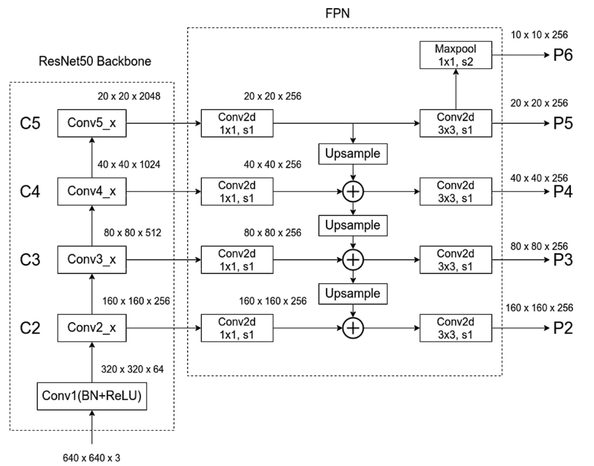
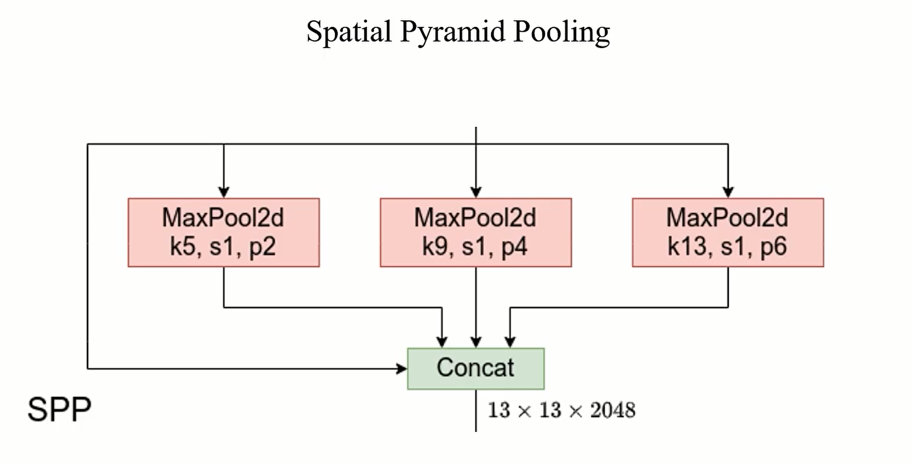
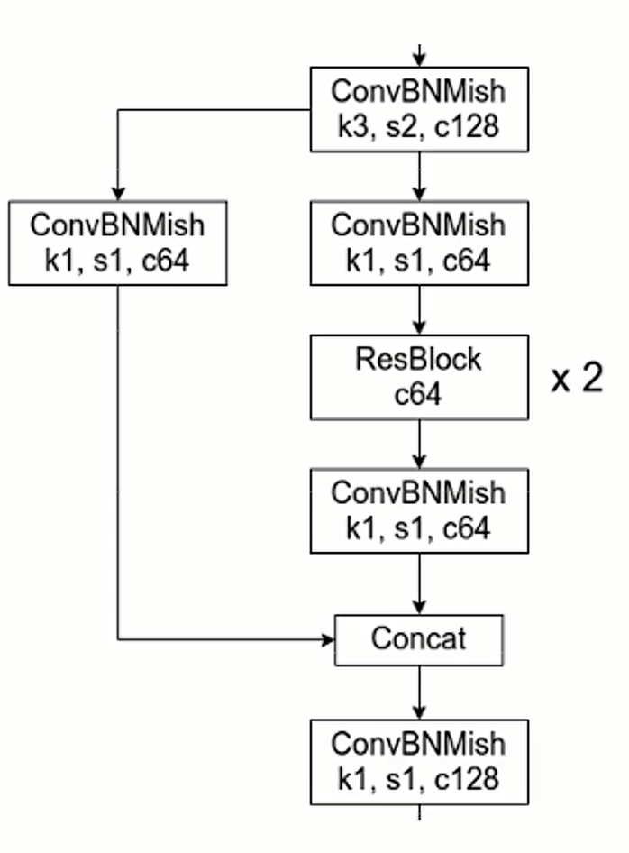

# YOLO 系列

说到目标检测，YOLO 一定是一个绕不开的话题，而且版本更迭非常快，但是这也造成了一定程度的混乱，因为版本之间的开发团队可能不一致。其实到底什么算 YOLO 呢？我想现在已经没有一个很明确的定义，因为 YOLO 更像是一个各种实用 trick 的混合体

本笔记主要参考 [wz-bilibili](https://www.bilibili.com/video/BV1yi4y1g7ro) 目的在于简单总结 YOLO 系列的进化路程，以及其中哪些结构值得关注，有哪些 take-home message

## YOLO v1

2016 CVPR

相比同期的 SSD & Faster R-CNN 还是差一些，但之后逐渐成长。YOLO v1 没有使用 anchor 可能是 anchor-free 的鼻祖

核心思想：

1. 将一幅图像分成 SxS 个网格，如果某个 object 的中心落在这个网格中，则这个网格就负责预测这个 object
2. 每个网格要预测 B 个 bounding box，每个 box 需要预测如下变量：
   1. box 坐标 (x, y, w, h)，box 的表示形式可以有很多，这里只是其中一种，但基本都是用 4 个变量表示。在进行回归时有时不会直接回归真值，而是回归一些经过处理的相对值
   2. confidence/objectness 置信度，本质上是对 IoU 的预测
   3. classification 分类，是以 C 维的变量组成

这些思想我都似乎在各个论文里见到过，但实际上现在的这些思想在细节上的处理是超过 YOLO v1 的，比如损失函数在 YOLO v1 中只使用了平方和损失，但实际上对于分类通常使用的是交叉熵损失。而且由于 SxS (S=7) 网格的分辨率相对粗糙，对小目标的检测比较差

## YOLO v2

2017 CVPR

也叫做 YOLO9000，相比于前作是巨大的提升，也说明深度学习在 2016 年过后每年都是迅速的发展，而深度学习的框架也在逐渐走向规范，大家都会使用一些公认的结构来提升自己的表现

核心改进：

1. 使用 Batch Normalization + 2 mAP，可加速收敛，并替代 dropout 正则化效果。很难想象 BN 在 2017 才广泛使用
2. 使用更高分辨率的输入 + 4 mAP
3. 使用基于 anchor 预测，能够加速收敛，加大召回率，但是还没有明显提升 mAP，其中 anchor 使用 k-means 聚类方法获得
4. 将不同分辨率的特征图谱进行融合 +，融合方式是将高分辨率图谱进行下采样，下采样思想是将空间转换到通道
5. 使用多尺度训练。一般设置几种不同尺度的图片，训练时每隔一定 iterations 随机选取一种尺度训练。这样训练出来的模型鲁棒性强，其可以接受任意大小的图片作为输入

## YOLO v3

2018 CVPR

核心改进：

1. 将 backbone 加深。YOLO 使用的 backbone 都是用 darknet，本质是残差网络，使用卷积层替代最大池化，使用 LeakyReLU 激活函数
2. 引入了 FPN 结构，图片来自与 [bilibili](https://www.bilibili.com/video/BV1dh411U7D9)

正负样本/anchor的匹配也是基于 anchor 与 gt 的 IoU 值，但为了平衡正负样本数量 IoU 阈值取得相对低，计算 IoU 时，仅计算 object 中心所落在的 grid 产生的 anchor，并且 anchor 和 gt 会先左上角对齐后再计算 IoU

SPP 版本核心改进：

1. 使用 Mosaic 图像增强，随机选取4张图像进行组合

2. 插入 SPP 模块，使用多尺度最大池化并进行拼接

   

3. 使用 CIoU 损失

4. 值得一提的是没有使用 Focal Loss，在参考的视频中也提到 Focal Loss 有两个注意点：1. 需要调整参数；2. 对样本要求比较高，若标注错误可能对错误样本进行错误优化

## YOLO v4

2020 CVPR

核心改进：

1. 使用 CSP-Darknet53 作为 backbone，所谓 CrossStagePartial (CSP) 就是分两个支路行动，和 SC-Conv 有相似之处，下图来自 [wz-bilibili](https://www.bilibili.com/video/BV1NF41147So)

   

2.  使用 Path Aggregation Network (PAN)，简单来说就是把已经得到的特征金字塔又 bottom-up 融合了一次

3.  对中心的表示更灵活，突破 grid 限制，或者说消除 grid 敏感度
   $$
   b_x = (2\sigma(logit_x) - 0.5) + grid_x \\
   b_y = (2\sigma(logit_y) - 0.5) + grid_y
   $$
   同时在正负样本匹配的时候，也需要扩展到相邻 grid

## YOLO v5

没有发表论文，更纯粹的工程项目

核心改进：

1. 优化 CSP-Darknet53

2. 优化 SPP 为 SPPF，与原 SPP 等价，但是效率更高，因为能重复利用 MaxPooling 结果

3. 优化 PAN 为 CSP-PAN

4. 限制长宽预测的值域，缩放因子最大为4
   $$
   b_w = a_w(2\sigma(logit_w))^2\\
   b_h = a_h(2\sigma(logit_h))^2
   $$
   
5. 更复杂的数据增强

6. 不再以 IoU based 分配正负样本，是以长宽比来间接衡量 anchor 和 gt 的匹配度
   $$
   r_w = w_{gt}/w_a\\ r_h = h_{gt} / h_a\\
   r_w^{max} = max(r_w, 1/r_w)\\
   r_h^{max} = max(r_h, 1/r_h)\\
   r_{max} = max(r_w^{max}, r_h^{max})
   $$
   最终只要 $r_{max}$ 是在 4 以内就算匹配成功  

再总结一下训练技巧：混合精度训练（很香，显存减半速度翻倍），WarmupCosineLrScheduler，Multi-scale training，EMA 更新参数（不是很清楚，但平滑就对了）

损失由三个部分组成：

1. Classification，只计算正样本的分类损失，BCE Loss
2. Objectness，计算所有样本的损失，BCE Loss，使用的 CIoU 衡量
3. Location，只计算正样本的定位损失，使用 CIoU Loss

对于不同尺度的特征层损失有不同的权重，权重随着目标边小而增加，也就是更倾向于加强对小目标的预测能力

## YOLOX & FCOS

[YOLOX](https://www.bilibili.com/video/BV1JW4y1k76c) [FCOS](https://www.bilibili.com/video/BV1G5411X7jw)

在讲 YOLOX 之前先整理一下 FCOS 2019 CVPR，一个经典的 anchor-free one stage 网络

Anchor-based 局限性：

1. 需要人工设计 anchor 的大小
2. anchor 相对固定，难以处理形状变化大的目标
3. 为了获得高 recall，需要在图像中生成非常密集的 anchor boxes，这会导致正负样本不均匀。其实这一点是不成立的，因为 anchor free 也存在正负样本不均衡的问题。但每个 Pixel 确实会预测多个 anchor boxes，这在计算量上会大于 anchor-free

但可以看到之前的 YOLO 系列其实是从 anchor-free 转到 anchor-based 之中，说明 anchor-based 依然有其优势所在：加速收敛，高召回率

FCOS 的其实更像 anchor-free 版本的 YOLO v3，但是在正负样本匹配和回归上面有不同：

1. 正负样本分配是根据某个像素点是否落在 gt boxes 当中决定，使用 Focal Loss。这个分配方法有两个局限性：

   1. boxes 中不是所有的点都是我们关注的物体
   2. 一个点可能落到多个 gt boxes 当中

   第一个问题通过缩小 gt boxes 范围（sub-box，向中心靠近）而改进；第二个问题通过 FPN 可改进。但其实都没有真正解决这两个问题

2. 回归 centerness，类似于 YOLO 中的 objectness，测试时，将预测的中心度与相应的分类分数相乘，计算最终得分(用于对检测到的边界框进行排序)。公式如下，*代表 gt，使用 BCE Loss
   $$
   centerness^*=\sqrt{\frac{\min \left(l^{*}, r^{*}\right)}{\max \left(l^{*}, r^{*}\right)} \times \frac{\min \left(t^{*}, b^{*}\right)}{\max \left(t^{*}, b^{*}\right)}}
   $$

3. 回归边框使用的 GIoU Loss，并且回归参数是 $(t,l,b,r)$ 的形式，即点到边框上下左右的距离，当然在回归的时候还要考虑 FPN 的缩放尺度 scale factor

下面就来讲讲 YOLOX 2021 CVPR，类似于 FCOS，也是 anchor-free 模型，但其预测的参数更 YOLO 一些，即 $(x,y,h,w)$ 以及 objectness。 更主要的改进可能在于正负样本的匹配，论文中名为 SimOTA，引入了最优化/分配里面的方法，cost 矩阵是由预测的分类和回归的损失计算得到

