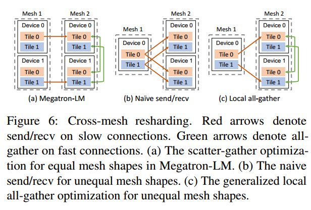

# ALPA

## Links

- [ZeRO: Memory Optimizations Toward Training Trillion Parameter Models](https://arxiv.org/abs/1910.02054)
- [Efficient Large-Scale Language Model Training on GPU Clusters Using Megatron-LM](https://arxiv.org/abs/2104.04473)
- [Alpa: Automating Inter- and Intra-Operator Parallelism for Distributed Deep Learning](https://arxiv.org/abs/2201.12023)
- [Colossal-Auto: Unified Automation of Parallelization and Activation Checkpoint for Large-scale Models](https://arxiv.org/abs/2302.02599)
- [Auto-Parallelizing Large Models with Rhino: A Systematic Approach on Production AI Platform](https://arxiv.org/abs/2302.08141)
- https://github.com/ray-project/ray
- https://github.com/microsoft/DeepSpeed
- https://github.com/alpa-projects/alpa

## Concept

- Auto Parallel

  分成两个部分：自动和并行。并行就是让训练过程在多个设备上同时进行，从而加速训练。而自动就是解决这个并行过程中遇到的一些问题，例如如何让数据并行、如何让模型并行、如何在节点间进行通信等

- Intra-operator & Inter-operator parallelisms

  这是论文中的两个核心概念

  Intra-op 并行就是将算子沿着张量的一个轴或者多个轴（batch or non-batch）进行分割，然后利用分布式设备来同时进行计算（data/tensor/ZeRO parallelism）

  Inter-op 并行是将整个模型切分为几个部分（子图），然后利用分布式设备来进行流水线运作（pipeline parallelism）

  下图使用一个两层的 Linear 来直观展示

  

  Intra-op para 由于需要对数据进行切分和整合，所以需要在设备之间进行大量的交流，这需要高带宽进行支撑。对比于 inter-op para，则不需要这么高带宽来进行设备间的交流

- Alpa

  本论文提出的方法，是一个模型编译器，用于生成执行计划

  > Alpa is a compiler that generates model-parallel execution plans by hierarchically optimizing the plan at two different levels: intra-op and inter-op parallelism

- Megatron-LM

  论文发表时的 sota training system，专门为 transformer 语言模型的并行训练而设计

- ZeRO

  权重分片更新，一种 data para 的优化技巧，详细的解读 [zhihu](https://zhuanlan.zhihu.com/p/394064174)

- Compilation Pass

  > A compilation pass refers to a specific phase or step in the process of compiling source code into executable machine code. Each pass performs a particular set of tasks on the source code, transforming it in preparation for the next pass. 

  一个具体的例子就是编译 C++ 程序，编译过程需要3个 pass：

  1. Lexical Analysis，这个 pass 扫描源代码，并将其分为有意义的单元
  2. Syntax Analysis，这个 pass 分析语法，并生成 syntax tree
  3. Code Generation，这个 pass 使用 syntax tree 来生成机器码

- Passes in Alpa

  1. Inter-op Pass，将模型分割为子图（stages），分割结果由动态规划算法决定
  2. Intra-op Pass，优化子图在 devices 中的运行速度，执行计划由整数线性规划算法决定
  3. Runtime Orchestration，将上面的最优策略进行编译生成 pipeline 和执行指令，完成不同子图间的数据交流和 resharding

  

- SPMD-style intra-op para

  Single Program Multi Data. scalable parallelization for ml computation graphs

  > which partitions operators evenly across devices and executes the same instructions on all devices

- Space of Intra & Inter op para

  这相当于是一个搜索空间，在这些空间中存在一个最优的方案，使得 Inter & Inter op para 获得最优速度

  在 Intra op para 中论文使用了 mat mul 作为例子，我们可以对矩阵乘法中的三个循环 i,j,k 进行组合和并行，来生成一个搜索空间

- Device mesh

  > 2-dimensional logical view of a set of physical devices
  >
  > We assume different groups of devices along the same mesh dimension have the same communication performance

- Sharding Spec 分片规范

  对一个 N 维张量，使用一个规范来表示其某个轴是否被划分。该规范为 $X_0X_1 ···X_{n−1}, where\  X_i ∈ \{S,R\}.$

  $X_i=S$ 表示第 i 个轴被切分，$X_i=R$ 表示第 i 个轴不被切分，会被完整复制

  除此之外还使用上标来表示某轴被分配到 device mesh 中的哪个维度。例如 $S^0$ 代表被切分到 mesh 的横轴，$S^01$ 代表会被同时切分到 mesh 的横轴和竖轴

  resharding 其实就是 reshape，即将数据重新进行分片

- Computational graph 计算图

  这个概念在接触深度学习之初就看到过了，尤其是在计算反向传播的时候，会频繁提到计算图的概念。计算图由节点和边组成 $G=(V,E)$，**其中每一个节点是一个算子，而边代表数据的流向**。其他教程也有说：节点是数据，边是算子的。但为了统一，我以后都按加粗字体理解

- XLA, Ray, Jax, NCCL

  上述四个工具用于论文的代码实现

  - https://github.com/openxla/xla
  - https://github.com/ray-project/ray
  - https://github.com/google/jax
  - https://github.com/NVIDIA/nccl
  
- 1F1B pipeline

  one-forward-one-backward pipeline 就是 Gpipe 的升级版本，其核心思想是尽快释放占用显存，这样 peak memory 相比 Gpipe 要少，但是二者的时间其实是一样的 [ColossalAI](https://colossalai.org/docs/features/pipeline_parallel/#introduction-of-1f1b-pipeline)

- 3D parallelism

  所谓的 3D 是指包含了三个维度：data parallelism, tensor parallism (also called model parallelsim & operator parallelism), pipeline parallelism
  
- Operand

  直翻为操作数。带入到论文里根本读不通，这里应该是指一个算子

## Layouts

- Manual combination of parallelism

  Megatron-LM 就是手工设计 parallelism 的经典之作。通过假设模型为堆叠的 transformer blocks，可以很容易地将模型切分为几个相同的子图。对所有层都使用手工设计的 operator + data parallelism 很容易完成对 Megatron-LM 的 3D 并行训练

- Parallelism 之间的交互

  当我们在使用多种并行技巧的时候，它们之间显然是会相互影响的。例如在某个 operator parallelism 之下，你想要再增加一个 data batch 以提升 data parallelism 并行度，此时你需要添加多个 GPU，以满足 operator parallelism 的 GPU 基础条件，而不是只添加一个 GPU。同时 pipeline parallelism 也取决于你如何分配 GPU，以及在这些 GPU 之上你的 data & operator parallelism 如何运行

- ILP Formulation

  ILP Formulation 所解决的问题：一个子图在一个 mesh grid 上所花费的最小时间

  ILP 将计算图所花费的时间进行数学抽象：计算图中的每一个节点代表算子，每一个算子需要花费计算时间以及通信时间，而节点与节点之间需要进行 resharding。总时间就是节点的时间和边的时间
  $$
  \operatorname*{min}_{s}\sum_{\nu\in V}s_{\nu}^{T}(c_{\nu}+d_{\nu})+\sum_{(\nu,u)\in E}s_{\nu}^{T}R_{\nu u}s_{u},
  $$
  其中把一个 stage 仍然抽象为一个图 $(V,E)$，下标 v 代表一个节点（一个或多个算子，这里混用了节点和算子概念），s 则代表所选用的策略，为一个 one-hot 向量，c 为算子内通信时间，d 为算子计算时间，R 为节点之间的通信时间

  算子内的通信时间和节点之间的通信时间，都可以理解为 resharding 所花费的时间

  几个优化：

  1. 所有的计算量 $c_v$ 都是 0。这基于一个假设：shard specs 不影响算子的计算速度。算子（例如矩阵乘法）拆分成几个部分做，其算数计算数都是一样的，而且所有算子都是平分到 GPU 上，所以都应该是同时完成
  2. 将一些 element-wise 的算子融合到节点当中
  3. 将通信的 all-reduce 操作全部替换为 reduce-scatter + all-gather，这样更快 [zhihu](https://zhuanlan.zhihu.com/p/504957661)

- DP Formulation

  将计算图所花费的时间进行数学抽象，与 ILP Formulation 不同的是，这里的计算图是整个模型的计算图，而 ILP 则为一个固定的子图，一个子图也称为一个 stage。而一个 stage 可由多个算子组成 $o_1,o_2,...$

  需要通过动态规划来获得最小的计算时间，但是求解时间太久，论文使用了两个技巧：1. early pruning 来提前停止搜索；2. operator clustering 来融合细碎算子
  $$
  T^{*}=\operatorname*{min}_{(n_{1},m_{1}),...,(n_{S},m_{S})}\left\{\sum_{i=1}^{S}t_{i}+(B-1)\cdot\operatorname*{max}_{1\le j\le S}\{t_{j}\}\right\}.
  $$
  可能的 mesh 种类有 $N+log_2(M)$ 种

  其中 t 为某个 stage 所花费的时间，B 为 micro-batches 数量。下面为整个计算图的消耗时间 T 的示意图

  

  有两个合理的限制：

  1. 把 forward 和 backward 的 tensor 排在一起，这样会节省通信时间
  2. 划分的 stages 要把所有的 device 占满。但是占用的 Mesh 形状有限制：只能是 $(1, 2^m)$ 或者 $(n,M)$，也就说，要么整排整排的占，要么只占一排并且按照 2 的次方数占据。这也限制了，stage 的数量最多为 $NM$ 个，超过这个数 Mesh 就不够分

  这个动态规划问题比较复杂，但是作者是动态规划的高手，把整个问题拆分为了两个部分，也就是上面公式的两个项：

  1. 所有 stage 的和
  2. 所有 stage 最耗时的部分

  论文将逐个循环所有可能的 stage 情况，获得可能的耗时 `compute_cost`，然后以每个可能的耗时，作为 stage 中最长的部分，以此为条件来计算所有 stage 的和。

  状态定义 $F(s, k, d|t_{max})$ 为：在每一个 stage 耗时不超过 $t_{max}$ 的条件下，将算子序列 $o_k,o_{k+1},...,o_K$ 分为 $s$ 个 stages，并分配到 $d$ 个 GPU 上所花费的最小耗时 

  下面列出状态转移方程
  $$
  F(s,k,d|t_{max})=\min_{i,n,m} C(k,i,Mesh(n,m))+F(s-1,i+1,d-nm)
  $$
  $C(k,i,Mesh(n,m))$ 代表计算图 $o_k,...,o_i$ 在 $Mesh(n,m)$ 上的 compute cost，这个 compute cost 是事先通过 ILP 求解得到的。状态转移方程将计算图分配两部分 $o_k,...,o_i$ 以及 $o_{i+1},...,o_K$，后一部分的状态由最优子结构得出。通过遍历可能的 $i$ 以及可能的 mesh 结构，我们就一直向下推导。更多细节必须查看代码，例如循环方式，更新方式等

  ```python
  import numpy as np
  
  def alpa_dp_impl(
      num_layers, num_devices, num_microbatches, submesh_choices, compute_cost, max_stage_cost, best_configs
  ):
      """Implementation of Alpa DP for pipeline strategy
      Paper reference: https://www.usenix.org/system/files/osdi22-zheng-lianmin.pdf
  
      Arguments:
              num_layers: K
              num_devices: N*M
              num_microbatches: B
              submesh_choices: List[(n_i,m_i)]
              compute_cost: t_intra[start_op_index, end_op_index, device_mesh_index]
              best_configs: best_configs[start_op_index, end_op_index, device_mesh_index]
      """
      # For f, layer ID start from 0
      # f[#pipeline stages, layer id that is currently being considered, number of devices used]
      f = np.full((num_layers + 1, num_layers + 1, num_devices + 1), np.inf, dtype=np.float32)
      f_stage_max = np.full((num_layers + 1, num_layers + 1, num_devices + 1), 0.0, dtype=np.float32)
      f_argmin = np.full((num_layers + 1, num_layers + 1, num_devices + 1, 3), -1, dtype=np.int32)
      f[0, num_layers, 0] = 0
      for s in range(1, num_layers + 1):  # stage loop
          for k in range(num_layers - 1, -1, -1): # operation loop
              for d in range(1, num_devices + 1): # device number loop
                  for m, submesh in enumerate(submesh_choices):   # device mesh loop
                      # above 2 loops are to test the sub mesh under certain number
                      n_submesh_devices = np.prod(np.array(submesh))
                      if n_submesh_devices <= d:
                          for i in range(num_layers, k, -1):
                              # split the op into 2 parts: [k, i] and [i + 1, num_layers] and 
                              stage_cost = compute_cost[k, i, m]
                              # I believe the impl here is wrong, below commented is correct
                              # new_cost = f[s - 1, i + 1, d - n_submesh_devices] + stage_cost
                              new_cost = f[s - 1, k, d - n_submesh_devices] + stage_cost
                              
                              if stage_cost <= max_stage_cost and new_cost < f[s, k, d]:
                                  # update cost, max stage cost, (start op index, mesh index, sharding choice)
                                  f[s, k, d] = new_cost
                                  f_stage_max[s, k, d] = max(stage_cost, f_stage_max[s - 1, i, d - n_submesh_devices])
                                  f_argmin[s, k, d] = (i, m, best_configs[k, i, m])
      # find best stages and its cost
      best_s = -1
      best_total_cost = np.inf
      for s in range(1, num_layers + 1):
          if f[s, 0, num_devices] < best_total_cost:
              best_s = s
              best_total_cost = f[s, 0, num_devices]
  
      if np.isinf(best_total_cost):
          return np.inf, None
  
      total_cost = f[best_s, 0, num_devices] + (num_microbatches - 1) * f_stage_max[best_s, 0, num_devices]
      current_s = best_s
      current_layer = 0
      current_devices = num_devices
  
      # get the stages information
      res = []
      while current_s > 0 and current_layer < num_layers and current_devices > 0:
          next_start_layer, submesh_choice, autosharding_choice = f_argmin[current_s, current_layer, current_devices]
          assert next_start_layer != -1 and current_devices != -1
          res.append(((current_layer, next_start_layer), submesh_choice, autosharding_choice))
          current_s -= 1
          current_layer = next_start_layer
          current_devices -= np.prod(np.array(submesh_choices[submesh_choice]))
      assert current_s == 0 and current_layer == num_layers and current_devices == 0
  
      return total_cost, res
  
  def alpa_dp(
      num_layers, num_devices, num_microbatches, submesh_choices, num_autosharding_configs, compute_cost, gap=1e-6
  ):
      """Alpa auto stage dynamic programming.
          Code reference: https://github.com/alpa-projects/alpa/blob/main/alpa/pipeline_parallel/stage_construction.py
  
      Arguments:
          submesh_choices: List[(int,int)]
          num_autosharding_configs: Max number of t_intra(start_layer, end_layer, LogicalMesh)
          compute_cost: np.array(num_layers,num_layers,num_submesh_choices,num_autosharding_configs)
      """
      assert np.shape(compute_cost) == (
          num_layers,
          num_layers,
          len(submesh_choices),
          num_autosharding_configs,
      ), "Cost shape wrong."
      all_possible_stage_costs = np.sort(np.unique(compute_cost))
      best_cost = np.inf
      best_solution = None
      last_max_stage_cost = 0.0
      # TODO: [luzgh]: Why alpa needs the num_autosharding_configs dimension in compute_cost?
      # In dp_impl it seems the argmin n_config will be chosen. Just amin here.
      best_configs = np.argmin(compute_cost, axis=3)
      best_compute_cost = np.amin(compute_cost, axis=3)
      assert len(all_possible_stage_costs), "no solution in auto stage construction."
      for max_stage_cost in all_possible_stage_costs:
          if max_stage_cost * num_microbatches >= best_cost:
              break
          if max_stage_cost - last_max_stage_cost < gap:
              continue
          cost, solution = alpa_dp_impl(
              num_layers, num_devices, num_microbatches, submesh_choices, best_compute_cost, max_stage_cost, best_configs
          )
          if cost < best_cost:
              best_cost = cost
              best_solution = solution
          last_max_stage_cost = max_stage_cost
  
      return best_cost, best_solution
  ```

  DP 还有两个小的优化方法：

  1. Early stopping。当 $B\times t_{max}$ 已经比当前的最优解大时就可以停止搜索了，当前最优解就是全局最优。因为最优解有 $T^*\ge B\times t_{max}$
  2. Operator cluster。因为一个计算图的算子通常非常多，我们将 K 个计算图进行聚类，最终将其聚类到 L << K 的数量，L 对应代码中的 `num_layers`。L 是一个超参数，通常设得比较小，对最后的效果影响不大。注意到 cluster 不仅在 DP 层面，应该在 ILP 的时候就进行了划分

- 论文设计了一个 cross-mesh communication 方法，来让 mesh 之间进行相对高效的通信。简单来说需要减少像 naive send & recieve 一样的重复低带宽通信。只发送一次低带宽通信，然后利用 mesh 间的高带宽传递数据

  

- Limitations

  1. DP Formulation 当中不建模 mesh 之间的通信时间，因为这些通信相对轻量。加入过后会增加 DP 的搜索时间
  2. 只能对静态计算图进行
  3. 不能对计算图的 branch 进行并行
  4. 不优化 computation 和 communication 的重叠时间

## Question

- ✅如何将 Data Parallelism, Operator Parallelsim, ZeRO 统一起来的？在 ZeRO 中还有对 optimizer 的优化

  ALPA 的 intra-op para 和 ZeRO 可以说关系不大，因为 ZeRO 是直接将数据展开到一维，然后暴力切分，在计算的时候再利用通信组合起来成为完成的 layer。这与 ZeRO blog 的图示理解不一致

- 在 ILP Formulation 中，这些计算时间、通信时间是如何获得的？

- ✅为什么使用更多的 GPU 反而 out of memory？

  因为随着 GPU 的增加，模型 channel 也在增加，导致显存平方增加，没进行张量并行的话一定会炸掉

- Crazy ideas，是否能够使用以下优化算法来进行 management:
  1. Neural Nets，神经网络对于非凸优化应该有不错的能力，DeepMind 应该会比较在行
  2. RegNets，向 Kaiming 学习
  3. xgboosts，向 TVM 学习。但是在 [bilibili](https://www.bilibili.com/video/BV1f14y1A7AN) 中说与 autoTVM 还是有一定区别的，没有那么细？区别在哪里？
  
- 算法复杂度如何进行降低？似乎不能扩展到 64+ 的 Cluster

- **ALPA 中最核心的部分应该就是 strategy 的空间，具体是什么样子的？**

- ✅Logical & physical mesh 如何进行区别？如果 Logical 不符合 Physical 的建模，是否会影响最后结果？

  logical mesh 可以更灵活地处理算子的切分，例如将一个 2x8 的 physical mesh 划分为一个 4x4 的 logical mesh，我们就能够将算子分成4份，而不仅限于分为2份或者8份。同时需要将 logical mesh 实际映射到 physical mesh 当中，这也非常简单，个人猜测和 tensor.view 是一个道理，即把 2x8 展开到一维，然后再4个4个分组

- ✅为什么视觉模型无法做到和语言模型一样大？

  实际上是可以的，只不过训练视觉模型没有语言模型那样简单，resolution 在不断地降低，这样在网络前期占用显存高，计算密度大，网络后期显存和计算都会显著降低。这种情况很难在 GPU 之间进行简单切分。我认为现在的 vit 应该能解决这样的问题，因为 vit 训练不需要多个 resolution，也是简单堆叠

- 在计算图中，如何将 transpose, reduce 和其他 operand 融合？

- Forward 和 backward 怎么排到一起？

- `dp_impl` 实现代码，参考 [colossal-ai](https://github.com/hpcaitech/ColossalAI/blob/main/colossalai/device/calc_pipeline_strategy.py)

  - 代码与论文不符。不管是 colossal-ai 还是 alpa 原项目

    ```python
    # new_cost = f[s - 1, i + 1, d - n_submesh_devices] + stage_cost
    new_cost = f[s - 1, k, d - n_submesh_devices] + stage_cost
    ```

  - `autosharding_configs` 指的是什么？

- ✅clustering & fusing 有什么区别？

  clustering 仅仅是逻辑上的分块操作，不对算子做融合
