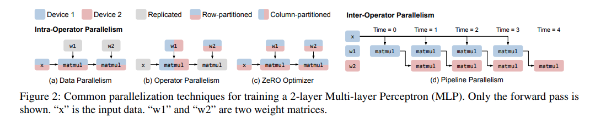

# ALPA

## Links

- [ZeRO: Memory Optimizations Toward Training Trillion Parameter Models](https://arxiv.org/abs/1910.02054)
- [Efficient Large-Scale Language Model Training on GPU Clusters Using Megatron-LM](https://arxiv.org/abs/2104.04473)
- [Alpa: Automating Inter- and Intra-Operator Parallelism for Distributed Deep Learning](https://arxiv.org/abs/2201.12023)
- [Colossal-Auto: Unified Automation of Parallelization and Activation Checkpoint for Large-scale Models](https://arxiv.org/abs/2302.02599)
- [Auto-Parallelizing Large Models with Rhino: A Systematic Approach on Production AI Platform](https://arxiv.org/abs/2302.08141)
- https://github.com/ray-project/ray
- https://github.com/microsoft/DeepSpeed
- https://github.com/alpa-projects/alpa

## Concept

- Auto Parallel

  分成两个部分：自动和并行。并行就是让训练过程在多个设备上同时进行，从而加速训练。而自动就是解决这个并行过程中遇到的一些问题，例如如何让数据并行、如何让模型并行、如何在节点间进行通信等

- Intra-operator & Inter-operator parallelisms

  这是论文中的两个核心概念

  Intra-op 并行就是将算子沿着张量的一个轴或者多个轴（batch or non-batch）进行分割，然后利用分布式设备来同时进行计算（data/tensor/ZeRO parallelism）

  Inter-op 并行是将整个模型切分为几个部分（子图），然后利用分布式设备来进行流水线运作（pipeline parallelism）

  下图使用一个两层的 Linear 来直观展示

  

  Intra-op para 由于需要对数据进行切分和整合，所以需要在设备之间进行大量的交流，这需要高带宽进行支撑。对比于 inter-op para，则不需要这么高带宽来进行设备间的交流

- Alpa

  本论文提出的方法，是一个模型编译器，用于生成执行计划

  > Alpa is a compiler that generates model-parallel execution plans by hierarchically optimizing the plan at two different levels: intra-op and inter-op parallelism

- Megatron-LM

  论文发表时的 sota training system，专门为 transformer 语言模型的并行训练而设计

- ZeRO

  权重分片更新，一种 data para 的优化技巧，详细的解读 [zhihu](https://zhuanlan.zhihu.com/p/394064174)

- Compilation Pass

  > A compilation pass refers to a specific phase or step in the process of compiling source code into executable machine code. Each pass performs a particular set of tasks on the source code, transforming it in preparation for the next pass. 

  一个具体的例子就是编译 C++ 程序，编译过程需要3个 pass：

  1. Lexical Analysis，这个 pass 扫描源代码，并将其分为有意义的单元
  2. Syntax Analysis，这个 pass 分析语法，并生成 syntax tree
  3. Code Generation，这个 pass 使用 syntax tree 来生成机器码

- Passes in Alpa

  1. Inter-op Pass，将模型分割为子图（stages），分割结果由动态规划算法决定
  2. Intra-op Pass，优化子图在 devices 中的运行速度，执行计划由整数线性规划算法决定
  3. Runtime Orchestration，将上面的最优策略进行编译生成 pipeline 和执行指令，完成不同子图间的数据交流和 resharding

  

- SPMD-style intra-op para

  Single Program Multi Data. scalable parallelization for ml computation graphs

  > which partitions operators evenly across devices and executes the same instructions on all devices

- Space of Intra & Inter op para

  这相当于是一个搜索空间，在这些空间中存在一个最优的方案，使得 Inter & Inter op para 获得最优速度

  在 Intra op para 中论文使用了 mat mul 作为例子，我们可以对矩阵乘法中的三个循环 i,j,k 进行组合和并行，来生成一个搜索空间

- Device mesh

  > 2-dimensional logical view of a set of physical devices
  >
  > We assume different groups of devices along the same mesh dimension have the same communication performance

- Sharding Spec 分片规范

  对一个 N 维张量，使用一个规范来表示其某个轴是否被划分。该规范为 $X_0X_1 ···X_{n−1}, where\  X_i ∈ \{S,R\}.$

  $X_i=S$ 表示第 i 个轴被切分，$X_i=R$ 表示第 i 个轴不被切分，会被完整复制

  除此之外还使用上标来表示某轴被分配到 device mesh 中的哪个维度。例如 $S^0$ 代表被切分到 mesh 的横轴，$S^01$ 代表会被同时切分到 mesh 的横轴和竖轴

  resharding 其实就是 reshape，即将数据重新进行分片

- Computational graph 计算图

  这个概念在接触深度学习之初就看到过了，尤其是在计算反向传播的时候，会频繁提到计算图的概念。计算图由节点和边组成 $G=(V,E)$，**其中每一个节点是一个算子，而边代表数据的流向**。其他教程也有说：节点是数据，边是算子的。但为了统一，我以后都按加粗字体理解

- ILP Formulation

  将计算图所花费的时间进行数学抽象

  计算图中的每一个节点代表算子，每一个算子需要花费计算时间以及通信时间，而节点与节点之间需要进行 resharding

  总时间就是节点的时间和边的时间
  $$
  \operatorname*{min}_{s}\sum_{\nu\in V}s_{\nu}^{T}(c_{\nu}+d_{\nu})+\sum_{(\nu,u)\in E}s_{\nu}^{T}R_{\nu u}s_{u},
  $$
  其中把一个 stage 仍然抽象为一个图 $(V,E)$，下标 v 代表一个节点（一个或多个算子，这里混用了节点和算子概念），s 则代表所选用的策略，为一个 one-hot 向量，c 为算子内通信时间，d 为算子计算时间，R 为节点之间的通信时间

  算子内的通信时间和节点之间的通信时间，都可以理解为 resharding 所花费的时间

  几个优化：

  1. 所有的计算量 $c_v$ 都是 0。这基于一个假设：shard specs 不影响算子的计算速度。矩阵乘法拆分成几个部分做，其算数计算数都是一样的，而且我们都是平分到 GPU 上，所以都应该是同时完成
  2. 将一些 element-wise 的算子融合到节点当中
  3. 将通信的 all-reduce 操作全部替换为 reduce-scatter + all-gather，这样更快 [zhihu](https://zhuanlan.zhihu.com/p/504957661)

- DP Formulation

  将计算图所花费的时间进行数学抽象，与 ILP Formulation 不同的是，这里的计算图是整个模型的计算图，而 ILP 则为一个固定的子图
  
  需要通过动态规划来获得最小的计算时间，但是求解时间太久，论文使用了两个技巧：1. early pruning 来提前停止搜索；2. operator clustering 来融合细碎算子
  $$
  T^{*}=\operatorname*{min}_{(n_{1},m_{1}),...,(n_{S},m_{S})}\left\{\sum_{i=1}^{S}t_{i}+(B-1)\cdot\operatorname*{max}_{1\le j\le S}\{t_{j}\}\right\}.
  $$
  其中 t 为某个 stage 所花费的时间，B 为 micro-batches 数量。下面为整个计算图的消耗时间 T 的示意图
  
  
  
- XLA, Ray, Jax, NCCL

  上述四个工具用于论文的代码实现

  - https://github.com/openxla/xla
  - https://github.com/ray-project/ray
  - https://github.com/google/jax
  - https://github.com/NVIDIA/nccl
  
- 1F1B pipeline

  one-forward-one-backward pipeline 就是 Gpipe 的升级版本，其核心思想是尽快释放占用显存，这样 peak memory 相比 Gpipe 要少，但是二者的时间其实是一样的 [ColossalAI](https://colossalai.org/docs/features/pipeline_parallel/#introduction-of-1f1b-pipeline)

- 3D parallelism

  所谓的 3D 是指包含了三个维度：data parallelism, tensor parallism (also called model parallelsim & operator parallelism), pipeline parallelism
  
- Operand

  直翻为操作数。带入到论文里根本读不通，这里应该是指一个算子

## Layouts

- Manual combination of parallelism

  Megatron-LM 就是手工设计 parallelism 的经典之作。通过假设模型为堆叠的 transformer blocks，可以很容易地将模型切分为几个相同的子图。对所有层都使用手工设计的 operator + data parallelism 很容易完成对 Megatron-LM 的 3D 并行训练

- Parallelism 之间的交互

  当我们在使用多种并行技巧的时候，它们之间显然是会相互影响的。例如在某个 operator parallelism 之下，你想要再增加一个 data batch 以提升 data parallelism 并行度，此时你需要添加多个 GPU，以满足 operator parallelism 的 GPU 基础条件，而不是只添加一个 GPU。同时 pipeline parallelism 也取决于你如何分配 GPU，以及在这些 GPU 之上你的 data & operator parallelism 如何运行

- Operator oriented parallelism

  在我看来，intra-op para 似乎更多的是比谁的 operator parallelism 设计得好。要有足够好的并行算法，才能生成足够好的搜索空间
  
- ILP 详解

  看懂 ILP Formulation 的公式并不难，但是仍有几个问题没有弄清楚：

  

## Question

- ✅如何将 Data Parallelism, Operator Parallelsim, ZeRO 统一起来的？在 ZeRO 中还有对 optimizer 的优化

  ALPA 的 intra-op para 和 ZeRO 可以说关系不大，因为 ZeRO 是直接将数据展开到一维，然后暴力切分，在计算的时候再利用通信组合起来成为完成的 layer。这与 ZeRO blog 的图示理解不一致

- 在 ILP Formulation 中，这些计算时间、通信时间是如何获得的

- 在 DP Formulation 中，动态规划的代码是如何实现的？如何理解动态规划的状态转移方程？

- 在以上 formulation 中，哪些计算是估计的？

- 为什么使用更多的 GPU 反而 out of memory？因为随着 GPU 的增加，模型 channel 也在增加，导致显存平方增加，没进行张量并行的话一定会炸掉

- 就使用论文里面的 limitations，看能否突破？例如建模通信速度

- Crazy ideas，是否能够使用以下优化算法来进行 management:
  1. Neural Nets，神经网络对于非凸优化应该有不错的能力，DeepMind 应该会比较在行
  2. RegNets，向 Kaiming 学习
  3. xgboosts，向 TVM 学习。但是在 [bilibili](https://www.bilibili.com/video/BV1f14y1A7AN) 中说与 autoTVM 还是有一定区别的，没有那么细？区别在哪里？
  
- 算法复杂度如何进行降低？似乎不能扩展到 64+ 的 Cluster

- **ALPA 中最核心的部分应该就是 strategy 的空间，具体是什么样子的？**

- Logical & physical mesh 如何进行区别？如果 Logical 不符合 Physical 的建模，是否会影响最后结果？

- ✅为什么视觉模型无法做到和语言模型一样大？

  实际上是可以的，只不过训练视觉模型没有语言模型那样简单，resolution 在不断地降低，这样在网络前期占用显存高，计算密度大，网络后期显存和计算都会显著降低。这种情况很难在 GPU 之间进行简单切分。我认为现在的 vit 应该能解决这样的问题，因为 vit 训练不需要多个 resolution，也是简单堆叠

- 在计算图中，如何将 transpose, reduce 和其他 operand 融合？
