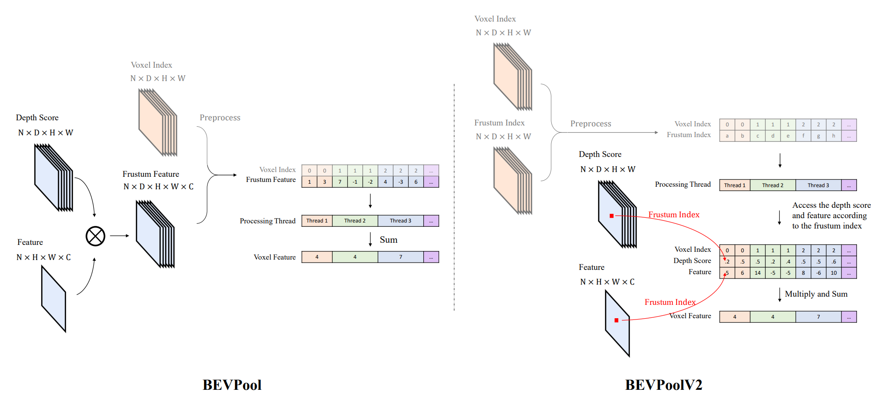

# BEVDet 2.0

想要学习的点：

- [ ] CUDA
- [x] BEV Aug
- [ ] 时序数据处理（总感觉这里有更好的时序处理方式，可以借用LLM中处理上下文的能力
- [ ] TEHI 整理

## 阅读论文笔记

### BEVDet

- BEV augmentation

  在训练过程中作者发现了过拟合现象，原因可能在于从图像空间转移到BEV空间时，图像的增广作用并不能同样使用于BEV空间。为解决这个问题提出了在 BEV 空间下的增广

- Scaled-NMS 以移除重叠选框

### BEVDet4D

- Align features

  需要将连续两帧的图像进行连接，需要对两个帧的特征空间进行统一，本质就是坐标系的转换，然后再 concat 起来。问题在于对于移动物体的特征如何统一

## 代码阅读

### Install

1. pytorch 1.11+cu113

2. mmlab related

   ```shell
   pip install mmcv-full==1.5.3 -f https://download.openmmlab.com/mmcv/dist/cu113/torch1.11.0/index.html
   
   pip install mmdet==2.25.1 mmsegmentation==0.25.0
   ```

3. other packages

   ```shell
   pip install pycuda \
       lyft_dataset_sdk \
       networkx==2.2 \
       numba==0.53.0 \
       numpy \
       nuscenes-devkit \
       plyfile \
       scikit-image \
       tensorboard \
       trimesh==2.35.39
   ```

4. project itself

   ```shell
   pip install -v -e .
   ```

5. Dataset

   首先将 `tools/create_data_bevdet.py` 中的 trainval 改成 mini，因为我只有 mini 在手上。然后

   ```python
   python tools/create_data_bevdet.py
   ```

   使用 `samples_per_gpu=1` 成功跑通！说明 BEVDet 还是非常干净的结构，一路安装完全没坑

### Dataset

使用 mmdet3d 中的 `nuscenes_converter` 完成数据处理，其中字段可以在 [nus](https://mmdetection3d.readthedocs.io/zh_CN/latest/datasets/nuscenes_det.html#) 中查看

没有看到 BEVDet 有处理时序的部分。

`sweep[sensor2lidar`

### Pipline

#### PrepareImageInputs

- `PrepareImageInputs` 是 BEVDet 获得数据的核心方法，用于获得以下输出

  ```python
  return (imgs,	# (N_cam, 2, H, W)
   sensor2egos,	# (N_cam, 4, 4)
   ego2globals,	# (N_cam, 4, 4)
   intrins,		# (N_cam, 3, 3)
   post_rots,		# (N_cam, 3, 3) image augmentation rots
   post_trans)	# (N_cam, 3)
  ```

  所有的数据都放在 `results['img_inputs']` 当中。下面细看如何获得这些数据

- `for cam_name in cam_names`，对于每一个相机

  - 获得图像 `img`

  - 生成数据增强参数 `img_augs`。包括 `resize, crop, flip, rotate`，这些数据增强均可由 `PIL` 库进行完成

    ```python
        def img_transform_core(self, img, resize_dims, crop, flip, rotate):
            # adjust image
            img = img.resize(resize_dims)
            img = img.crop(crop)
            if flip:
                img = img.transpose(method=Image.FLIP_LEFT_RIGHT)
            img = img.rotate(rotate)
            return img
    ```

    目前图像数据增强使用的增强越来越简单，例如 DINO 只用了 flip & resize & crop 这几种，并且需要注意对标签进行相应的增强处理。**但是 BEV 里无法进行简单处理，**因为标签并不属于图像空间，而存在于三维空间

  - 图像的增广使用了 `post_rot & post_trans` 表示，能够对 rotation, flip, crop 做统一的表示。变换矩阵针对的是像素的坐标

    ```python
    # pixel coords (x, y), (0, 0) is left corner
    new_coords = post_rot @ coords + post_trans
    ```

#### LoadAnnotationsBEVDetpth

- 获得三维选框的标签 `gt_boxes, gt_labels`，并对其使用数据增强，并记录其增强参数为 `bda_rot`

### BEVDet

- BEVDet 继承于 CenterPoint，应该只用 head 部分

- `self.extract_feat` 就是用于从图像提取 BEV 特征的

  - `prepare_inputs` 基本上什么都没干，只是多了一个 `sensor2keyegos`，这个矩阵是 `(B, N_cam, 4, 4)`，完全可以理解为 `sensor2egos`，因为 keyego 就是 `CAM_FRONT` 所在 timestamp 时的 ego 坐标系

  - 使用 `self.image_encoder` 对图像进行编码，即使用 ResNet + FPN 进行特征提取，返回特征 `(B, N_cam, C, H, w)`。最终是 16 倍下采样

  - 获得图像特征后就要将特征转换到 BEV 空间中，使用 `img_view_transformer`，这里就是 BEVDet 的**核心模块** `LSSViewTransformer`

    - `LSSViewTransformer` 将完成转换工作，注意此 transformer 跟 attention transformer 没有一丝关系

    - `self.craete_grid_infos` 通过 grid config

      ```python
      grid_config = {
          'x': [-51.2, 51.2, 0.8],
          'y': [-51.2, 51.2, 0.8],
          'z': [-5, 3, 8],
          'depth': [1.0, 60.0, 1.0],
      }
      ```

      简单生成3个变量（depth 信息这里没用到）

      ```python
      self.grid_lower_bound	# config first col
      self.grid_interval		# config last col
      self.grid_size			# number of grids in each dim
      ```

      这里的 grid 全部都是指的 ego 坐标系下的 grid，而不是指 image 坐标系，所以用 `x, y, z` 来标识，而不是 `D, H, W` 标识

      这些变量用于将之后的 ego 坐标系下的点转为 voxel index

    - `self.create_frustum` 使用 grid config 中的 depth 以及 `input_size & downsample` 来获得 frustum (锥台，或者说这里应理解为视锥)，其形状为 `(D, H, W, 3)`

      - `input_size & downsample` 等价于获得 image encoder 中输出的特征图形状
    
      - `grid_config['depth']` 表示了在深度上的采样点
    
        ```python
        d = torch.arange(1, 60, 1)
        # expand to (D, H, W)
        d = d.view(-1, 1, 1).expand(-1, H_feat, W_feat)
        ```

        这里还创建了属性 `self.D = d.shape[0]` 就是有多少个 D 采样点，当前设置下为 59
    
    - `self.depthnet` 是一个简单的二维卷积

      ```python
      self.depth_net = nn.Conv2d(            in_channels, self.D + self.out_channels, kernel_size=1, padding=0)
      ```

      输出的前 `self.D` 为深度分布预测，后面的维度为特征维度转换

    - **核心 `forward`** 

      - 对 `self.image_encoder` 的输出，使用 `self.depthnet` 进行特征提取，并将深度和特征通道分离，然后对深度 logtis 使用 softmax，获得归一化分布

      - `self.view_transform` 进行特征转换，以下所有整理均认为 `self.accelerate=False`，事实上在训练中也是这么配置的，输出两个张量 `bev_feat & depth`

        - 使用 `sefl.get_lidar_coord`，将之前定义的 `self.frustum` 转为为 ego 坐标系中的点
    
          首先将逆转 image augmentation 的效果
    
          ```python
                  # post-transformation
                  # B x N x D x H x W x 3
                  points = self.frustum.to(sensor2ego) - post_trans.view(B, N, 1, 1, 1, 3)
                  points = torch.inverse(post_rots).view(B, N, 1, 1, 1, 3, 3)\
                      .matmul(points.unsqueeze(-1))
          ```
    
          然后根据透视投影 perspective projection 的公式
          $$
          Zx=K_f\Pi_0X
          $$
          就可以求得不同深度的 image frustum 其对应的 camera 坐标系下的点
        
          最后再通过外参转换为 ego 坐标系下的点 `coord` 并加入 BEV augmentation，形状仍然是 `(B, N_cam, D, H, W, 3)`

        - `self.voxel_pooling_v2` 能够将相同 voxel 的特征进行整合，从而形成真正的三维空间特征 or BEV 空间特征 `bev_feat: (B, Z, Y, X, C) or (B, Y, X, C)`
    
          BEVPool 和 BEVPool v2 的区别
        
          
        
          看上图是非常好理解的，也推荐看官方的技术报告，很简短，但是很清晰。这里先把 `self.voxel_pooling_prepare_v2` 简单整理
        
          `self.voxel_pooling_prepare_v2` 用来生成 `bev_pool_v2` 的前期准备，输入就是上述 ego 坐标系下的 `coord` 包括如下变量
        
          ```python
          ranks_bev
          ranks_depth		# range(0, num_points), num_points = B*N_cam*D*H*W
          ranks_feat		# range(0, num_points // D)
          interval_starts
          interval_lengths
          ```
        
          看一下 `ranks_bev` 的代码，就是将相同的 coord 排列到一起
        
          ```python
                  # get tensors from the same voxel next to each other
                  ranks_bev = coor[:, 3] * (
                      self.grid_size[2] * self.grid_size[1] * self.grid_size[0])
                  ranks_bev += coor[:, 2] * (self.grid_size[1] * self.grid_size[0])
                  ranks_bev += coor[:, 1] * self.grid_size[0] + coor[:, 0]
                  order = ranks_bev.argsort()
                  ranks_bev, ranks_depth, ranks_feat = \
                      ranks_bev[order], ranks_depth[order], ranks_feat[order]
          ```
      
  
  - 获得 `bev_feat` 过后还要再用一下 FPN，相当于 OpenPCDet 中的 Backbone2D，搞一个多尺度出来

- 生成 `bev_feat` 过后就好办了，直接上 `CenterHead`，完事儿啦😎
