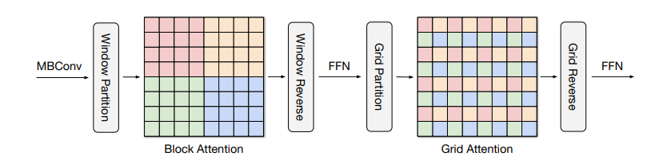

# Better ViTs

现在是 2023/06，所以 swin transformer 已经是两年前的工作了，之前看了论文觉得很复杂，没看懂，不喜欢，也没有去看代码进行深入理解🤣

时间来到了 swin 发布两年后，vit 发布三年后，有没有更好的结构诞生。结论是：有超越 Swin 的更强的 backbone 诞生，但是 vit 仍然是你大爷 

这一篇笔记的目的是想要对 vision transformer 做一个代表性的整理，因为 ViT 有很多变体，咱们当然只看效果最好的那几个，并掌握其精髓，入选的模型如下：

1. MaxViT
2. Hiera
3. EVA

本来还入选了一个 DAT 的，希望用其来替换 Deformable DETR 中的 attention 机制，但后面发现这二者解决的不是一件事情。DAT 更偏向于 backbone 上的应用，而 Deformable DETR 更偏向于 decoder 中对于 query 的处理

现在看到了 RT-DETR 也没有在 encoder 阶段使用 deformable attn 而只在 decoder 中使用了，效果一样的嘎嘎好，ViTDet 也说明了用 ViT 作为 backbone 也能行，另一个现象是 EVA 中使用的是 Cascade-RCNN 模型，仍然可以 SOTA，这说明了即使是17年的检测模型结构依然是非常强势的，之后的核心竞争力来源于 **backbone** 和 **训练方法**

实现参考来自于项目：[vit-pytorch](https://github.com/lucidrains/vit-pytorch/tree/main#maxvit) & [EVA]()

## MaxViT

问题1：ViT 未经过大规模的预训练，不好用。这个问题在 Swin 已经得到了解决，就是加入 inductive bias，本质上仍然回到了移动窗口

问题2：ViT 中使用的注意力机制是平方增长的，限制了其在视觉领域的应用。这个问题也在 Swin 中得到了部分解决，依然是移动窗口立大功

问题3：移动窗口缺少了一定的灵活性，对更大的数据集表现可能仍然逊色于 vanilla ViT

MaxViT 在我看来就是用于解决问题三的，使用 grid attention + window attention 的结合

### 方法

其实看下面的图就一目了然了，一个 MaxViT Block 就是由下面的流程构成。MBConv 可被看作 conditional position encoding，这样就不用显式加入位置嵌入了



整个分类器的结构图


### 消融

TODO

### 代码

这里我只对 window attention 的实现感兴趣，lucidrians 给了非常简洁的实现，而只要稍微排列一下输入就能够完成 grid attention

同时该 attention 也实现了 relative bias
$$
\text{RelAttention}(Q,K,V)=\text{softmax}(QK^T/\sqrt{d}+B)V
$$
只能说！优雅！太优雅了！

```python
class Attention(nn.Module):
    def __init__(
        self,
        dim,
        dim_head = 32,
        dropout = 0.,
        window_size = 7
    ):
        super().__init__()
        assert (dim % dim_head) == 0, 'dimension should be divisible by dimension per head'

        self.heads = dim // dim_head
        self.scale = dim_head ** -0.5

        self.to_qkv = nn.Linear(dim, dim * 3, bias = False)

        self.attend = nn.Sequential(
            nn.Softmax(dim = -1),
            nn.Dropout(dropout)
        )

        self.to_out = nn.Sequential(
            nn.Linear(dim, dim, bias = False),
            nn.Dropout(dropout)
        )

        # relative positional bias

        self.rel_pos_bias = nn.Embedding((2 * window_size - 1) ** 2, self.heads)

        pos = torch.arange(window_size)
        grid = torch.stack(torch.meshgrid(pos, pos, indexing = 'ij'))
        grid = rearrange(grid, 'c i j -> (i j) c')
        rel_pos = rearrange(grid, 'i ... -> i 1 ...') - rearrange(grid, 'j ... -> 1 j ...')
        rel_pos += window_size - 1
        rel_pos_indices = (rel_pos * torch.tensor([2 * window_size - 1, 1])).sum(dim = -1)

        self.register_buffer('rel_pos_indices', rel_pos_indices, persistent = True)

    def forward(self, x):
        batch, height, width, window_height, window_width, _, device, h = *x.shape, x.device, self.heads

        # flatten

        x = rearrange(x, 'b x y w1 w2 d -> (b x y) (w1 w2) d')

        # project for queries, keys, values

        q, k, v = self.to_qkv(x).chunk(3, dim = -1)

        # split heads

        q, k, v = map(lambda t: rearrange(t, 'b n (h d ) -> b h n d', h = h), (q, k, v))

        # scale

        q = q * self.scale

        # sim

        sim = einsum('b h i d, b h j d -> b h i j', q, k)

        # add positional bias

        bias = self.rel_pos_bias(self.rel_pos_indices)
        sim = sim + rearrange(bias, 'i j h -> h i j')

        # attention

        attn = self.attend(sim)

        # aggregate

        out = einsum('b h i j, b h j d -> b h i d', attn, v)

        # merge heads

        out = rearrange(out, 'b h (w1 w2) d -> b w1 w2 (h d)', w1 = window_height, w2 = window_width)

        # combine heads out

        out = self.to_out(out)
        return rearrange(out, '(b x y) ... -> b x y ...', x = height, y = width)
```

而改变输入成为 grid patch 也非常简单，即使用 einops 中的 `Rearrange` 即可，但我认为他的注释错误，这样的方法应该先做的 grid-like attention，然后才是 block-like attention，不过我感觉就算交换位置也无妨

```python
block = nn.Sequential(
    MBConv(
        stage_dim_in,
        layer_dim,
        downsample = is_first,
        expansion_rate = mbconv_expansion_rate,
        shrinkage_rate = mbconv_shrinkage_rate,
    ),
    Rearrange('b d (x w1) (y w2) -> b x y w1 w2 d', w1 = w, w2 = w),  # block-like attention
    PreNormResidual(layer_dim, Attention(dim = layer_dim, dim_head = dim_head, dropout = dropout, window_size = w)),
    PreNormResidual(layer_dim, FeedForward(dim = layer_dim, dropout = dropout)),
    Rearrange('b x y w1 w2 d -> b d (x w1) (y w2)'),

    Rearrange('b d (w1 x) (w2 y) -> b x y w1 w2 d', w1 = w, w2 = w),  # grid-like attention
    PreNormResidual(layer_dim, Attention(dim = layer_dim, dim_head = dim_head, dropout = dropout, window_size = w)),
    PreNormResidual(layer_dim, FeedForward(dim = layer_dim, dropout = dropout)),
    Rearrange('b x y w1 w2 d -> b d (w1 x) (w2 y)'),
)
```

## Hiera

