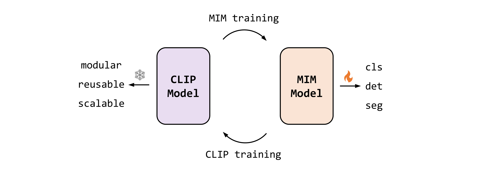
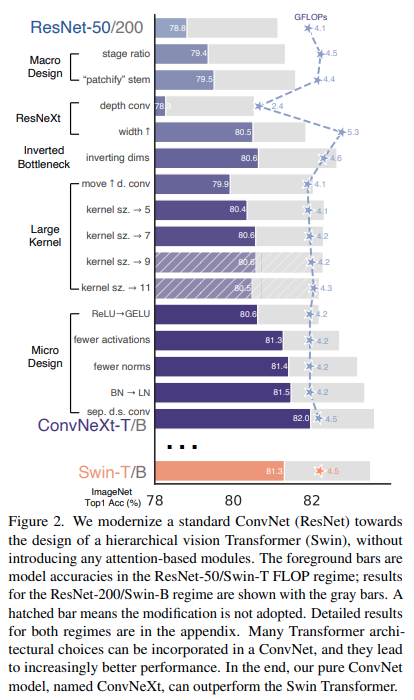
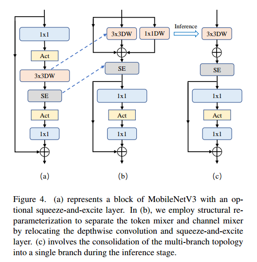
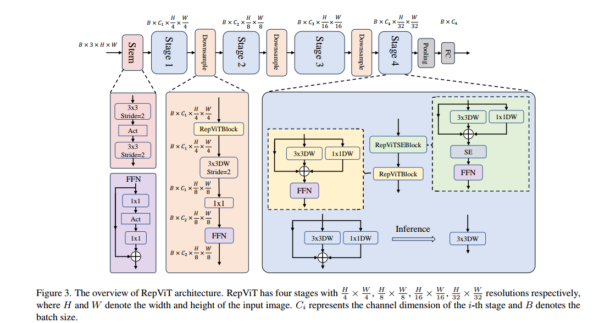
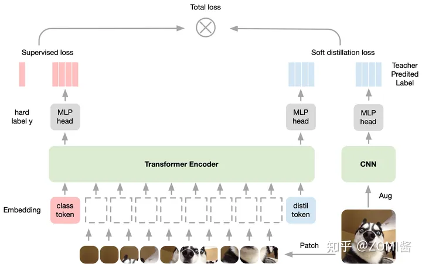

# Better ViTs

现在是 2023/06，所以 swin transformer 已经是两年前的工作了，之前看了论文觉得很复杂，没看懂，不喜欢，也没有去看代码进行深入理解🤣

时间来到了 swin 发布两年后，vit 发布三年后，有没有更好的结构诞生。结论是：有超越 Swin 的更强的 backbone 诞生，但是 vit 仍然是你大爷 

这一篇笔记的目的是想要对 vision transformer 做一个代表性的整理，因为 ViT 有很多变体，咱们当然只看效果最好的那几个，并掌握其精髓，入选的模型如下：

1. MaxViT
2. Hiera
3. EVA

本来还入选了一个 DAT 的，希望用其来替换 Deformable DETR 中的 attention 机制，但后面发现这二者解决的不是一件事情。DAT 更偏向于 backbone 上的应用，而 Deformable DETR 更偏向于 decoder 中对于 query 的处理

现在看到了 RT-DETR 也没有在 encoder 阶段使用 deformable attn 而只在 decoder 中使用了，效果一样的嘎嘎好，ViTDet 也说明了用 ViT 作为 backbone 也能行，另一个现象是 EVA 中使用的是 Cascade-RCNN 模型，仍然可以 SOTA，这说明了即使是17年的检测模型结构依然是非常强势的，之后的核心竞争力来源于 **backbone** 和 **训练方法**

实现参考来自于项目：[vit-pytorch](https://github.com/lucidrains/vit-pytorch/tree/main#maxvit) & [EVA]()

## MaxViT

问题1：ViT 未经过大规模的预训练，不好用。这个问题在 Swin 已经得到了解决，就是加入 inductive bias，本质上仍然回到了移动窗口

问题2：ViT 中使用的注意力机制是平方增长的，限制了其在视觉领域的应用。这个问题也在 Swin 中得到了部分解决，依然是移动窗口立大功

问题3：移动窗口缺少了一定的灵活性，对更大的数据集表现可能仍然逊色于 vanilla ViT

MaxViT 在我看来就是用于解决问题三的，使用 grid attention + window attention 的结合

### 方法

其实看下面的图就一目了然了，一个 MaxViT Block 就是由下面的流程构成。MBConv 可被看作 conditional position encoding，这样就不用显式加入位置嵌入了


整个分类器的结构图


### 消融

TODO

### 代码

这里我只对 window attention 的实现感兴趣，lucidrians 给了非常简洁的实现，而只要稍微排列一下输入就能够完成 grid attention

同时该 attention 也实现了 relative bias
$$
\text{RelAttention}(Q,K,V)=\text{softmax}(QK^T/\sqrt{d}+B)V
$$
只能说！优雅！太优雅了！

```python
class Attention(nn.Module):
    def __init__(
        self,
        dim,
        dim_head = 32,
        dropout = 0.,
        window_size = 7
    ):
        super().__init__()
        assert (dim % dim_head) == 0, 'dimension should be divisible by dimension per head'

        self.heads = dim // dim_head
        self.scale = dim_head ** -0.5

        self.to_qkv = nn.Linear(dim, dim * 3, bias = False)

        self.attend = nn.Sequential(
            nn.Softmax(dim = -1),
            nn.Dropout(dropout)
        )

        self.to_out = nn.Sequential(
            nn.Linear(dim, dim, bias = False),
            nn.Dropout(dropout)
        )

        # relative positional bias

        self.rel_pos_bias = nn.Embedding((2 * window_size - 1) ** 2, self.heads)

        pos = torch.arange(window_size)
        grid = torch.stack(torch.meshgrid(pos, pos, indexing = 'ij'))
        grid = rearrange(grid, 'c i j -> (i j) c')
        rel_pos = rearrange(grid, 'i ... -> i 1 ...') - rearrange(grid, 'j ... -> 1 j ...')
        rel_pos += window_size - 1
        rel_pos_indices = (rel_pos * torch.tensor([2 * window_size - 1, 1])).sum(dim = -1)

        self.register_buffer('rel_pos_indices', rel_pos_indices, persistent = True)

    def forward(self, x):
        batch, height, width, window_height, window_width, _, device, h = *x.shape, x.device, self.heads

        # flatten

        x = rearrange(x, 'b x y w1 w2 d -> (b x y) (w1 w2) d')

        # project for queries, keys, values

        q, k, v = self.to_qkv(x).chunk(3, dim = -1)

        # split heads

        q, k, v = map(lambda t: rearrange(t, 'b n (h d ) -> b h n d', h = h), (q, k, v))

        # scale

        q = q * self.scale

        # sim

        sim = einsum('b h i d, b h j d -> b h i j', q, k)

        # add positional bias

        bias = self.rel_pos_bias(self.rel_pos_indices)
        sim = sim + rearrange(bias, 'i j h -> h i j')

        # attention

        attn = self.attend(sim)

        # aggregate

        out = einsum('b h i j, b h j d -> b h i d', attn, v)

        # merge heads

        out = rearrange(out, 'b h (w1 w2) d -> b w1 w2 (h d)', w1 = window_height, w2 = window_width)

        # combine heads out

        out = self.to_out(out)
        return rearrange(out, '(b x y) ... -> b x y ...', x = height, y = width)
```

而改变输入成为 grid patch 也非常简单，即使用 einops 中的 `Rearrange` 即可，但我认为他的注释错误，这样的方法应该先做的 grid-like attention，然后才是 block-like attention，不过我感觉就算交换位置也无妨

```python
block = nn.Sequential(
    MBConv(
        stage_dim_in,
        layer_dim,
        downsample = is_first,
        expansion_rate = mbconv_expansion_rate,
        shrinkage_rate = mbconv_shrinkage_rate,
    ),
    Rearrange('b d (x w1) (y w2) -> b x y w1 w2 d', w1 = w, w2 = w),  # block-like attention
    PreNormResidual(layer_dim, Attention(dim = layer_dim, dim_head = dim_head, dropout = dropout, window_size = w)),
    PreNormResidual(layer_dim, FeedForward(dim = layer_dim, dropout = dropout)),
    Rearrange('b x y w1 w2 d -> b d (x w1) (y w2)'),

    Rearrange('b d (w1 x) (w2 y) -> b x y w1 w2 d', w1 = w, w2 = w),  # grid-like attention
    PreNormResidual(layer_dim, Attention(dim = layer_dim, dim_head = dim_head, dropout = dropout, window_size = w)),
    PreNormResidual(layer_dim, FeedForward(dim = layer_dim, dropout = dropout)),
    Rearrange('b x y w1 w2 d -> b d (w1 x) (w2 y)'),
)
```

### Question

- MBConv 所使用的必要性？

## EVA

### Layout

1. 问题

   将了下 MIM 存在的挑战：low-level geometry & high-level semantics 之间的关系建模

   目前有两个 debate

   1. tokenized semantic features 能否比 masked images 产生更好的监督信号
   2. 能否使用 distillation 来获得好的表现，不使用 masked prediction 

2. 把各个视觉的 SOTA 刷了个遍

3. 泛化性极强，对于 1200 类  LVISv1.0 和 80 类的 COCO 都表现很好。LVIS 和 COCO 使用的图像数据几乎一样。论文猜测 swin v2 beit-3 也会有类似的效果，因为数据和模型都大。

4. 训练 CLIP 更加稳定。原始 clip 必须使用 bfloat 16（训练不稳定），并且训练效率 efficiency 低。论文使用 EVA 来初始化 CLIP 的 vision encoder，直接用 fp16 的 AMP 就能训了。

   但是这里有一个问题，EVA 本来就是用 CLIP 训的，再拿去训 CLIP 不是作弊吗？关键点在于此：EVA 的参数有 1000M，而训练 EVA 的 CLIP 参数只有 400M，而再用 EVA 去初始化一个更大的 1000M 的 CLIP，就能稳定训练了。有种循序渐进的感觉

5. 两个实验结果，用于验证之前的 debate：

   1. tokenization 是不必要的
   2. distillation 在增加训练 epoch 后无法获得更好的效果，反之直接回归图像特征效果好

   这两个结论催生出 EVA 的训练策略：

   simply reconstructing the masked out CLIP vision features conditioned on visible image patches

6. 论文不是首先提出 MIM image-text aligned 的，但是是规模最大的，证明了不需要 semantic tokenization & explicitly image-text pair data

7. 实际上对齐的就是 CLIP 特征，CLIP 使用的是 400 million image-text dataset 训练出来的

8. 数据集使用的公开联合数据集，29.6 million

9. 现在 imagenet-21K 微调，然后再 imagenet-1K 微调，微调花费的时间是 MIM 的 1/5，相比 swin V2 的微调时间反而是 MIM 的 1.5 倍 

10. 在分类时采用的是 vision-style 方法，只用一个 Linear 进行分类，而不是像 CLIP 一样要使用 text encoder

11. 吐槽 DINO，EVA 不用 DETR 结构，就用 R-CNN 框架，就能达到好的效果，并且 DINO 还不能做实例分割

- Efficient scale up ViT
- achieves SOTA on 1000 categories
- reconstrunct the masked out image-text aligned vision features

### Question

- 什么是 additional tokenization？
- using efficient video hierachical vit to train

## EVA-02

### Layout



- 想要把 EVA 改得更小一点，并提供各种尺寸的模型。还要改进一下 pre-train 方法

- 原始 ViT 的设计没有太多 inductive bias，所以有更强的表示能力，并且天然适合于 MIM 任务

  经过一些简单的改变过后，也能处理高分辨率和多尺度任务

- 经过一些 trick 实验，在 IN-1K 上进行 Pre-train 和 fine-tune 提出了改进的 ViT，并称之为 TrV (Transform Vision)

  1. 激活函数用 SwiGLU/SiLU + xnorm
  2. positional embedding 用 RoPE
  3. 在 FFN 中用 sub-LN

  Pre-train 用的是 EVA-CLIP

  比原 ViT 提了 1.6 个点

- 再研究了不同大小的 CLIP 来作为 MIM target 的效果。EVA-CLIP 教 ViT-B 反而把 ViT 给教坏了，论文认为是因为训练时间不够，ViT 没有学到

- EVA-02：TrV with sufficient MIM pretraining from EVA-CLIP

- EVA-02 即使模型很小，也能够达到精心设计的小模型的速度，这说明了 MIM 能够克服 inductive bias 问题

- 左脚踩右脚，再训一个 EVA-02-CLIP 又刷 SOTA。

### Question

- RoPE 的表示形式？
- 目前 MIM 和 CLIP 形成了完整的闭环，但是这个环是否还能有第三方加入？例如 language 的语义训练提升？又例如视频的语义学习？Reinforcement Learning with EM Algorithm
- 如果继续提升 EVA-02 的尺寸，会不会还能提升？

## ConvNext

### Concept

- Stem

  >  Typically, the stem cell design is concerned with how the input images will be processed at the network’s beginning.
  >
  > A common stem cell will aggressively downsample the input images to an appropriate feature map size in both standard ConvNets and vision Transformers. The stem cell in standard ResNet contains a 7×7 convolution layer with stride 2, followed by a max pool, which results in a 4× downsampling of the input images. In vision ransformers, a more aggressive “patchify” strategy is used as the stem cell, which corresponds to a large kernel size (e.g. kernel size = 14 or 16) and non-overlapping convolution

### Layout

全面模仿 Swin Transformer

1. Macro design

   - 更改堆叠块比例，从 3:4:6:3 变为 1:1:3:1
   - 最初的下采样模块 stem 从 7x7 + 3x3 一步改为 4x4 stride 4

2. ResNeXt

   - depth wise conv + bigger channels，单独使用 depth wise conv 是会变差的。使用 depth wise 是想对标大的感受野

3. Inverted bottleneck

   - 两头细中间粗

4. Large Kernel size

   - 将卷积顺序改变，把 depth wise 提前

     原始：1x1 -> depth wise -> 1x1

     更改：depth wise -> 1x1 (96 to 384)-> 1x1 (384 to 96)

     这是为了对标 transformer 的 attention + FFN

   - 更改 depth wise 卷积核大小增加，从 3x3 改到 7x7

5. Various layer-wise micro designs

   - ReLU 改为 SiLU，并降低激活层的数量
   - 更少的 normalization 层
   - 将 BN 改为 LN
   - 使用单独的下采样层 conv stride 2



- ConvNext V2

  使用 MAE + ConvNext，并提出了一个  Global Response Normalization (GRN) layer

  论文中 MAE 叫做 FCMAE（Fully Convolutional MAE）。为了适配 MAE 需要采用 sparse convolution 才能享受 MAE 的计算节省

## RepViT

### Layout

- 最近轻量级的 ViT 表现强势，作者想把这些结构往 CNN 上用。简单来说就是用 MobileNet V3 + light weight ViT architectures。有点像 ConvNext 的写作风格，就是一个一个 trick 的测试
- 是目前最快的方案，在 iphone 12 上只要 0.87 ms，实际上 MobileNet V3 也只要 1.01 ms
- 通常的方案：hybrid，改 attention 计算为线性复杂度，dimension-consistent design
- training recipe 使用更现代的方式，改了一下 mobile vit 的激活层，然后 MobileNet 就掉点了，但只为了建立基线，所以无所谓 

- 和 ConvNext 一样对每一个 block 进行重新排列，使得其按照 transformer block 的方式能够进行 token mix 和 channel mix，直接这样改回导致迅速掉点，但是增大 channel 就能涨回来，同时减少了 expansion ratio 以减少不必要的计算

  同时使用 Re-parameterization 对 DW Conv 进行整合，这样在推理的时候节省时间

  

- 对于输入的降采样（stem）使用了两个卷积，为什么不和 ConvNext 一样采用 4 kernel size 的卷积一步到位？可能是因为时间问题，做 3x3 卷积优化更好

- 收到 patch merging & EfficientViT 启发，使用更深的 downsampling layer，此时会增加耗时

- 使用简单的 classifier 以替代原来 MobileNet V3-L 的两层 classifier，加速但降精度

- 调整 stage ratio 为 1:1:7:1，并且一个 stage 基础 block 数调整为 2，耗时但是增加精度

- 把 MobileNet-V3 中的 kernel size 5x5 的换成 3x3 的，但精度没变，同时 3x3 对 mobile device 更友好

- SE layer 能够弥补卷积的注意力机制，但是相当耗时，论文对所有 stage 都使用，但是只在 stage 的一个 block 用



- we develope multiple RepViT variants, including RepViT-M0.9/M1.0/M1.1/M1.5/M2.3. The suffix ”-MX” means that the latency of the model is Xms.

### Question

- 又回到了这个问题：什么样的算子是可以融合的？这里简单的 DW 分支可以融合，Conv + BN + ReLU 也可以融合
- Depth wise convolution 到底是快还是慢？

## EfficientViT-MIT

### Layout

- 使用 Linear Attention + Depthwise conv 来获得全局 + local 的信息，单独的 Linear Attention 多半不会好用

### Question

- 有没有更好的 Linear Attention 比 ReLU attention 更强，但同样获得信息
- 针对这些模型的 micro & macro designs 提炼出共同特点，看看它们之间有没有矛盾的地方
- 似乎这个模型 timm 甚至像要把其剔除了...

## EfficientViT-MSRA

### Layout

- Attention 的 Memory bound 需要解决，论文使用 sandwich layout 来解决，即减少 attention 模块的计算比例，在前后增加 DW+FFN，channel 数量应该也有相应调整。
- Attention 可能学习重复的 linear projection，论文使用 cascade group attention 解决

### Question

- Multi-head attention 本来就是将原来的 input 分开为多个 head，这里的 group 又有什么意义呢？并且 cascade 会导致模型无法并行🤔

## FastViT

### Layout

- 使用 RepMixer 来减少推理用时，RepMixer 对标的是 Attention（Apple 真的很喜欢 Rep 技术），同时 FNN 还使用了 big kernel depthwise conv 来增强全局视野
- 把所有的 conv 使用 depthwise conv + 1x1 conv 替代，主要在 stem 和 patch embedding 中使用

### Question

- 结构设计不好总结出规律...可以和 RepViT 进行细致对比，我感觉二者几乎等效
- 怎样将 Transformer 的 MIM 训练方式和卷积结合起来，或者针对 transformer-based 进行加速？

## DeiT

### Concept

- hard distillation & soft distillation

  假设有两个预测结果 teacher & student，二者都是一个长为 n 的向量，对应 n 个分类。那么 soft distillation 就是求两个向量的 KL 散度，而 hard distillation 就是把 teacher 的预测结果（argmax）作为目标，求 student 与目标间的交叉熵

### Layout

- ViT 使用了大量的图像和 GPU 进行训练，DeiT 只用了 ImageNet only 的图像，并且不用 Convolution。训练方式是使用 teacher-student distillation on token

  训练设备是一个8卡机，训练时间大约2~3天

- 使用 Convnet 作为教师网络能够比使用 Transformer 架构效果更好，但论文没有给出使用 tansformer teacher 的实验结果

  并且蒸馏出来的网络比 teacher 网络更好，这非常神奇。论文推测可能是学习了 inductive bias

- 蒸馏使用的是 hard distillation，比 soft 效果更好

- 这个 [zhihu](https://zhuanlan.zhihu.com/p/543730203) image 基本上就把 DeiT 的过程写清楚了

  

### Question

- 不同的模型可能擅长捕捉不同的模式？inductive bias 可以通过蒸馏传入，那么还有没其他方式更快地传入？
- 为什么 soft distillation 比 hard 弱这么多？
