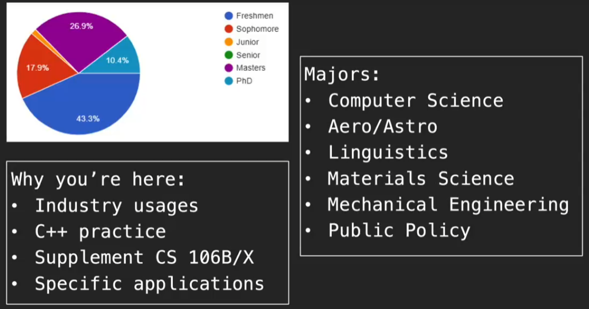

# CS 106L 03

## Survey results

- 震惊！这门课的成分太高了！PhD 有 40% 多😂

  

## Overview of STL

- **"As mathematicians learned to lift theorems into their most general setting, so I wanted to lift algorithms and data structures."**
  																					——Alex Stepanoy,inventor of the STL

  "Another benefit of striving for **efficiency** is that the process forces you to **understand the problem in more depth**."

  ​																					——also Alex Stepanoy

- overview graph

  

## Sequence Containers

- **Provides access to sequences of elements**

  - `std::vector<T>`
  - `std::deque<T>`
  - `std::list<T>`
  - `std::array<T>`
  - `std::forward_list<T>`

  课程只介绍前两个，后面几个请自查

- `std::vector<T>`

  A vector represents **a sequence of elements of any type**

  you specify the type when using the vector

  ```c++
  std::vector<int> vecInt;
  std::vector<myStruct> vecStruct;
  std::vector<std::vector<string>> vecOfVec;
  ```

  highlight use:

  1. add k to the end of the vector: `v.push_back(k)`
  2. get the element at index i: `v.at(i) or v[i]`
  3. replace the element at index i: `v.at(i) = k or v[i] = k`

- why doesn't `std::vector` bounds check by default?

  By the philosophy of C++: if you write your program correctly, bounds checking will just slow your code down.

  ```c++
  vector<int> vecInt;
  vecInt.push_back(1);
  vecInt[2]; // this won't give an error!! causes undefined behavior
  vecInt.at(2) // throws an exception
  ```

- 为了让 `push_front` 很快，C++ stl 使用了 `std::deque` 也就是 double ended queue 双端队列，CS106B 会更多地介绍这个数据结构，有时候还会出现在考试里🤣

  但是 `deque` 没有 `vector` 在 access element  快

- Takeaway: vector as default, deque if neccessary
- **Also, the next class is the most important class!!!**

## Associative Containers & Iterators

- CS106B 已经 half empty😆看来国内外都一样

## Container Adaptors

- stack & queue 就是在 vector 和 deque 上构建的，其实就是 vector or deque 限制了一些功能

- stacks and queues are known as container adaptors

- Why not just use a vector/deque

  仍然是根据 C++ philosophy

  - Epxress ideas and intent directly in code
  - Compartmentalize messy constructs

## Assignment 1

- 简单介绍了下 assignment 1，不要用 stanford library
- 代码量不会很大
- 有一个 CourseReader，大概有 500 多 pages，非常全面的课程笔记。有空可以补充下课程里没有介绍的内容

## Associative Containers

- data is accessed using key instead of indexes (map)

  - `std::map<T1, T2>`
  - `std::set<T>`
  - `std::unordered_map<T1, T2>`
  - `std::unordered_set<T>`

  ordered: based on ordering property of keys, keys need to be comparable (看来不是先后顺序)

  unordered: based on hash function

  map/set: faster to iterate, based on red-black-tree

  unordered map/set: faster to access individual elements, based on hash table

## Iterators

- How do we iterate over associate containers?

  say NO to `for (int i = num; i < num; i++)`

  C++ has a solution! Iterator!

- **Iterators allow iteration over any container**

  we can get an iterator pointing to the "start" of the sequence by calling `mySet.begin()`

- type of iterator depends on the type you use

  ```c++
  set<int>::interator iter = mySet.begin();
  ```

- dereference

  We can get the value of an iterator by using the dereference * operator

- we can check if we have hit the end by comparing to `mySet.end()`

  ```c++
  if (iter == mySet.end()) return;
  ```

- 学生提问：iterator 不是指针？

  iterator 和指针很像，用了 4 个指针来实现，但助教也不明白细微区别

  学生提问：为什么使用 `++iter` 而不是 `iter++`

  prefix versus postfix operator

  `++iter` means increment before using the iterator

  `iter++` means use the iterator before increment

  区别仅存在于当 `++iter or iter++` 作为右值时，前者 + 1 后者不 + 1

  ```c++
  a = ++iter;
  ```

- 使用 iterator 的两种方法

  ```c++
  while (iter != container.end(){
      ...
      iter++;
  })
      
  for (iter = container.begin(); iter != container.end(); iter++){
      ...
  }
  ```

- 之前有用过更好用的循环方式

  ```c++
  for (auto& [key, value] : m){
      cout << key << " " << value << endl;
  }
  ```

  这样更加 python

## Map Iterators

- 助教的 vscode 放了 `word2vec.py`，他也是 deep learning guy!!!

- 再提了一下 `pair`

  a pair is simply two objects bundled together

  ```c++
  std::pair<string, int> p;
  p.first = "xxx";
  p.second = 1;
  ```

  a quicker way to make a pair

  ```c++
  std::make_pair("xxx", 1)
  ```

  this is great place to use auto

  ```c++
  auto time = std::make_pair(1, 45)
  ```

- Map iterators are slightly different, because we have both keys and values!  这也是为什么要再提一下 pair

  dereference a map `map<string, int>`gives you a `std::pair<string, int>`

  ```c++
  map<int, int>::iterator i;
  cout << i->first;
  cout << (*i).first;
  ```

  这里提到了一个 range-based for loop，是 C++11 的一个新特性

  ```c++
  for(auto x: container){
      // codebase
  }
  ```

  使用 for 的方法简单了很多，可读性也更好

  甚至于使用 structured key val inside

  ```c++
  for(auto [key, val]: map){
      // codebase
  }
  ```

- 这里又提了一下 parameter passing

  在传入一个大的数据结构，例如一个数组，你永远想要使用 reference，并且你不更改其中的值，所以要使用 const。这样是为什么 `const Type& ` 的参数形式会非常常见

- 接下来举两个例子：sort element & find element

  ```c++
  // sorting a vector
  vector<int> vec{3,2,1,7,8};
  
  std::sort(vec.begin(), vec.end()); // might use custom function to compare
  // you can sort part of them
  std::sort(vec.begin(), vec.begin() + 1);
  
  printVec(vec);
  
  // finding an element
  set<int> elems{3,2,1,7,8};
  // you can use count
  elems.count(5);
  // you can also use find
  auto result_iter = std::find(elems.begin(), elems.end(), 5)
      
  if result_iter == elems.end(){
      cout << "Not Found" <<endl;
  }
  else{
      cout << "Found:" << *result_iter << endl;
  }
  ```

  `find` is slightly faster than `count`

  在这里例子里又介绍了两个小方法 `lower_bound & upper_bound` 

  ```c++
  set<int>::iterator iter = elems.lower_bound(4) // find smallest element >= key
      
  set<int>::iterator end = elems.upper_bound(6) // find smallest elemetn > key
      
  // print element between them
      
  for (; iter != end; ++iter){
      cout << *iter << " ";
  }
  ```

  iterator 会根据 key 的顺序自动排序

- Ranges

  we can iterate through different ranges

  

- 正式提出 range based `for` Loop, a shorthand 

  ```c++
  map<string, int> m;
  for(auto thing: m){
      // codebase
  }
  
  // equals
  
  for(auto iter=m.begin(); iter != m.end(); ++iter){
      auto thing = *iter;
      // codebase
  }
  ```

## Quick review of structs

- 由于去年很多同学在做作业的时候都被 struct 语法难到了，所以打算快速讲一下 struct

  ```c++
  // Declaring the struct definition
  struct Object{
   	type varl;
  	type var2;  
  }
  
  // Initializing a struct object using uniform initialization
  struct Object objName{value1, value2}
  // Operating on the struct object in this case,assigning a value
  objName.var1 = newvalue1;
  ```

  在 C++ 中 always use `struct` before the struct type when use initalize a new struct object

  以作业中的例子来讲解

  ```c++
  // How do you add a node to the graph
  
  struct SimpleGraph{
      vector<Node> nodes;
      vector<Edge> edges;
  }
  
  struct Node{
      double x;
      double y;
  }
  
  struct SimpleGraph graph{};
  
  graph.nodes.push_back({someXValue, someYValue}); // automatically creates Node object + adds to vector
  ```

- 在进行 Iterator  操作时会有一些注意点

  使用 linked list `std::list` 时不能使用 `iter + 3` 这种操作，因为链表不能跳过中间元素

- Iterator Types

  

  left arrow means it is a superset of previous type

  1. input

     read only, i.e. can only be dereferenced on the right side of expression

     ```c++
     int val = *iter;
     ```

     Use cases: `find & count`; input streams

  2. output

     write only, i.e. can only be dereferenced on the left side of expression

     ```c++
     *iter = 12;
     ```

     Use cases: copy; output streams

  3. forward

     combine input & ouput, + can make multiple passes

     这里的 multiple passes 讲解得不是很清晰，助教没办法解释清楚...所以需要下来再查看下，但是也提到如果不理解也没关系，完全不影响

     助教的理解：multiple passes means, you can create multiple iterators to point to the same position, when you ++ for each of them , their position would also align. But this behavior is not guaranteed in input or output iterator

     助教提到 inheritence 会比较 tricky 似乎不会在课上讲...会提供额外材料

  4. bidirectional

     forward iterator, + can go backwards with decrement --

  5. random access

     can be increment or decrement by arbitrary amounts using + and -

  最后在提了一下 iterator 和 pointer 的区别，大意：

  - **Iterator**: 是一种抽象的概念，它提供了一种访问容器元素的方法，而不必暴露容器的内部实现细节。

  - **Pointer**: 是一种具体的数据类型，它存储了另一个对象的内存地址。指针允许直接访问和操作内存中的数据。

  个人理解：iterator 提供了一个 pointer-like abstraction (interface)，让大家更安全访问数据
