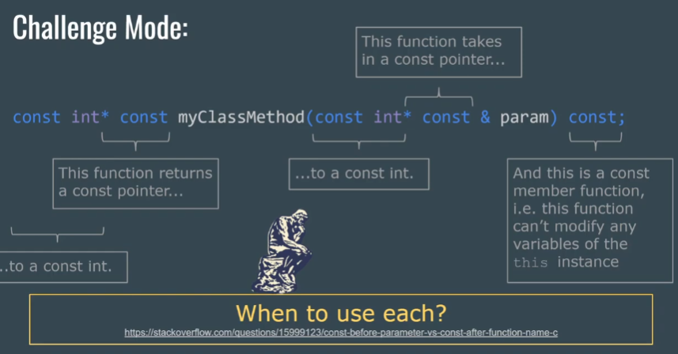

# CS106L 08

## Review

- 助教给了一个网址链接 [link](https://en.cppreference.com/w/cpp/language/operators)，可以参考如何 overload operator

- Bettr explaination for: why learn about move? ep15, 5:00

  avoid to use extra memory where you don't have to. It is encouraged to implement move assignment / constructors in your own classes!

- quick review on `const`, what does these 5 `const` means ? 9:30

  ```c++
  cosnt int* const myClassMethod(const int* const & param) const;
  ```

  

  there is no `Type &*`, because you are referencing to what the pointer is pointing to, however the object the pointer is pointing to, is changable. so the reference is pretty confusing, it does not know, which object I am trying to reference. That is why we say reference is like a dereferenced const pointer.

## Namespaces

- there was a lot of `::` like `std::` and `StringVector::` in our code 15:50

  ```c++
  using std::cout;
  StringVector::StringVector():...
  ```

  `::` is scope resolution operator, is how we identify what function we are working with

- why would we have namespace?  17:03

  it is easy to have conflict name in libraries like `max, count, string` ... we should use namespace to differenciate them

  what happen when there is a conflict?

  ```c++
  #include <algorithm>
  #include <vector>
  using namespace std;
  
  // define your own namespace
  namespace Lecture {
      int count (const vector<int>& v) {
          ...
      }
  }
  
  int main() {
      int count = 0;
      vector<int> v{3, 1};
      // std also have a count function
      // you are trying to use this function
      count(v.begin(), v.end(), 1); // would raise error! local `count` comes first
      std:: count(v.begin(), v.end(), 1); // have to specify the namespace!
      Lecture::count // use your own namespace function
  }
  ```

  所以说不推荐使用 `using namespace xxx`，因为很容易引起歧义

  in python we also have something like `from xxx import *` 22:13，这和 `using namespace xxx` 有异曲同工之妙，因为你不知道到底 import 了哪些东西进来

  so you have to `include` the header file, and specify which name space you want to use! 26:00

- why do we need to write `StringVector::` in front of all of our member functions? 30:30

  so the compiler knows which class you're trying to defining a function for

## Inheritance

- Warning: this is a quick overview of inheritence. We will cover C++-specific details of inheritence, but won't spending time on how to use it, take CS 108 to learn more!

- One example to bring out why we use inheritence 35:00

  ```c++
  void print(ifstream &stream, int i) {
      ...
  }
  
  void print(istringstream &stream, int i){
      ...
  }
  ```

  当我们希望实现上面两种不同的 `print` 我们希望使用一个函数来表达。之前我们的方法是写模板

  ```c++
  template <typename StreamType>
  void print(StreamType &stream, int i)
  ```

  this works because templates use the concept of **implicit interface**，也就是说 模板 会假设这个类有哪些功能，如果没有这些功能的话，模板在运行的时候就会报错

  Note there isn't a list of what functions are requried!

  但是在 C++20 过后我们就可以要求这些 模板类 有哪些功能/operator

- If there is an implicit interface, there must be an explicit one. Usually just called an **interface, the simplest form of inheritence** 37:09

  下面是 Java 的 interface 使用 C++ inheritence 完成

  

  其中 `make() = 0` 代表这是一个 pure virtual function, means that the inheriting class must define this function

  There is no interface keyword in C++

  - to be an interface,  a class must consist only of pure virtual functions

    what if there are some other non-pure virtual functions? then this class is called abstract class

    If a class have at least one pure virtual function, then it's called an abstract class (interfaces are a subsets of abstract classes)

    **Abstract classes cannot be instantiated!!!**

  - To implement an interface, a class must define all of those virtual functions

  这里有学生提问：你这里的 interface 并不能解决你之前提出的问题呀？助教：确实是🤣

- Solution of inheritence

  as long as istream implements **print (as a non-virtual function)**, and all types of streams inherit from istream, you only need to write one function

- Inherit members 45:53

  No "virtual" members. if a member has the same name as inherited member, it hides it

  ```c++
  struct A {
      int a;
  }
  
  struct B: public A {
      double a; // Hides A::a
  }
  ```

- Always calls the superclass constructor. ep 16

  If not specified, called the default constructor of Base

  ```c++
  class Derived : public Base {
      Derived(): Base(args), /*others*/ {
          //
      }
  }
  ```

  If you intend to make your class inheritable, make your destructor virtual! Otherwise will almost definitely have memory leaks.

  ```c++
  virtual ~Base() {}
  
  Base *b = new Derived();
  delete b; // never calls the destructor for derived!
  ```

  Aside: whether or not the destructor is virtual is a good indication of whether a class is intended to be inherit from.

- Access specifiers 6:46

  - private

    Can only be accessed by `this` class

  - protected

    Can only be accessed by `this` class or `derived` classes

  - public

    Can be accessed by anyone

  normally you should define your classes in header files 12:50

- There is still a way to access  the parent class function, even it is a virtual one 18:00

  Just use the `::` scope resolution，类似于 python `super`

  ```c++
  // class Drink { virtual void make() {...}}
  // class Tea: Drink
  
  Tea t("red");
  t.make();
  t.Drink::make();
  ```

- Template vs Inherit

  When to use each? static vs dynamic polymorphism

  Prefer templates when:

  - Runtime efficiency is most important
  - No common base can be defined

  Prefer inherit when:

  - Compile-time efficiency is most important
  - want to hide implementations

- Casting 28:00

  Using `static_cast` is considered the best practice to cast type!

  ```c++
  int a = (int)b;
  int a = int(b);
  int a = static_cast<int>(b);
  ```

## Template Classes

- just put the template in front of class, `class` & `typename` are basically the same, just use typename would be enough, because typename has more use cases

  ```c++
  template <class T, typename Container = vector<T>>
  class Priority_Q{
  public：
      Priority_Q() = default;
      ~Priority_Q() = default;
      T top() const {...}
      void pop() {...}
      void push (T val) {...}
  private:
      vector<T> _heap;
      size_t _count{0};
  }
  
  Priority_Q<vector<string>> q;
  q.push({"Avery"});
  ```

  the `{"Avery"}` using the initializer list syntax to create a temporary object 40:00

  More examples of initializer list

  Example 1

  ```c++
  #include <vector>
  #include <iostream>
  
  int main() {
      std::vector<std::string> names = {"Alice", "Bob", "Charlie"};
      
      for (const auto& name : names) {
          std::cout << name << " ";
      }
      
      return 0;
  }
  ```

  Example 2

  ```c++
  #include <iostream>
  
  struct Point {
      double x, y;
  
      Point(double x, double y) : x(x), y(y) {}
  
      Point(std::initializer_list<double> list) {
          auto it = list.begin();
          x = *it++;
          y = *it;
      }
  
      void print() const {
          std::cout << "Point(" << x << ", " << y << ")" << std::endl;
      }
  };
  
  int main() {
      Point p1(10.0, 20.0);
      p1.print();
  
      Point p2{30.0, 40.0};  // Using brace-initialization
      p2.print();
      return 0;
  }
  ```

  Example 3

  ```c++
  #include <vector>
  #include <iostream>
  
  template<typename T>
  class MyContainer {
  public:
      // Constructor that takes an initializer list and two additional integer parameters
      MyContainer(std::initializer_list<T> init, int a, int b) : 
          items(init), extra_a(a), extra_b(b) {
          // Initialize the container with the initializer list
          // and store the additional parameters
      }
  
      void print() const {
          for (const auto& item : items) {
              std::cout << item << " ";
          }
          std::cout << "a: " << extra_a << ", b: " << extra_b << std::endl;
      }
  
  private:
      std::vector<T> items;
      int extra_a;
      int extra_b;
  };
  
  int main() {
      MyContainer<std::string> container({"Hello", "World"}, 1, 2);
      container.print();
  
      return 0;
  }
  ```

## Concept

- Concepts are named set of constraints 45:00

  a concept is a predicate, evaluated at compile-time, this is a part of the interface. only C++20 and above support this! not going to dive deep

## Question

- does template compiling a lot of types of codes for single template?

  Yes! There is a step called **Template Instantiation**, it will generate specific type codes at compile time, so you can use it.

  - When the compiler encounters a template instantiation, it generates a new version of the template code for the specific types provided as template arguments.
  - For example, if you have a template function `template<typename T> void foo(T t);` and you call `foo(5);`, the compiler will generate a version of `foo` that works with `int`.

  ```c++
  #include <iostream>
  
  template<typename T>
  void print(T value) {
      std::cout << "Value: " << value << std::endl;
  }
  
  int main() {
      print(10);         // Instantiates print with T=int
      print(3.14f);      // Instantiates print with T=float
      print(std::string("Hello"));  // Instantiates print with T=std::string
  
      return 0;
  }
  ```

  the generated code looks like this

  ```c++
  void print(int value) {
      std::cout << "Value: " << value << std::endl;
  }
  
  void print(float value) {
      std::cout << "Value: " << value << std::endl;
  }
  
  void print(std::string value) {
      std::cout << "Value: " << value << std::endl;
  }
  ```

  

