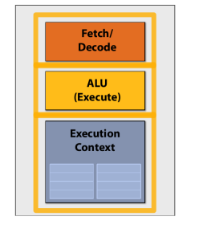
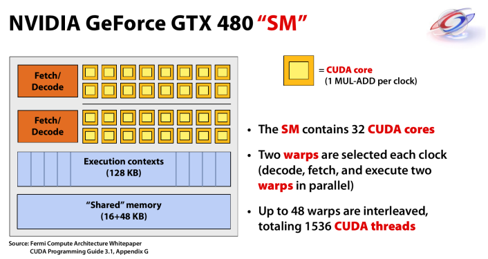
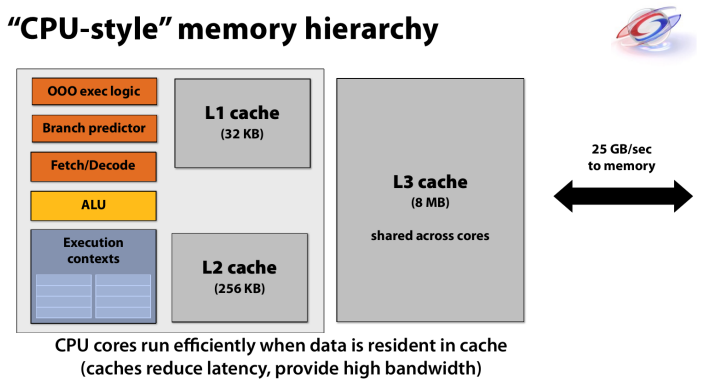

# CUDA Tutorial 3

主要参考 [bilibili](https://www.bilibili.com/video/BV1kx411m7Fk)

## CPU 基础

CPU 是执行指令、处理数据的器件，能够完成基本的逻辑和算术指令。现在 CPU 增加了复杂的功能，增加了内存接口和外部设备接口对其进行拓展

CPU 的基本指令，下面用汇编语言举例

```assembly
add r3,r4 -> r4 # 算数
load [r4] -> r7 # 访存
jz end			# 控制
```

对一个编译好的程序，最优化目标：
$$
\frac{cycles}{instruction} \times \frac{seconds}{cycle}
$$
前者为 Instruction per Cycle (IPC)，后者为每个 cycle 所用时间，cycles 表示时钟周期。本质上是优化每条指令所使用的时间

对于桌面级应用，其特点是：

1. Lightly threaded，轻量级进程，少量线程
2. Lots of branches，大量分支
3. Lots of memory access，大量存储器访问
4. Few instrunctions，少量数值运算

**总结：CPU 大量的工作在分支控制与存储访问（占 60%），极少用于矢量运算（占 1%）**

CPU 中的晶体管都在干啥？其实正如上面所说，CPU 其实大部分是为了分支控制与存储访问，所以大量的晶体管也被用于这两个功能（Cache & Memory Controller），而用于计算的 Core 实际上面积不是最大的！所以最好把 CPU 理解为一个吞吐机，而不是处理机


下图是一个最简单的 CPU 结构图与流水线 pipeline


其中 `I$ & D$` 分别代表了指令和数据。**流水线模型**是一个非常重要的模型，经常用工厂流水线或者搬砖来做一个类比。流水线的优势：指令的并行。即流水线上大家都在工作，且工作都不一样

但是也带来了问题：1. 如何处理具有依赖关系的指令；2. 如何处理分支；

这两个问题通过旁路、重新排序、分支预测等方式来进行一定程度的解决

### CPU 存储器

层次结构，越大越慢


所以缓存是最接近使用的数据，这样才是最快的

现在 CPU 遇到的两面墙（限制）：

1. 能量墙。晶体管数量的增加导致功耗增加，散热跟不上
2. **存储墙**。存储访问的延迟跟不上处理器的计算

上述两面墙催生了解决方案：GPU 并行计算😎 GPU 在相同功耗的情况下，数据吞吐量远大于 CPU。有两个原因：

1. GPU 的高带宽内存与多个并行处理单元
2. CPU 本质适合于串行程序。对于一个指令，CPU 会使用旁路、重新排序、分支预测等方法来尝试优化指令，这些都会增加处理的功耗

## GPU 体系架构

名词解释：

1. FLOPS – FLoating-point OPerations per Second
2. GFLOPS - One billion (109) FLOPS
3. TFLOPS – 1,000 GFLOPS

为什么需要GPU？应用的需求越来越高，计算机技术由应用驱动（如气象预测）

常用的 GPU 处理单元，可以看作一个小的处理器，执行3个工作：取址（Fetch），处理核心（ALU），上下文（Execution Context）



> 在处理器中，程序指令存储在内存中的指令存储器中。**Fetch/Decode 的任务是从指令存储器中获取下一条指令，并将其传送到处理器的其他部件进行执行**
>
> ALU是算术逻辑单元（Arithmetic Logic Unit）的缩写，是计算机中的一个部件或电路，**用于执行算术和逻辑运算**。ALU是中央处理器（CPU）的一部分，用于执行加法、减法、乘法、除法等算术运算，以及与、或、非、异或等逻辑运算。ALU能够根据指令和数据进行运算，然后将结果返回给主存储器或寄存器。
>
> 执行上下文（Execution Context）指的是在编程语言中，每个代码块（函数、方法等）在 runtime（运行时）时创建的一个环境，用于**存储变量、函数、对象等的信息，并且跟踪代码的执行**。它包括了当前代码所处的作用域、变量的值、函数的调用堆栈等信息。执行上下文中的变量可以存储在寄存器、缓存、主存等存储硬件中

而在 CPU 中的基本执行单元就变得很复杂了！可以用下面的图表示


可以看到，有很大一部分的空间分配给了 Data cache 以及控制流（OoO，分支预测，提前取址），一个简单的比喻：CPU 有一个臃肿的管理机构，但是实际上干活的人很少🤣但是他能够把复杂的长串儿工作完成得漂亮

GPU 就是想要精简掉 CPU 中这样的部件：原本设计于运行加速，但实际上非常消耗资源的部件


精简完过后，就开始考虑将处理单元数量增加：4个核，8个核，16个核...一个核就是上图的基本单元，一个程序片元（fragments）就是一个程序段/程序流


但是处理单元数量的增加会带来问题：如果每一个程序片元使用的是不同的指令流，将会大大增加控制难度，从而增加计算开销。所以我们要求这16个程序片元（以上图为例），共享指令流

之后还可以为每一个核增加 ALU 数量，进一步加强其计算能力，增大数据吞吐量。这里就引出了 SIMD 处理（Single Instruction Multi Data）


遇到分支处理怎么办？（SIMT, SIMD, warp）

如下面的示意图，遇到了一个 if 分支。可以看到有3个 ALU 在进行 True 分支，5个 ALU 在进行 False 分支。在执行 True 分支时，Flase 分支的 ALU 必须要进行等待，因为他们是共享的指令流 single instruction，或者可以看作 False 分支也在完成 True 分支的操作，但是其数据与结果没有意义。只有当 True 分支结束过后，False 分支才能继续，此时 True 分支也进入了一种无效状态


停滞状态（Stalls）

> Stalls occur when a core cannot run the next instructionbecause of a dependency on a previous operation.

当指令需要执行时，由于前置依赖没有完成，需要等待！比如数据没到，中间结果没计算出来

应对思路：使用大量的独立片元相互切换，通过片元切换来掩藏延迟。本质就是让其他独立的活儿，取占领停滞状态的核，不让处理单元闲置。为了达到这样的目的，我们需要多个上下文存储空间来存储独立程序片元的信息（切换上下文可能会增加开销）。下图就是将一个上下文存储池，分成了18份以获得较好的延迟隐藏效果。**澄清：上下文切换可以软件也可以硬件管理！**（这在一定程度上减少了上下文切换成本？）


下面就是一个”完整“的芯片设计，其中两点解释一下：

1. 64 concurrent instruction streams，我们最多能同时**执行/处理**16个指令流，但是能同时**载入/承载/驻扎**64个指令流，多余的指令可用于延迟掩藏。所以同时载入64个指令流不代表能同时执行64个
2. 256 GFLOPs = (8 * 16 * 1 G) * 2，假设一个时钟周期能进行2次浮点运算，就能够得到 256 GFLOPs 的结果


下面看下 Nvidia GeForece GTX 480 的一个 SM，黄色的即为一个 CUDA core，可以看作一个复杂的 ALU




**GPU 中的数据访存问题！**

CPU 中的缓存 data cache 非常巨大，并且使用了分级缓存。



但是在 GPU 中我们把大部分的芯片面积用于计算单元，所以需要高带宽的内存


**访存带宽是非常宝贵的资源！！**

有两个常规方法：

1. 减少数据请求
2. 每次输送更多数据。通常指一些零碎、不连续数据，因为这些数据需要多次输送，会产生大量的消耗
3. 重复数据利用

其中一个应用是 texture cache，通常用于图形渲染。texture cache 就是将一些空间上重叠/临近？的数据存到缓存当中（图中的白色重叠部分），以提高访问效率


GPU 的缓存结构比 CPU 小得多

片上存储减轻了内存系统的负担。许多开发人员呼吁增加类似高速缓存的存储（尤其是 GPU 计算应用），因为目前来讲 shared memory 甚少


## CUDA 编程

cudaMalloc 是分配 global memory


线程调度

每个 warp 含32个线程，但一个 SM 只有8个 CUDA core，这个时候只能一次调度8个线程，通过4次调度完成一个 warp 的调度


**分配极限**

例子：对于一个 G80 显卡，一共有 8K 个寄存器，并且一个 SM 最多承载768个线程。在此条件下：

1. 如果你一个线程使用了10个寄存器，并且每个 block 含有256个线程，那可以在一个 SM 上驻扎 3 个 block，因为一共有 256x10x3 < 8K 个寄存器

2. 如果你一个线程使用了11个寄存器，并且每个 block 含有256个线程，那可以在一个 SM 上驻扎 2 个 block，因为 256x11x2 < 8K < 256x11x3 个寄存器。此时一个 SM 可以驻扎 256x2/32 = 16 个 warp

   那么当一个 SM 能够同时运行（不是驻扎）的 warp 数量 > 16 时，就会有空闲的核心，造成资源的浪费


Shared Memory 的分配也是类似的道理，是整个 block 共享的 `Shared Memory Per Block: 48 KB`。我们也不能让每个 block 分配过多的 shared memory，这样会导致一个 SM 最多载入的 block 减少


## Matrix Multiply

在 cuda-tutorial chk-dev 中写的 `matmul.cu` 中记录了3个矩阵乘法：

1. baseline，只使用多线程
2. 使用 block
3. 使用 shared memory
