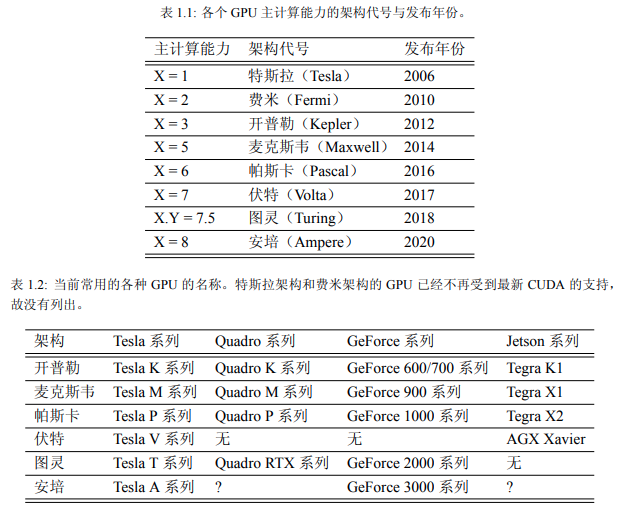
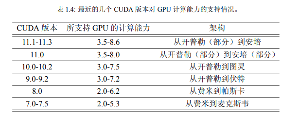

# CUDA Programming 1

总结 [CUDA Programming](https://github.com/brucefan1983/CUDA-Programming) 一书，是我看到的最理想的入门教材，将 CUDA 中的基础概念讲得非常连贯，并且还有对应代码😃

之前是将其基础内容通看了一遍，现在要正式形成文本整理

这篇笔记记录 GPU 硬件概念

## 计算能力

每一款 GPU 都有一个用以表示其“计算能力”（compute capability）的版本号。该版本号可以写为形如 X.Y 的形式。其中，X 表示主版本号，Y 表示次版本号。**版本号决定了 GPU 硬件所支持的功能**，可为应用程序在运行时判断硬件特征提供依据



版本号越大的 **GPU 架构**（architecture）越新，你会经常来查看这张表格以确定你的 GPU 是否支持一些 CUDA 编程操作。同时我们也要将 **CUDA 版本**和计算能力区分开来，二者部分的对应关系如下



## CUDA Runtime API

CUDA 提供了两层 API（Application Programming Interface，应用程序编程接口）给程序员使用，即 CUDA 驱动（driver）API 和 CUDA 运行时（runtime）API。其中，CUDA 驱动 API 是更加底层的 API，它为程序员提供了更为灵活的编程接口；CUDA 运行时 API 是在 CUDA 驱动 API 的基础上构建的一个更为高级的 API，更容易使用。这两种 API 在性能上几乎没有差别。从程序的可读性来看，使用 CUDA 运行时 API 是更好的选择。在其他编程语言中使用 CUDA 的时候，驱动 API 很多时候是必需的。因为作者没有使用驱动 API 的经验，故本书只涉及 CUDA 运行时 API。

所有 CUDA 运行时 API 函数都以 cuda 开头，例如 `cudaMalloc, cudaDeviceSynchronize, cudaFree`

## Hello CUDA world

这一部分我之前就整理过了，主要介绍以下概念：

1. Host & Device
2. Kernel，核函数
3. Grid Block Thread

下面通过 `hello.cu` 再补充2点

```c++
#include <stdio.h>

__global__ void hello_from_gpu()
{
    printf("Hello World from the GPU!\n");
}

int main(void)
{
    hello_from_gpu<<<1, 1>>>();
    cudaDeviceSynchronize();
    return 0;
}

```

1. `printf`

   核函数中的 printf() 函数的使用方式和 C++ 库（或者说 C++ 从 C 中继承的库）中的 printf() 函数的使用方式基本上是一样的。而且在核函数中使用 printf() 函数时也需要包含头文件（也可以写成 ）。需要注意的是，核函数中不支持 C++ 的 iostream

2. `cudaDeviceSynchronize`

   这行语句调用了一个 CUDA 的运行时 API 函数。**去掉这个函数就打印不出字符串了**。这是因为调用输出函数时，输出流是先存放在缓冲区的，而缓冲区不会自动刷新。只有程序遇到某种同步操作时缓冲区才会刷新。**函数 `cudaDeviceSynchronize` 的作用是同步主机与设备**，所以能够促使缓冲区刷新

## Block Grid 大小限制

对任何从开普勒到安培架构的 GPU 来说，网格大小在 x、y 和 z 这 3 个方向的最大允许值分别为 $2^{31} -1$、65535 和 65535；线程块大小在 x、y 和 z 这 3 个方向的最大允许值分别为 1024、1024 和 64。另外还要求线程块总的大小，即 blockDim.x、blockDim.y 和 blockDim.z 的乘积不能大于 1024。也就是说，**不管如何定义，一个线程块最多只能有 1024 个线程，网格大小限制相对宽松。**这些限制是必须牢记的

## CUDA 中的头文件

CUDA 中也有一些头文件，但是在使用 nvcc 编译器驱动编译 .cu 文件时，将自动包含必要的 CUDA 头文件，如 `<cuda.h>` 和 `<cuda_runtime.h>` 。因为 `<cuda.h>` 包含了 `<stdlib.h>`，故用 nvcc 编译 CUDA 程序时甚至不需要在 .cu 文件中包含 `<stdlib.h>`

## nvcc 编译 CUDA 程序

CUDA 的编译器驱动（compiler driver）nvcc 先将全部源代码分离为主机代码和设备代码。主机代码完整地支持 C++ 语法，但设备代码只部分地支持 C++。nvcc 先将设备代码编译为 PTX（Parallel Thread eXecution）伪汇编代码，再将 PTX 代码编译为二进制的 cubin 目标代码。

在将源代码编译为 PTX 代码时，需要用选项 `-arch=compute_XY` 指定一个虚拟架构的计算能力，用以确定代码中能够使用的 CUDA 功能，换句话说：`-arch=compute_xx` 取一个较低值是为了保证编译的**兼容性**，但这也会舍弃部分的运行性能

在将 PTX 代码编译为 cubin 代码 时，需要用选项 `-code=sm_ZW` 指定一个真实架构的计算能力，用以确定可执行文件能够使用的 GPU。真实架构的计算能力必须等于或者大于虚拟架构的计算能力

```shell
-arch=compute_35 -code=sm_60	# OK
-arch=compute_60 -code=sm_35	# NO!!
```

选项 `-code=sm_ZW` 指定了 GPU 的真实架构为 Z.W。对应的可执行文件只能在主版本号为 Z， 次版本号大于或等于 W 的 GPU 中运行：

```shell
-arch=compute_35 -code=sm_35
```

上面编译出来的可执行文件只能在计算能力为 3.5 和 3.7 的 GPU 中执行

如果希望编译出来的可执行文件能够在更多的 GPU 中执行，可以同时指定多组计算能力，每一组用如下形式的编译选项

```shell
-gencode arch=compute_35,code=sm_35
-gencode arch=compute_50,code=sm_50
-gencode arch=compute_60,code=sm_60
-gencode arch=compute_70,code=sm_70
```

编译出来的可执行文件将包含 4 个二进制版本，分别对应开普勒架构（不包含比较老的 3.0 和 3.2 的计算能力）、麦克斯韦架构、帕斯卡架构和伏特架构。这样的可执行文件称为胖二进制文件（fatbinary）。在不同架构的 GPU 中运行时会自动选择对应的二进制版本。

假如我们处于只有 CUDA 8.0 的年代（不支持伏特架构），但希望编译出的二进制版本适用于尽可能多的 GPU，则可以用如下的编译选项

```shell
-gencode arch=compute_35,code=sm_35
-gencode arch=compute_50,code=sm_50
-gencode arch=compute_60,code=sm_60
-gencode arch=compute_60,code=compute_60
```

其中，前三行的选项分别对应 3 个真实架构的 cubin 目标代码，第四行的选项对应保留的 PTX 代码。这样在伏特架构的 GPU 中运行时，会根据虚拟架构为 6.0 的 PTX 代码**即时地编译**出一个适用于当前 GPU 的目标代码

在学习 CUDA 编程时，有一个简化的编译选项可以使用：

```shell
-arch=sm_XY
```

它等价于

```shell
-gencode arch=compute_XY,code=sm_XY
-gencode arch=compute_XY,code=compute_XY
```

的程序在编译时并没有通过编译选项指定计算能力。这是因为编译器有一个默认的计算能力，默认计算能力一般比较低