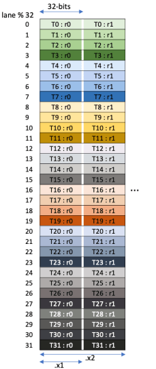

# CUDA Programming 11

正式发起对 blackwell GPU 的学习。根据之前的了解 blackwell 的特性相比 Hopper 又多了一些：

1. Tensor Memory

   解决 register 不足的原因，Tensor Core 的累计结果将直接存储到 tensor memroy 当中。此使可以将 epilogue 和 mma 阶段完全并行起来，彻底抛弃 PingPong

2. UMMA, i.e. tcgen05

   更快更强大的 MMA，支持 fp4 精度 & micro scaling & Pair-SM MMA。单线程发起，相比 WGMMA 更轻量

3. Cluster Launch Control (CLC)

   解决 persistant kernel 的 workload balance 问题

4. Dynamic Cluster

   解决在大的 cluster size 下 problem size 部分运算结果被浪费的问题 

个人认为以上特性的重要程度逐渐递减。尤其是前两个特性的引入，宣布了重要**历史意义**：从通用计算资源向专用硬件资源转移的趋势——Volta 分离了 GEMM 算术运算，Ampere 实现了异步拷贝，Hopper 引入了 TMA 和异步 WGMMA，而 Blackwell 的 TMEM 和 UMMA 使 MMA 成为真正的单线程、异步、零寄存器消耗的操作

reference :

- [CUTLASS Tutorial: Writing GEMM Kernels Using Tensor Memory For NVIDIA® Blackwell GPUs – Colfax Research](https://research.colfax-intl.com/cutlass-tutorial-writing-gemm-kernels-using-tensor-memory-for-nvidia-blackwell-gpus/)

## Tensor Memory

首先，tensor memory (TMEM) 到底是什么？

> From Kimi
>
> **Tensor Memory** 是 Blackwell 为 Tensor Core 引入的专用片上内存，旨在替代寄存器用于第五代 Tensor Core 操作

我理解的 tensor memory 存在的意义：在 pre-Blackwell 之前进行 mma 计算的时，accumulator 都是使用的 register，但是 register 的数量是有限的，这限制了我们进行更大 mma 计算的可能。另外一方面，如果有单独的 tensor memory 来作为 accumulator，epilogue 就可以更好地和 mma 计算 pipeline 并行起来，不需要复杂的 PingPong schedule 即可以掩藏 epilogue 时延。当 epilogue 开始之后可以立即进行下一个 tile 的 mma 计算，而 mma 的结果存入到空闲的 tensor memory 当中

### TMEM Structure

Tensor memory 的结构理解起来相对简单，就是一块 2D memory，在每一个 SM 上有 256 KB。2D 的具体维度为：

1. Row，一共 128 行，也叫做 lanes
2. Column，一共 512 列，每一列为 4 Btype (32 bit)，一整行为 2048 Btype (2KB)


### TMEM Usage

TMEM 在使用上有着一些限制：

1. TMEM 的分配

   必须有显式的 alloc & dealloc，通过 PTX `tcgen05.alloc` and `tcgen05.dealloc` 完成，二者都必须使用单个 thread 进行调用

2. 分配单位

   TMEM 的分配是按列分配，即最少分配一个 column 的 TMEM = (128 lanes x 4Bytes)

3. TMEM -> Register copy

   使用如下 PTX 完成

   ```cpp
   tcgen05.ld.sync.aligned.shape.num.b32    r, [taddr];
    
   .shape = { .16x64b, .16x128b, .16x256b, .32x32b }
   .num    = { .x1, .x2, .x4, .x8, .x16, .x32, .x64, .x128 }
   ```

   可以看到是一个 `sync.aligned` 的命令，和之前接触的 ldmatrix 类似，是 warp 同步级指令。其中的 shape 代表了 `.{lanes}x{bits}`，num 代表了会重复执行的次数，可以简单认为是在 row 方向的延申。下图就很清楚地展示了命令 `tcgen05.ld.sync.aligned.32x32b.x1.b32`

   

   TMEM 有 128 lanes，所以通常我们都是以一个 warpgroup 为单位进行操作，每一个 warp 负责 32 个 lanes。再向前思考一步，register 如何 copy 回 smem 当中呢？在 cute 的世界里，thread tensor 通常以 `(V, rest_m, rest_n)` 的方式存在，如果不是，那就使用 `thr_copy.partition(Tensor)` 让其变为对应的形状。而这里的 Tensor MN shape 可以认为是 `(128, 2 x num)`，可以使用 universal copy 的方式进行快速的数据拷贝。并且好消息是，这里的 tv layouts 不像 ldmatrix/stmatrix 一样的复杂，可以使用更好的向量化存储方式

TODO: 具体的在 Cute 当中的使用方法待整理

## UMMA


- TMA Multicast

  在 Hopper 当中 Multicast 只在一个 single-dimension 当中进行，并且 cluster 最大都只能设置为2，这个限制在 [Dynamic Cluster and Scheduler for Blackwell - 知乎](https://zhuanlan.zhihu.com/p/1940858379905001339) 当中有所解释

  而在 blackwell 当中 cluster 真正能够做大，最大能够做到 `(4, 4)`，所以其数据的传输能力有了更强的提升。可以有更复杂的情况进行讨论。例如对于一行 4 个 cta，如果只有 3 个 cta 参与了 multicast 其数据是怎么样的？
  
  我一开始以为大家的数据都会是不完整的，然而事实可能是：参与 multicast cta 的数据是完整的，未参与 multicast cta 的 smem 数据是空的。这也比较符合使用时的直觉