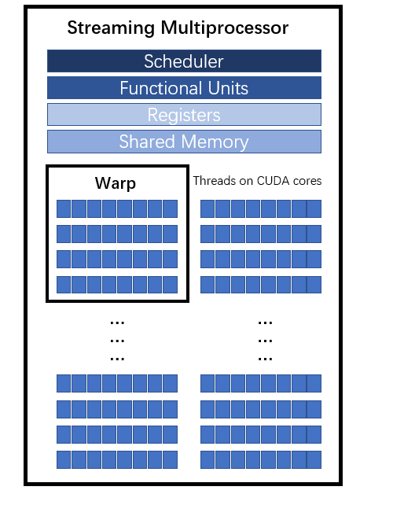

# CUDA Programming 3

## 获得 GPU 加速的关键

- 第5章讲了一下如何测试 CUDA 程序的运行速度，感觉实际上我们都是使用 nsys 去分析程序的用时，而教材中的 nvprof 已经是比较老的方法了，现在都不太常用，所以不做整理，之后看下有无更好的 profile 教程

- 几个影响 GPU 加速的关键因素

  1. 带宽

     教材中的小标题为：数据传输的比例，讲的更多的是从 CPU 传输数据到 GPU 上。但我们平时更多意思就是数据传输、读取会在 CUDA 程序中占据不小的时间，如果数据很多都需要传输到 GPU 上，那么整个程序就是访存受限的，也就是常说的 memory bound

     实际上 GPU 已经是为高带宽而设计的芯片了，通常连接 GPU 和 CPU 内存的 PCIe x16 Gen3 仅有 16GB/s 的带宽。而 RTX 2080ti 的理论带宽已经到了 616GB/s

     这里的带宽指的是 GPU **global memory** 的带宽。以 2080ti 为例，GPU 能够在 1s 内**发出** 616 GB 的数据量，这些数据量会传输到 shared memory、register、cuda core 以及 global memory 本身，而**传输**本身还会消耗时间，这段时间叫做 **latency**。GPU global memory 的带宽高，同时 latency 也高，相对的，shared memory latency 非常低，而 register 是 latency 最低的

     >  一个比喻：一个大的工厂需要很快的处理物料，生产处所需要的产物。所以常用的或者反复用到的物料，我们希望放在距离所有工人比较近的地方（shared memory），不然每一次需要该物料都要去大仓库里拿（global memory），并且由于比较近的地方空间有限，而且大家都有权限存放和拿取，所以是珍贵的资源，需要进行精细的管理！

     另外计算发生的地方是在 CUDA core，也就是消费 data 的地方，现如今计算能力（消耗）强于我们的运输能力的。可以看到通常的算力是以 Tera 为单位来进行的，而带宽通常是以 GB 来衡量，仍然以 2080ti 举例，其单精度算力为 13 TFlops，如果运输 616 GB，假设我们只对每一个浮点数 +1 的话，消耗的时间是 0.15s，而发出的时间就要 1s 还没有计算 latency 所需要的时间。并且由于现在 fp16/fp8/fp4 的计算更快，估计计算所消耗的时间要比运输低2~3个数量级

  2. 算数强度 arithmetic intensity

     定义为 算数操作量 / 内存操作量，当算数强度越高时 GPU 提速效果越好。教材中以 FMA 指令为例子计算了 2070 的 register 理论带宽

     FMA 是 fused multiply-add 指令：$d=a\times b+c$，该指令涉及4个浮点数和2个操作运算，2070 的峰值算力为 6.5TFlops，所以带宽为
     $$
     \frac{4Byte \times 4}{2 Ops} \times 6.5 TFlops = 52TB/s
     $$

  3. 并行规模

     一个 GPU 由多个流处理器 (streaming multiprocessor, SM) 组成，每一个 SM 中有若干个 CUDA 核心，一个 SM 最多驻留 (reside) 的线程个数是 2048，对于图灵架构是 1024。所以要尽可能提高并行规模才能得到好的加速比

- CUDA 数学函数库

  CUDA 里提供了各种各样的数学函数和不同数值类型的 intrinsics (内建函数/原语)

  - single/double/half/integer intrinsics & math functions，其中 half 需要包含 `#includ<cuda_fp16.h>`，其他直接用就行
  - type casting intrinsics
  - SIMD (single instruction multi data) intrinsics

## CUDA 的内存组织

从之前的总结里复制一个图过来，这个图将逻辑和物理视角统一了起来


一个高度总结 CUDA 不同内存的特性的表格

| 内存类型   | 物理位置 | 访问权限 | 可见范围         | 生命周期         |
| ---------- | -------- | -------- | ---------------- | ---------------- |
| 全局内存   | off-chip | 可读可写 | 所有线程和主机端 | 由主机分配与释放 |
| 常量内存   | off-chip | 仅可读   | 所有线程和主机端 | 由主机分配与释放 |
| 寄存器内存 | on-chip  | 可读可写 | 单个线程         | 所在线程         |
| 局部内存   | off-chip | 可读可写 | 局部内存         | 所在线程         |
| 共享内存   | on-chip  | 可读可写 | 线程块           | 所在线程块       |

所谓的 on-chip 和 off-chip 就是把 GPU 的硬件划分地更加细致了一些，这里的 chip 就是 GPU processing units (GPU DIE)，包含了 cuda cores, memory controllers, cache 等等。GPU DIE 是 SM 的超集，也就是说 GPU DIE 包含 SM (主要构成) 和 memory controllers & logic controllers，可粗略地认为 GPU 就是由多个 SM 构成

SM (**Streaming Multiprocessors**) 也是 GPU 硬件中的重要概念，注意是硬件概念

这个图是我之前根据理解所画的 SM 概念图



这里面的小正方形就是 CUDA cores，一个 Warp 是最小的操作单元，一次性调用 32 个 CUDA cores

接下来更深入地理解下各个内存的特性：

1. Global Memory

   全局内存由于没有存放在 GPU 的芯片上，因此具有较高的延迟和较低的访问速度。全局内存缓冲区的生命周期就是从主机端用 cudaMalloc 对它们分配内存开始，到主机端用 cudaFree 释放它们的内存结束。

2. Constant Memory

   使用 constant memory 两个方法

   - 在核函数外面用 `__constant__` 定义变量，然后用 cudaMemcpyToSymbol 将数据从主机端复制到设备的常量内存后供核函数使用

   - 在核函数中通过对参数传值的方式给核函数中的线程使用。可以传单个值，也可以传递一个结构体，结构体由单个变量或固定长度的数组构成。例如教材中的 `add` 核函数中的 `const int N` 最后就会被送到常量内存当中

     ```c++
     void __global__ add(const real *x, const real *y, real *z, const int N)
     ```

   对常量内存的访问要快于对全局内存的访问

3. Register

   - **寄存器变量仅仅被一个线程可见**
   - 在核函数中定义的**不加任何限定符的变量 一般** 来说就存放于寄存器中
   - 核函数中定义的**不加任何限定符的数组**有可能存放于寄存器中，但也有可能存放于局部内存中
   - 各种内建变量，如 `gridDim, blockDim, blockIdx, threadIdx, warpSize` 都保存在特殊的寄存器中

   一个寄存器占有 4B (32 bit)

4. Local Memory

   局部内存和寄存器的用法几乎一样，寄存器中放不下的变量，以及索引值不能在编译时就确定的数组，都可能放在局部内存中。局部内存其实是全局内存中划分出来的一部分，所以延迟也很高，并且也有大小限制(512KB)，使用过多会降低程序性能

5. Shared Memory

   On-chip memory，具有仅次于寄存器的读写速度，数量也有限。区别于寄存器，共享内存对整个线程块可见，其生命周期也和线程块一致

- SM 构成

  一个 GPU 是由多个 SM 构成的，一个 SM 包含如下资源：

  - 一定数量的寄存器
  - 一定数量的共享内存
  - 缓存（常量内存缓存，纹理和表面内存缓存，L1 缓存）
  - 线程调度器（warp scheduler），用于在不同线程的上下文之间迅速地切换，以及为准备就绪的 warp 发出执行指令
  - 执行核心（cores）
    - 若干整型运算核心
    - 若干单精度浮点运算核心
    - 若干双精度浮点运算核心
    - tensor cores

- SM 理论占有率（theoretical occupancy）

  以下对于 SM 占有率的分析与教材有所出入，是根据 Chat 老师以及硬件参数进行的自我理解
  $$
  Occupancy = \frac{\text{reside warps}}{\text{maximum reside warps}}
  $$
  这里引入了概念 **reside warps**，要与 **active warps** 进行显著区分：
  
  1. Reside warps: warps/threads that have been located onto the SM and have allocated resources like registers and shared memory
  2. Active warps: subset of reside warps, that are currently being executed by the GPU's execution units (e.g. CUDA cores)
  
  所以 warps 在 GPU 上有两种状态：一种是已经准备好资源了，随时准备被执行；另一种就是正在被执行单元运行。
  
  下面让 Chat 老师给了一个具体的例子来说明 occupancy & reside & active warps 的联系与区别：
  
  **GPU Settings**
  
  - GPU: RTX 3080
  
  - Max threads per SM: 2048
  
  - Register per SM: 64 KB
  
  - Shared Memory per SM: 100 KB (configurable, but let's assume this setup)
  
  **Example Scenario**
  
  Let's say you launch a kernel where:
  
  - Each thread uses 64 registers.
  - Each block has 128 threads.
  - Shared memory per block is 8KB.
  
  **Calculating Resident Threads**
  
  - Registers per block 128 x 64 = 8192, GPU can fit up tp 8 blocks
  - Shared memory is 8 KB, GPU can fit up to 12 blocks
  
  So bounded by resigers, total resident threads are 8 x 128 = 1024, i.e. 32 warps
  
  **Active Threads**
  
  Active threads are managed by the SM's warp scheduler. While 1024 threads are resident, appropriate warps are scheduled depending on available execution resources and ready instructions.
  
  3080 has 128 CUDA cores pre SM [reference link](https://www.techpowerup.com/gpu-specs/geforce-rtx-3080.c3621), so there can be up to 128 threads being active simultaneously
  
  **Non-Resident Threads**
  
  If you were to launch more threads (say 4096) than could be resident due to hardware resource limits,  threads would need to be queued or managed at a higher abstraction layer while waiting for resources to become available before becoming resident.
  
  所以上上面的例子中可以看到 SM 占用率仅为 1024 / 2048 = 50%
  
  最后一个问题是：max threads per SM 是由什么决定的？这也是由 GPU 硬件所决定的上限，个人猜测是由 warp scheduler 资源所决定，只有那么多个 slots 来同时规划 2048 个 threads。只需要把这个值作为固定参数理解即可

## Question

- 当要进行运算的时候，如何高效利用寄存器？是不是所有的运算数据都要先放在寄存器，再搬运到处理器上？

  问了 Chat 老师，第二个问题的答案是：Yes！

  > Yes—before data from global memory can be used in computation, it must be loaded into registers; all GPU computations operate on data in registers, so even data requested from global memory is first moved into registers for use by the CUDA cores.

  update 2025/02/20
  
  询问了 DeepSeek，用一个 CUDA code 计算了 register 使用数量。任何用于计算的数据都必须有一个寄存器来存储，不管这个数据是来自 shared memory 还是来自 global memory
  
  update 2025/03/06
  
  [cute 之 Copy抽象](https://zhuanlan.zhihu.com/p/666232173) 
  
  离计算单元Tensor Core和CUDA Core（图中分别标记为TC和CUDA）更近的存储结构为寄存器堆（图中标记为Register File），计算单元计算所需要的数据必须来自寄存器（Ampere及之前架构如此，Hopper架构的Tensor Core可以直接读取存储在shared memory数据进行计算），是GPU中最快的存储结构
  
  
