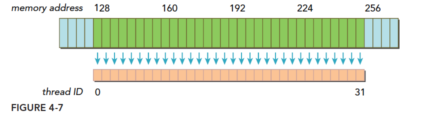

# CUDA Programming 4

## 全局内存和常量内存的合理使用

- **合并访问 coalesced memory access [link](https://face2ai.com/CUDA-F-4-3-%E5%86%85%E5%AD%98%E8%AE%BF%E9%97%AE%E6%A8%A1%E5%BC%8F/)**

  > It refers to an efficient way of accessing global memory where memory transactions are combined to minimize the number of memory operations, thereby improving performance.

  顾名思义，合并访问就是将多次内存访问需求在一次内存事务 (memory transaction) 中解决

  > 我们把一次内存请求——也就是从内核函数发起请求，到硬件响应返回数据这个过程称为一个内存事务（加载和存储都行）

  核函数运行时需要从全局内存（DRAM）中读取数据，只有两种粒度，这个是关键的：

  - **128字节**
  - **32字节**

  解释下“粒度”，可以理解为最小单位，也就是核函数运行时每次内存请求，哪怕是读一个字节的变量，也要读128字节，或者32字节。也会把这种粒度叫做“缓存粒度”

  > **对齐访问 memory alignment**。当一个内存事务的首个访问地址是缓存粒度（32或128字节）的偶数倍的时候，这个时候被称为对齐内存访问，非对齐访问就是除上述的其他情况，非对齐的内存访问会造成带宽浪费

  在什么条件下合并访问能够发生：

  > **当一个线程束内的线程访问的内存都在一个内存块里的时候，就会出现合并访问**

  个人理解：什么是内存块？内存块就是连续 (continous) 的缓存粒度。这里所说“一个线程束内的线程”，应该不是指所有线程，只要存在有多个线程满足情况，就会发生合并访问，只是不是所有的线程访问都是合并的，利用率不是最高。这里可以定义一个合并度/利用率的概念：所需数据和所取数据之比

  最理想的情况就是下面所示的**合并对齐访问**，也就是所有的请求数据都分布在连续的缓存粒度当中，并且首地址是缓存粒度的偶数倍。如下图所示
  
  
  
  **上面蓝色表示全局内存，下面橙色是线程束要的数据，绿色就是对齐的地址段**
  
  除了对齐合并访问的理想内存排布情况外，内存排布还有其他可能的情况：
  
  - 非对齐连续排布。数据虽然是连续排布的，但是首地址并不是对齐的
  
    
  
  - 非对齐非连续排布。这是最坏的情况
  
    
  
- **矩阵转置**

  教材以矩阵转置为例子，说明了合并访问在读写数据上的区别

  教材首先写了一个 copy 的核函数

  ```c++
  __global__ void copy(const real *A, real *B, const int N)
  {
      const int nx = blockIdx.x * TILE_DIM + threadIdx.x;
      const int ny = blockIdx.y * TILE_DIM + threadIdx.y;
      const int index = ny * N + nx;
      if (nx < N && ny < N)
      {
          B[index] = A[index];
      }
  }
  ```

  其中 `TILE_DIM` 是一个全局的常量，`N` 就是方形矩阵的形状

  ```c++
  const int TILE_DIM=32;
  ```

  对于 copy 来说**读取矩阵A**和**写入矩阵B**都是**合并访问**的，所以 copy 是一个非常高效的操作

  之后就是 transpose 的核函数了，由于 transpose 的特性，矩阵A和矩阵B势必有一个矩阵是要非合并访问的，所以教材写了两种 transpose 的核函数：

  1. 合并读取A，非合并写入B

     ```c++
     __global__ void transpose1(const real *A, real *B, const int N)
     {
         const int nx = blockIdx.x * blockDim.x + threadIdx.x;
         const int ny = blockIdx.y * blockDim.y + threadIdx.y;
         if (nx < N && ny < N)
         {
             B[nx * N + ny] = A[ny * N + nx];
         }
     }
     ```

     为什么 A 就是合并访问呢？

     > Each thread in a warp accesses consecutive elements in memory because consecutive threads (`nx`) access elements like `A[ny * N + nx]`, `A[ny * N + (nx+1)]`, etc.
     >
     > This means that memory access for `A` is along a row because `nx` changes faster than `ny`.
     >
     > `threadIdx.x` will increment first before `threadIdx.y`.

  2. 非合并读取A，合并写入B

     ```c++
     __global__ void transpose2(const real *A, real *B, const int N)
     {
         const int nx = blockIdx.x * blockDim.x + threadIdx.x;
         const int ny = blockIdx.y * blockDim.y + threadIdx.y;
         if (nx < N && ny < N)
         {
             B[ny * N + nx] = A[nx * N + ny];
         }
     }
     ```

  在运行时就会发现二者的耗时有着巨大的差距，几乎是两倍的关系，合并写的 transpose 要快很多

  ```shell
  transpose with coalesced read:
  Time = 0.0477568 +- 0.000422037 ms.
  
  transpose with coalesced write:
  Time = 0.0252896 +- 0.000424992 ms.
  ```

  原因在于

  > 如果编译器能够判断一个全局内存变量在整个核函数的范围都只可读（例如这里的矩阵 A），则会自动使用函数 `__ldg()` 读取全局内存，从而对数据的读取进行缓存，缓解非合并访问带来的影响

  所以在不能同时满足读取和写入的合并访问时，通常选择满足写入合并

## 共享内存的合理使用

- **共享内存 shared memory**

  共享内存将会是 CUDA 编程中最为重要的概念之一。这里也是教材花费了较多内容进行描述的地方

  > 共享内存是一种可被程序员直接操控的缓存，主要作用有两个：
  >
  > 1. 减少核函数对全局内存的访问
  > 2. 提高全局内存访问的合并度

  教材使用了两个例子来说明共享内存的作用：1. 上面提到的矩阵转置；2. 数组归约。数组归约的例子也是 CUDA 编程中经常遇到的

- **transpose with shared memory with bank conflict**

  使用 shared memory 比之前的版本会多一个中间步骤：将 global memory 数据先移动到 shared memory 当中，从 shared memory 操作数据

  ```c++
  __global__ void transpose1(const real *A, real *B, const int N)
  {
      __shared__ real S[TILE_DIM][TILE_DIM];
      int bx = blockIdx.x * TILE_DIM;
      int by = blockIdx.y * TILE_DIM;
  
      int nx1 = bx + threadIdx.x; // (bx, tx)
      int ny1 = by + threadIdx.y;	// (by, ty)
      if (nx1 < N && ny1 < N)
      {
          S[threadIdx.y][threadIdx.x] = A[ny1 * N + nx1];
      }
      __syncthreads();
  
      int nx2 = bx + threadIdx.y; // (bx, ty)
      int ny2 = by + threadIdx.x; // (by, tx)
      if (nx2 < N && ny2 < N)
      {
          B[nx2 * N + ny2] = S[threadIdx.x][threadIdx.y];
      }
  }
  ```

  上述过程主要分两步：

  1. 首先将 `A[y][x]` 中的数据搬运到 shared memory `S[y][x]` 当中
  2. 然后将 `S[x][y]` 写入到 `B[y][x]` 当中，注意此时 B 矩阵的 block id 也是进行转置的。并且不要被 `nx, ny` 给迷惑住了，实际上 `nx` 对应的是 TILE 中的 y 轴...

  使用了 shared memory 过后时延为 0.026 ms，看起来和上面没有使用 shared memory 的 transpose2 相当

  ```shell
  transpose with shared memory bank conflict:
  Time = 0.0268096 +- 0.000426905 ms.
  ```

  这是因为其中存在 **bank conflict**，由于其比较重要，我直接分在下一个小节来整理

- **transpose with shared memory without bank conflict**

  什么是 bank?

  > 为了获得高的内存带宽，shared memory 在物理上被分为 32 个区域，每一个区域被称为一个 bank。32 正好对应了一个 warp size 的大小，可以让一整个 warp 的线程同时访问到 shared memory 当中的数据

  bank 的逻辑抽象图如下

  

  每一个 bank 的宽度为 4B/32bit，并且同一个 bank 将会分为多个 layer。shared memory 将会让数据连续地分布到 bank 当中，从 bank0 的 layer0 开始，根据地址的顺序填入数据。以上面的 transpose 为例子，我们向 shared memory 填入一段 32x32 TILE float 矩阵，每一个 float 正好就是 4 Byte，那也就正好使用了 32 个 layer

  没有 bank conflict 的情况：一个线程束中的线程各自访问不同的 bank

  

  但是按照我们上面的 transpose 代码的写法会出现 bank conflict。原因如下：我们对于 shared memory 访问代码为

  ```c++
   B[nx2 * N + ny2] = S[threadIdx.x][threadIdx.y]
  ```

  thread0~thread31 会去访问 bank0 中的 layer0~layer31 中的数据，这下多个线程需要的数据都在同一个 bank 上 (in our case bank0)，此时我们就说产生了冲突 conflict，需要排队获取数据

  

  要解决这样的 bank conflict 也很简单，只需要在申请 shared memory 的时候多申请一部分数据，填入一些空白的数据，让各个线程在取数据的时候分布在不同的 bank。我们只需要更改一行代码

  ```c++
  // original:  __shared__ real S[TILE_DIM][TILE_DIM];
  __shared__ real S[TILE_DIM][TILE_DIM + 1];
  ```

  此时 bank 访问的情况如下

  

  黑色框就是我们所申请的空白内存，即 `TILE_DIM + 1` 中的 +1，这下我们在访问 ` S[threadIdx.x][threadIdx.y]` 时，所有的 thread 都会访问到不同 bank 的数据，只不过是他们的 layer 不同罢了。最后测试的时延如下

  ```shell
  transpose without shared memory bank conflict:
  Time = 0.0190464 +- 0.000501629 ms.
  ```

  0.019 ms 就小于之前的最好结果 0.025 ms 了，有显著的提速！但教材还指出：shared memory 不一定能够稳定地提供加速，对于不同的设备可能有不一样的表现形式，有可能使用全局内存的缓存优化作用甚至更大

  

- **reduce with shared memory**

  数组归约（reduce）的定义：给定一个数组，一个 reducer function，返回依次对每个元素执行 reducer function 得到的最终结果

  ```python
  def reduce(nums: List, func):
      ret = init
      for num in nums:
          ret = func(ret, num)
      return val
  ```

  通常这个 reduce op 以 sum 作为例子，教材也是用 sum 作为例子，说白了，此时 reduce 就是对整个数组求和

  教材首先写了一个全局内存的 `reduce_global`

  ```c++
  const int N = 100000000;
  const int M = sizeof(real) * N;
  const int BLOCK_SIZE = 128;
  
  
  void __global__ reduce_global(real *d_x, real *d_y)
  {
      const int tid = threadIdx.x;
      real *x = d_x + blockDim.x * blockIdx.x;
  
      for (int half_block = blockDim.x >> 1; half_block > 0; half_block >>= 1)
      {
          if (tid < half_block)
          {
              x[tid] += x[tid + half_block];
          }
          __syncthreads();
      }
  
      if (tid == 0)
      {
          d_y[blockIdx.x] = x[0];
      }
  }
  
  int grid_size = (N + BLOCK_SIZE - 1) / BLOCK_SIZE;
  // reduce_global<<<grid_size, BLOCK_SIZE>>>
  ```

  以上代码并不是完整的归约程序，而是把数组归约到 `grid_size or gridDim` 大小的数组中，并没有归约到一个数当中，最后把这些数据移动到 CPU 上再进行最后的归约。教材说这样写不是很高效，但还是这样写了

  另外一个值得注意的事情是 `__syncthreads`，如果没有这一行代码将会获得错误的结果。 这是因为 for 循环的运行不会等待所有线程完成，即：当第二个循环开始过后，第一个循环中的一些线程可能还没有结束，这一定会造成归约结果错误。所以 `__syncthreads` 会强制 block 内的所有线程都运行到该语句过后，才会继续运行下面的代码，类似于 `barrier`

  教材归约了一个 1e8 长度的数组，CPU 需要 100 ms 左右，而上面写的代码只需要 5.8 ms，大约是 17 倍

  下面是使用 shared memory 的实现

  ```c++
  void __global__ reduce_shared(real *d_x, real *d_y)
  {
      const int tid = threadIdx.x;
      const int bid = blockIdx.x;
      const int n = bid * blockDim.x + tid;
      __shared__ real s_y[128];
      s_y[tid] = (n < N) ? d_x[n] : 0.0;
      __syncthreads();
  
      for (int half_block = blockDim.x >> 1; half_block > 0; half_block >>= 1)
      {
  
          if (tid < half_block)
          {
              s_y[tid] += s_y[tid + half_block];
          }
          __syncthreads();
      }
  
      if (tid == 0)
      {
          d_y[bid] = s_y[0];
      }
  }
  
  
  
  
  
  
  
  
  
  
  
  
  
  ```

  直接申请一个 block size 大小的 shared memory 数组，将所有的数据都存到里面去，然后利用该数组进行归约。需要注意的地方有2点：

  1. shared memory 对一个线程块里的所有线程都是共享的，需要加入 `__syncthreads` 保证所有线程对应的数据都读入了 shared memory 当中
  2. shared memory 周期仅在线程块中，所以需要将其数据存入到全局变量，才能够在核函数结束后获取

  除此之外上方使用的是静态共享内存，还可以使用动态共享内存，二者区别如下：

  1. 静态：

     只需要在核函数中使用 `__shared__` 关键字声明即可

     ```c++
     __shared__ float x[128]
     ```

  2. 动态：

     在核函数中除了 `__shared__` 关键字声明外还需要使用 `extern` 关键字，但是不指定数组大小

     ```c++
     extern __shared__ float x[]
     ```

     数组大小在 launch kernel 时，传入第三个参数指定

     ```c++
     your_kernel_name<<<grid_size, block_size, sizeof(float) * block_size>>>
     ```

  使用 shared memory 版本 reduce 并没有比使用 global memory 的快，GPT 的解答是

  > If the global memory access in your `reduce_global` version is coalesced and well aligned, the difference between accessing shared memory and global memory might be less noticeable. Coalesced accesses can mitigate the high latency of global memory to some extent.


## Question

- 如何快速计算对应的 id or coordinates，包含 block id, thread id? 

  本质上是高维与低维坐标之间的转化，这在张量中是非常常见的，也可以以进制的思维去理解

  ```python
  # 3 dim tensor T shaped in (DimZ, DimY, DimX)
  # any coord in T (z, y, x) will have unique idx when flatten
  idx = x + y * DimX + z * DimY * DimX
  ```

  用进制的思路去理解：y 坐标，缝 DimX 进一；z 坐标，缝 DimY * DimX 进一。例如一个整数 `2024` 就是拆解为一个四维坐标 `(2,0,2,4) = 4 + 2 * 10 + 0 * 100 + 2 * 1000`

  所以在对 CUDA 编程时，要进行 id or coordinate 转换时，一定要先构建好坐标的体系，然后按照进制进行计算即可

  ```c++
  id = (bid, tid)
  global_flatten_id = bid * blockDim + tid
  ```
  
  我经常会记不清 blockDim 到底是指 thread 的维度，还是指 block 的维度，这里我自己定义下：blockDim is max ids of threads within a block。也就是说 blockDim 实际上说的是 thead 的维度，以此定义的 blockDim 可以直接和 bid 直接相乘，获得展开过后的坐标。我们很少用到 `gridDim`，因为没有 `gridIdx` 的存在
  
  进制的思想能够尽快地将坐标进行转换，另外一个思想是迭代顺序，以矩阵转置为例：
  
  ```c++
  x, y = threadIdx.x, threadIdx.y
  // method 1
  A[x, y] = B[y, x]
  // method 2
  A[y, x] = B[x, y]
  ```
  
  以上两种方式其实都能够完成矩阵转置，但是二者在实际运行时的迭代顺序是不一样的，因为 `threadIdx.x` 会先递增（即：进制的最低位）然后再递增 `threadIdx.y`。如果当 threadIdx.x 和 threadIdx.y 是相同大小的，我们可以很安全地更换二者的迭代顺序而并不影响

