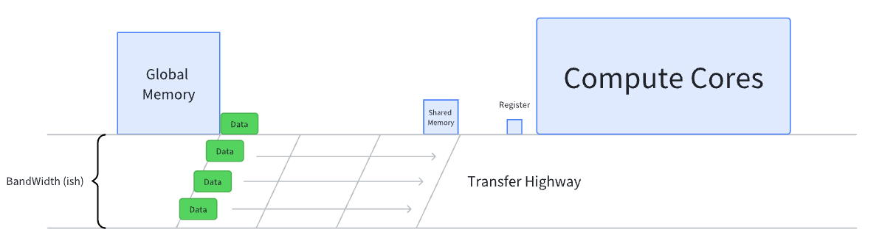

# CUDA Programming 7

有了之前 CUDA Programming 1-6 的铺垫，对于 CUDA 基础应该有了一定的了解。现在想要干一些有趣的事情

想必绝大部分在深度学习领域的人都听说过 [FlashAttention](https://github.com/Dao-AILab/flash-attention)，其是一个 fast & memory efficient 的 attention 实现。除此之外，也有非常多的人听说过 [FlashInfer](https://github.com/flashinfer-ai/flashinfer)，该项目也是一个用于加速 LLM serving 的 library。而你去查看他们的仓库时都会发现一个共同的 3rdparty 仓库：[CUTLASS](https://github.com/NVIDIA/cutlass)

我的本意是想要将 FlashInfer 仓库进行深入的学习，但显然在这之前还有大量的 cutlass 知识需要做铺垫。所以我先进行 cutlass 的学习，再进行 flashinfer 的学习

但问题在于：cutlass 似乎没有特别好的教材来帮助入门。目前我有一些切入口：

1. CUDA MODE lecture 15 introduced cutlass a little bit
2. CUTLASS examples
3. CUTE tutorial

通过学习 cutlass 的例子来掌握其用法，**掌握用法是最主要的需求，也是最直接的反馈**

Other zhihu references:

- [Reed's zhihu posts](https://www.zhihu.com/people/reed-84-49/posts), and its gemm code [github](https://github.com/reed-lau/cute-gemm)
- [CUTLASS CuTe实战(一)-基础](https://zhuanlan.zhihu.com/p/690703999)
- [CUTLASS CuTe实战(二)-应用](https://zhuanlan.zhihu.com/p/692078624)
  - [github](https://github.com/zeroine/cutlass-cute-sample)
- [cutlass cute 101](https://zhuanlan.zhihu.com/p/660379052)
- A collective repo which gathers a lots of blogs and kenel impl [CUDA-Learn-Notes](https://github.com/DefTruth/CUDA-Learn-Notes), not suitable for system learning, can be used for look-up table if you are trying to seek for some topic

## Install & Hello World

Good news! CUTLASS does not need to be built!!!

> CUTLASS is a header-only template library and does not need to be built to be used by other projects. Client applications should target CUTLASS's `include/` directory in their include paths.

但为了运行一些 example code，我们必须要进行编译，才能 run 起来

Hello World in CUTE

[sgemm_1.cu](https://github.com/NVIDIA/cutlass/blob/main/examples/cute/tutorial/sgemm_1.cu)

[quick start guide](https://github.com/NVIDIA/cutlass/blob/main/media/docs/quickstart.md)

[quick start guide-cute](https://github.com/NVIDIA/cutlass/blob/main/media/docs/cute/00_quickstart.md)

根据 [quick start guide](https://github.com/NVIDIA/cutlass/blob/main/media/docs/quickstart.md) 中提示，我先试用 cmake 并且指定自己的 compute capacity

```shell
# see your compute capacity with command:
# nvidia-smi --query-gpu=compute_cap --format=csv
mkdir build && cd build
cmake .. -DCUTLASS_NVCC_ARCHS=86
```

似乎应该使用 `-DCUTLASS_NVCC_ARCHS=80`? 即使我的 compute capacity 是86。Another tip: 我尝试在 WSL 上进行 cmake，结果卡住了 `(pid, sts) = os.waitpid(self.pid, wait_flags)`，应该是多线程在 WSL 上不太管用，把 unit test 取消编译就好 ` cmake .. -DCUTLASS_NVCC_ARCHS=86 -DCUTLASS_ENABLE_TESTS=OFF`

在运行完过后可以看到 `build/Makefile` 中会有许多我们可 build 的文件，其中 `examples` 下的所有文件都可以在里面搜到 (e.g. `00_basic_gemm`)，而我要使用的就是 `sgemm_1` 

```shell
make sgemm_1 -j8
```

运行完过后就可以在 `build/examples/cute/tutorial/sgemm_1` 找到，运行

```shell
# under the `build` dir
./examples/cute/tutorial/sgemm_1
```

```shell
➜  cutlass git:(main) ./build/examples/cute/tutorial/sgemm_1
M = 5120
N = 5120
K = 4096
C = A^N B^T
Using device 0: NVIDIA GeForce RTX 3080  (SM86, 68 SMs)
CUTE_GEMM:     [11452.9]GFlop/s  (18.7506)ms
```

该代码的源码就在 `./examples/cute/tutorial/sgemm_1.cu`。于此同时我测试了一下同等条件下 cuBLAS 的 latency 只需要 10.89 ms，所以上面的 sgemm 仍然是一个非常慢 gemm，说明优化空间还非常大👀

## A Closer Look

现在来看下 `sgemm_1.cu` 到底干了什么事情也许是个不错的选择，该文件也就是一个 400 多行的代码，我来贴一部分代码

```c++
// to be paste later...
// not so convinient to see the whole picture
```

可以看到整个代码分为4个部分：

1. `gemm_device` 是 cutlass gpu kernel 的核心实现
2. `gemm_nt & gemm_tn`，调用 `gemm_devie` 完成矩阵乘法
3. `gemm` 就是一个 wrapper，包裹 `gemm_nt & gemm_tn`，其区别于 `cute::gemm`，或许应该换一个名字
4. `main` 即为 host 主程序的运行，包含测量 Flops & latency

###  gemm_device

在此之前，我从未学习过如何使用 GPU 来进行矩阵运算，只对简单的 reduce & tranpose 做过学习。那么问题来了：为何矩阵乘法适合于并行运算？这是因为可以独立地计算每一个元素
$$
C_{ij}=\Sigma_k A_{ik}B_{kj}
$$
这个公式可以用图像非常形象地表达


蓝色部分的矩阵乘积结果，由绿色和黄色部分的矩阵的点积和得到。`gemm_device` 所采用的就是这样朴素的思维，比不过 cuBLAS 也是情有可原的，下面具体地讨论整个过程，即：如何将数据分配到各个 block/warp/thread 当中，并进行计算，此处参考 [cutlass cute 101](https://zhuanlan.zhihu.com/p/660379052) [0x_gemm_tutorial.md](https://github.com/NVIDIA/cutlass/blob/main/media/docs/cute/0x_gemm_tutorial.md)

- What does this code trying to do logically?

  这基本上就是在教你如何用并行的思维去处理矩阵乘法。我先从逻辑视角完成这件事情，然后再将这些逻辑映射到代码当中，看下代码的具体实现

  为了简单起见，我们首先定义问题为最简单的单精度矩阵乘法：$C = AB$，他们形状分别为 `A(M,K) & B(K,N), C(M,N)`，为了让问题更加具象化，我们以 `M=N=5120, K=4096` 为例子（这也是 cutlass 代码例子中所使用的数值）

  一个不错的划分视角是以矩阵 $C$ 为核心：我们将矩阵 C 进行划分，以 $(128,128)$ 的方块作为划分单位，去单独求解每一个方块中的矩阵乘法结果。从 CUDA 编程的角度来讲：我们让一个 block 去处理一个 $(128,128)$ 的矩阵乘法结果

  

  好，现在就可以集中精力来处理每一个 block 应当如何计算了，即：计算一个 $(128,128)$ 的矩阵 C 应该如何做到？首先我们需要获取矩阵 A & B 中对应的数据，分别获得对应的 $(128, 4096)$​​ 大小的数据（即上图中的 `gA & gB`，`gC` 也在图里，`g` 代表的是 global memory，请忽略图中错误的分块数量，因为实在画不了...）

  其实现在就可以做矩阵乘，得到我们想要的结果：
  $$
  gC=gA \times gB
  $$
  但是这里是 GPU！我们如果每次都从 global memory 读取数据的话，时延会非常大，所以我们需要先把数据读到 shared memory 里面，这样读取数据做计算的时候会更快。但是 shared memory 又没有这么大的空间，每一个 block 需要分配~ 100K*4Byte 大小的空间，这太多了！好消息是：我们还可以将这个问题继续进行切分

  我们沿着 K 轴方向，把 4096 切分成为 $(512,8)$ 的形状，我们每次做 $(128,8)$ 大小的矩阵乘法，然后进行了累加也能够得到相同的结果。经过切分过后我们的计算过程变为了
  $$
  gC=\Sigma_{i=1}^{512}sA\times sB
  $$
  

  最后我们就需要考虑将这个 block level 的问题，切分到 thread level 上，考虑每一个 thread 应该干的工作。考虑一个 block 有 256 个 thread，我们将这个 thread 排列成为 $(16,16)$ 形状，这样一次就可以处理 $(16,16)$ 大小的矩阵。

  为了方便用图形表示，我没办法画这么大的图，我将用形状 `gC.shape=(8,8) & sA.shape=sB.shape=(8,4) & thread.shape=(4,4)` 来示意每一个线程所要分配的数据，以及最终计算结果 [reference: math-partitioning](https://github.com/NVIDIA/cutlass/blob/main/media/docs/cute/0x_gemm_tutorial.md#math-partitioning)

  

  我在 threads 中选择了5个 thread 来进行表示，每一个 thread 用不同的颜色。虽然眼花缭乱的，但是就是矩阵乘法所需要的数据，专注一个颜色的就OK。第一行红色和橙色的方块都需要读 `sA` 中第一行的数据，所以我多画了一行出来，`sB` 中多出来的一列也是这个道理。每一个 thread 将会去读取 $sA(2,4)$ 以及 $sB(2,4)$ 大小的矩阵用于矩阵乘法

  所以当理解了图中的线程分配方式过后，理解我们例子当中的：将 $(128, 128)$ 大小的矩阵分配到 $(16,16)$ 大小的 threads 中，就非常容易了。每一个单独的 thread 总共会处理 $gC(8,8)$ 大小的矩阵，并且每一次都会获取 $sA(8,8)$ 以及 $sB(8,8)$​ 大小的数据用于矩阵乘法

- What are the cutlass codes?

  经过上面的逻辑分析整个切分脉络已经很清晰了：

  1. 将整个矩阵进行切分，划分成为多个 blocks
  2. 再将矩阵乘法沿着 K 轴进行切分，以满足 shared memory 要求，利用循环累加的方式完成矩阵乘法
  3. 最后将矩阵使用 threads 队列进行划分，给每一个 thread 分配数据，是最终矩阵乘法的执行者

  我直接贴代码了，整个过程跟着注释看也非常的清晰明了

  ```c++
  // Setup params for an NT GEMM
  // Use m-major smem sA, n-major smem sB, and mn-major threads tA|tB
  template <class TA, class TB, class TC,
            class Alpha, class Beta>
  void
  gemm_nt(int m, int n, int k,
          Alpha alpha,
          TA const* A, int ldA,
          TB const* B, int ldB,
          Beta beta,
          TC      * C, int ldC,
          cudaStream_t stream = 0)
  {
    using namespace cute;
  
    // Define shapes (dynamic)
    auto M = int(m);
    auto N = int(n);
    auto K = int(k);
    auto prob_shape = make_shape(M, N, K);                     // (M, N, K)
  
    // Define NT strides (mixed)
    auto dA = make_stride(Int<1>{}, ldA);                      // (dM, dK)
    auto dB = make_stride(Int<1>{}, ldB);                      // (dN, dK)
    auto dC = make_stride(Int<1>{}, ldC);                      // (dM, dN)
  
    // Define CTA tile sizes (static)
    auto bM = Int<128>{};
    auto bN = Int<128>{};
    auto bK = Int<  8>{};
    auto cta_tiler = make_shape(bM, bN, bK);                   // (BLK_M, BLK_N, BLK_K)
  
    // Define the smem layouts (static)
    auto sA = make_layout(make_shape(bM, bK));                 // (m,k) -> smem_idx; m-major
    auto sB = make_layout(make_shape(bN, bK));                 // (n,k) -> smem_idx; n-major
    auto sC = make_layout(make_shape(bM, bN));                 // (m,n) -> smem_idx; m-major
  
    // Define the thread layouts (static)
    auto tA = make_layout(make_shape(Int<32>{}, Int< 8>{}));   // (m,k) -> thr_idx
    auto tB = make_layout(make_shape(Int<32>{}, Int< 8>{}));   // (n,k) -> thr_idx
    auto tC = make_layout(make_shape(Int<16>{}, Int<16>{}));   // (m,n) -> thr_idx
  
    dim3 dimBlock(size(tC));
    dim3 dimGrid(size(ceil_div(M, bM)),
                 size(ceil_div(N, bN)));
    gemm_device<<<dimGrid, dimBlock, 0, stream>>>
        (prob_shape, cta_tiler,
         A, dA, sA, tA,
         B, dB, sB, tB,
         C, dC, sC, tC,
         alpha, beta);
  }
  
  template <class ProblemShape, class CtaTiler,// CTA means Cooperative Thread Array
            class TA, class AStride, class ASmemLayout, class AThreadLayout,
            class TB, class BStride, class BSmemLayout, class BThreadLayout,
            class TC, class CStride, class CSmemLayout, class CThreadLayout,
            class Alpha, class Beta>
  __global__ static
  __launch_bounds__(decltype(size(CThreadLayout{}))::value)
  void
  gemm_device(ProblemShape shape_MNK, CtaTiler cta_tiler,
              TA const* A, AStride dA, ASmemLayout sA_layout, AThreadLayout tA,
              TB const* B, BStride dB, BSmemLayout sB_layout, BThreadLayout tB,
              TC      * C, CStride dC, CSmemLayout sC_layout, CThreadLayout tC,
              Alpha alpha, Beta beta)
  {
    using namespace cute;
    //
    // Full and Tiled Tensors
    //
  
    // Represent the full tensors
    Tensor mA = make_tensor(make_gmem_ptr(A), select<0,2>(shape_MNK), dA); // (M,K)
    Tensor mB = make_tensor(make_gmem_ptr(B), select<1,2>(shape_MNK), dB); // (N,K)
    Tensor mC = make_tensor(make_gmem_ptr(C), select<0,1>(shape_MNK), dC); // (M,N)
  
    // Get the appropriate blocks for this thread block
    // so when try to tile it with step<_1, X, _1>, it will first tile it in a sub-tensor mA_tiled ((BLK_M, BLK_K), (m, k))
    // then we try to slice it with the coord (blockIdx.x, blockIdx.y, _) in the rest-mode(second-mode)
    // the _ means that for the k dimension, we will take all the elements, similar : in the pytorch
    // so we are actually doing this: gA = mA_tiled[:, :, x, :]
    auto cta_coord = make_coord(blockIdx.x, blockIdx.y, _);              // (x,y,_)
    Tensor gA = local_tile(mA, cta_tiler, cta_coord, Step<_1, X,_1>{});  // (BLK_M,BLK_K,k) i.e. (128, 8, 512)
    Tensor gB = local_tile(mB, cta_tiler, cta_coord, Step< X,_1,_1>{});  // (BLK_N,BLK_K,k) i.e. (128, 8, 512)
    Tensor gC = local_tile(mC, cta_tiler, cta_coord, Step<_1,_1, X>{});  // (BLK_M,BLK_N)   i.e. (128, 128)
  
    // Shared memory buffers
    __shared__ TA smemA[cosize_v<ASmemLayout>];
    __shared__ TB smemB[cosize_v<BSmemLayout>];
    Tensor sA = make_tensor(make_smem_ptr(smemA), sA_layout);            // (BLK_M,BLK_K) i.e. (128, 8)
    Tensor sB = make_tensor(make_smem_ptr(smemB), sB_layout);            // (BLK_N,BLK_K) i.e. (128, 8)
  
    //
    // Partition the copying of A and B tiles across the threads
    //
  
    // local_partition is a lot like local_tile, first we tile the tensor, then we still slice in the first mode
    // gA_tiled = ((THR_M, THR_K), (thr_m, thr_k, k))
    // Note that the threadIdx.x will be converted into a coord (x, y) automatically
    // we slice it at the fist-mode (tile-mode) gA = gA_tiled[x, y, :, :, :]
  
    // gA is the tiled tensor in this block, and tA is this thread
    // so tAgA basically means the single tensor allocated for a single tensor
    Tensor tAgA = local_partition(gA, tA, threadIdx.x);                  // (thr_m,thr_k,k) i.e. (4, 1, 512)
    Tensor tAsA = local_partition(sA, tA, threadIdx.x);                  // (thr_m,thr_k)   i.e. (4, 1)
  
    Tensor tBgB = local_partition(gB, tB, threadIdx.x);                  // (thr_n,thr_k,k) i.e. (4, 1, 512)
    Tensor tBsB = local_partition(sB, tB, threadIdx.x);                  // (THR_N,THR_K)   i.e. (4, 1)
  
    //
    // Define A/B partitioning and C accumulators
    //
  
    // Partition sA(BLK_M,BLK_K) by the rows of tC(THR_M,THR_N)
    // (128, 8) -> ((16), (8, 8)) -> (8, 8)
    Tensor tCsA = local_partition(sA, tC, threadIdx.x, Step<_1, X>{});   // (8, 8)
    Tensor tCsB = local_partition(sB, tC, threadIdx.x, Step< X,_1>{});   // (8, 8)
    // (128, 128) -> ((16, 16), (8, 8)) -> (8, 8)
    Tensor tCgC = local_partition(gC, tC, threadIdx.x, Step<_1,_1>{});   // (8, 8)
  
    // Allocate the accumulators -- same shape/layout as the partitioned data
    Tensor tCrC = make_tensor_like(tCgC);                                // (8, 8)
    // Clear the accumulators
    clear(tCrC);
  
    // TUTORIAL: Example of a simple mainloop that read tiles of data into shared memory,
    //           and then computes on those tiles.
    //   copy(.) operates on the global and shared memory via the tA|tB partitioning
    //   gemm(.) operates on the shared and register memory via the tC partitioning
  
    auto K_TILE_MAX = size<2>(tAgA); // k = K // BLK_K = 4096 // 8 = 512 (in this case)
  
    for (int k_tile = 0; k_tile < K_TILE_MAX; ++k_tile)
    {
      // Copy gmem to smem with tA|tB thread-partitioned tensors
      // tAgA (thr_m, thr_k, k) i.e. (4, 1, 512) in our case
      // tAsA (thr_m, thr_k) i.e. (4, 1) in our case
      // Note that whole block would use the shared memory, (4, 1) actually will multiply (THR_M, THR_K) i.e. (32, 8)
      // and then fill up entire shared memory (128, 8)
      copy(tAgA(_,_,k_tile), tAsA);      // A   (THR_M,THR_K) -> (THR_M,THR_K)
      copy(tBgB(_,_,k_tile), tBsB);      // B   (THR_N,THR_K) -> (THR_N,THR_K)
  
      cp_async_fence();        // Label the end of (potential) cp.async instructions
      cp_async_wait<0>();      // Sync on all (potential) cp.async instructions
      __syncthreads();         // Wait for all threads to write to smem
  
      // Compute gemm on tC thread-partitioned smem
      gemm(tCsA, tCsB, tCrC);            // (THR_M,THR_N) += (THR_M,BLK_K) * (THR_N,BLK_K)
      __syncthreads();         // Wait for all threads to read from smem
    }
  
    //
    // Epilogue
    //
  
    axpby(alpha, tCrC, beta, tCgC);
  }
  ```

## CUTE Tutorials

主要总结 Concepts

### Layout

[layout](https://github.com/NVIDIA/cutlass/blob/main/media/docs/cute/01_layout.md)

- Dynamic and static int

  在介绍 layout 之前先简要介绍下 cutlass 中表示 int 的方式。有两种，一种就是 dynamic int，另一种是 static int

  ```c++
  int{2};   // dynamic
  2;		  // also dynamic
  Int<2>{}; // static
  _2{};	  // equal with Int<2>{}, using cute::_2 = cute::Int<2> 
  ```

- What is Layout?

  > A `Layout` is a pair of (`Shape`, `Stride`). Semantically, it implements a mapping from any coordinate within the Shape to an index via the Stride. 
  >
  > In CuTe, `Layout` is a first class citizen.

  正如上面所说，layout 是由 shape 和 stride 组成的 pair，而 shape 和 stride 本身是 tuple (IntTuple to be exact)，layout 提供了一套抽象，能够很好地描述 multi-dimensional array 的排布，并且方便我们对排布进行变换和操作。当你去 print 一个 cutlass layout 时，就会获得  `shape:stride` 这样的表示

  那么这就引出了接下来的问题：what is shape and stride?

- Shape & Stride

  Shape 其实没什么好介绍的，就是描述 layout 的形状的。和 pytorch 中的 tensor.shape 类似，不同的是 Shape 也可以嵌套: `(make_shape(2, make_shape (2,2))`，这样我们就有一个形状 `(2, (2, 2))` 的 shape。其实嵌套的 shapr or stride 没什么 fancy 的东西，通常用来表示 sub layout/tensor，在我们在进行 tiling or dividing 的时候会比较有用，你其实就把嵌套的括号打开，把这个看作一个多维 tensor 也 OK 的

  Stride 可以说是描述 layout 排布的关键所在，它告诉了我们元素之间的间隔到底是多少。我们可以表示一个 column-major 的矩阵如下

  ```c++
  // Shape :  (4,2)
  // Stride:  (1,4)
    0   4
    1   5
    2   6
    3   7
  ```

  而表示一个 row-major 的矩阵只需要将 stride 反过来即可

  ```c++
  // Shape :  (4,2)
  // Stride:  (2,1)
    0   1
    2   3
    4   5
    6   7
  ```

  在 cutlass 中也称 column-major 为 LayoutLeft，而 row-major 为 LayoutRight。如果你在构建 layout 的时候不指定 stride，将默认使用 LayoutLeft。用一个更加通用的表示 LayoutLeft

  ```c++
  // Shape : (x1, x2, x3, ..., xn)
  // LayoutLeft: (1, x1, x1·x2, ..., x1·x2·x3·...·xn-1)
  ```

- Creation & Use

  可以使用 `make_layout & make_shape & make_tuple` 来创建 layout

  ```c++
  Layout s8 = make_layout(Int<8>{});
  Layout s2xs4 = make_layout(make_shape(Int<2>{},Int<4>{}));
  Layout s2xd4_a = make_layout(make_shape (2,4), make_stride(12, 1}));
  ```

  创建完 layout 过后可以通过 cutlass 内建方法来查看 layout 的一些性质：rank, depth, shape, stride, size

- **Coordinates & Index Conversion/Mapping**

  Coordinates & Index Conversion 可以说就是 layout 最重要的核心逻辑！一共有两种类型的 Mapping:

  1. the map from an input coordinate to the corresponding natural coordinate via the `Shape`
  2. the map from a natural coordinate to the index via the `Stride`

  上面出现了两个新的概念：

  1. input coordinate
  2. natural coordinate

  coordinate 对我来说是熟悉的，其实就是 tensor 的索引，或者说空间中的坐标，加一个 natural 就变得比较迷惑了。个人理解：与其说是 natural coordinate 不如说是 natural layout，因为 coordinate 本身没有什么好变化的，只有当 coordinate 配合 stride 时才有更多的区分。**而 natural layout 其实就是 LayoutLeft**！

  那么什么是 input coordinate? 个人理解：其实是 cutlass 对 natural coordinate 的拓展，或者说泛化。对于一个 n-D shape 的 coordinate，可以转换为其他维度的 coordinate。在 tutorial 中举了一个 3-D shape `(3, (2, 3))` 的 coordinate 在 2-D 和 1-D coordinate 之间的转换

  | 1-D  | 2-D     | Natural     |      | 1-D  | 2-D     | Natural     |
  | ---- | ------- | ----------- | ---- | ---- | ------- | ----------- |
  | `0`  | `(0,0)` | `(0,(0,0))` |      | `9`  | `(0,3)` | `(0,(1,1))` |
  | `1`  | `(1,0)` | `(1,(0,0))` |      | `10` | `(1,3)` | `(1,(1,1))` |
  | `2`  | `(2,0)` | `(2,(0,0))` |      | `11` | `(2,3)` | `(2,(1,1))` |
  | `3`  | `(0,1)` | `(0,(1,0))` |      | `12` | `(0,4)` | `(0,(0,2))` |
  | `4`  | `(1,1)` | `(1,(1,0))` |      | `13` | `(1,4)` | `(1,(0,2))` |
  | `5`  | `(2,1)` | `(2,(1,0))` |      | `14` | `(2,4)` | `(2,(0,2))` |
  | `6`  | `(0,2)` | `(0,(0,1))` |      | `15` | `(0,5)` | `(0,(1,2))` |
  | `7`  | `(1,2)` | `(1,(0,1))` |      | `16` | `(1,5)` | `(1,(1,2))` |
  | `8`  | `(2,2)` | `(2,(0,1))` |      | `17` | `(2,5)` | `(2,(1,2))` |

  那么这些维度的 coordinate 之间是怎么转化的呢？很显然他们应该都有一个相同的 id，使得他们本质是等价的，这个 id 就是 **index**

  计算 index 的方式很简单：就是 coordinate 和 stride 的内积 (inner product)

  ```c++
  // Shape: (M, N, K)
  // Stride: (1, M, MN), LayoutLeft/natural layout
  // Coord: (i, j, k)
  index = i*1 + j*M + k*MN
  ```

  这个公式就能够完成从 coordinate 到 index 的映射，并且通过这个关系，我们也能够在多个维度之间转换得到等价的坐标

  NOTE: 其实 stride 的定义可以非常灵活，例如之前定义过 layout

  ```c++
  Layout s2xd4_a = make_layout(make_shape (2,4), make_stride(12, 1}));
  // (2,4):(12,1)
  ```

  显然这个 stride 非常地不 natural，所计算得到的 index 远远超过了 natural layout 中最大的 index

- Congruent

  所谓的 congruent 就是指的 shape 和 stride 他们 tuple profiles 是一样的。换句话说：shape 有几个维度，stride 就有几个维度

  ```c++
  (2, 2):(1, 2) // congruent
  (2, 2):(3)	// not congruent
  ```

- Print

  cutlass cute 提供了一些 print 函数帮助我们查看 layout 信息，例如 `print_layout & print_latex`

### Layout Algebra

Only focus on the [Divide](https://github.com/NVIDIA/cutlass/blob/main/media/docs/cute/02_layout_algebra.md#division-tiling) and [Product](https://github.com/NVIDIA/cutlass/blob/main/media/docs/cute/02_layout_algebra.md#product-tiling) section

### Tensor

Basically the application of Layout

### Algorithms

Functions that we can use

- [layout algebra](https://github.com/NVIDIA/cutlass/blob/main/media/docs/cute/02_layout_algebra.md)
- tensor
- algorithms

### MMA Atom

> An "MMA atom" in the CUTLASS library refers to a basic building block or operation unit for performing these matrix multiply-accumulate operations efficiently on NVIDIA GPUs.
>
> The term "atom" in MMA atom is used metaphorically to describe a fundamental unit or building block of computation within this context.


- CTA Cooperative Thread Array

  The simplest of the tutorial examples covers the basics of partitioning the global memory into tiles across the CTAs (also called threadblocks in CUDA), partitioning the data tiles across the threads of each CTA, and writing a mainloop using `cute::copy` and `cute::gemm`.

  - `CtaTiler`. A CuTe [tiler concept](https://github.com/NVIDIA/cutlass/blob/main/media/docs/cute/02_layout_algebra.md#composition-tilers) that determines how to extract a tile of data from the problem shape.
  - At the highest level, the work is distributed across CTAs. In principle, each CTA's tile could come from the input tensors in many different ways. Many [CuTe `Tiler`s](https://github.com/NVIDIA/cutlass/blob/main/media/docs/cute/02_layout_algebra.md#composition-tilers) could be used to tile the data, but for these cases it is sufficient to simply use the shape of the desired CTA tile.

- zipped_divide

  本来想就看下 zipped_divide，但可以顺手把 logical divide 给学了，都在 [layout algebra](https://github.com/NVIDIA/cutlass/blob/main/media/docs/cute/02_layout_algebra.md) 里面

- drawing from each level: how gemm is divided from block to thread, and we have different layout to deal with computation (global mem & shared mem)

- From a bigger picture: an intuitive way to think about layout algebra, where is the bottleneck to understanding the process?

Key functions

- `make_tensor`

- `make_coord`

- `make_gemm_ptr`

- `make_smem_ptr`

- `make_shape`

- `make_strid`

- `make_layout`

- `size`

- `local_tile`

  what is `Step` trying to do?

- `local_partition`

  seems like there are reload functions of `local_partition`

- `copy`

- `gemm`

Everything is layout in cutlass: problem layout, block layout, thread layout, memory layout, **use layout algebra to solve them in a unified view**

Other reference

- [CUDA MODE lecture 15](https://www.bilibili.com/video/BV1QZ421N7pT?spm_id_from=333.788.videopod.episodes&p=15) checked, pretty useful
- [Reed's zhihu posts](https://www.zhihu.com/people/reed-84-49/posts), not checked
- [CUTLASS CuTe实战(一)-基础](https://zhuanlan.zhihu.com/p/690703999), not checked

## Learn Cutlass with DeepSeek-R1

我之前的学习路线是直接切入到了 cute 当中，在 cute 的学习中我对矩阵乘法的切分有了不错的认识。但我又发现一个事实，那就是 cute 的 example 实际上并不多，这说明大量的使用范围可能并不在 cute。对于这个观点，DeepSeek 给出了 cutlass 和 cute 之间的差异

1. **CUTLASS 与 CUTE 的定位差异**

| **维度**     | **CUTLASS**                      | **CUTE**                                 |
| ------------ | -------------------------------- | ---------------------------------------- |
| **抽象层级** | 高层模板库（GEMM/Conv 算子级）   | 底层编程模型（线程级数据流抽象）         |
| **核心目标** | 提供高性能线性代数算子的通用实现 | 解耦数据布局与计算逻辑，实现极致灵活性   |
| **典型应用** | 标准 GEMM/Conv2d/批处理场景      | 非规则算子（如 Attention）、硬件特性榨取 |
| **代码关系** | CUTLASS 3.0+ 基于 CUTE 重构      | 作为 CUTLASS 的底层引擎，可独立使用      |

2. **何时应该深入 CUTE？**

   - **推荐使用 CUTE 的场景**

     - **非标准数据布局**  

       需要处理交错存储（interleaved）、块稀疏（block-sparse）等复杂内存模式时，CUTE 的 `Layout` 和 `Copy` 原子操作能简化跨步访问逻辑。

     - **自定义计算模式**  

       例如实现 Flash Attention 中的分块 Softmax 或 Mask 处理，CUTE 的 `TiledMMA` 和 `Pipeline` 能精确控制流水线。

     - **硬件特性榨取**  

       在 Hopper 架构上利用 TMA（Tensor Memory Accelerator）异步拷贝时，需通过 CUTE 的 `Copy_Atom` 显式管理数据传输。


   - **CUTLASS 高层 API 更优的场景**

     - **标准 GEMM/Conv**  

       直接使用 `cutlass::gemm::device::Gemm` 等预定义模板，通过参数调整即可获得 90%+ 的硬件利用率。

     - **快速原型开发**  

       CUTLASS 的 `Epilogue` 机制能快速实现融合操作（如 ReLU + GEMM），无需深入线程级编排。

这样看来 cute 应该是一种更加灵活（底层）的 CUDA 编程技术，所以说先对 cutlass 模板进行学习应该是更好的选择，更好上手。我给了 DeepSeek 一个 prompt，我有一定的 CUDA 基础，我想要在两天之内学习 cutlass，应该如何安排我的学习计划😏下面就跟着 DeepSeek 的总结开始学习，后面简称 DeepSeek-R1 为 DS

### 模板元编程

我首先让 DS 介绍下 cutlass 中的模版元编程，他给出了如下的优势

1. 编译时多态：通过模板参数在编译时确定类型和算法，避免运行时分支。
2. 零成本抽象：生成的代码直接针对硬件特性优化（如Tensor Core），无运行时开销。
3. 组合式设计：通过嵌套模板参数组合线程块、Warp、指令集等层级的分块策略。

这三个优点都非常的抽象，根本没办法理解。为什么要采用模板元编程的形式，而不直接采用 CUDA C++ 进行编程？接下来 DS 给出了非常具体的回答，基本解决疑惑。

Cutlass 想要解决的一个重要问题：实现一个高效的 GEMM。在这个问题背后有很多复杂需求：

1. 多数据类型：float & half & int
2. 多硬件架构：Pascal（sm60）、Volta（sm70）、Ampere（sm80）
3. 多分块策略：线程块分块大小（128x128 vs 256x64）

**如果要使用传统的 CUDA C++ 编程，势必要使用大量的 if else 判断或者运行时多态（虚函数或指针函数）来完成如此多种类的 GEMM。**但是这样必然掉入到了低效陷阱中，运行时每次 if else 分支或者虚函数调用都会导致额外的开销，而且会导致代码膨胀问题，即所有的代码逻辑都被编译到了同一个二进制文件当中，并且很大部分的二进制文件都不会被执行

```c++
// 运行时通过分支选择逻辑
__global__ void gemm_kernel(
    int M, int N, int K,
    void* A, void* B, void* C,
    DataType dtype,     // 数据类型：float 或 half
    Arch arch,          // 硬件架构：sm60/sm70/sm80
    TileShape tile      // 分块策略：128x128 或 256x64
) {
    // 运行时分支判断数据类型
    if (dtype == FLOAT) {
        float* A_f = static_cast<float*>(A);
        float* B_f = static_cast<float*>(B);
        // 进一步判断硬件架构
        if (arch == SM80) {
            // 使用 Tensor Core 的代码
            if (tile == TILE_128x128) { ... }
            else { ... }
        } else if (arch == SM60) { ... }
    } else if (dtype == HALF) {
        half* A_h = static_cast<half*>(A);
        half* B_h = static_cast<half*>(B);
        // 同样嵌套分支...
    }
}
```

**此时，模版元编程就派上用场，将各个选项作为模板的参数传入给模板，这样就能将模版进行实例化**

```c++
// 定义模板参数
using Gemm = cutlass::gemm::device::Gemm<
    half_t,                     // ElementA
    cutlass::layout::RowMajor,  // LayoutA
    half_t,                     // ElementB
    cutlass::layout::ColumnMajor, // LayoutB
    half_t,                     // ElementC
    cutlass::layout::RowMajor,
    cutlass::arch::OpClassTensorOp, // 使用 Tensor Core
    cutlass::arch::Sm80,           // Ampere 架构
    cutlass::gemm::GemmShape<128, 128, 32>, // 线程块分块
    cutlass::gemm::GemmShape<64, 64, 32>    // Warp 分块
>;

// 编译器会生成一个专用的核函数：
// - 使用 half 数据类型
// - 启用 Tensor Core (mma.sync 指令)
// - 分块策略 128x128x32
// - 仅适用于 sm80 架构
```

这样做就解决了之前的花销问题，因为所有的分支在编译时会进行静态展开，没有任何的判断逻辑。除此之外，代码的可维护性也极大增加，我们可以专注于编写每一个不同特性的 gemm

此时另一个问题产生了：模版元编程和模版编程有什么本质上的区别吗？这里 DS 分成了三个步骤来解释：

1. 什么是元编程

   **元编程（Metaprogramming）** 的本质是 **“编写能够生成代码的代码”**。它通过程序逻辑操纵另一段程序的结构，甚至改变编译器的行为。在 C++ 中，模板元编程利用模板系统在 **编译时** 完成这些操作，而不是运行时

   类比解释：

   - **普通编程**：你直接编写处理数据的代码（例如排序算法）。
   - **元编程**：你编写一段代码，这段代码的 **输出是另一段代码**（例如生成特定硬件的优化排序算法）。

2. 模版编程 vs 模版元编程

   DS 针对这两个编程方式举了例子

   **普通模板编程（Generic Programming）**

   - 目标：实现类型无关的通用代码

   - Example

     ```c++
     template <typename T>
     T add(T a, T b) { return a + b; }
     ```

     编译器为 `add<int>` 和 `add<float>` 生成不同的函数。其本质是类型参数化，避免重复代码

   **模板元编程（TMP）**

   - 目标：在编译时计算值、生成代码或做决策

   - Example 编译时的阶乘计算

     ```c++
     template <int N>
     struct Factorial {
         static const int value = N * Factorial<N-1>::value;
     };
     template <>
     struct Factorial<0> { static const int value = 1; };
     
     int main() {
         constexpr int fact_5 = Factorial<5>::value; // 编译时计算出120
     }
     ```

     **关键**：编译器通过模板递归展开完成计算，生成的结果直接写入二进制。

   通过上面两个例子能够很清楚地感知到二者的目标有显著区别。另一个显著区别则是：普通模板编程，模版所接受的是一个类 (like int, float...)；而模版元编程则接收的是一个具体类的具体值 (like 5, 6...)

3. 为什么 cutlass 使用模版元编程

   这下就彻底理解了为什么 cutlass 使用模板元编程了：**Cutlass 将硬件特性、算法策略和数据类型转化为编译时的“元参数”，生成高度定制的内核。**

   DS 举了一个普通 CUDA C++ 实现 vs 模版元编程实现的例子

   ```c++
   __device__ void multiply(float* A, float* B, float* C, int K) {
       for (int k = 0; k < K; ++k) {  // 动态循环，可能有分支开销
           C[threadIdx.x] += A[k] * B[k];
       }
   }
   
   template <int K>
   __device__ void multiply(float* A, float* B, float* C) {
       if constexpr (K > 0) {
           C[threadIdx.x] += A[K-1] * B[K-1];
           multiply<K-1>(A, B, C); // 编译时递归展开
       }
   }
   
   // 显式实例化模板（K=64）
   template __device__ void multiply<64>(float*, float*, float*);
   
   ```

   **普通 CUDA C++ 实现的问题**：循环次数 `K` 在运行时确定，编译器无法自动展开。而模版元编程就可以在编译时直接展开循环，从而降低开销

### ThreadBlock/Grid 层次结构

这个在之前的学习中已经比较熟悉，不再进行整理

### SplitK & SlicedK


`kSplitKSerial` vs `kParallel`

### Cuda Core & Tensor Core (FMA vs MMA)


## Basic gemm

使用 cutlass 中的 gemm，轻松达到 cublas 九成功力

### include/cutlass/gemm/device/gemm.h

理解这一个函数的功能，其实现逻辑

这个 gemm.h 中就是 cutlass 暴露给我们的 device-level api，对标的就是 cublas api，相当于是一个 `__global__` kernel function，还不需要你指定 grid & block & shared memory

```cpp
  The intent is to provide a convenient mechanism for interacting with most plausible GEMM
  configurations for each supported architecture. Consequently, not all parameters are exposed
  to the top-level interface. Rather, sensible defaults at each level of the CUTLASS hierarchy
  are selected to tradeoff simplicity of the interface with flexibility. We expect 
  most configurations to be specified at this level. Applications with more exotic requirements 
  may construct their kernels of interest using CUTLASS components at the threadblock, warp, 
  and thread levels of abstraction.
```

翻译

> **目的是为每个支持的架构提供一种便捷的交互机制，以便使用最合理的GEMM（通用矩阵乘法）配置**。因此，并非所有参数都开放给顶层接口，而是通过选择CUTLASS层次结构中每一级的合理默认值，在接口简洁性和灵活性之间进行权衡。我们预计大多数配置将在此层级指定。对于有特殊需求的应用，开发者可以利用CUTLASS在抽象层级（线程块级、warp级和线程级）提供的组件，自行构建所需的核心计算模块。
>
> （注：warp是NVIDIA GPU架构中的基本执行单元，通常包含32个并行线程，在此保留英文术语以准确反映CUDA编程模型的概念）

可以看到模版当中很多都给定了默认值，所以在使用时只需要给定最基础的5个值，就能实例化一个 gemm class 出来

```cpp
  using CutlassGemm = cutlass::gemm::device::Gemm<float,        // Data-type of A matrix
                                                  ColumnMajor,  // Layout of A matrix
                                                  float,        // Data-type of B matrix
                                                  ColumnMajor,  // Layout of B matrix
                                                  float,        // Data-type of C matrix
                                                  ColumnMajor>; // Layout of C matrix

```

而且 cutlass 还有更细粒度的组件，可以在下面的路径中找到：

1. `include/cutlass/gemm/thread`
2. `include/cutlass/gemm/warp`
3. `include/cutlass/gemm/threadblock`

### 模板部分特化


### column major & row major & layout transpose

使用巧妙的排布方式，来规避对矩阵进行 transpose，这就是 cute 的核心思想，layout algebra

### Class Gemm

### How to debug cutlass

### Components in cutlass gemm

OK，目前又遇到瓶颈了，我现在知道了 cutlass 的调用流程，主要看了 `include/cutlass/gemm/kernel/gemm.h`

整个 gemm 计算被抽象在了这个 `gemm.h` 当中，使用 `Mma_ & Epilogue_ & ThreadblockSwizzle & SplitKSerial` 四个模板来决定。基本上就是利用这四个模板来进行组合，就能够完成一个比较高效 gemm 计算

那么问题就来了：

1. 这四个 component 到底有什么用呢？

2. 这四个 component 的代码到底在哪里，各个部分代表着什么？**mapping the code to the gemm process is my next step**

3. 除了这四个 component 之外 cutlass 似乎还有其他的组件，如何使用这些组件来优化我们的 gemm or universal kernel

   这个问题还是过于宏大了，不太好回答，需要有具体问题（examples）的带入，否则无法获得反馈

4. cutlass 3.x 和 cutlass 2.x 之间的区别到底在哪些地方，这些 example 到底属于 cutlass3.x 还是 cutlass2.x?

   这个问题的根本原因在于引入了更高级的硬件特性，所以更核心的知识点在于学习硬件特性

在回答问题之前，我还需要了解 GPU 流水线到底是什么意思，因为这一张图经常出现

[cutlass/media/docs/efficient_gemm.md at main · NVIDIA/cutlass](https://github.com/NVIDIA/cutlass/blob/main/media/docs/efficient_gemm.md) 必须理解 efficient gemm 的关键原理


using cutlass gemm api v.s. using cute component

the key is to understand how the gpu computing model is working, and how to make this gpu work efficiently.

TODO：整理 kernel/gemm.h operator() 流程。由于 cutlass 是模板函数，其本意并不是想让你 debug 好用，所以最好当做 API 来使用。而学习 cute 才是完全 step by step 掌握 cutlass 编程精髓的核心

[cutlass/media/docs/ide_setup.md at main · NVIDIA/cutlass](https://github.com/NVIDIA/cutlass/blob/main/media/docs/ide_setup.md)

[cutlass/media/docs/fundamental_types.md at main · NVIDIA/cutlass](https://github.com/NVIDIA/cutlass/blob/main/media/docs/fundamental_types.md)

[cutlass/media/docs/gemm_api.md at main · NVIDIA/cutlass](https://github.com/NVIDIA/cutlass/blob/main/media/docs/gemm_api.md)

[cutlass/media/docs/gemm_api_3x.md at main · NVIDIA/cutlass](https://github.com/NVIDIA/cutlass/blob/main/media/docs/gemm_api_3x.md)

## Partition

## MMA

## Epilogue

- 目前所有的数据都还在 accumulator 里面，还没有保存到全局内存当中，需要通过 epliogue 来把数据存放到全局内存。在把数据存到全局内存之前，我们还可以利用这些数据做一些额外的简单操作，操作完过后再存。这通常也能节省不少的数据搬运时间，否则还得再从全局内存中读出来，完成这些简单操作

TODO: here is the next focus!!!!!!!

# Efficient Gemm

[cutlass efficient gemm doc](https://github.com/NVIDIA/cutlass/blob/main/media/docs/efficient_gemm.md)

理解这个文档对理解 gemm 高效实现非常重要。同时能够建立良好的 GPU 运算模型

## Pipelining

流水线并行

1. GEMM的块状计算需要每个线程维护多个累加器，这部分占据至少一半寄存器

   按照 cutlass 的实例，是不是每一个线程至少需要维护 8x8 个 register 作为累加器？剩下的寄存器用于什么？需要确认这个假设是否是成立的。看来另一半寄存器用于从 shared memory 获取数据

   如果一个线程需要大量的 register，那么 SM 利用率很容易就被 register 数量 bound 住。如果按照 cutlass 图中所示，我们按照 128 个 register 进行计算

   在 3080 上一个 block 最多的 register 数量为 65536，如果一个 register 使用 128 个 register，那最多也就驻留 512 个 thread，而 3080   Maximum number of threads per block 为 1024，占用率非常低

   而此时可以通过流水线，让计算流程持续发生：一半寄存器用于累加器，这部分是用作计算的 register；而另一半寄存器去获取数据，这部分寄存器不参与计算。

2. 如何理解流水线延时掩藏？

   这非常形象，假设有一个地方着火了，但是水源很远，不过一群人拿着盆子形成了一条流水线，由第一个人从水源处开始接水，然后不断地传递到着火点。有意思的是，当整个流水线完全开始运转时，从水源处输出了多少水，在同一时刻就会在着火点输出多少水（也可以把这个流水线想象成一条水管）。此时从水源处运输到着火点的时间似乎没有了，我们也就说这段时间被掩藏了起来。

3. 为什么双缓存就够了，而不是使用三级缓存或者更多级？

   我有一个比较形象的理解：如何理解流水线延时掩藏？这非常形象，假设有一个地方着火了，但是水源很远，不过一群人拿着盆子形成了一条流水线，由第一个人从水源处开始接水，然后不断地传递到着火点。有意思的是，当整个流水线完全开始运转时，从水源处输出了多少水，在同一时刻就会在着火点输出多少水（也可以把这个流水线想象成一条水管）。此时从水源处运输到着火点的时间似乎没有了，我们也就说这段时间被掩藏了起来。在这个模型之下，要隐藏运输水的条件有两个：1. 水足够多；2. 要有足够多的人和盆子。再类比到 GPU 当中，要掩藏时间的条件也是两个：1. 足够多的数据量；2. 足够多的存储（不是很确定第二条）？显然如果在 shared memory 和 register 很少的时候，不足以支撑流水线的建立，如何计算这个最小 shared memory 或者 register 呢？
   
   我应该是把多级缓存和多级流水线搞混了！双缓存就能够满足流水线不受阻，只是需要调整每一次申请数据量的大小，如果一次申请的数据量太大，缓存就失去意义，所以切分 tile 是一个重要参数
   
   我重新构建了一个形象模型，把 global memory 比作一个大 house，而 shared memory 和 register 是小 house，代表了他们能存储数据量的多少。数据从 Global Memory 发出，放到了 transfer highway 上，数据在这条高速路上会以恒定的速度向前移动（光速），所以我把这个 transfer highway 看做一个恒定转速的履带，把数据放上去数据就开始运输，中途无法自己停止，除非运输到了存储结构当中。另外我把 bandwidth 标记为了这个 highway 的宽度，这代表了这条 highway 单位时间能够运输的最大数据量，这个宽度越大，代表带宽越大。我添加了一个 ish 在其后面，是因为 Bandwidth 是 Bytes per seconds，还需要考虑单位时间，仅标记为宽度不太严谨。计算核心 compute cores 只会从 register 中获取数据，并快速地进行消耗，当计算数据是从 global memory 发出时，距离非常远，有很长的延时 latency，但如果是从 shared memory 发出则更为方便，而一个最优情况是，global memory 不断地以最大带宽发送数据，直接传输到 compute cores 进行消耗，这样就能够掩藏掉中间的运输时间，不过这种情况很难发生，如果一旦数据运输到 compute core 但没有被使用，那么数据就会被浪费掉，因为 compute cores 无法对数据进行存储，此时就得重新让 global memory 发送数据，所以需要 shared memory 和 register 进行数据存放，与 compute cores 进行配合，保证计算所需数据持续被满足，并尽可能保持这条高速持续在运输数据。至此就能比较完整且形象地描述整个 GPU 存储/计算模型
   
   


Bandwidth & Flops & Roofline 模型

[zhihu](https://zhuanlan.zhihu.com/p/34204282)

所谓“Roof-line”，指的就是由计算平台的算力和带宽上限这两个参数所决定的“屋顶”形态，如下图所示。

- **算力**决定“屋顶”的高度（绿色线段）
- **带宽**决定“房檐”的斜率（红色线段）


1. **横坐标**：**算术强度（Arithmetic Intensity）**

   - 定义：单位字节数据能完成的计算量（FLOPs/Byte），即：
     $$
     \frac{\text{total FLOPs}}{\text{total Bytes}}
     $$

2. **纵坐标**：**可达到的性能（FLOPS）**

   - 表示硬件在特定算术强度下能达到的最大计算性能（单位如 TFLOPs）

- 矩阵乘法（高算术强度）：每加载一个元素，参与多次计算。
- 向量加法（低算术强度）：每加载一个元素，仅参与一次计算。

1. **带宽受限区（Memory-Bound）**
   - **条件**：算术强度 < 硬件平衡点。
   - **性能公式**：性能=算术强度×显存带宽性能=算术强度×显存带宽。
   - **优化方向**：减少数据访问量（如数据复用、分块计算、使用共享内存）。
2. **计算受限区（Compute-Bound）**
   - **条件**：算术强度 > 硬件平衡点。
   - **性能公式**：性能=峰值算力性能=峰值算力。
   - **优化方向**：提高计算效率（如使用Tensor Core、减少线程同步开销）。

### Exercise: is attention memory bound or compute bound

TODO: take A100 as example

## Swizzle

有两个不同的 swizzle

### cute swizzle

[reed swizzle](https://zhuanlan.zhihu.com/p/671419093) [killua swizzle](https://zhuanlan.zhihu.com/p/684250988)

1. 为什么读一次 bank 必须要读 16 byte

   一个 phase = 8 bank * 16 byte = 128 byte，这似乎就是一次内存访问事务的粒度，需要确认

为了让读写的所有数据都分布在不同的 bank 当中

### cutlass threadblock swizzle

前者更为复杂，后者更为直观

局部性：我们希望**相邻线程块处理的矩阵子块在全局内存中物理相邻**，这样就能提高 L2 缓存的命中率


- **原始顺序**：线程块按行优先顺序执行 `(0,0) → (0,1) → (0,2)...`
- **Swizzle后顺序**：线程块按Z字型顺序执行 `(0,0) → (1,0) → (0,1) → (1,1)...`

这种调整让相邻线程块访问的A和B子块在全局内存中更接近，从而提高L2缓存命中率。更具体来说，当我们在执行 `(1,1)` 块时，其中所需要的数据，其实被前面的线程块已经使用过，所以数据可能都还在缓存中，从而命中。而按照原始顺序，在执行 `(0,3)` 的时候，其所需的 B 矩阵数据一定是没办法在缓存中找到的，因为之前都没有使用到

## SplitK & SlicedK

[reed's blog](https://zhuanlan.zhihu.com/p/667521327) 对此有一些介绍，一般用 sliced-k，split-k 只在特殊场景有效 (小 m & n，大 k)

# CUTLASS in Practice

- improve cutlass gemm  [zhihu](https://zhuanlan.zhihu.com/p/707715989) [Reed's zhihu posts](https://www.zhihu.com/people/reed-84-49/posts)
- pick up cutlass examples: interested in all kinds of gemm and kernel fusion
- [CUTLASS CuTe实战(二)-应用](https://zhuanlan.zhihu.com/p/692078624) [github](https://github.com/zeroine/cutlass-cute-sample) [zhihu](https://zhuanlan.zhihu.com/p/690703999)this gives examples on optimze gemm and fusing kernel, and most importantly, it gives examples on how to use ncu & nsys to analyize the performance
- cutlass in flash attention
- understand cutlass scale mm in vllm
- sage attention implementation (not much cutlass involved, but have a lot to do with flashinfer and vllm)

## Learning Stages

Stage1:

learn gpu model with cutlass gemm (improved gemm kernel with cute), **here is the next next focus**

learn important layer implementation: **quantization**, **flash attention 2**, layer norm

compare your implementation with sota project integration (vllm, sage attention) focusing on quantization gemm

Stage2:

dive into sota projects

learn improved gpu hardware (Hopper) features （Later）

we are going to explore all the tricks that these inference engine used (vllm, sglang, flashinfer)

## Questions

- How to Debug? I often see colored squares in screen

- cute and cutlass, which should we choose?

- How to fuse kernels?

- when using `cmake .. -DCUTLASS_NVCC_ARCHS=86` does this equal to `cmake .. -DCUTLASS_NVCC_ARCHS=80`

- CUTLASS assert functions

- dynamic & static difference✅

  dynamic is the value you can get at runtime, the static is the value that can be determined at compile time.

- what is nested tensor mode

- sgemm_2 is 3ms faster than sgemm_1 (15ms v.s. 18 ms), still 5ms to go from 10ms (cuBLAS), how to exceed it? [zhihu](https://zhuanlan.zhihu.com/p/707715989)

- what is mode and major

  seems like mode refers to axis...

- Layout compatibility is not well explained: Why Shape 24 is compatible with Shape (24), but Shape (24) is **NOT** compatible with Shape 24.

- There are 2 async functions that I don't quite understand

  ```c++
  cp_async_fence();        // Label the end of (potential) cp.async instructions
  cp_async_wait<0>();      // Sync on all (potential) cp.async instructions
  __syncthreads();         // Wait for all threads to write to smem
  ```
