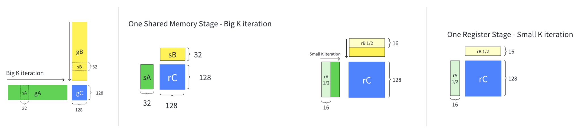

# CUDA Programming 8.1

我需要将之前的 cutlass 笔记 (CUDA Programming 7 & 8) 进行一个调理清晰的整理，所以将该笔记命名为 8.1

目前的一个 GPU 编程趋势：以 Tile 视角进行编程。最近有一个 [TileLang](https://github.com/tile-ai/tilelang) 项目也很火，不过我了解不多😂

一个 Tile 即一个 Block 所能处理的数据块，一个 Tile 需要做到承上启下的作用：

1. Tile 中的数据向下分配到 thread level (layout tv parition)
2. Tile 进行重复，处理完整的 problem size (tiler zipped divide)

通过 tiler 作为解决问题的粒度，能够更清晰地构建出 kernel pipeline，这也是 triton 的优势之一：以 block 作为编程粒度，开发者不用去考虑 thread level 的问题。在 cutlass 当中，通过 tile 承上启下的功能，完成具体的 thread level 代码。

## 核心抽象

### Layout Algebra

这是整个 cute 的核心，并且 cute 本身文档很难读，而且网上没有太多的学习资料，所以就算是 GPT 也很难给出好的回答。我的学习资料主要来源于三个部分：1. Reed zhihu 2. [Lei Mao's blog](https://leimao.github.io/article/CuTe-Layout-Algebra/) 3. [A note on the algebra of CuTe Layouts](https://research.colfax-intl.com/a-note-on-the-algebra-of-cute-layouts/)

我想以四个部分来介绍，目的是为了形成对 layout algebra 的清晰理解，使得我在阅读代码的时候能够进行逻辑推理

1. layout 基本概念
2. layout algebra 基本运算
3. layout algebra 组合运算
4. layout algebra 直观总结

#### 基本概念

layout 概念非常简单，就是由两部分组成：shape & stride，二者共同构建出一个整数到整数的映射：$\mathbb{N} \rarr \mathbb{N}$
$$
shape=(s_0,s_1,...,s_{n-1})\\ stride=(d_0,d_1,...,d_{n-1})\\
$$
为了完成这个映射，我还需要引入一个概念：整数与多维坐标的同构性 ([isomorphism](https://en.wikipedia.org/wiki/Isomorphism))。在数学上，两个东西同构意味着二者本质上是一个东西，二者可以通过一个映射进行可逆的转换。现在我们来构建整数与多维坐标的转换，就能够证明二者的同构性。我们定义多维坐标是 shape 空间中的一个点 $(x_0,x_1,...,x_{n-1})$，通过点积我们就能完成多维坐标到整数的转换
$$
x=f(x_0,x_1,...,x_{n-1}) = x_0·1+x_1s_0+...+x_{n-1}\prod_{i=0}^{n-2}s_{i}
$$
而整数到多维坐标的转换则是通过取余完成
$$
f'(x)=\left( x \bmod s_0,\ \left\lfloor \frac{x}{s_0} \right\rfloor \bmod s_1,\ \ldots,\ \left\lfloor \frac{x}{s_0 \times \cdots \times s_{n-2}} \right\rfloor \bmod s_{n-1} \right)
$$
实际上这就是列优先的顺序排列方式

```python
# shape (2, 3) with its int
(0,0)<->0      (0,1)<->2      (0,2)<->4
(1,0)<->1      (1,1)<->3      (1,2)<->5
```

有了以上的转换过后就可以定义 layout function 映射了，定义为如下
$$
Layout(x) = g(f'(x))
$$
其中 $f'(·)$ 即为将整数转换为坐标的映射，而 $g(·)$ 为将坐标转换为整数的映射，其本质是坐标 coord 与步长 stride 的点积
$$
g(x_0,x_1,...,x_{n-1})=coord ·stride=s_0d_0+s_1d_1+...+s_{n-1}d_{n-1}\\
$$
如此一来我们就完成了从整数到整数的映射：我们从整数 $x$ 出发，寻找其对应的坐标点，然后通过步长进行新的映射

此时你可能发现了，将 $f$ 与 $g$ 其实非常相似，都是将坐标映射到整数。在之前我也提到了，$f$ 本身就是 row-major 的排列方式，其可用一个特殊的 layout 来表示，该 layout 我们称之为 layout left (or natural layout)
$$
shape=(s_0,s_1,...,s_{n-1})\\ stride=(d_0,d_1,...,d_{n-1})\\
d_i=\prod_{j=0}^{i-1}s_j=d_{i-1}s_{i-1},d_0=1
$$
举一个例子，一个 shape 为 `(2, 3, 4)` 的 natural layout 为

```python
Layout(shape=[2, 3], stride=[1, 2])
     0      2      4
     1      3      5
```

有了 layout left，那就有 layout right，也就是行主序排列

```python
Layout(shape=[2, 3], stride=[3, 1])
     0      1      2
     3      4      5
```

Layout 其中一个作用就是用来描述坐标与内存位置。这是很自然的事情，因为物理内存永远都是以一维的形式来表达，**所以在 cutlass cute 中就是用一个指针 + 一个 layout 来描述一个 tensor，并且在 cutlass 中以 `shape:stride ` 的形式 print layout**

```c++
Tensor(Ptr const& ptr, Layout const& layout)
Layout(shape=[2, 3], stride=[3, 1])	// (2, 3):(3, 1)
```

而实际上 Layout 可以用来描述更多的事情，例如：如何将一个 $(M,N)$ 形状 tensor 分配到 $(T,V)$ 形状当中。其中 $T$ 就是 threads 数量，$V$ 是每一个 thread 拥有的 values，这将在基本运算小节中进行介绍

#### 基本运算

layout algebra 最抽象的部分在于其基本运算，尤其是以下两个基本运算：

1. complement，补运算
2. compose，复合运算

当然还有其他的运算，例如 concat, coalecse，我用代码来简单解释

```python
"""
@dataclass
class Layout:
    shape: List[int]
    stride: List[int]
"""

A = Layout([2, 3], [1, 2])
B = Layout([4], [10])
coalesce(A)	# Layout(shape=[6], stride=[1])
concat(A, B)# Layout(shape=[2, 3, 4], stride=[1, 2, 10])
```

concat 就是将 shape & stride 分别连接，而 coalecse 则是合并 shape & stride，以更少维度呈现

##### Complement

补运算需要两个元素，整数 $M$ 和 layout 本身。我先用一个一维的例子来说明补运算的作用，这也是 reed zhihu 中所使用到的例子

```python
A = Layout([4], [2])
B = complement(8, A)    # Layout(shape=[2], stride=[1])
```

在 reed zhihu 中说到

> 当codomain存在不连续时，则存在空洞的位置，如图4所示，这时候我们可以构造一个Layout2能够填充上codomain的空洞位置，此时我们构造的Layout则为原Layout的补集

我认为 complement 的作用是计算出了 layout 所需要重复的“次数”以填满整个 $M$ 空间。用上面的例子来说

```python
0 2 4 6
0 1 2 3 4 5 6 7
```

A 还需要重复两次才能够填满 0~8 的整个空间，而后面的 stride 则描述了重复空间之间的间隔，在这里间隔是 1。实际上只需要将 A 和 A 的补 concat 起来就会发现，二者组成了一个连续的空间

```python
C = concat(A, B)	# Layout([4, 2], [2, 1])
```

在这个 case 中 concat 过后的结果是一个 layout right 排布

再举一个二维的例子

```python
A = Layout([2, 3], [2, 4])
B = complement(24, A)	# Layout(shape=[2, 2], stride=[1, 12])

# Layout A
#     0      4      8
#     2      6     10

# Layout([4, 6], [1, 4])
#     0      4      8     12     16     20
#     1      5      9     13     17     21
#     2      6     10     14     18     22
#     3      7     11     15     19     23
```

可以看到 A 需要在两个维度（在 cutlass 中习惯把一个维度称之为一个 mode）的方向上都分别重复两次。在第一个 mode 上重复空间的间隔是 1，而在第二个 mode 重复空间的间隔是 12。我们仍然可以将 A 和 B 进行对应 mode 的 concat

```python
A = Layout([2, 3], [2, 4])
B = Layout([2, 2], [1, 12])
C = Layout([(2, 2), (3, 2)], [(2, 1), (4, 12)])
```

concat 之后的 Layout C 实际上可以看做一个合并的 `Layout([4, 6], [1, 4])`

现在我们再来看 complement 的公式就会发现其中的奥秘：
$$
\operatorname{complement}(A, M) = \left( d_{0},\ \frac{d_{1}}{s_{0}d_{0}},\ \frac{d_{2}}{s_{1}d_{1}},\ \cdots,\ \frac{M}{s_{a}d_{a}} \right) : \left( 1,\ s_0 d_{0},\ s_1 d_{1},\ \cdots,\ s_a d_{a} \right)
$$
其本质就是在计算每一个 mode 还需要重复多少次才能够填满整个空间，重复空间的间隔即为子空间大小 $s_id_i$

##### Compose

既然是映射（函数），那么将两个函数进行复合是再正常不过的想法了。从直观上来说将两个 layout 进行 compose 非常简单，毕竟都是整数到整数的映射：
$$
g_3=g_1(g_2(x))
$$
但是需要考虑的问题是，如何将新的 compose 结果 $g_3$ 描述为一个合法的 layout 结构 `(shape, stride)`。而这个描述其实还是要化不少笔墨介绍的，这里省略，可参考 Definition 2.13 from  [A note on the algebra of CuTe Layouts](https://research.colfax-intl.com/a-note-on-the-algebra-of-cute-layouts/)


NOTE: 其实 layout algebra 对于输入其实都是有要求的，并不是任意两个 layout 进行 compose 都是可行的，其对于整除性还是有不少要求。好消息是如果数值都是以 $2^n$ 存在，整除性质就会得到很好的保障，而这正是在 GPU 编程中常用的数值。我在笔记 CUDA Programming 8 中有简要说明

虽然说需要严谨的数学来保证 compose admissibility，但这不妨碍其本质就是上述所说的复合函数，即：从一个 domain 映射到另一个 domain。我将以一个非常具体的例子帮助理解这个 compose 过程

```python
TV2MN = Layout([4, 2, 2], [2, 1, 8])
MN2Memory = Layout([4, 4], [4, 1])
```

首先我定义了两个 layout，第一个 `TV2MN` 描述了 thread values 所对应的 MN 映射。第二个 `MN2Memory` 描述了 MN 到内存的映射。更具体来说

1. `TV2MN` 描述了 4 个线程，每一个线程拥有有 (2, 2) 个 values，这些 values 将映射到一个 shape 为 (M, N) 的 tensor 上。该 layout 也将描述 tensor 是如何被分配到线程当中的
2. `MN2Memory` 描述了 tensor 中各个坐标的 value 在内存当中的位置。在例子当中是一个 layout right 的排布，也就 tensor 在内存中是行优先排列

通过 compose 我们可以直接获得 `TV2Memory` 这样的映射，该映射即代表了内存中的数据如何被分配到线程当中

```python
TV2Memory = compose(MN2Memory, TV2MN) # Layout(shape=[2, 2, 4], stride=[1, 8, 2])
```

我们将这个例子打印出来，通过 step by step 的方式看下整个 compose 的过程：

```python
TV2MN: Layout(shape=[4, 2, 2], stride=[2, 1, 8])
     0|     1|     8|     9|
     2      3     10     11
     4      5     12     13
     6      7     14     15
MN natural: Layout(shape=[4, 4], stride=[1, 4])
     0|     4      8|    12
     1|     5      9|    13
     2      6     10     14
     3      7     11     15
MN2Memory: Layout(shape=[4, 4], stride=[4, 1])
     0|     1      2|     3
     4|     5      6|     7
     8      9     10     11
    12     13     14     15
TV2Memory: Layout(shape=[2, 2, 2, 2], stride=[8, 1, 4, 2])
     0|     4|     2|     6|
     8     12     10     14
     1      5      3      7
     9     13     11     15
```

以 thread 0 为例：

1. 其对应的 MN index 为 `(0, 1, 8, 9)`
2. 通过 MN index 可以找到 `(0, 1, 8, 9)` 分别对应坐标 `(0,0), (1,0), (0,2), (1,2)`
3. 通过对应坐标找到 `MN2Memory` 所对应的值为 `(0, 4, 2, 6)`
4. 所以 thread 0 的 4 个 values 将会寻找内存中第 0, 4, 2, 6 个元素

由此我们就完成了一个映射，其从 TV domain 出发，映射到了 Memory domain。这也引出了 compose 的一个直观性质：不改变 source domain，即输入的 layout “形状”是不会改变的

```python
TV2MN: Layout(shape=[4, 2, 2], stride=[2, 1, 8])
TV2Memory: Layout(shape=[(2, 2) 2, 2], stride=[8, 1, 4, 2])
```

##### Inverse

同样的，在函数中也存在逆函数。在 layout algebra 中的逆函数定义可参考 [reed-zhihu](https://zhuanlan.zhihu.com/p/662089556) 中的 two line notation 表示形式。所谓的 two line 就是：input domain 为一个 line，output domain 为一个 line，下面举一个例子

```python
# Layout(shape=[2, 3], stride=[3, 1])
# [0, 1, 2]
# [3, 4, 5]

coord: [0, 1, 2, 3, 4, 5]
value: [0, 3, 1, 4, 2, 5]

# sort the pair according to value
coord: [0, 2, 4, 1, 3, 5]
value: [0, 1, 2, 3, 4, 5]

# switch coord and value as new layout
coord: [0, 1, 2, 3, 4, 5]
value: [0, 2, 4, 1, 3, 5]
```

上述 two line notation 用于理解 inverse 是比较直观的，但是对于理解 inverse 过后 layout 形式是怎么样的，没有太大帮助。具体来说，他们的 shape & stride 应该如何得到？在 [Lei Mao's blog](https://leimao.github.io/blog/CuTe-Inverse-Layout/) 当中证明了 compact layout inverse 过后的 shape & stride 应当如何计算，不过 blog 当中的叙述顺序对我来说略显晦涩，我这里用我自己的思考逻辑来整理

Conditions:

- Layout function: $f_L(x)$

- shape & stride 为 $S=(s_0,s_1,...,s_n),D=(d_0,d_1,...d_n)$

- natural layout funciton 将多维坐标 $(x_0, x_1, ...,x_n)$ 映射为 $x$
  $$
  x=x_0+x_1·s_0+...+x_n·\prod_0^{n-1}s_i
  $$

Target:

- 找到 inverse layout: $f_{L'}(x)$ 使得满足
  $$
  f_{L'}(f_L(x)) = x
  $$

- inverse layout $L'$ shape & stride 为 $S'=(s_0',s_1',...,s_n'),D'=(d_0',d_1',...d_n')$

现在开始正式推导。对于输入 $x$ 对应的 $L$ 坐标为 $(x_0, x_1, ..., x_n)$，我们设其输出为 $x'$
$$
f_L(x)=x'
$$
输出 $x'$ 所对应的 $L^{-1}$ 坐标为 $(x_1',x_2',...,x_n')$，由 $L'$ shape 的 natural layout function 完成映射。由等式条件得
$$
\begin{aligned}
f_{L'}(f_L(x)) &= f_{L'}(x') \\
               &= f_{L'}(x_0',x_1',...,x_n') \\
               &= x_0' \cdot d_0' + x_1' \cdot d_1' + \cdots + x_n' \cdot d_n' \\
               &= x \\
               &= x_0 + x_1 \cdot s_0 + \cdots + x_n \cdot \prod_{i=0}^{n-1} s_i
\end{aligned}
$$
其中最重要的等式为
$$
x_0' \cdot d_0' + x_1' \cdot d_1' + \cdots + x_n' \cdot d_n' =x_0 + x_1 \cdot s_0 + \cdots + x_n \cdot \prod_{i=0}^{n-1} s_i
$$
下面的证明思路为：如果我们能够找到一个 permutation $I=\{i_0,i_1,...,i_n\}$，使得 $x_{i_0}'=x_0,x_{i_1}'=x_1,...,x_{i_n}'=x_n$，那么我们就能对应多项式的每一项，直接算出每一个 $d'$ 的值。现在我们来考察 $(x_0,x_1,...,x_n)$ 与 $(x_0',x_1',...,x_n')$ 之前的联系是什么，是否存在这样的 permutation

他们之间的关系非常清晰
$$
(x_0,x_1,\ldots,x_n) \xleftrightarrow{L} x' \xleftrightarrow{N} (x_0',x_1',\ldots,x_n')
$$
这里的 $N$ 就是 inverse layout 的 natural function。现在问题转换为：对于一组  $(x_0,x_1,...,x_n)$ 与 $(x_0',x_1',...,x_n')$，他们彼此都是对方的 permutation，我们需要找到合适的 natural layout function 即可。其实对于第一个要求非常好满足（忽略 natural layout 限制），我们可以直接对 $L$ 中的 shape & stride 进行 permute 即可。以简单的 `Layout(shape=[2,3], stride=[3,1])` 为例子，当 permute shape & stride 时，坐标也随之 permute
$$
(x_0,x_1) \xleftrightarrow{(2,3):(3,1)} x' \xleftrightarrow{(3,2):(1,3)} (x_1,x_0)
$$
现在只需要考虑 natural layout 的限制即可，而答案也就随之浮出水面：只需要将 $L$ 的 shape & stride permute 成为一个 natural layout (left layout) 即可。更具体来说，根据 stride 的大小，从小到大进行排列，由于 layout 有 compact 保证，没有任何空洞，所以排列出来的 layout 必定也是 natural layout。所以此 permutation 存在且唯一，确定了 inverse layout 的 shape，其对应的 stride 也可由下面的式子进行计算
$$
d_{i_0}'=1,\\
d_{i_1}'=s_0,\\
...,\\
d_{i_n}'=\prod_{i=0}^{n-1} s_i,\\
$$
那么根据上述结论，我们就找到了 $L'$ 的 shape & stride 了！**其中 shape 的结论会很 clean，就是将 $L$ 进行 sort 过后的 shape。从定性来说：原始 stride 小的 shape 在 inverse 过后会靠前；反之则会靠后**

而在 [写给大家看的 CuTe 教程：Layout compose & Inverse](https://zhuanlan.zhihu.com/p/1962625273636845008) 中提到，通常 inverse 过后还会使用 `with_shape` 来构建我们期望的 layout shape，我们必须要了解 inverse 的输出形状到底是什么，才能正确地使用 `with_shape`。具体的例子在 retile 部分中，计算 `(t, v) -> (m, n)` layout 进行展示，其精妙地展示了 inverse 的一个核心作用：domain 的交换。如果我们获得了 `(m, n) -> (t, v)` 的映射，直接使用 inverse 就可以获得 `(t, v) -> (m, n)` 映射

#### 组合运算

有了 layout algebra 所定义的基础运算就可以定义一些更复杂更有用的运算：divide & product

##### divide

divide 是划分数据中最常用的方法，尤其是 zipped divide。我先介绍 logical divide 的一维运算公式（B 是维度为1的 layout，A 没有限制）

```python
def logical_divide(A, B):
    M = A.size()
    c_B = complement(M, B)
    concatenated = concat(B, c_B)
    return compose(A, concatenated)
```

可以看到，其先计算了 B 补集，然后与 B 进行了 concat，最后用 concat 过后的 layout 与 A 进行了 compose。通常我们称 layout B 就是一个 **Tiler**，以 Tiler 为粒度对 A 进行了划分。在实际应用过程中都是对一个 layout 进行逐维度 divide (by-mode divide)

```c++
Layout Shape : (M, N, L, ...)
Tiler Shape  : <TileM, TileN>

logical_divide : ((TileM,RestM), (TileN,RestN), L, ...)
zipped_divide  : ((TileM,TileN), (RestM,RestN,L,...))
```


在上面的例子中 Tiler 是不连续的，而我们更常会遇到的 Tiler 是最简单的 stride 为 1 的 Tiler。如 `B = Layout([4], [1])`，这样就会以 4 为单位切分该轴。zipped divide 会将 Tiler 维度直接提到最前面来，以方便我们进行索引操作，通常这个维度可以是 thread，这样通过索引就获得具体某个线程所对应的数据

通常我们遇到的情况都是：A & B 都是 1-dim，如果 A 为多维 layout，那么就需要谨慎看待，最后的结果一般不是我们想要的。举个例子

```python
l1 = Layout([5, 4], [1, 30])
l2 = Layout([4], [1])
# logical_divide(l1, l2) won't work
A size: 20
complement of B: Layout(shape=[5], stride=[4])
concated (B, c_B): Layout(shape=[4, 5], stride=[1, 4])
```

原因在于 concated layout 无法和 A 进行 compose。不过好消息是在进行数据 divide 时，通常是对 MN shape 进行 divide，这是一个非常规整的 domain，满足我们在 by-mode divide 时各个 mode dim 都是 1 的需求

##### product

这里有个割裂感：我们说 product 为 divide 的逆运算，但实际上我发现二者并不能进行可逆操作。例如 `C != A.product(B).div(B)`。但是这个定义并不符合我们的直觉，严谨的数学定义在 [Lei Mao's blog](https://leimao.github.io/article/CuTe-Layout-Algebra/) 中有所阐述。这里以一个 [2D exmaple](https://docs.nvidia.com/cutlass/latest/media/docs/cpp/cute/02_layout_algebra.html#logical-product-2-d-example) 作为说明


这个 product 的结果非常直观：把 `(2, 5): (5, 1)` 进行重复，重复维度为 `(3, 4)`。在我的期望中，直接使用 tiler `<3:1, 4:1>` 就能完成上述功能，但实际上用的 tiler 为 `<3:5, 4:6>`，这就是因为 product 的定义并不是我们想象中的直观，仍然是根据 complement & compose 来定义的。为了让 product 功能与我们的编程直觉相符，cute 直接构建了几种常见的 api 方便调用，参考 [reed zhihu](https://zhuanlan.zhihu.com/p/662089556)

| 乘法模式 | 乘积的shape      |
| -------- | ---------------- |
| logical  | ((x, y), (z, w)) |
| zipped   | ((x, y), (z, w)) |
| tiled    | ((x, y), z, w)   |
| blocked  | ((x, z), (y, w)) |
| raked    | ((z, x), (w, y)) |

上面只列举了 shape，对于 stride 而言，**相同 dimension 的 stride 也是一样的**：即任意乘法模式中所有 x 对应的 stride 都一样。需要注意的是，这些操作是 layout x layout，而不是 layout x tiler。所以他们都是 rank sensitive 的，即两个 layout 的维度必须一致。同时和 divide 一样，通常使用在相对规整的 domain，即 layout 的 size 和 cosize 一致。否则存在空洞的话，product 也可能无法进行，举一个例子

```cpp
auto l1 = make_layout(make_shape(_4{}, _5{}), make_stride(Int<30>{}, _1{}));
auto l2 = make_layout(make_shape(_2{}, _4{}));
// can't do logical_product(l1, l2)
```

这里点出一个 product 和 divide 的重要差异：divide 习惯使用 layout divide tiler，而 product 习惯使用 layout product layout。另外一个实验是，product 的顺序是会改变结果的

```cpp
auto base_layout = make_layout(make_shape(_4{}, _3{}), make_stride(_4{}, _1{}));
auto layout_x2 = blocked_product(base_layout, make_layout(make_shape(_1{}, _2{})));
auto layout_x2_x2 = blocked_product(layout_x2, make_layout(make_shape(_2{}, _1{})));
auto layout_x4 = blocked_product(base_layout, make_layout(make_shape(_2{}, _2{})));

// Product order test
// ((_4,_1),(_3,_2)):((_4,_0),(_1,_16))
// (((_4,_1),_2),((_3,_2),_1)):(((_4,_0),_32),((_1,_16),_0))
// ((_4,_2),(_3,_2)):((_4,_16),(_1,_32))
```

我先对 base layout 在第二个 dim 进行扩张，然后再对第一个维度进行扩张，其结果和同时扩张两个维度是不一致的

#### 直观总结

1. complement 提供了重复的能力，让 tiler 通过重复覆盖目标 layout，以达到方便分割的目的。
2. compose 提供了重排的能力，让 tiler 自由地选择目标 layout 中位置，以达到重新排列的目的。而重新排列过后的 layout 能够更方便我们进行操作，或者用特定排列方式满足一些物理硬件上的要求

### MMA

#### MMA Atom

mma atom 可以大致认为由两个部分组成：mma op & mma traits

1. MMA op 用于描述所使用的 PTX 命令，以及该命令所需要的寄存器

2. MMA traits 用于描述需要完成一个 MMA 所缺失的部分：包含数据类型、数据形状，线程数据排布 tv layouts

以 mma op `SM80_16x8x16_F16F16F16F16_TN` 为例来说明

```c++
// MMA 16x8x16 TN
struct SM80_16x8x16_F16F16F16F16_TN
{
  using DRegisters = uint32_t[2];
  using ARegisters = uint32_t[4];
  using BRegisters = uint32_t[2];
  using CRegisters = uint32_t[2];

  CUTE_HOST_DEVICE static void
  fma(uint32_t      & d0, uint32_t      & d1,
      uint32_t const& a0, uint32_t const& a1, uint32_t const& a2, uint32_t const& a3,
      uint32_t const& b0, uint32_t const& b1,
      uint32_t const& c0, uint32_t const& c1)
  {
#if defined(CUTE_ARCH_MMA_SM80_ENABLED)
    asm volatile(
      "mma.sync.aligned.m16n8k16.row.col.f16.f16.f16.f16 "
      "{%0,  %1},"
      "{%2,  %3,  %4,  %5},"
      "{%6,  %7},"
      "{%8,  %9};\n"
      : "=r"(d0), "=r"(d1)
      :  "r"(a0),  "r"(a1),  "r"(a2),  "r"(a3),
         "r"(b0),  "r"(b1),
         "r"(c0),  "r"(c1));
#else
    CUTE_RUNTIME_ASSERT("Attempting to use SM80_16x8x16_F16F16F16F16_TN without CUTE_ARCH_MMA_SM80_ENABLED");
#endif
  }
};
```

该 mma op 就是用来封装 PTX 接口的，给出所使用的命令以及该命令需要的寄存器。该 PTX 命令是一个 16x8x16 的矩阵乘，对应的数据类型都是浮点，而 `TN` 代表的是 transposed & normal，分别代表 row-major & col-major。需要强调两点：

1. 是 `TN` 并不是代表矩阵 A & B 他们的数据排布就是 row-major & col-major，这其实只是 PTX 遵循 BLAS 当中的语言约定。而真实的 A & B 数据排布，参考 [TN & NT & TT & NN](https://github.com/NVIDIA/cutlass/blob/main/media/docs/cpp/cute/0x_gemm_tutorial.md#aside-m-major-n-major-k-major)，`TN` 其实都是 row-major。并且输出的 C 也是 row-major
2. PTX 命令名字虽然包含了矩阵形状以及数据类型，但是只是名字，实际上在 mma op 中并不具体包含这些信息，所以仍需要 mma traits 提供

接下来看该 mma op 对应的 mma traits

```c++
template <>
struct MMA_Traits<SM80_16x8x16_F16F16F16F16_TN>
{
  using ValTypeD = half_t;
  using ValTypeA = half_t;
  using ValTypeB = half_t;
  using ValTypeC = half_t;

  using Shape_MNK = Shape<_16,_8,_16>;
  using ThrID   = Layout<_32>;
  using ALayout = Layout<Shape <Shape < _4,_8>,Shape < _2,_2,  _2>>,
                         Stride<Stride<_32,_1>,Stride<_16,_8,_128>>>;
  using BLayout = Layout<Shape <Shape < _4,_8>,Shape <_2, _2>>,
                         Stride<Stride<_16,_1>,Stride<_8,_64>>>;
  using CLayout = SM80_16x8_Row;
};

```

正如我之前所说，mma traits 提供了：数据类型 (val type)、数据形状 (shape mnk)、线程数据排布 (thread id, ABC layout)

线程排布其实就是 tv layouts，描述的 (threads, values) -> MK 的映射关系，在 reed zhihu 中用更详细的注释说明：

```c++
using ALayout =      // (Logical thread id (tid), Logical value id (vid)) -> Flat MK-coord
using BLayout =      // (Logical thread id (tid), Logical value id (vid)) -> Flat NK-coord
using CLayout =      // (Logical thread id (tid), Logical value id (vid)) -> Flat MN-coord
```

#### TiledMMA

mma atom 提供了一个 warp 所能完成的矩阵乘大小，通常我们会在一个 block 中使用更多的 threads，将多个 mma atom 组成一个 tiled mma。该组合通过参数 `AtomLayoutMNK` 来定义 atom 在 MNK 方向上重复的次数。

```c++
  static constexpr int kMmaEURepeatM = 2;
  static constexpr int kMmaEURepeatN = 2;
  static constexpr int kMmaEURepeatK = 1;
  using MMA_EU_RepeatT = decltype(make_layout(make_shape(Int<kMmaEURepeatM>{}, Int<kMmaEURepeatN>{}, Int<kMmaEURepeatK>{})));
  using MMA = decltype(make_tiled_mma(mma_atom{}, MMA_EU_RepeatT{});
```

上述代码在 MN 方向上重复了两次，于是从原来的 `16x8x16` 变为了 `32x16x16` 的矩阵乘

NOTE：绝大多数的情况下，都是在 MN 方向上重复 mma atom，几乎从来不会在 K 方向上重复 mma atom [[QST] TiledMMA with `>1` Atoms in K dimension --- how to reduce?](https://github.com/NVIDIA/cutlass/issues/1391#issuecomment-1987272892)。这其实是合理的，在 MN 方向上的重复可以通过简单的 atom 重复完成，而 K 方向上的重复需要进行额外的累加：即需要将多个重复的 mma atom 结果进行累加。通常在 K 方向的累加是通过 main loop 完成

另外还有一个参数 `PermutationMNK`，该参数是比较迷惑的，对于该参数的解释最终都会回到 [[QST] What is PermutationMNK in TiledMMA in CUTLASS 3.4 changes?](https://github.com/NVIDIA/cutlass/discussions/1345)。其中对 `PermuationMNK` 最本质的介绍是：

> The easiest way to think about it is that the `Permutation` parameter is a **Tiler** for the MNK modes of the MMA.

我先举一个实际例子说明其功能，再总结一下其影响

```c++
  // mma atom shape is 16x8x16
  using mma_atom_shape = mma_traits::Shape_MNK;
  static constexpr int kMmaPM = 1 * kMmaEURepeatM * get<0>(mma_atom_shape{});
  static constexpr int kMmaPN = 2 * kMmaEURepeatN * get<1>(mma_atom_shape{});
  static constexpr int kMmaPK = 1 * kMmaEURepeatK * get<2>(mma_atom_shape{});
  using MMA_P_T = Tile<Int<kMmaPM>, Int<kMmaPN>, Int<kMmaPK>>;
  using MMA = decltype(make_tiled_mma(mma_atom{}, MMA_EU_RepeatT{}, MMA_P_T{}));
```

这里 `MMA_P_T` 就是 `PermutationMNK`，在例子中的具体值为 `M=(16x2), N=(8x2x2), K=(16)`，即 `32x32x16`。由此就形成了一个 `32x32x16` 的 Tiler，会将输入数据按照这个 Tiler 形状进行分割。可以看到我们在 `AtomLayoutMNK` 重复的基础上，再对 N 方向又扩大了一倍

该参数其实有两个重要影响：

1. 影响 TiledMMA 数据排布，但该影响现在一般不会发生

   因为通常所使用的 tiler 是普通的 stride=1 的 layout，不会对数据进行任何的排布（permute）。如果 tiler 中某一个维度使用了特殊的 layout 例如 `Layout<Shape <_2,_4,_4>, Stride<_1,_8,_2>>`，这将会对数据进行重新的排布。这会将会影响 data partition 的结果，使得线程获得不一样的数据。但并不会影响最终的矩阵乘结果，因为 permutation 不改变 reduction 结果，并且最后数据在 copy 的过程中也会回到 permutation 之前的位置
2. **影响 `get_layoutA/B/C_TV` & `tile_size`。我认为这其实是针对于 tiled copy 设计的一个接口，并不是针对于 tiled mma 本身所设计。**

   设置了 `PermutationMNK` i.e. tiler 过后，threads 就会以该 tiler 为大小进行分配数据，形成对应的 tv layouts。通常该 tv layouts 会被 tiled copy 所使用，而不会被 tiled mma 所使用。以上述例子中的 B 矩阵来说明：其 tv layouts 所对应 NK 区域为 `(32, 16)`，即 tiler 中的 NK 大小，每一个 thread 所拥有的 values 为 8；需要注意的是在 mma atom 当中，每一个 thread 所拥有的 values 应该为 4（查看上面的 `BLayout`），所对应的 NK 区域为 `(16, 16)`。我们必须要分开看待这两个 tv layouts，前者用于 tiled copy partition，后者才是真正用于 tiled mma partition 的 tv layouts。**为了合理区分这两个 tv layouts 我以 tiled tv layouts 和 block tv layouts 来进行命名**，这一点在后面的 hgemm 实践中会有具体表现

#### ThrMMA

thread mma 的作用是根据 tiled mma 中所定义的 block tv layouts & mnk shape 对 tensor 进行划分（这里我忽略 `permuationMNK` 所带来的数据排布影响），获得每一个线程所需要的数据。对于一个 tensor shape `(M, N)`，使用 thread mma 按照 matrix A 的 tv layouts & mn shape 对 tensor 划分过后得到每个线程的 tensor shape 为：
$$
(\text{num}_V, \text{num}_M, \text{num}_N)=(V, \frac{M}{m},\frac{N}{n})
$$
第一个维度 `num_v` 代表了 block tv layouts 当中每一个 thread 控制的 values 数量，而 `num_M` 和 `num_N` 则代表 tensor 中的的 M & N 在各自维度上包含了多少个 atom。以上述 tiled mma 为例子，matrix B block tv layouts 中每一个 thread 有 4 个 values，nk shape 为 `(16, 16) = (8x2, 16)`，所以如果我们给定一个 tensor shape 为 `(128, 32)` 的话，得到的 thread tensor shape 为 `(4, 8, 2) = (4, 128/16, 32/16)`

**ThrMMA 的作用仅限于划分，最终传入 `cute::gemm` 方法的仍然是 TiledMMA**

### Copy

copy 其实是比 mma 更加灵活更加复杂的操作。因为其要考虑到不同的硬件结构 (global memory, shared memory, register)，以及 source & destination 对于数据排布不同的要求。GPU 编程的魅力之一就在于如何搬运大量数据以增加数据吞吐量

#### Copy Atom

copy atom 我认为由三个部分组成：copy op, copy traits, copy type。

1. copy op 用于描述 PTX 指令以及所需的寄存器
2. copy traits 用于描述 src & dst tv layouts，以及线程数量。这里的 tv layouts 区别于 mma atom，其映射的 domain 不是矩阵的 shape，而是 bits，在实际使用过程中实际上是提供的数据的**逻辑位置**。这在之后的 ldmatrix/tiled copy 小节中将具体表现
3. copy type 表示数据类型

相比于 mma traits，copy traits 不一定是以 warp 单位来定义，即 tv layouts 中的 t 大小不一定是 32。我对此有一些疑问：难道 GPU 不都应该以 warp 为单位来执行吗？看来我将执行单元和内存操作的最小单位混淆了，二者应当区分看待

> From DeepSeek
>
> Warp 是执行单元，但不是内存操作的最小单位。确实，warp（32线程）是 GPU 的基本执行单元，但内存操作的最小单位不一定与 warp 对齐。这些指令可以由单个线程发起（虽然通常整个 warp 会协同工作）支持各种大小和模式

下面就是一个具体的 copy atom 及其对应 copy traits 在实际代码中的使用

```c++
  using T = cute::half_t;
  using g2s_copy_op = SM80_CP_ASYNC_CACHEGLOBAL<cute::uint128_t>;
  using g2s_copy_traits = Copy_Traits<g2s_copy_op>;
  using g2s_copy_atom = Copy_Atom<g2s_copy_traits, T>;
```

这里创建了一个 global to shared memory 的 copy atom，每一个 copy atom 可以完成一个 128bit 的数据搬运，由于我们使用的数据类型为半精度 16bit，所以一次将搬运 8 个数据元素

#### TiledCopy

同样的，和 tiled mma 一样，我们在一个 block 当中通常会有多个 threads，我们仍然需要对 copy atom 进行排布，组成一个更大的 tiled copy。下面就是一个创建 tiled copy 的例子

```c++
  // Each Tile will copy 32x32 half_t elements
  using G2SCopyA = decltype(make_tiled_copy(g2s_copy_atom{},
                                            make_layout(make_shape(Int<32>{}, Int<4>{}),
                                                        make_stride(Int<4>{}, Int<1>{})),
                                            make_layout(make_shape(Int<1>{}, Int<8>{}))));
  using G2SCopyB = G2SCopyA;
```

该 tiled copy 负责将 A & B 矩阵从 global memory 复制到 shared memory，每一次 copy 的 mn shape 为 `(32, 32)`。我想从 `make_tiled_copy` 的具体实现来看下传入参数的含义，我认为非常巧妙

```c++
make_tiled_copy(Copy_Atom<Args...> const& copy_atom,
                ThrLayout          const& thr_layout = {},     // (m,n) -> thr_idx
                ValLayout          const& val_layout = {})     // (m,n) -> val_idx
{
  // Take the raked_products to compute the Layout_MN
  // (M,N) -> (thr_idx, val_idx)
  auto layout_mn = raked_product(thr_layout, val_layout);
  // (thr_idx, val_idx) -> (M,N)
  auto layout_tv = right_inverse(layout_mn).with_shape(make_shape(size(thr_layout), size(val_layout)));
  // Tiler for extracting relevant elements
  // (M,N) -> tensor coord
  auto tiler = product_each(shape(layout_mn));
  return make_tiled_copy_impl(copy_atom, layout_tv, tiler);
}
```

可以看到在构造 tiled copy 中我们传入了两个 layout，一个是 `thr_layout`，另一个是 `val_layout`，我在一开始看到这两个 layout 的时候，只是单纯地觉得这就是在描述 thread 和 values 的排布，然后把这两个 layout 乘起来就获得了一个 `(32, 32)` 的 layout，正好就是 tiled copy 所覆盖的 tensor 区域，并且我错误地认为了这是一个 tv -> mn 的映射。而实际上这两个 layout 在描述 `(m=32, n=4) -> tid` 和 `(m=1, n=8) -> vid` 的映射，通过 raked product 进行了 interleaved 重复获得了 `(m, n) -> (tid, vid)` 的映射。所谓 interleaved 重复即为：在第二个维度是将 8 重复 4 次，而不是将 4 重复 8 次。这在实际的映射中表现为，在 n 方向会先看到同一个 thread 所拥有的连续 values，而不是同一个 value 的连续 thread。最后通过 right inverse 将映射返回成为 `(tid, vid) -> (m, n)`

```c++
auto l = Layout<Shape<_32, _4>, Stride<_4, _1>>{};
auto tiler = Layout<Shape<_2, _8>, Stride<_8, _1>>{};
auto lxtiler = logical_product(l, tiler);
auto lxtiler_rake = raked_product(l, tiler);

((_32,_4),(_2,_8)):((_4,_1),(_1024,_128))
((_2,_32),(_8,_4)):((_1024,_4),(_128,_1))
```

可以看到 `make_tiled_copy` 中还有一个 `make_tiled_copy_impl`，这个函数接受了两个参数 `layout_tv` 以及其对应的 `tiler`，他们二者就共同描述了 tiled copy 如何去划分一个 tiler 大小的数据，然后进行 copy。在实践过程中这个 `layout_tv` 通常可以是 tiled mma 中的 `get_layoutA/B/C_TV`，而 tiler 大小就是 `PermutationMNK` 所设置的 tiler size 大小

在上述例子当中只需要一个 block 进行一次 copy 就能够完成 `(32, 32)` 大小的 copy 任务。还有一种情况，**一个 tiled copy 需要一个 block 进行多次来完成 `(32, 32)` 大小的 copy 任务**，例如将上述例子中的 copy atom 换为 `Copy_Atom<UniversalCopy<cute::uint32_t>, T>`，一个线程只会复制两个 fp16 元素，此时 128 个线程只能够复制 256 个 fp16 元素，很明显并不能够一次完成 `(32, 32)` 大小的 copy 任务。所以一个 tiled copy 会执行多次来完成该 copy 任务

#### ThrCopy

利用 tiled copy 当中的 tiled tv layout & mn shape 对 tensor `(M, N)` 进行划分，得到每一个线程所拥有的 tensor，表达公式其实和 ThrMMA 是一样的
$$
(\text{num}_V, \text{num}_M, \text{num}_N)=(V, \frac{M}{m},\frac{N}{n})
$$
但不一样的是 `num_V` 不一定就是 copy atom 中的 values 数量，还可能是由于 tiled copy 会重复多次执行 copy atom 所导致的 `num_V` 的增加

**ThrCopy 的作用仅限于划分， 最终传入 `cute::copy` 方法的仍然是 TiledCopy**

#### ldmatrix

ldmatrix 是为了满足 mma atom 的特殊排布应运而生，ldmatrix 能够将自己线程的数据发送到其他线程当中，这在常规的 CUDA 编程中是做不到的，因为在 SIMT 编程下我们认为寄存器是线程私有的。


第一张图描述了 ldmatrix 的高效性：一个 thread 将搬运 8 个元素，并分配到不同的线程当中。在一般的 LDS 命令下，一个 thread 只能搬运 2 个元素，所以要进行 4 次搬运，效率大大降低。


第二张图则需要对应我们的 copy traits 一起食用。该图其实就是 ldmatrix 的 warp 版本。其搬运了一个 `(16, 16)` 大小的 half 矩阵。需要注意的是数据排布顺序要按照图示中的箭头来看

```c++
template <>
struct Copy_Traits<SM75_U32x4_LDSM_N>
{
  // Logical thread id to thread idx (warp)
  using ThrID = Layout<_32>;

  // Map from (src-thr,src-val) to bit
  using SrcLayout = Layout<Shape < _32,_128>,
                           Stride<_128,  _1>>;
  // Map from (dst-thr,dst-val) to bit
  using DstLayout = Layout<Shape <_32,Shape <_32,   _4>>,
                           Stride<_32,Stride< _1,_1024>>>;

  // Reference map from (thr,val) to bit
  using RefLayout = DstLayout;
};
```

我们把 src layout 和 dst layout 都打出来看，由于所使用的 data type 为 half，所以 src layout 和 dst layout 转化为 `(t, v) -> logical mem id` 映射


上面的打印中相同的数字代表了相同的 logical mem id，即他们代表了统一个元素。可以看到在 src 当中的 t0 拥有数据 0~7，他们分别分配到了 dst 当中的 t0~t3 中的前两个 values 当中。而对于 dst 当中的 t0 数据则来自于 t0, t8, t16, t24 的前两个 values

为什么我始终强调逻辑位置 logical mem id，这是因为这些元素在内存中的位置与逻辑位置并不一致。最重要的是：**根据 logical memory id 我们可以构建一个 src tv -> dst tv 的映射关系，从而能够轻松获得 src tv 中的元素在 dst tv 当中的位置**

#### 3 tv layouts & 1 tiler

介绍完了 ldmatrix，我们发现 source tv layouts 和 dst tv layouts 是可以不一样的，一个线程的元素可能会跑到另外的线程当中。而对于目标 tv layouts，我们如何通过 copy atom 来完成整个 copy 过程以获得目标 tv layouts 呢？这其中涉及到 3 个 tv layouts 和一个 tiler size，这是已知条件：

1. src tv layouts, `AtomLayoutSrc`

   描述 copy atom src tv layouts 映射到的 logical memory id

2. dst tv layouts, `AtomLayoutDst`

   描述 copy atom dst tv layouts 映射到的 logical memory id

3. target tv layouts, `TiledLayout_TV` 以及其对应的 tiler size `TilerMN`

   描述 `(t, v) -> (m, n)` 的映射，这针对的是 dst tv layouts。`(M, N)` 描述 src & dst tensor 的形状，`TiledLayout_TV` 就是上节 TiledCopy 中使用的 `layout_tv`

从这些已知条件出发：需要完成对 src tensor & dst tensor 的数据进行 tv 分配，各自线程进行 copy，使得 copy 完成后符合 `TiledLayout_TV` 要求。这个过程就是整个 TiledCopy，完成这个过程有2个关键点需要完成

1. tiled layout tv 通常包含了多个 copy atom tv，需要计算 copy atom tv 需要如何重复以覆盖 tiled layout tv
2. dst tensor 对应的 tv layout 已是已知条件，还需要计算 src tensor 所对应的 tv layout

第一个关键点很容易完成，只需要一个 zipped divided

```c++
// ((t, v), (rest_t, rest_v)) -> (m, n)
dst_tv_2_mn = zipped_divide(TiledLayout_TV,
					AtomLayoutDst.shape)
```

这样我们就计算出了还需要重复的 t 和 v，分别以 `rest_t, rest_v` 标识

第二个关键点也很容易完成，只需要一个 compose

```c++
// ((t, v), (rest_t, rest_v)) -> (m, n)
src_tv_2_mn = dst_tv_2_mn.compose(src_tv_2_dst_tv)
```

这里就是 `AtomLayoutSrc` 和 `AtomLayoutDst` 发挥作用的时候，二者之间通过 logical memory id 构建了一个映射 src tv -> dst tv，该映射表示为 `src_tv_2_dst_tv`，将 `dst_tv_2_mn` 与 `src_tv_2_dst_tv` 进行 compose 过后就能够构建 src tv -> (m, n) 映射，完整映射路线为：src tv -> dst tv -> (m, n)

至此整个 TiledCopy 关键点都已完成，结果必定满足 `TiledLayout_TV` 要求，因为我们一开始就是按照这个 tv layout 去分割 tensor，然后通过映射倒推出 src tensor 应该如何去分割以满足该要求

#### Copy 连续性要求

在上述讨论过程中，我只聚焦在了 src tv & dst tv 之间的 logical memory id 转换，而忽略掉了 copy atom 本身对物理内存的连续性是有要求的。例如 ldmatrix 其实是要求 src tv 中每一个 thread 所拥有的 8 个 values 在 shared memory 中是连续的。这种约束也存在在 universal copy 当中

```c++
  using R2SCopyAtomC = Copy_Atom<UniversalCopy<cute::uint32_t>, T>;
  // using R2SCopyAtomC = Copy_Atom<UniversalCopy<cute::uint16_t>, T>; // no errors
  // using R2SCopyAtomC = Copy_Atom<UniversalCopy<cute::uint64_t>, T>; // cause errors
```

当我们使用 copy atom 为 `cute::uint64_t` 的大小时，在 hgemm 的例子当中就会报错，因为 64bit 代表 4 个 half 数据，但这 4 个数据 copy 到 shared memory 中的位置是不连续的，通过这个 copy atom 是无法完成的

同样在 ldmatrix 过程也有连续性要求，先回顾一下 ldmatrix 当中的 src & dst tv layout


该图定义了 src tv 和 dst tv 之间的映射。可以看到如下的特征

```python
DST						SRC		 
----------------------------
T0~T3    V0~V1 <=> T0  V0~V7
T4~T7    V0~V1 <=> T1  V0~V7
...
T28~T31  V0~V1 <=> T7  V0~V7
----------------------------
T0~T3    V2~V3 <=> T8  V0~V7
T4~T7    V2~V3 <=> T9  V0~V7
...
T28~T31  V2~V3 <=> T15 V0~V7
----------------------------
```

用语言描述一下第一行：dst T0~T3 线程的 V0~V1 数据，对应了 src T0 线程的 V0~V7 数据。对于 ldmatrix 而言，其要求 src thread 中的 V0~V7 在内存中是连续的。OK，现在我们就用 mma atom 的 tv layout 来实际看一下，其 src thread 中的 V0~V7 是否真的连续。以 `SM80_16x8x16_F16F16F16F16_TN` 中的 matrix A 的 (dst) tv layout 为例，用 `print_latex` 打出来得到如下排布


我们可以发现 T0~T3 的 V0~V1 数据，正好是横向连续的 MK 坐标，这也说明了 T0 线程的 V0~V7 就是连续的 MK 坐标，但是为了保证内存的连续，MK -> Memory 的映射必须是 LayoutRight 即 row-major 排布内存，否则这些横向连续的 MK 坐标所对应的数据在内存仍然不连续

综上，在所给的 ldmatrix + mma layout + tensor layout 的条件下，copy 的连续性得到了满足。这也凸显出了三者的高度定制性：ldmatrix 必须和匹配的 mma layout 以及匹配的 tensor layout 进行使用，否则将会报错

#### Async Copy

在进行 copy 的时候经常会使用异步的 copy，即发出命令过后不会等待 copy 完成而是会继续执行后面的代码。但是我们也需要一些等待指令，以保证在计算时数据的确已经 copy 完成了。cutlass 提供了两个结构 `cp_async_fence & cp_async_wait` 用于完成这样的操作，在之后的 hgemm 实践中会有具体表现，这里先仅二者的功能

`cp_async_fence`

- 这是一个内存屏障（fence）操作，用于标记当前所有已提交的异步拷贝（`cp.async`）任务的完成点。
- 它的作用是确保在该 `fence` 之前的所有 `cp.async` 操作（即从全局内存到共享内存的异步拷贝）被视为一个批次，后续的 `cp.async_wait` 可以对这些批次进行同步。
- 它并不阻塞线程，只是标记一个任务提交的边界。

`cp_async_wait`

- 这是一个同步操作，用于等待之前提交的异步拷贝任务完成。
- 参数 `N` 表示“等待除了最新的 `N` 个批次之外的所有批次完成”。例如：
  - `cp_async_wait<0>`：等待所有之前提交的异步拷贝完成。
  - `cp_async_wait<1>`：允许最多 1 个批次的异步拷贝未完成（即等待除最新提交的 1 个批次外的其他所有批次完成）。
- 通常用于实现流水线的同步，确保数据在计算之前已经加载到共享内存。

### Problems solved with inverse（补充）

**补充（2025/09/17）：retile 到底要解决一个什么样的问题？结论：解决线程 register 的 layout 转换问题**

我们在思考 copy 的问题时，其实还是更容易从整体去思考，例如把一个 MN shape 的数据进行划分，每一个线程获得各自的数据，然而最后我们都是面向 thread 编程，各个线程的 register 数据都是各自独立（互不可见）的，我们必须要将自己的视角进行转换。以下有三个划分视角：

对于一个 MN shape 数据

1. 我们可以使用 mma atom 的 layout 对 MN shape 的数据进行划分，每一个线程的数据 `tCrC_0`

   假设 mma atom layout 的 mn shape 为 `(m, n)`，每一个 thread 有 4 个 values，那么 `tCrC_0.shape = (4, M//m, N//n)`

2. 我们可以使用 s2r copy atom 的 layout 对 MN shape 的数据进行划分，每一个线程的数据 `tCrC_1`

   假设 s2r copy atom 的 mn shape 为 `(2m, n)`，每一个 thread 有 8 个 values，那么 `tCrC_1.shape = (8, M//2m, N//n)` 

3. 我们可以使用 r2s copy atom 的 layout 对 MN shape 的数据进行划分，每一个线程的数据为 `tCrC_2`

   假设 r2s copy atom 的 mn shape 为 `(m, 2n)`，每一个 thread 有 8 个 values，那么 `tCrC_1.shape = (8, M//m, N//2n)`

以上三种划分，最终得到了三种数据 `tCrC_0/1/2`，而这**三种数据实际上包含了相同的数据内容**，更具体来说，这三个 tensor 的 `tensor.data()`，指向的是同一片内存，但是他们的排布 `tensor.layout()` 完全不同。实际上 retile 干的事情就是这样，把相同拥有相同 data 的 tensor 转换为所需要的 layout，本质上就是做了这么一件事

```cpp
// retile A tensor to B tensor's layout
A_retiled = make_tensor(A.data(), B.layout())
```

但是这个 B 的 layout 计算有时候并不是那么明显的，所以 retile 将 B layout 计算都隐藏起来了。拥有了 retile 过后，就能够在各个形态进行丝滑转换，我们无论是在进行 mma 计算，还是在进行数据 copy，就可以构建同一份 register 数据的不同排布，以确保在 `cute::copy & cute::gemm` 在进行坐标 index 的时候获得了正确的数据

我之前对于 retile & tiled copy 没有那么熟，所以认为要用更多的概念来进行区分。实际上从始至终，我们都是在 block level 上进行编程，更多由重复所带来的功能，都可以由 `cute::gemm & cute::copy` 进行完成。而由于 copy & mma block 之间，对数据的划分各有不同，所以产生了对数据 layout 的操作转换，这带来了极大的学习困难

**补充（2025/10/28）：retile solved by compose & inverse**

[写给大家看的 CuTe 教程：Layout compose & Inverse](https://zhuanlan.zhihu.com/p/1962625273636845008) 受到其中的例子启发，我又重新审视了一下 retile，并且更深入地对 product/divide 和 inverse 进行了练习，获得了一些不错的经验。现在对 retile 问题进行更具体的阐述：

Condition：对于一个 gmem tensor A，使用了两种 partition 方式，`partition_A` & `partition_C`，划分过后每个线程所获得的数据分别为 `gA_as_A` 和 `gA_as_C`（注意这仍是 global memory）。并且已经申请了 register `rA_as_A` 用于 copy `gA_as_A`

Target：构建 `rA_as_C` 的 register tensor 以满足

**补充（2025/10/31）：mma tv layout solved by product & inverse**

如何利用 inverse 完成 mma atom layout 的推导？其中 inverse 过后，如果使用 `with_shape` 方法构建所需的形状？bear in mind with both shapes，在 inverse 之后 product 的维度会在末尾，这是由 inverse 本身的性质决定，在之前已经讨论过：原 stride 小的维度 shape 靠前

## 核心优化

### 多级流水线 (Double Buffer)

多级流水线在 [cute 之 GEMM流水线](https://zhuanlan.zhihu.com/p/665082713) 中已经介绍地比较完善了，我这里将其中译中一下


解释图中各个模块的含义：

1. 浅绿色长方形代表：全局内存到共享内存的数据搬运 $G^i \rarr S^i$ ，上标 $i$ 代表的是第 $i$ 个 Tile 的数据（我称之为大 k 循环）

2. 浅橙色长方形代表：共享内存到寄存器的数据搬运 $S_j \rarr R_j$，下标 $j$ 代表的是第 $j$ 个小 k 循环（Tile 内循环）

3. 深绿色的长方形代表：TiledMMA 利用寄存器上的数据进行矩阵计算

4. 黑色实线之间代表：完成一个 Tile 的矩阵运算（完整的小 k 循环）。并且黑色实线上方使用了曲线虚线进行了连接，代表完成了一个 Tile 计算之后继续计算下一个 Tile

5. 黑色虚线代表：进行 `cp_async_wait`，等待 shared memory 搬运完毕

整个流水线的关键步骤：

1. 首先将 `Stage - 1` 个全局内存到共享内存的加载任务异步地发布出去（发布过后不进行等待，直接执行之后的任务）

2. 等待 $S^0$ 的数据完成加载

3. 在进入小 k 循环之前，首先从 $S^0$ 中取出第一个小 k 循环所需要的数据，将其发送到寄存器上 $S_0\rarr R_0$

4. 此时正式进入到小 k 循环，可以分为 4 个要点：

   1. 发射异步读取新 Tile 的任务请求，即图中的 $G^3 \rarr S^3$
   2. 从共享内存中异步读取下一个小 k 循环所需要的数据 $S_j\rarr R_j$
   3. 执行第一个小 k 循环矩阵运算
   4. 重复步骤 2~3 直到当前小 k 循环完成

   需要注意的是，在做最后一个小 k 循环时，我们需要读取下一个 Tile 中的第一个小 k 循环数据，该操作需要使用 `cp_async_wait ` 来保证下一 Tile 的数据已经完全加载到 shared memory 当中。这也是图中的虚线所表达的含义

我们也经常听说 double buffer 这个词，其实就是多级流水线的一个特例，即流水线的级数等于 2，级数数量就等于 buffer 数量。在上图所示的流水线中，shared memory 流水线级数为 4，register memory 流水线级数为 5

### Swizzle

[cute 之 Swizzle](https://zhuanlan.zhihu.com/p/671419093) 已经将 swizzle 将得特别清楚了。这段话极其本质

> 回顾之前的介绍我们知道描述逻辑空间我们可以使用 [Layout（本质是函数）](https://zhuanlan.zhihu.com/p/661182311)，而为了避免 bank 冲突，cute 中定义了 swizzle 抽象，swizzle 的本质也是函数，swizzle 作用在 layout 上，即函数作用在函数上，复合函数复合的定义。Layout 的作用是给定坐标返回 offset，而 swizzle 的作用则是给定 offset 返回 bank conflict free 的 offset。即
> $$
> offset_{\text{no-conflict}}=Swizzle(Layout(coord))
> $$

通过 swizzle 获得了新的 layout，将 (M, N) -> offset 的位置进行改变。所以当在进行 read & write 时，会将数据读写到 swizzled position 从而避免 bank conflict

并且 swizzle (晃动/摇动) 这个名字特别的形象，想象你正在向 tensor `x` 的某个 coord `(m, n)` 写入数据

```c++
x(m, n) = 1.0
```

它本来该在 `layout(coord)` 位置写入该数据，结果 swizzle 了一下，写到了 `swizzle(layout(coord))` 位置。物理位置对于读和写其实是无感的，因为读和写操作的是 tensor coord `(m, n)`

```c++
print(x(m, n))	// 1.0
```

swizzle 不同于普通的 layout algebra，没办法用之前的 composition 来统一表达，但其本质仍然是函数映射。通过 M, B, S 三个参数来完全表示。最小单元为 $2^M$，而这个单元就是从 layout offset 顺序进行 group 和排序

swizzle 似乎给我上面的连续性分析带来了矛盾：swizzle 会打乱数据的连续性，但如果以 $2^M$ 为单位的话，基本的连续性还是有保障的。例如 $2^3$ 为单位的话，那么连续 8 个数据则都会是连续的，这就能满足 ldmatrix 的连续性要求

Swizzle 具体的计算过程在这里下不整理，在之后用 Swizzle 解决 bank conflict 处再详细说明，理解其意义，并且知道如何用 swizzle 来解决不同情况的 bank conflict

#### Bank Conflict

首先定义两个概念：

1. shared memory bank

   共享内存被划分为多个独立的、等宽的存储单元，称为 **Bank**。每个 Bank 的宽度：**4 bytes（32-bit）**（所有现代 NVIDIA GPU 均如此）。Bank 总数：**32 个**（对应一个 Warp 的 32 个线程）

   每个 Bank 可以独立读写，因此 **32 个线程可以同时访问 32 个不同的 Bank**（无冲突）。如果多个线程访问同一个 Bank 的不同地址，则发生 **Bank Conflict**，导致访问串行化

2. phase

   **1 个 Phase** = 硬件一次性完成的 **128B 数据传输**（32 Banks × 4B）

   **线程参与 Phase 的方式**：

   | 每个线程的请求位宽 | 填满 128B 所需的线程数 | 是否典型优化   |
   | :----------------- | :--------------------- | :------------- |
   | 4B（32-bit）       | 32 线程                | 否（低效）     |
   | 8B（64-bit）       | 16 线程                | 部分场景       |
   | 16B（128-bit）     | 8 线程                 | **是**（最优） |

   **为什么 8 线程 × 16B 是最优的？**

   - 减少指令数（1 条 `LDG.128` 代替 4 条 `LDG.32`）
   - 最大化带宽利用率（单次 Phase 完成更多数据搬运）

   bank conflict 考虑范围的是一个 phase 内，不会考虑两个 phase 或更多，因为同时考虑两个 phase 一定会产生 bank conflict，因为一个 phase 就把 bank 宽度填满了，两个 phase 中必定有不同线程指向相同的 bank

   正如本文之前所示的 ldmatrix 示意图，一个黑色方框 (8x8 half matrix) 就是一次 phase 读取

   
   
   update 2025/07/19 补充一下 `LDG.128` 与合并访问之间的关系
   
   > From Kimi
   >
   > **LDG128 是向量化加载指令，天然利于合并访存**。在 CUDA 中，**一个 warp（32线程）如果使用 LDG.128 连续访问内存地址**，则：
   >
   > - 每个线程请求 16 Byte；
   > - 整个 warp 请求 32 × 16 = **512 Byte**；
   > - 如果地址对齐且连续，这 512 Byte 可以合并为 **4 次 128 Byte 的事务**（512/128 = 4）。
   >
   > 这**极大提高了合并度（coalescing degree）**，减少 memory transaction 数量，提升带宽利用率。
   
   使用4次 `LDG.32` 仍然可能仅使用在 4 次 128 Byte 的内存事务完成，但是相比 `LDG.128` 会使用更多的指令，这也会消耗更多的时间。所以尽可能使用 `LDG.128` 指令

在 reed zhihu 中有一个分析 bank conflict 的思路

> 完整的512byte需要4个phase才能完成访问。**这种情况也可以看作是：shared memory基本单元为16byte，总bank数为8，冲突与否的分析不在是32线程，而变成4个phase中的不同线程。如果采用64bit的访问形式，则相应的基本单元可以看作是8byte，总bank数目为16，冲突与否的条件变成两个phase内的线程是否冲突。**整体上shared memory空间可以看作二维存储空间，其中列方向表示bank情况，行方向表示自由定义的大小。

我们可以从不同的粒度来构建简化过后的 shared memory 模型，方便我们分析。用这个模型来分析一个 16x16 or 16x64 size 的矩阵读写

**所以Bank Conflict数量其实可以等价的理解为，在一个Phase内需要额外多少访存次数**。From [zhihu](https://www.zhihu.com/question/667972067/answer/43935974172)

理解 swizzle 以及其使用需要对多个概念进行熟悉。网络上的教程每一个都有自己对 swizzle 的定义和理解，我结合了三篇 blog 总结出自己对 swizzle 的理解：

1. [LeiMao-CuTe Swizzle](https://leimao.github.io/blog/CuTe-Swizzle/)，最为严谨的 blog，给出了准确概念，并且有实际例子与计算过程，能够推导出一般 swizzle 参数的计算公式
2. [Swizzle 本质思考](https://zhuanlan.zhihu.com/p/32954684694)，给出了逻辑行列和物理行列的思考模式
3. [实用 Swizzle 教程系列](https://zhuanlan.zhihu.com/p/20579515046)，是第二篇 blog 的参考，我也列在这里

我将按照用五个部分来叙述 swizzle 概念以及其使用方法，并在最后给出解决 bank conflict 的一般思路

1. Swizzle Arguments，介绍 swizzle 概念

2. Introduce Examples，用例子来熟悉 swizzle 概念

3. Logical & Physical view，介绍逻辑 & 物理的不同视角来看到 swizzle bits

4. Common Examples，利用逻辑 & 物理 offset 分析一些常见例子

5. General Methods，给出一般解决思路

#### Swizzle in Bits

cutlass swizzle 其实是按地址的 bit 来解释的，其注释写得其实很清楚，但很容易被其迷惑的排版给迷惑了

```c++
// A generic Swizzle functor
/* 0bxxxxxxxxxxxxxxxYYYxxxxxxxZZZxxxx
 *                               ^--^ MBase is the number of least-sig bits to keep constant
 *                  ^-^       ^-^     BBits is the number of bits in the mask
 *                    ^---------^     SShift is the distance to shift the YYY mask
 *                                       (pos shifts YYY to the right, neg shifts YYY to the left)
 *
 * e.g. Given
 * 0bxxxxxxxxxxxxxxxYYYxxxxxxxZZZxxxx
 * the result is
 * 0bxxxxxxxxxxxxxxxYYYxxxxxxxAAAxxxx where AAA = ZZZ xor YYY
 */
```

swizzle 一共有3个参数：M, S, B。在 reed 的教程中分别解释为：基本单元包含的元素，一行包含的单位单元，有多少行。这当然是最直观的解释，不过现在我们要将这些参数用一般的 address 来看待。这里一个 address 是一个 32bit 的数据（可以数一下，上面注释一个地址包含了 32 个字母），下面是英译中

1. `M or MBase`，保持不变的位数量

   例子中用了 4bit，代表着一个基本单元包含 16 个元素。其中的字母都是一个 bit 其值为 0 or 1

2. `B or BBits`，mask 当中的位数量

   例子中用了 3bit，我们可以将其直观解释为“行号”

3. `S or SShift`，需要位移的位数量

   例子中用了 10 bit，我们可以将其直观解释为“列号”

例子中的直观解释：一个基本单元包含 16 个元素，一行包含了 1024 个基本单元，一共有 8 行。在进行 swizzle 计算时，其实就是用行号 `YYY` 和列号 `ZZZ` 进行了异或操作，获得了新的列号 `AAA`。这里有一个隐藏的限制：`S <= B`，否则无法有足够的位完成异或操作

异或操作由于其封闭性和双射性会将数据进行完美的重排，即不会有多个数据排到相同位置，也不会有数据排布到规定范围之外。下面用一些基本的例子来看如何利用 swizzle 将数据进行重排，从而避免 bank conflict

#### Introduce Examples

**Example 1**

读取一个 fp32 matrix 中的一列，matrix layout 为 `Layout(shape=[32, 128], stride=[128, 1])`

shared memory bank 一行能够装下 1024bit 的数据，矩阵的一行有 128 个 32bit 元素，会填满 4 行的 bank。假设我们读取第一列的数据，各个数据的 offset 根据 layout algebra 的运算为

```python
128 * 0
128 * 1
128 * 2
...
128 * 31
```

由于 `offset % 32` 的结果都是 0，所以这些数据都会落在 bank0 的位置，会引起非常严重的 32-way bank conflict。读取其他列也是类似的情况

不过我们可以通过 swizzle 来解决这一个问题：

1. `M = 1`，一个基本单位包含 1 个 fp32 元素
2. `S = 7`，一行包含 128 个基本单位
3. `B = 5`，一共有 32 行

我们的 swizzle bit version表示如下
$$
\underline{xxxxx}\ yy\underline {yyyyy}\ z
$$
第一列的列号为 `00000000`，32行的行号为 `00000~11111`，通过异或操作对应的 5bit 得到新的列号（公式中加下划线的部分）

```python
00000 xor 00000 = 0
00000 xor 00001 = 1
...
00000 xor 11111 = 31
```

此时第一列的所有数据通过 swizzle 被分配到了 32 个不同的 bank，彻底解决了 bank conflict。其他列同理可证

**Example 2**

在 Example 1 的基础上，使用向量化内存读取（Vectoriezed Memory Access），让单个线程一次性读取或写入连续的多个数据元素。既然一个线程读取的数据变多了，那么一个 phase 所包含的线程数量就会减少。所以我们讨论的范围变为：用 8 个线程，每一个线程读取 4 个 fp32，即读取 matrix 当中的一个 (8, 4) 区域

如果未经过 swizzle，那么就会产生 8-way bank conflict，每一个线程的起始地址都在相同的 bank 当中

直接计算 swizzle 中的参数，就可以将这些在相同 bank 的地址，重排到其他地址当中 $\underline{xxx}\ yy\underline {yyy}\ zz$

1. `M = 2` 一个基本单位包含 4 个 fp32 元素
2. `S = 5` 一行包含 32=(128/4) 个基本单位
3. `B = 3` 一共有 8 行

另外再强调一个“显而易见”的事情：通常产生 bank conflict 的情况都是在访问“列”方向上，而不会出现在访问“行”方向上。因为一行中的数据本身就放在了不同的 bank 当中，并且我们讨论的范围还是一个 phase，即 32 个 bank 的总宽度，那么在访问连续的“行”数据时，一般是不会发生冲突的

#### Logical & Physical view

在上面两个例子都使用了同一个矩阵形状，而且这个矩阵形状的宽度正好和 shared memory bank 的宽度一致 (1024bit)，在实际应用过程中我们会遇到各种不同形状的矩阵。他们放到 shared memory 当中并不会像上面例子当中一样正好合适。所以这一节我将通过例子来介绍如何从逻辑视角转移到物理视角来直观计算 swizzle bits

**Example 1**

以一个 fp16 的 matrix 为例，其 matrix layout 为 `Layout(shape=[16, 16], stride=[16, 1])`，线程读取方式仍然是老图的左侧所示


我们先写一个其逻辑上的 swizzle bits

1. `M = 3` 一个基本单位包含 8 个 fp16 元素，这里我们仍然假设是使用 128bit 向量化读取
2. `S = 1` 一行包含 2 个基本单位
3. `B = 4` 一共有 16 行

用 swizzle bits 的方式来看
$$
xxxx\ y\ zzz
$$
但这样来看我们很难看出和 bank conflict 之间的关系。此时我们要以物理上的 swizzle bits 来看待。memory bank 一行有 1024bit 将包含 8 个基本元素，即 `S = 3`，再回到 Bank Conflict 小节的末尾，就能明白 reed 对于 bank 的一种逻辑抽象：此时我们可以认为一共有 8 个逻辑 bank

我们将这个 swizzle bits 修改为如下：`B=2, S=3, M=3`，相当于从 B 挪了两个 bit 到 S 当中
$$
xx\ xxy\ zzz
$$
此时我们可以看到，$xyy$ 这 3bit 就对应了 bank 的一整行，即 8 个逻辑 bank。当 $xxy=000$ 时就代表了逻辑 bank 0，此时对于前面两个 bit $xx$ 的任意值，他们都属于同一个逻辑 bank，所以会产生 bank conflict！再从逻辑视角来看，每 4 行会占据一整行的 bank 宽度，第 0，4，8，12 行的数据都会落在同一个 bank 当中

现在我们需要考虑线程读取的方式了，因为我们只考虑一个 phase 的读取，在本例当中，一个 phase 读取 (8, 8) 区域的矩阵，按照 swizzle bits 来算的话是 (8, 1) 个单位，即原来的 $xxxx$ 4bit 表示 16 行，我们现在只考虑 8 行 $xxx$
$$
\cancel xx\ xxy\ zzz
$$
现在可以看到目前是第 0，4 行就会产生 2-way bank conflict，我们直接在这个位置上进行 xor 操作，把 bank conflict 解决
$$
\underline x \ xx\underline y\ zzz
$$
此时我们的 swizzle 表示为 `Swizzle<B=1, S=3, M=3>` 就可以把这些冲突给解开

**Example 2**

在 **Example 1** 当中我们读取的是一个 (16, 16) 的矩阵，那么如果我们读取的是一个 (16, 32) 大小的矩阵，也是一个 phase 读取 (8, 8) 区域大小的数据，应该采用怎样的 swizzle 呢？

按照上面的分析我直接把这个 swizzle bits 写出
$$
\cancel x \underline{xx}\ x\underline{yy}\ zzz
$$
此时我们的 swizzle 表示为 `Swizzle<B=2, S=3, M=3>`，相比上一个例子多了一位的 mask bit，因为矩阵的一行会占一半的 bank，我们这样的读取方式会产生 4-way bank conflict，需要分配到 4 个不同的 bank 当中，所以 mask bit 需要为 2

这里似乎凸显出了一个规律：$y$ 的数量和 `B` 是一致的，这是合理的。因为 $y$ 的数量决定了一行数据占据 bank 的比例，在 bank 所代表的这几个 bit 中，放入多少 $y$ bit 就会挤出多少 $x$ bit，挤出的 $x$ bit 就会形成 bank conflict（由 phase 正好占据一行 bank 保证）

```python
# 1 phase have 3 bit to occupy the bank
xxx
# put in 1 y bit, get out 1 x bit
x xxy
# put in 2 y bit, get out 2 x bit
xx xyy
# put in 3 y bit, get out 3 x bit
xxx yyy
# more y bit won't increase mask x bit
xxxyy yyy
```

#### General Methods

我直接给出我总结的 swizzle 公式

1. `M` 是最好计算的参数，根据向量化读取的情况决定

2. `S` 应该分两种情况讨论，假设一行数据元素为 `X`，每个元素为 `k` bit

   1. 一行数据未占满 bank：`S` 将计算一个 bank 会包含多少基本单元
      $$
      S=\log_2{\frac{1024}{k·2^M}}
      $$

   2. 一行数据已占满 bank：`S` 将计算一行元素会包含多少基本单元
      $$
      S=\log_2{\frac{X}{2^M}}
      $$

   所以两个公式合成一个公式
   $$
   S=\log_2{\frac{\max(1024,X·k)}{k·2^M}}
   $$

3. `B` 的计算同样也按照 `S` 一样分两种情况讨论
   $$
   B=\log_2{\max(2^M, \frac{1024}{k·2^M})}
   $$
   这里没有考虑多种访存模式，而是直接考虑一个 phase 中，每个线程都是按照列排布读写数据，没有向行方向的更多排布，都是单列的。 这是因为在行方向上进行排布更不会产生 bank conflict，所以使用该 `B` 值也能满足其 bank conflict free 的要求

   另外我们并不在意数据有多少行，因为有更多的行数，只是增加了 $x$ bit 的数量，并不改变 mask bit。这些多余的 $x$ bit 就会像之前的例子中直接被划掉 $\cancel x$

在之后的 hgemm 实践中，我们会对一个 (128, 32) 的 block tile 进行读写，使用 128bit 的向量化读取，根据公式得到 `Swizzle<B=2, S=3, M=3>`

update 2025/10/20 在 zhihu 上也看到一个推导 swizzle 的 [repo](https://github.com/melonedo/algebraic-layouts) 可以看下和我的公式是否一致

### Epilogue

在计算完成后，我们需要将累加器（寄存器）中的结果，全部都运输到 global memory 当中存储起来。但直接完成这件事并不是最优选项，因为会造成不连续的数据写入（如下图），这样会导致存储时需要更多的内存事务，而不能使用向量化存储指令（STG.128）


针对这个问题，cute 中专门提供了 Epilogue 来通过共享内存作为中间媒介。先将寄存器数据存储到共享内存，然后再从共享内存中以更连续、更高位宽的形式存储到全局内存中去。对于 half 元素来说应该至少让一行有 8 个元素进行运输，这样就能用 128bit 的向量化存储指令了

## hgemm 实践

**TODO：这部分整理还是混乱，尤其是我推翻了之前的 block/tile atom 假设**。最好以 tiled base 把整个思路简化。另外似乎 smem -> tensor core 这个阶段不需要流水线同步？因为没有看到 async 相关指令。只有 gmem -> smem 阶段有 async 同步指令

问题定义：

1. (M, N, K) = (512, 512, 512)
2. block threads = 128

对 hgemm 当中的核心算法进行整理，并配合清晰的图解

### Define Atom

首先我需要先定义我们所能使用的工具：mma atom & copy atom。正如之前在 tiled copy 当中所分析的，我将以两个概念来构建 atom

1. basic atom：最小的操作单元，定义所需的基本工具。最小操作单元可以是 thread level，也可以是 warp level
2. block atom (tiled atom)：结合 tv layout & mn shape 构建出具体的操作区域与 partition 方法，本质是 basic atom 的 block level 形态，也是实际编程中所使用的 atom。在对 basic atom 进行扩展时，其实就是将 basic atom 进行重复，以铺满 mn shap 空间。所谓的铺满，就是由 threads 增加所带来的重复效应，即 tv layouts 中的 t 维度进行扩张

#### Basic Atom

1. mma atom

   选择 mma op `SM80_16x8x16_F16F16F16F16_TN`，并且在 M, N 方向上重复 2 次，所以 128 个线程总共将处理 `(32, 16, 16)` 大小的 mma

2. copy atom

   copy atom 会是最复杂的

   1. Global to shared memory (G2S)

      选择 copy op ` SM80_CP_ASYNC_CACHEGLOBAL<cute::uint128_t>`，128 个线程总共将处理 1024 个 half elements，可完成 `(32, 32)` 大小的 G2S copy

   2. Shared memory to register (S2R)

      选择 copy op `SM75_U32x4_LDSM_N`，128 个线程总共将处理 1024 个 half elements，可完成 `(32, 32)` 大小的 S2R copy

   3. Register to shared memory (R2S)

      选择 copy op `Copy_Atom<UniversalCopy<cute::uint32_t>, T>`，128 个线程总共将处理 256 个 half elements，可完成 `(32, 8)` 大小的 R2S copy

   4. Shared memory to global (S2G)

      选择 copy op `Copy_Atom<UniversalCopy<cute::uint128_t>, T>`，128 个线程总共将处理 1024 个 half elements，可完成 `(32, 32)` 大小的 S2R copy

   NOTE: 在上面的叙述中我都使用的**“可完成”**来描述 block atom 完成的 MN shape，是因为在提供具体的 TV layouts & MN shape 之前，我只能知道其复制的总元素数量是多少

#### Block Atom

Tiled Atom 实际上都是围绕 copy atom，对于 mma atom 的核心定义，其实都在的 block atom 中完成了。即使是 tiled mma 当中定义的 PermutationMNK 也是针对于 tiled copy 所设计的

我们需要根据 mma 的情况来给 block atom 赋予实际的 MN shape 以方便我们构建 gemm 算法

1. tiled mma atom

   在上述 basic atom 中已经描述完毕

2. tiled copy atom

   1. G2S

      一般 G2S 和 S2G 是比较简单的，不需要特殊的 tv layouts。这里将其处理的 mn shape 设置为 `(32, 32)`，而 tiled tv layouts 的计算过程在 TiledCopy 小节中有介绍，其计算结果为 `((_4,_32),_8):((_256,_1),_32)`

   2. S2R

      此时由于 mma 对于 tv layouts 有特别的要求，所以 tiled tv layouts 必须遵守 mma tv layouts 要求以确保 copy 的正确性

      - Matrix A，使用 tiled mma 中的 `get_layoutA_TV` 作为 tiled tv layouts，其 mn shape 为 `(32, 16)`，总复制元素数量为 1024
      - Matrix B，使用 tiled mma 中的 `get_layoutB_TV` 作为 tiled tv layotus，其 mn shape 为 `(32, 16)`，总复制元素数量为 1024

   3. R2S

      此时由于 register 已经按照 mma tv layout C 进行排布，所以 tiled tv layouts 必须遵守 mma tv layouts C 要求以确保 copy 的正确性

      - Matirx C，使用 tiled mma 中的 `get_layoutC_TV` 作为 tiled tv layouts，其 mn shape 为 `(32, 32)`，总复制元素数量为 1024

      另外可以看到由于 R2S 的 block copy atom 实际上一次只能处理 256 个元素，**所以该 atom 需要重复 4 次才能完成复制任务**

   4. S2G

      与 G2S 一样，采取 mn shape `(32, 32)`，tiled tv layouts `((_4,_32),_8):((_256,_1),_32)`

**补充：PermutationMNK, N = 2 的推导过程，实践 TiledCopy**

**What We Have**: s2r copy atom, mma atom's tv layouts and NK shape, block threads

**What We Want**: copy the NK data to register and satisfy mma tv layouts for 1 block

一些更具体的参数值列在下方以方便我们的推导:

```python
# Conditions
N = 8
K = 16
num_threads = 128 = 32 * 4
AtomLayoutMNK = (2, 2, 1)		# 4 Atoms 
copy_atom = SM75_U32x4_LDSM_N
mma_atom = SM80_16x8x16_F16F16F16F16_TN
# What's missing...
PermutationMNK
```

现在我们就差定义好 `PermutationMNK` 就能够构建出 TiledMMA，让后利用方法 `get_layoutB_TV & get_layoutB_NK` 获得 NK 矩阵的 tv layout & MN shape，而这两个参数正是构建 TiledCopy 唯二需要的参数

我们先看下我们需在此条件下，需要什么：


我们需要复制的数据，其实就是 NK1 & NK2，但是注意到：Atom1 & Atom2 都需要 NK1，Atom2 & Atom4 都需要 NK2。所以需要的总数据其实是 2 倍的 NK1 & NK2，总共需要 copy 512 个元素

```python
one_atom = N * K = 8 * 16 = 128
four_atom = 4 * one_atom = 128 * 4 = 512
```

在 `PermuationMNK` 都为 1 的情况下，可以得到对应的 matrxi B tv layout & nk shape

```python
B_dst_tv_layout = Layout(
  # (n_threads, (v_per_thread, restNK)), (128, 4) in total
	shape = ((4, 8, 2, 2), ((2, 2), (1, 1)))
  stride = ((32, 1, 0, 8), ((16, 128), (0, 0)))
)
NK_shape = (16, 16)
```

OK，现在我们来尝试在此情况下使用 TiledCopy。在之前的分析中，我们需要使用 `src_tv_2_dst_tv` 与上述的 `B_dst_tv_layout` 进行 zipped divide & compose，以获得符合要求的 `B_src_tv_layout`，从而划分 src tensor。而 `src_tv_2_dst_tv` 这个 layout 是一个 `(t, v) -> (t, v)` 的映射，其中 `v = 8`，这是由 copy atom 决定的。而 `B_dst_tv_layout` 的 shape 只有 `(128, 4)`，其 `v = 4`，无法被 `v = 8` 进行 divide！于是乎，以上操作无法完成

既然没有足够的 values，那么我们就可为其扩展足够的 values，此时 `PermutationMNK` 就可发挥大作用了（当我理解原理过后，我认为之前的 `ValLayoutMNK` 命名更为合理呢🤔）。我们可以选择在 K 维度上进行扩展，也可以选择在 N 维度上进行扩展，显然选择后者会是更合理的选择，因为在 K 维度上扩展的话，会连带影响 A 矩阵的 tv layout。以下就是将 N 维度扩展两倍过后的结果

```python
B_dst_tv_layout = Layout(
  # (n_threads, (v_per_thread, restNK)), (128, 8) in total
	shape = ((4, 8, 2, 2), ((2, 2), (2, 1)))
  stride = ((64, 1, 0, 8), ((32, 256), (16, 0)))
)
NK_shape = (32, 16)
```

此时 `(128, 8)` 的大小正好有 1024 个 half 数据，这也正是一个 block 进行一次 copy 的最小数量（i.e. 每一个 threads copy 8 个 half 数据）。如果我们再继续扩展 `PermutationMNK` 可不可以呢？其实是可以的，但是也需要满足 compose 的合法要求，同时 values 数量会 > 1024，本质上变为重复一个 block atom 的能力，而该功能实际可由 `cute::copy` 去完成

以上的分析回答了一个困扰许久的问题：`PermutationMNK` 到底有什么作用？**我的回答：增加 cta 中 TiledCopy 一次能 copy 的 values 数量**。同时以上的分析也让我真正懂得了如何去构建和使用 TiledCopy，让我对组成 TiledCopy 的两个参数：tv layout & mn shape 有了更具象化的理解

1. tv layouts，是线程分割数据的核心，也是保证程序合法的重要参考
2. mn shape，是对 gemm 进行 tile 区域划分的逻辑粒度

### Define Shared Memory

在 gemm 算法中定义 shared memory 主要从 3 个方面来考量：

1. 定义一个 block 需要处理的 Tiler MN shape（区别于 tiled mma mn shape）
2. 定义 shared memory 流水线 stages
3. 定义 register 流水线 stages

在 hgemm 实践中我们定义为如下：

1. 一个 block 需要处理 `(128, 128)` 区域的 MN 矩阵乘法（Matrix C view）
2. shared memory 流水线为 3 级
3. register 流水线为 2 级

根据以上定义我们可以计算得到所需要的 shared memory 大小以及 swizzle

1. matrix A & B 各需要 `(128, 32, 3)` 大小的 shared memory，其中 `32 = 16 * 2` 代表了 register 的两级流水线，会在小 k 循环中进行 2 次。最后一个维度 `3` 则代表了 shared memory 的 3 级流水线
2. matrix C 并不需要全部存储到 shared memory 当中，shared memory 只是作为一个中转站以方便进行向量化读取，所以需要 `(32, 32)` 大小即可，在 reed 所给代码中使用了 `(32, 32, 2)` 的大小，相当于申请了更大的 shared memory 作为中转，但在我的实验过程中发现加速效果不明显
3. 根据之前的 swizzle 计算思路，我们只讨论一个 phase 当中的 shared memory 读取，也就是 `(8, 32)` 大小的 shared memory 读取。那么利用公式可以得到 `Swizzle<B=2, S=3, M=3>`，而在 reed 所给代码中则使用了 `Swizzle<B=3, S=3, M=3>` 其能够处理更大范围的 bank conflict



### GEMM Algorithm

终于进入万众期待的 gemm 算法了，我主要想通过简要的图解来直观理解 gemm multi-stage 算法以及 TiledCopy & TiledMMA 在其中的使用方式

1. 根据 Tiler MNK 划分每一个 block 所需要处理的数据

   

   我们的问题一共需要 16 个 block 来完全解决，接下来的视角就缩小到单个 block 之内

2. 准备 shared memory & register data

   在我们的 case 当中 shared memory 需要两个 `(128, 32, 3)` 大小的区域以应对 matrxi A & B，而 matrix C 的区域较小可以直接复用他们申请的空间。而对于 register data 则需要根据 thread mma 所分配的线程 tensor 大小进行申请，在我们的 case 中每个线程需要分别申请 register：`(8, 4, 2)`，`(4, 8, 2)`，`(4, 4, 8)` 给 matrix A & B & C

   

3. 构建 thread copy 以分配 matrix A & B 各个线程的数据：G2S & S2R

   

4. 进入流水线大小 K 循环

   流水线的原理在之前已经介绍清楚了。我还需要对三个点进行强化：

   1. 流水线的不同时刻

      我用连续的四个时刻来清晰理解流水线 & big/small k iteration 过程，具体流程也在图中标注

      

   2. `cp_async_fence` 的使用

      该 function 应当被看做一个标记器，随着时间不断地进行标记，从而更新最新任务所在的时间点。在使用 `cp_async_wait<n>` 时会从最新的标记处往回看 n 个标记（包含自身），那么 n 个标记前的任务就不必等待了。在 reed 代码中巧妙地使用强制 `cp_async_fence` 时间标记，来保证所有的 async copy 被正确地等待完成

      ```c++
          if (itile_to_read < ntile) {
            cute::copy(g2s_tiled_copy_a, tAgA_copy(_, _, _, itile_to_read), tAsA_copy(_, _, _, ismem_write));
            cute::copy(g2s_tiled_copy_b, tBgB_copy(_, _, _, itile_to_read), tBsB_copy(_, _, _, ismem_write));
            // cp_async_fence(); // it must be outside the if condition, or the next cp_async_wait will not work as expected
            ++itile_to_read;
            ismem_write = (ismem_write + 1) % kStage;
          }
	// force to fence here
          cp_async_fence();
      ```

      如果我们将 fence 移动到 if 条件内就会导致最后几个 tile 无法被正确等待。如下图所示

      

   3. tiled copy & tiled mma 的使用

      tiled copy & tiled mma 定义了我们操作 tensor 的粒度，不过我们真正想要完成的是某一个区域的 copy or mma 操作。好消息是，当 tensor 经过 thread copy or mma 切分过后，会生成两个维度以提供非常便捷的区域选择：$(\frac{M}{m}, \frac{N}{n})$

      我们可以通过 `cute::copy & cute::gemm` api 完成所需的 copy or mma 操作，`cute::copy & cute::gemm` 会自动地通过多次使用 tiled atom 完成所需功能，我们要做的就是通过 slice & index 传入 tensor 所需部分

      ```c++
      // complete 1 small k iteration copy of matrix A
      // tAsA			(CPY, CPY_M, CPY_K, kStage)
      // tCrA_view	(CPY, CPY_M, CPY_K)
      cute::copy(s2r_tiled_copy_a, tAsA(_, _, 0, ismem_read), tCrA_view(_, _, 0));
      cute::copy(s2r_tiled_copy_b, tBsB(_, _, 0, ismem_read), tCrB_view(_, _, 0));
      
      // complete 1 small k iteration mma
      cute::gemm(tiled_mma, tCrD, tCrA(_, _, 0), tCrB(_, _, 0), tCrD);
      ```

      在上面的代码当中，我们就完成了一个 small iteration 所需要的 S2R 操作以及 mma 计算。可以看到要完成这样的 S2R 操作需要 tiled atom 重复4次（用橘色标出），而完成这样的 mma 操作，则需要 16 次的 tiled atom 重复

      

5. 完成 epilogue

   我们对已经计算好的 register D `tCrD` 需要搬运到 global memory 中去。但是 register D 是按照 mma block atom 进行切分的，所以划分的 tensor shape 不符合 copy tiled atom 的形状，这也是我之前提到的错位。所以必须要使用 retile 来修复这种错位，让 register D 就像是使用 copy tiled atom partition 的一样

   

   经过 retile 过后，`tCrD` 的形状变为了 `tCrD_view`

   ```c++
   tCrD		(MMA, MMA_M, MMA_N) ((_2,_2),_4,_8):((_1,_2),_4,_16)
   tCrD_view	(CPY, CPY_M, CPY_N) ((_2,(_2,_2)),_4,_4):((_1,(_2,_16)),_4,_32)
   ```

   可以看到我们是从 N 方向上把重复的两个维度放到了第一个维度上

   然后我们就可以通过 `cute::copy` 进行愉快的工作了，在 reed 代码中使用了 `pipe = 2`，也就是说用 2 个 tiled atom 大小的 shared memory 作为中介进行传输，可以用下图表示

   

   在代码中，reed 将 M & N 维度进行了 group，从而直接用一维的 index 进行操作

   ```c++
     auto tCgC_s2gx = group_modes<1, 3>(tCgC_s2g);  // (CPY_, CPY_MN), ((_8,_1),(_4,_4)):((_1,_0),(4096,_32))
     auto tCrC_r2sx = group_modes<1, 3>(tCrC_r2s);  // (CPY_, CPY_MN), ((_2,(_2,_2)),(_4,_4)):((_1,(_2,_16)),(_4,_32))
   
     int step = size<3>(tCsC_r2s);  // pipe = 2
   #pragma unroll
     for (int i = 0; i < size<1>(tCrC_r2sx); i += step) {
       // reg -> shm with 2 pipe
   #pragma unroll
       for (int j = 0; j < step; ++j) {
         cute::copy(r2s_tiled_copy_c, tCrC_r2sx(_, i + j), tCsC_r2s(_, 0, 0, j));
       }
       __syncthreads();
   
   #pragma unroll
       // shm -> global with 2 pipe
       for (int j = 0; j < step; ++j) {
         cute::copy(s2g_tiled_copy_c, tCsC_s2g(_, 0, 0, j), tCgC_s2gx(_, i + j));
       }
   
       __syncthreads();
     }
   }
   ```

### General way to build tv layouts

如何构建 desired tiled copy or tiled mma tv -> mn layouts。整体的算法总结如下

1. 首先定义一个 block 能够处理的 MN tile
2. 该 tile 作为一个 tiler 在 MN domain 进行 zipped divide: `((TilerM,TilerN), (RestM,RestN))`
3. 然后再在这个 tile 内部讨论 tv 的分布: `((T,V), (RestM, RestN))`，我们可以对 `(RestM,RestN)` 进行一些 permuation 以达到 grouping 目的，例如我们再以 `(2,2)` 为 tiler 去划分 `(RestM,RestN)`，然后将其集中到 T 维度上：`((T,(2,2)), (V, (RestM/2, RestN/2)))`，此时就可以整体看待这个 layout 作为一个新的 tv layouts

## 总结

如何学习一个陌生且没有那么多资料的领域？

一些描述对于我来说或许非常抽象：数学公式，C++...但实际上这些都是非常清晰的描述，如果转换成为 python 或者我熟悉的语言描述我就能很好地理解。而这个过程恰好是 GPT 比较擅长的：因为 GPT 对这些语言都非常熟悉，将一个语言翻译为另外一种语言基本上不在话下，只要所提供的描述是准确且基础的，通过切入到我所熟悉的语言，那么理解起来就事半功倍了。但是如果所问的问题是一个没有太多资料的复杂领域：例如 layout algebra，如果不提供基础的数学证明材料，很难获得一个让我满意的回答，我也无法完成对问题的解决

在学习 cutlass 的路上 Grok & DeepSeek 给与了很大的帮助，可以具体看下其解决了哪些疑问

1. Layout Algebra python scripts

   利用原始数学证明材料写出了 layout algebra 各个基础运算的 python 代码。通过利用代码交互，能够更快地发现 layout algebra 中的一些性质

2. Compose first impression: fit spots to memory，但不够本质

   对于 compose 的最终顿悟来源于对 right inverse 的理解，彻底理解了 compose 是“映射”，赋予映射的 source domain & target domain 以含义具有重要意义

3. Cutlass recasting

   利用清晰的 C++ 代码得出了 recast 的算法过程

4. Swizzle Parameters

   利用 Lei Mao's blog 的清晰描述与定义，给出了 swizzle 例子的中间推导过程，理解 swizzle in bits 形式

**重大的突破其实来源于清晰的学习目标以及选择优秀的学习材料**。我需要学习材料包含足够多的上下文以支持我去完成所指定的目标。上下文主要包含几点：1. 清晰的文档结构与教程；2. 足够简洁的原理代码；3. 准确的公式推导（与第一点有所重叠）

三点钟任意满足一点就是不错的材料，满足两点就是非常优秀的材料。因为有了 GPT 的存在，对于不熟悉的领域可以“翻译”成为你所熟悉的语言，方便你进行理解：例如 c++ -> python or math -> python，并且可以通过构建最小例子来完成特例到通用的抽象化理解。所以拥有了好的学习材料，很大程度上就能保证学习的成功

