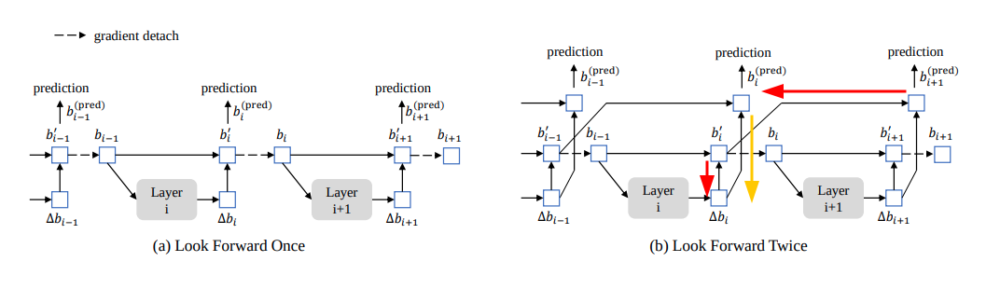

# DETR Series 3.0

又是一次重新的总结，按照当前的笔记风格解析 DINO

这次总结的契机是要看 SparseBEV，为了更深入理解 SparseBEV，必须要把基础模型搞清楚

## Concept

1. **Positional Embedding**

   采用了 2D positional sine embedding，对 x 和 y 两个方向进行编码，然后连接到一起。其中需要注意3点：

   - positional embed 公式中的 i 是归一化的。并且归一化因子为图像的有效长度和宽度。所谓有效是因为图像可能会被缩放，所以有填充像素

   - 我们需要对 multi-level feature 生成位置编码，最终生成的是一个列表 `multi_level_position_embeddings`，其中的每一个元素是对应尺度特征的位置编码
   - 在进行自注意力的时候，还对 multi-level pos embed 中添加了 **level embed**。具体来说对于每一个尺度的位置编码 $(H,W,C)$，加入了一个可学习的向量 $C$

2. **Two stage DETR**

   两阶段方法就是利用 encoder (self attention) 输出的特征图，提出初步的 proposal 作为 query 的 reference points

   如何提出 proposal 其实非常简单：

   - 为每一个特征栅格初始化一个选框
   - 单独使用一层 bbox layer & class layer 来获得选框残差和类别，利用类别得分来挑选 topk 个栅格。注意这里的类别只有2类：前景、背景
   - 将选框残差和初始选框合起来形成最终的 proposal

   如果不使用两阶段，就直接使用一个 `nn.Embedding(num_query, dim)` 作为随机的初始 anchor 替代，其中 dim = 4 代表 `(x,y,h,w)`，注意初始化的时候控制下初始值，要符合 box 值域

3. **Box Refinement**

   Box refinement 算法是一种迭代微调策略，它类似于 Cascade R-CNN 方法，可以在每个解码器层上对边界框进行微调，并且 `self.box_embed & self.class_embed` 是各自独立的，不共享参数

   这个思想在 two stage 中提出初始 proposal 时已经体现

4. **Look Forward Twice**

   在 Deformable DETR 中使用的 look forward once，该方式有一个缺点：无法优化 reference box。因为推理 box 由两部分组成：输入的 reference box 以及由 layer 推理得到的残差，而在 look forward once 中，reference box 是 detach 的，切断了梯度，也就无法更新上一层 layer 以获得更好推理结果。而 look forward twice 将中间结果保留了一份，可以同时优化上述两个部分。下图的梯度（红色、黄色箭头）即可说明：红色梯度的更新可优化用于下一层的 reference box，黄色梯度的更新可优化当前层的残差

   

5. **De-Noising**

   Denoising 思想非常简单：将经过噪声处理的 gt 作为 query，输入到 decoder 当中去重建 gt，其关键步骤如下：

   - 确定 `dn_groups`，就是一共需要多少组噪声选框，每一组噪声选框的数量为 `dn_groups * 2 * num_gt`，其中2代表 pos & neg 噪声，实际上 negative 区别于 positive 噪声就是 box 的缩放更大一些

   - **对 labels 进行随机噪声**，即将部分类别随机替换为其他类别。然后生成 `dn_query_label`

     `dn_query_label` 是一个形状为 $(B, dn\_groups \times2\times pad\_size, C)$ 的可学习张量，其中 `pad_size` 是一个 batch 所有样本中 gt 数量的最大值。该张量是由 `nn.Embedding` 进行映射，每一个类别对应一个向量。所以这里为 `query_label`，因为其中加入了 label 先验信息

   - **对 boxes 进行随机噪声**，即对选框进行随机位移和缩放。然后生成 `dn_query_ref_points`

     `dn_query_ref_poitns` 即为噪声选框，其形状为 $(B, dn\_groups \times2\times pad\_size, 4)$

   - 创建 attention mask，因为 gt 噪声不能被真正的 query 所看见，但是 gt 噪声可以看见真正的 query，各个 gt 噪声 groups 之间不能相互看见，最后的 mask 形状可如图所示

     

     灰色部分 `attention_mask=True`

6. **What is Query, really?**

   query 到底是什么？在 DETR 中对于 query 的运用非常非常的灵活。不仅在 decoder 中使用，还在 denoising 中也使用了，并且其中还配合了 query positional embed 发挥更大的作用。其实 query 的名字本身就回答这个问题：query 是一个询问。我更想把 query 当做一个目的，或者一个概念。

   在 decoder 中 query 的目的很简单：通过 encoder memory 寻找到物体。我们希望 query 不去死板地和 encoder memory 进行交互，而是灵活地负责各自的部分：一些 query 负责上方、一些 query 负责下方...此时 query positional embed 就排上大用场了。通过 query + query pos embed，每一个 query 有了空间的信息，然后进行 self attention 交流过后，query 之间就能更好地进行空间上的配合，从而最大优化检测效果。

   在 DETR decoder 中 query 被初始化为零，query pos embed 是一组任意初始化的可学习参数。在两阶段的 Deformable DETR 中，query 和 query pos embed 是由一阶段的 proposal 进行 encode 得到，获得更好的位置先验，但是在 decode 过程中 query pos embed 是不更新的。在 DINO 中 query 直接是一组可学习的参数，而 query pos embed 是由一阶段和各个 decoder 输出的 proposal 编码得到。同时这也解释了为什么，DETR 中要在每个中间层输入加入位置编码，而原始 transformer 只在起始层加入位置编码，因为位置在不断地变化！

## Layout of DINO

DINO 是目前最先进的目标检测器，我认为是目标检测器的集大成者，几乎总结了先前所哟检测器的设计结构：two stage, cascade, deformable, de-noising, transformer。其 forward path 我用伪代码总结一下

```python
import torch

def dino_forward(self, img, gt_instances):
	# backbone, output a list of multi-scale feat
    features = self.backbone(img)
    
    # neck, fpn ususally
    multi_level_feats = self.neck(feat)
    
    # multi-level pos & level embed, as query pos embed
    multi_pos_lvl_embed = []
    for lvl, feat in enumerate(multi_level_feats):
        multi_pos_lvl_embed.append(
        	self.pos_embed_sine(feat.shape) + self.level_embed[lvl]
        )
    
    ########## Encoder ##########
    # get anchor reference points
    reference_points = self.get_reference_points_for_self_deform_attn(multi_level_feats)
    feat_flatten = self.flatten(multi_level_feats)
    pos_lvl_flatten = self.flatten(multi_pos_lvl_embed)
    
    memory = self.encoder(
    	query=feat_flatten,
        key=None,
        value=None,
        query_pos=pos_lvl_flatten,
        reference_points=reference_points
    )
    ######## End Encoder ########
    
    ######## First Stage ########
    # get anchor boxes
    anchors = self.gen_encoder_feat_anchors(multi_level_feats.shapes)
    enc_outputs_cls = self.first_stage_cls(memory)
    enc_outputs_box = self.first_stage_box(memory)
    # decode box, because pred is residual
    enc_outputs_box += anchors
    
    # topk boxes
    topk = torch.topk(enc_outputs_cls, self.two_stage_num_proposals)[1]
    topk_box = torch.gather(enc_outputs_box, dim=1, topk)
    # normalize box to reference points, and detach
    reference_points_from_first_stage = topk_box.detach().sigmoid()
    ####### End First Stage #######
    
    ########## Decoder ##########
    # prepare dn query label and ref points
    dn_query_label, dn_query_ref_points, attn_mask = self.prepare_dn(
        gt_instances,
    	self.num_quries,
    	self.dn_groups,
    	self.label_embed)
    
    # prepare query and ref points
    query = torch.cat([dn_query_label, self.obj_embed.weight], 1)
    reference_points = torch.cat(dn_query_ref_points, reference_points_from_first_stage)
    
    # decode
    inter_states, inter_boxes = self.decoder(
    	query=query, # bs, num_queries, embed_dims
        key=memory,	# bs, num_tokens, embed_dims
        value=memory,
        query_pos=None,	# calculate inside decoder with reference points
        reference_points=reference_points,
        attn_mask=attn_mask
    )
    
    # predict boxes again to look forward twice
    outputs_classes = []
    outputs_boxes = []
    for layer_i in range(decode_layer_nums):
        if layer_i == 0:
            anchor_box = self.inverse_sigmoid(reference_points_from_first_stage)
        else:
            anchor_box = inter_boxes[layer_i - 1].sigmoid()
        outputs_class = self.class_head[layer_i](inter_states[layer_i])
        outputs_box = self.box_head[layer_i](inter_states[layer_i])
        outputs_box += anchor_box
        
        outputs_classes.append(outputs_class)
        outputs_boxes.append(outputs_box)
    
    outputs = (outputs_classes, outputs_boxes)
    ######## End Decode #######
    
    ########### Loss #########
    # this would calculate both dn and normal targets
    loss = self.criterion(outputs, gt_instances)
    ######### End Loss #######
```

至此 DETR 系列所有的细节、流程、原理都清晰了，需要查看 deocder 和 loss 的更多信息可以在 DETR Series 2.0 查看

## Question

1. 关于 look forward twice，为什么要再次将中间输出进行归一化？

   ```python
               if self.return_intermediate:
                   intermediate.append(self.norm(output))
   ```

   如果要 look forward twice 为什么不直接取消 detach，这样带来的梯度可能会不稳定