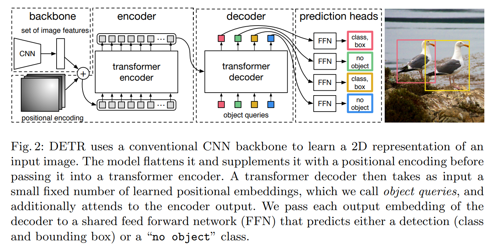

# DETR

[zhihu](https://zhuanlan.zhihu.com/p/348060767)	[bilibili](https://www.bilibili.com/video/BV1GB4y1X72R)

DETR 的特点：简单！端到端！no anchor！在性能（表现/速度）上和 Faster RCNN 相似。虽然和当时最好的方法相差10个点，但是这个框架太好了，是一个挖坑性质的文章，所以这也是件好事儿

## Intro

现阶段目标检测器很大程度上都受限于后处理 **NMS** 的方法，不管是 anchor-based or anchor-free，RCNN or SSD or YOLO，都有这个问题，这也让目标检测在目前的深度学习方法里都是比较复杂的，在优化和调参的难度上都比较大

DETR 的网络流程如下图所示



用语言总结如下：

1. 使用 CNN 抽取图像特征
2. 使用 Transformer encoder 获得全局特征
3. 使用 Transformer decoder 获得预测框
4. 将预测框和 ground truth boxes 做匹配并计算 loss

Transformer 大致结构如下


图中 Decoder 这边的结构是不够完整的，或者说不够正确的。实际上 Decoder 关于 query 的输入有两个：1

1. Query itself
2. Query positional encoding, **i.e. Object Query**

图中没有把 Query 本身给画出来，论文里是**初始化为0**，所以图中直接省略不画了，导致 Decoder 下侧的 `+` 号意义不清晰

### 一些结论

受益于 transformer 的全局建模能力，DETR 对于大物体的检测能力非常强，但是对小物体的比较差，并且 DETR 收敛的速度非常慢。改进方法在 Deformable DETR 中提出，依然是使用多尺度的特征图谱 + Deformable attention

前人也有使用二分图匹配的方法，或者使用 RNN 做 encoder-decoder 来进行目标检测，但是都没有用 transformer 所以性能上不去。所以说 DETR 的成功，也是 transformer 的成功

##  Model

### Bipartite Matching Loss

论文认为结构都是比较简单好理解的，所以先讲了损失函数这一块：如何使用二分图匹配来计算损失

DETR 预测输出是一个固定值，即预测固定的 N(=100) 个预测

关于二分图匹配算法（匈牙利算法），我在之前的博客 **图论算法** 里有一些总结可以参考，在 DETR 的场景下该匹配算法的作用为：将 N 个 prediction 与 N 个 gt 进行配对（没有 N 个 gt 则需要 padding）。预测有了 gt 过后就可以计算损失函数了

配对使用的 cost matrix 计算公式如下
$$
\hat{\sigma}=\underset{\sigma \in \mathfrak{S}_{N}}{\arg \min } \sum_{i}^{N} \mathcal{L}_{\operatorname{match}}\left(y_{i}, \hat{y}_{\sigma(i)}\right) \\
\mathcal{L}_{\operatorname{match}}\left(y_{i}, \hat{y}_{\sigma(i)}\right)=
-\mathbb{1}_{\left\{c_{i} \neq \varnothing\right\}} \hat{p}_{\sigma(i)}\left(c_{i}\right)+\mathbb{1}_{\left\{c_{i} \neq \varnothing\right\}} \mathcal{L}_{\mathrm{box}}\left(b_{i}, \hat{b}_{\sigma(i)}\right)\\

\mathcal{L}_{\mathrm{box}}=\lambda_{\text {iou }} \mathcal{L}_{\text {iou }}\left(b_{i}, \hat{b}_{\sigma(i)}\right)+\lambda_{\mathrm{L} 1}\left\|b_{i}-\hat{b}_{\sigma(i)}\right\|_{1}
$$
其中 $\sigma$ 可以看作一个排列或者映射，$\sigma(i)$ 代表第 i 个 gt 所匹配的预测的 index，box 损失使用的是 GIoU 损失和 L1 损失的加权。注意到空 gt 和任何 prediction 的 cost 都是 0，所以本质上就是 N 个 prediction 和 M 个 gt 之间的匹配，用于确定 M 个正样本 prediction 和 N - M 个负样本 prediction

### Detection Loss

匹配完成后，就可以计算损失函数
$$
\mathcal{L}_{\text {Hungarian }}(y, \hat{y})=\sum_{i=1}^{N}\left[-\log \hat{p}_{\hat{\sigma}(i)}\left(c_{i}\right)+\mathbb{1}_{\left\{c_{i} \neq \varnothing\right\}} \mathcal{L}_{\text {box }}\left(b_{i}, \hat{b}_{\hat{\sigma}}(i)\right)\right]
$$
论文提到在计算分类损失时，对于空类 gt $\varnothing$ 的分类损失要除以 10 用于平衡正负样本，在实现上是直接指定 `F.cross_entropy(..., weight=)` 完成

另外还是使用了中间监督，或者称为辅助损失。即把 decoder 的中间 block 的输出也作为预测结果，并计算检测损失

swin v2

DC5，是 dilated convolution at resnet stage 5 的一个简称，在 DETR 中使用的具体描述为

> Following [21, FCN], we also increase the feature resolution by adding a dilation to the last stage of the backbone and removing a stride from the first convolution of this stage.

但是在后面的 DETR-based 目标检测器中没有常用

### DETR 问题

大物体和小物体效果相差大

object query 的预测结果可视化

## Deformable DETR & Deformable Attention

### Multi-Scaele Deformable Attention

一开始看 Deformable DETR 的时候，注意力很容易集中到 Deformable 上，但我觉得 Multi-Scale 同样非常重要。为了彻底弄清 Multi-Scale Deformable Attention，我想从如下几个问题入手

1. 如何表示 multi-scale feature
2. 如何表示 multi-scale feature's positional embedding 
3. 如何表示 reference points
4. 如何完成 multi-scale deformable attention

#### Multi-scale Feature

这非常好理解，就是从 backbone **ResNet 50** 中输出的中间特征层，越深的特征层，分辨率越小

```python
# output feature dict
features = self.backbone(images.tensor)

# project backbone features to the reuired dimension of transformer
multi_level_feats = self.neck(features)
```

最终 neck 把这些特征图谱映射到同一个维度，以输入到 transformer 中做点积


#### Multi-scale Positional Embeddings

论文里还提到了 scale-level embedding，但在 two stage 中并没有使用，感觉用处不大，这里直接忽略。而处理 multi-scale 的 positional embeddings，也没有太多改动，就是逐个 level 获得

```python
for feat in multi_level_feats:
    multi_level_masks.append(
        F.interpolate(img_masks[None], size=feat.shape[-2:]).to(torch.bool).squeeze(0)
    )
    multi_level_position_embeddings.append(self.position_embedding(multi_level_masks[-1]))
```

解释一下：positional embedding 是根据一个 2D mask 直接生成的，对于不同 scale 的 mask 是直接根据 img mask 插值获得（img mask 中的非零值即表示该像素点被忽略） 

#### Reference Points

reference points 就是每个像素点中心的**归一化坐标**。每一个 scale 的 reference points 为一个张量，形状为 (H, W, 2)，那么多个 scale 的 reference points 合起来应该是 `(B, h1w1 + h2w2 + ..., 2)` 才对，但实际上的代码并不是这么做的

```python
    def get_reference_points(spatial_shapes, valid_ratios, device):
        """
        Args:
            spatial_shapes (Tensor): The shape of all feature maps, has shape (num_level, 2).
            valid_ratios (Tensor): The ratios of valid points on the feature map, has shape (bs, num_levels, 2)
        Returns:
            Tensor: reference points used in decoder, has shape (bs, num_keys, num_levels, 2).
        """
        reference_points_list = []
        for lvl, (H, W) in enumerate(spatial_shapes):
            ref_y, ref_x = torch.meshgrid(
                torch.linspace(0.5, H - 0.5, H, dtype=torch.float32, device=device),
                torch.linspace(0.5, W - 0.5, W, dtype=torch.float32, device=device),
            )
            ref_y = ref_y.reshape(-1)[None] / (valid_ratios[:, None, lvl, 1] * H)   # (1, HW) / (B, 1) -> (B, HW)
            ref_x = ref_x.reshape(-1)[None] / (valid_ratios[:, None, lvl, 0] * W)
            ref = torch.stack((ref_x, ref_y), -1)   # (B, HW, 2)
            reference_points_list.append(ref)
        reference_points = torch.cat(reference_points_list, 1)  # (B, N1+N2+..., 2)
        reference_points = reference_points[:, :, None] * valid_ratios[:, None]
        return reference_points
```

可以看到最终的输出形状是 `(bs, num_keys, num_levels, 2)`，**实际上这是为了各个 scale 之间的交互**，即某个 scale 的 reference point 可以去另一个 scale 进行采样 

#### MSDeformAttention

下面正式介绍 multi-scale deformable attention 模块，先简单描述下代码干了什么事情

1. 判断是否为自注意力，如果没有传入 value 则使用 query 本身

2. 给 query 加入 positional embedding，**注意，这里没有给 key 加入 positional embedding，更确切地说，在 deformable attetion 里没有 key 的概念，key 极其 attention 是通过其他方式获得**

3. value 经过一个线性层，维度不变，并且 mask 掉不需要进行注意力的点。然后再 view 为多头的形式

4. 将 query 送到 `self.sampling_points` 线性层，进行偏移量预测，也对偏移量进行归一化

   ```python
   self.sampling_offsets = nn.Linear(embed_dim, num_heads * num_levels * num_points * 2)
   ```

5. 将 query 送到 `self.attention_weight` 线性层，并用 softmax 计算注意力分数

   ```python
   self.attention_weights = nn.Linear(embed_dim, num_heads * num_levels * num_points)
   ```

6. 有了前面的准备工作，就能够愉快计算可变注意力了，pure pytorch 实现为 `multi_scale_deformable_attn_pytorch`，注意这里的输出已经合并了多头

7. 获得的结果再过一个线性层，维度不变

由于代码过于 mmlab 的风格🤣，我删除了一些，以方便理解

```python
    def forward(
        self,
        query: torch.Tensor,	# (B, N, C)
        key = None,
        value = None,
        identity = None,
        query_pos = None,
        key_padding_mask = None,
        reference_points = None,
        spatial_shapes = None,
        level_start_index = None,
        **kwargs) -> torch.Tensor:
        
        if value is None:	# True, when self-attetion
            value = query
        if identity is None:	# True
            identity = query
        if query_pos is not None:	# True
            query = query + query_pos
        bs, num_query, _ = query.shape
        bs, num_value, _ = value.shape

        value = self.value_proj(value)
        
        if key_padding_mask is not None:	# True
            value = value.masked_fill(key_padding_mask[..., None], float(0))
        value = value.view(bs, num_value, self.num_heads, -1)
        
        sampling_offsets = self.sampling_offsets(query).view(
            bs, num_query, self.num_heads, self.num_levels, self.num_points, 2
        )
        # bs, num_query, num_heads, num_levels, num_points, 2
        offset_normalizer = torch.stack([spatial_shapes[..., 1], spatial_shapes[..., 0]], -1)
        sampling_locations = (
            reference_points[:, :, None, :, None, :]
            + sampling_offsets / offset_normalizer[None, None, None, :, None, :]
        )
        
        attention_weights = self.attention_weights(query).view(
            bs, num_query, self.num_heads, self.num_levels * self.num_points)
        attention_weights = attention_weights.softmax(-1)
        attention_weights = attention_weights.view(
            bs, num_query, self.num_heads, self.num_levels, self.num_points)
        
        output = multi_scale_deformable_attn_pytorch(
                value, spatial_shapes, sampling_locations, attention_weights)
        output = self.output_proj(output)

        return self.dropout(output) + identity
```

pure pytorch 代码块如下，比较难看的是张量的形状，我都以注释给出，应该比较好理解。用简洁的语言概括为：

1. 对每一个 scale/level，计算所有 sampling points 在该 level 插值得到的特征向量
2. 对插值得到的 multi scale + multi points 的特征向量进行注意力加权整合
3. 合并多个 head 的特征向量

```python
def multi_scale_deformable_attn_pytorch(
    value: torch.Tensor,
    value_spatial_shapes: torch.Tensor,
    sampling_locations: torch.Tensor,
    attention_weights: torch.Tensor,
) -> torch.Tensor:

    bs, _, num_heads, embed_dims = value.shape
    _, num_queries, num_heads, num_levels, num_points, _ = sampling_locations.shape
    value_list = value.split([H_ * W_ for H_, W_ in value_spatial_shapes], dim=1)
    sampling_grids = 2 * sampling_locations - 1
    sampling_value_list = []
    
    for level, (H_, W_) in enumerate(value_spatial_shapes):
        # bs, H_*W_, num_heads, embed_dims -> bs*num_heads, embed_dims, H_, W_
        value_l_ = (
            value_list[level].flatten(2).transpose(1, 2).reshape(bs * num_heads, embed_dims, H_, W_)
        )
        # bs, num_queries, num_heads, num_points, 2 -> bs*num_heads, num_queries, num_points, 2
        sampling_grid_l_ = sampling_grids[:, :, :, level].transpose(1, 2).flatten(0, 1)
        # bs*num_heads, embed_dims, num_queries, num_points
        sampling_value_l_ = F.grid_sample(
            value_l_, sampling_grid_l_, mode="bilinear", padding_mode="zeros", align_corners=False
        )
        sampling_value_list.append(sampling_value_l_)
    # (bs, num_queries, num_heads, num_levels, num_points) -> (bs*num_heads, 1, num_queries, num_levels*num_points)
    attention_weights = attention_weights.transpose(1, 2).reshape(
        bs * num_heads, 1, num_queries, num_levels * num_points
    )
    output = ( # (bs*num_heads, embed_dims, num_quries, num_levels*num_points)
        (torch.stack(sampling_value_list, dim=-2).flatten(-2) * attention_weights) 
        .sum(-1)
        .view(bs, num_heads * embed_dims, num_queries)
    )
    return output.transpose(1, 2).contiguous()
```

### Decoder

看完了 Deformable Attention，实际上在 Decoder 上的东西也很不一样。从此开始 Decoder 不再保持原始 DETR 的简洁性，为了让收敛更快，我们需要使用更强的先验假设

1. query selection
2. encode new query

query -> region of interest
