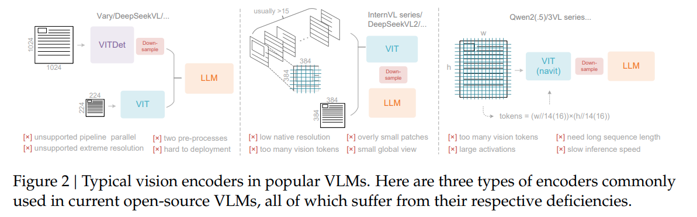
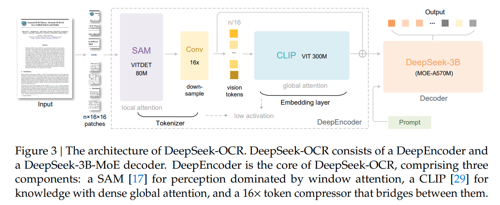
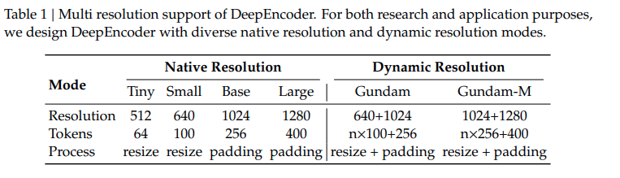
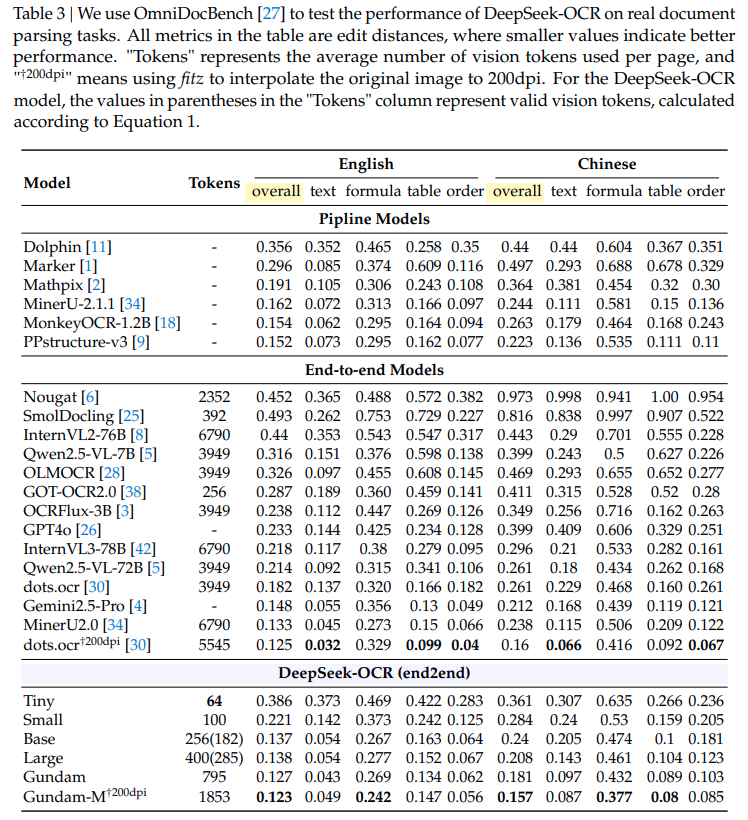
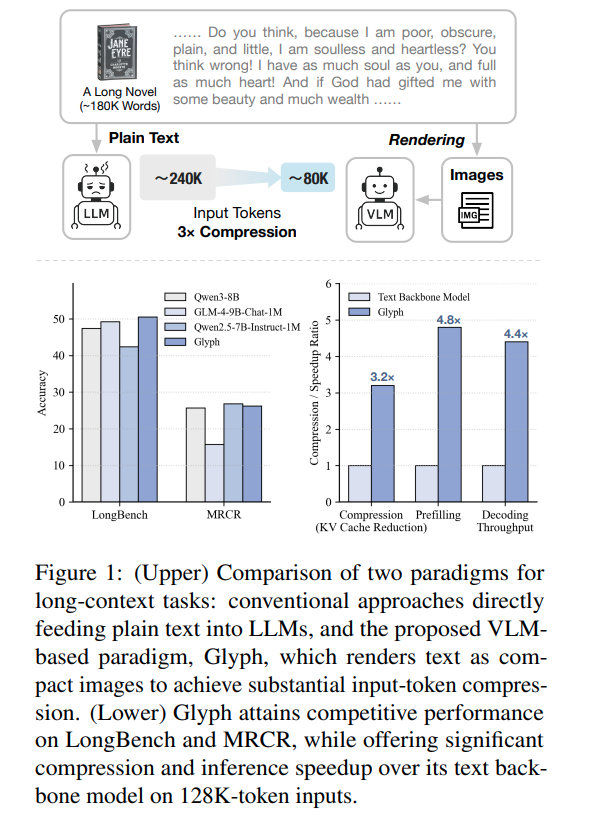
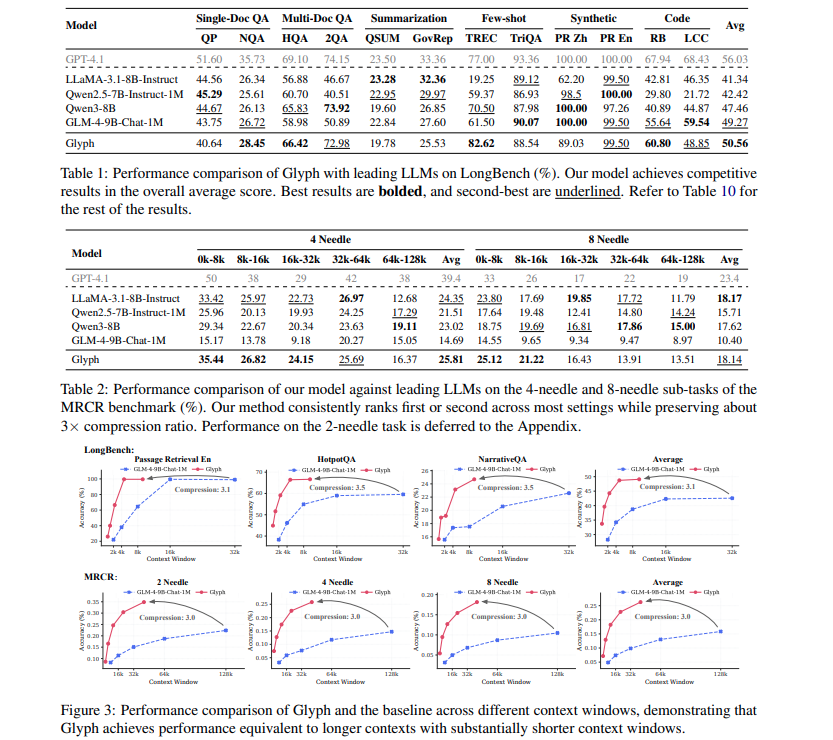

# DeepSeek-OCR

https://github.com/deepseek-ai/DeepSeek-OCR

Andrej Karpathy 对这篇论文很认可，其似乎指明了一个方向：所有 llm 输入应该使用 vision tokens

- 他们对世界的压缩率更高
- 移除了分词器的存在（在输入阶段）
- 输入阶段就可以使用 full attention，而不是 causal attention，模型更加强大

## Abstraction

模型：380 M DeepEncoder + DeepSeek-MOE-3B-A570M，其实是一个挺小的模型

视觉压缩：输出的 text tokens 是 vision tokens 9-20x，定义压缩比为 (text tokens/vision tokens) 。当压缩比 < 10x 时，decoding precision 保持在 97% 以上

实际用途：可以为 LLM/VLM 的 training data 生产提供强大的支持，一个 A100-40G 可生产 200k pages/day

## Intro

这个的故事是从 image 的 rich context 开始讲述的

> We explore a potential solution: leveraging visual modality as an efficient compression medium for textual information. A single image containing document text can represent rich information using substantially fewer tokens than the equivalent digital text, suggesting that optical compression through vision tokens could achieve much higher compression ratios.

论文认为 vision 对信息的压缩率会比文本本身更高，vision 作为一种压缩信息的中间介质将具有重大潜力

## Related Works

其实 VLM 常见的结构就是 ViT + LLM，即使是 DeepSeek-OCR 也是一样的配置。这里只提下之前工作的缺点

1. InternVL

   使用 tile based vit，**核心缺陷：图像分辨率锁死**。这是由 naive ViT 本身的设计缺陷导致的，其只能处理 512x512 大小的图像。这将导致一系列问题

   - 分辨率较低，无法捕捉细节信息
   - 超大图像，无法有效捕捉全局信息
   - 超大图像，vision tokens 显著增加

2. QwenVL

   使用 NaViT，部分解决了 InverVL 当中的问题，能够处理高分辨率图像。而处理方式实际上是由于使用了 patch based vit，也就是处理 image 的基本单位是 16x16 的 patch，本质上是增加了图像的分辨率能力。**但是这将更显著增加 vision tokens 数量**

从这里能够看出一些端倪：DeepSeek-OCR 并不是真心想对标 SOTA OCR 模型，而是在向 VLM 模型进行对标。只是论文作者应该对 OCR 领域非常熟悉，之前 GOT-OCR 也是论文作者的工作。

## Arch

结构上其实非常清晰：

- SAM-based encoder 作为 local 特征提取，使用 window attention，patch size 为 16，window size 为 14
- Conv 作为下采样结构，将 vision token 降低 16x。Conv 就是两个 Conv2D layer，每一个卷积层会 stride = 2，将分辨率降低4x
- CLIP-large encoder 作为 global 特征提取，使用 full attention
- DeepSeek-3B-MoE-A570M 作为 decoder 输出文字

能够原生地处理 4 种分辨率，应该是在训练的时候就是用了这四种分辨率进行预处理。不太理解 dynamic resolution 的具体解决方式

从表格中可以看到即使是 1280x1280 的分辨率，也仅用了 400 个 vision tokens

## Experiment

从实验结果看，基本和 SOTA 打平，但是 token 数量会少很多。对于实用来说 Large 分辨率可能已经够用了。其中最接近 DeepSeek-OCR tokens 数量的模型是 GOT-OCR，这也是论文作者本身的工作，但是效果差得多

总结下来：论文利用 SAM + Conv + CLIP + DeepSeek-MoE 的结构，构建了高效的通用 OCR 模型，其中 vision tokens 能够显著地少于生成的 text tokens。这种 window/local + global 的形式再一次证明了其有效性，**能够很高效地保留细节和全局的完整信息**，如果不完整，将无法很好地完成 OCR 工作。虽然论文没有用很 fancy 的算法，但是能够把 vision tokens 的数量降这么多，也是需要胆量的

## Another Work

智谱看到了 DeepSeek-OCR 大爆，然后自己手上又有一个相似故事的论文，连夜开源论文和代码 [Glyph: Scaling Context Windows via Visual-Text Compression](https://github.com/thu-coai/Glyph/blob/main)

智谱的论文与 DeepSeek-OCR 讲述问题的区别：

- Glyph 不是用 OCR 领域出发来阐述算法效果，而是真正使用了 LLM 领域中的 LongBench （类似长上下文中的大海捞针任务）来说明 vision token 对文本的压缩率很高
- Glyph 的训练方式完全遵从 LLM 的训练方式：Pretrain + SFT + RL，即 Pretrain + Post train 的训练流程，希望能打造一个真的能和 LLM 一样的通用智能模型。他们并没有构造一个新的模型结构，而是直接用了智谱的 VLM 作为 base model 进行训练（GLM-4.1V-9B-Base）
- Glyph 还针对如何将文本渲染为图像这一环节进行了探索，他们有一套优化的步骤，能根据文本来生成一套渲染为图像最优的 configurations（dpi, page size, font size, alignment, indent, spacing...）

核心的实验结果如下图，一句话来来说：在长上下文场景下的 benchmark 和相参数量的 LLM 打平，并且 context window 显著地小，压缩率约为 3x~4x

智谱 Glyph 的工作量其实比 DeepSeek-OCR 要多得多，愿景应该也更大，想要直接在 LLM 领域中的 benchmark 拿出好的效果来，所以被抢先也是情理之中😂。由于 DeepSeek-OCR 的切入点更小，模型结构也并不复杂，并且做出来的压缩效果十分惊艳（9x~20x），再加上 DeepSeek 本身的省钱背书，所以出圈很快

## Question

- SAM & CLIP & DeepSeek 的预训练效果在其中发挥了多少作用？如果更换其他的基础模型是否还能有这样高的压缩效果？论文是一点 ablation 没做