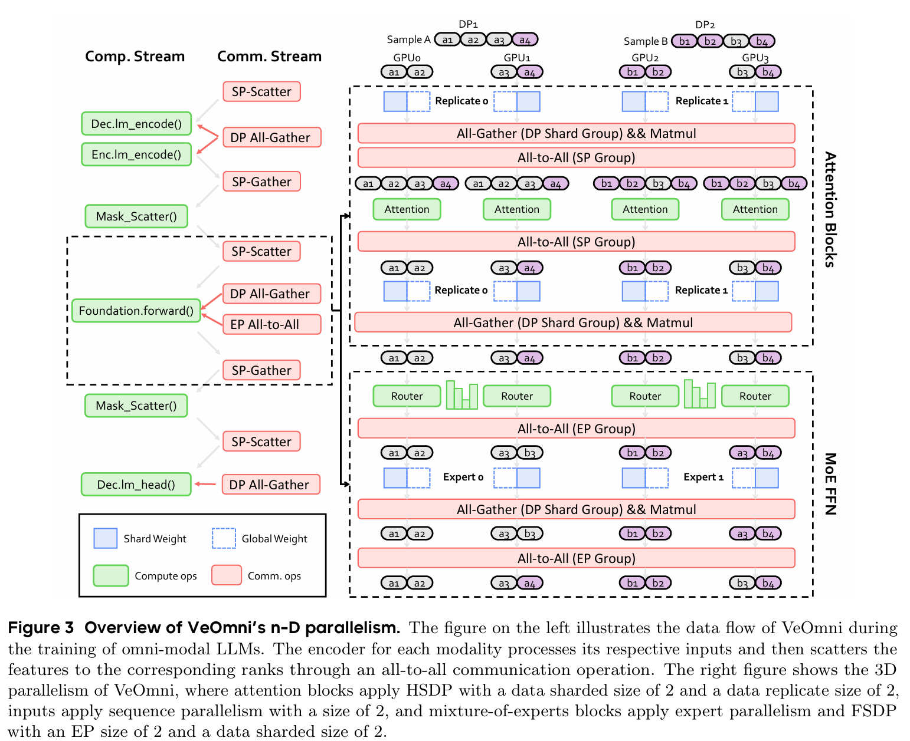

# FSDP & VeOmni

本文围绕 FSDP（Fully Sharded Data Parallel）展开，系统梳理了其省显存的核心原理、使用方式与嵌套运行机制，并重点分析了 FSDP 在 VeOmni 训练框架中与 SP、EP、TP 等并行策略的组合应用。此外对比了 FSDP1 与 FSDP2 的差异。在文末有一些补充材料，能帮助我们更深入理解通信原语以及 VeOmni 训练框架，不阅读也不妨碍对主线内容的理解。

本文档将介绍 FSDP 以及训练框架 VeOmni。旨在回答几个核心问题：

1. FSDP 解决了什么问题？
2. FSDP 如何与其他并行技巧结合？这在 VeOmni 当中是如何应用的？
3. VeOmni 在训练上做了哪些优化使得其由于市面上的其他训练框架？

## FSDP 最核心功能：省显存

FSDP 的核心思想其实参考了 ZeRO3 论文：将模型的参数、梯度和优化器状态在数据并行的所有 GPU 上进行分片（Sharding），每个 GPU 只持有其中一份，并在前向/反向计算时通过通信按需动态收集（All-Gather）和释放，从而将显存占用从单卡复制分摊到集群，以通信开销换取巨大的显存容量

|                    | DDP（每卡常驻） | FSDP N 卡（每卡常驻）       |
| ------------------ | --------------- | --------------------------- |
| 参数               | 100%            | 1/N                         |
| 梯度               | 100%            | 1/N                         |
| 优化器状态 (AdamW) | 100%            | **1/N** ← 最大头（参数 ×2） |

all-gather 出的完整参数**只在当前层 forward/backward 期间临时存在**，算完即释放。此时内存中**永远不会同时存在所有层的完整参数**。FSDP 对激活值不省，通常配合 activation checkpointing 使用。

```
Layer 0:  all_gather(L0) → forward L0 → reshard L0
Layer 1:  all_gather(L1) → forward L1 → reshard L1
...
Layer N:  all_gather(LN) → forward LN → reshard LN
```

内存中**永远不会同时存在所有层的完整参数**。峰值 = max(单层完整参数, 全部激活值)，而非 "完整模型 + 激活值"。

**完整流程（单层 Layer N，reshard_after_forward=True）**


**为什么 backward 前要第二次 all-gather？**

因为 forward 后把完整参数**扔了**（让位给激活值），backward 又需要完整参数求梯度，注意我们不仅要求参数梯度，还需要求 input 激活值的梯度，所以我们需要完整的参数来求解。

如果 `reshard_after_forward=False`：forward 后保留完整参数，跳过 forward 中的 reshard 以及 backward 中的 all-gather，不过需要注意的是，在 backward 完成过后，仍然会进行 shard 参数。所以整体来看，我们只省略了一次 backward 当中的 all-gather 通信。`reshard_after_forward=False` 常用于 `mp_ignored` 的 module：参数少但精度要求高（如 MoE gate 的 fp32 路由）。

**为什么需要 Reduce-Scatter 而不是 All-Reduce**

all-gather 的逆操作。backward 算出完整梯度后，每人只需要自己那份来更新参数：

- **All-Reduce**：每人得到完整梯度 → 占显存 → 但每人只更新 1/N 参数 → 浪费 (N-1)/N
- **Reduce-Scatter**：梯度按位置求和后分散，每人只留自己的 shard → 不浪费

通信量：一次 forward-backward ≈ 3 × 参数总量（2 次 AG + 1 次 RS），DDP 约 2 × 参数总量（all-reduce 需要接近两倍模型参数的通信量）。FSDP 多 ≈50% 通信，换来模型能塞进显存。

以上是 FSDP 省显存的核心机制：逐层 all-gather / reshard 控制峰值，reduce-scatter 让梯度也仅持有 1/N。下面看 FSDP 的具体使用方式——API 长什么样、参数如何分组、为什么必须自底向上 shard。

## FSDP 的使用方式

### `fully_shard`

FSDP2 的核心 API，per-module 粒度的参数切分：

```python
from torch.distributed._composable.fsdp import fully_shard, MixedPrecisionPolicy

fully_shard(module, mesh=fsdp_mesh, mp_policy=mp_policy, reshard_after_forward=True)
```

各个参数的含义如下：

| 参数                    | 作用                                                         |
| ----------------------- | ------------------------------------------------------------ |
| `mesh`                  | `DeviceMesh`，决定参数在哪些 GPU 上 shard                    |
| `reshard_after_forward` | forward 后是否立即释放完整参数                               |
| `mp_policy`             | `MixedPrecisionPolicy(param_dtype, reduce_dtype)`，参数/梯度精度 |
| `shard_placement_fn`    | 沿哪维切分，默认 dim-0，EP 场景用 `Shard(1)`                 |

`mp_policy.param_dtype` 控制前向的**计算精度**：参数 all-gather 后 cast 到此类型，forward 和 backward 都在此精度下计算。`mp_policy.reduce_dtype` 仅控制梯度 **reduce-scatter 通信**的精度，不影响 backward 计算。


`mesh` 为 1D 时做 FSDP（参数沿 mesh 全分片）；为 2D `(dp_replicate, dp_shard_sp)` 时做 HSDP——最后一个维度做参数分片（all-gather / reduce-scatter），其余维度做副本复制（梯度 all-reduce）。一般推理框架通过 `dp_replicate_size` / `dp_shard_size` 自动构造对应的 1D 或 2D `fsdp_mesh`，无需手动配置 mesh 维度。

### 自底向上 & 嵌套运行

我们**必须自底向上**定义 FSDP mdoule：先 shard 子 module，再 shard 父 module。

这是因为 PyTorch 在注册 `fully_shard` 时通过 DFS 收集该 module 下的参数。如果遇到已经有 FSDP 状态的子 module，DFS 停止——该子 module 的参数不纳入当前 FSDP group。这样父子 FSDP unit 管理的参数集**互斥**，各自独立调度。

但如果先 shard 父 module，此时子 module 还没有 FSDP 状态，DFS 会一路到底、把所有参数收进一个 group。之后再 shard 子 module 时，这些参数已经被父 group 管理——**double management**。自底向上的 `fully_shard` 能够避免 double management 的产生。

以 VeOmni 的三级嵌套为例（moe experts → decoder layer → root）


每个 group 是独立的 FSDP unit——自己的 all-gather / reshard 调度、自己的 mesh、自己的 mp_policy。了解了 API 和参数分组规则后，下面看这些 FSDP unit 在嵌套时如何协同运行。以 `reshard_after_forward=True` 的 decoder layer 为例，其运行流程如下图所示：


子 module（experts）的 unshard→compute→reshard 循环在 decoder layer 的 forward 内部完成，与 decoder layer 互不干扰，更具体来说，experts FSDP module 的参数不归父 module (i.e. decoder layer FSDP module) 管

以上两章覆盖了 FSDP 的通用原理。接下来聚焦 VeOmni 与 FSDP 的结合：为什么需要一个独立的训练框架？FSDP 在 VeOmni 中如何与 SP、EP 组合？mesh 如何构造？HSDP 如何配置？

## FSDP in VeOmni

### VeOmni 小结

一句话总结 veomni: 使用 FSDP + SP +  EP 来高效训练 omni model 的训练框架

- **FSDP**：解决模型参数放不进一张 GPU 的问题。将参数/梯度/优化器状态切到多卡，按需 all-gather。两个关键特性：(1) **非侵入**——对模型代码完全透明，不用改 forward，直接包一层 `fully_shard`；(2) **灵活组合**——通过 `dp_replicate × dp_shard` 二维 mesh 升级为 HSDP，把重的 FSDP 通信锁节点内，轻的 DDP 通信跨节点
- **SP (Ulysses)**：解决长序列（多模态 32K-256K tokens）单卡放不下的问题。序列切到多卡，attention 时 all-to-all 交换。实现了 **Async-Ulysses** 版本，all-to-all 通信与 QKV 投影计算 overlap，隐藏通信延迟
- **EP**：解决 MoE 大模型 expert 参数多的问题。expert 切到多卡，token 按路由分发到对应 expert。受 Comet 启发，采用 **operator-level 细粒度通信计算重叠**：将 all-to-all dispatch/combine 拆分为多个 chunk，第一个 chunk 通信完成后立即启动对应 expert 的 GEMM 计算，同时下一个 chunk 的通信仍在进行，形成通信-计算流水线。对比 DualPipe（pipeline 级，跨 micro-batch 重叠），Comet/VeOmni 方案对模型代码透明、跨模态通用、不影响其他并行策略调度。Comet 论文实测单 MoE 层加速 1.96x，端到端 1.71x

**为什么要单独提一个 omni 的训练框架，其 non-trival 在哪儿？**虽然论文提了不少点，但总体来讲就是两点：

1. omni 模型的多样性，需要我们针对多种模型进行支持，包含模型结构以及 loss 的计算。传统 llm 训练框架多样性不够，因为模型和训练范式已经收敛
2. omni 模型相比于 llm 模型比较小，vision 一般为几百 Million 参数，而语言模型则是 Billion 级别。我们不能用同一套切分方法（TP/PP/EP）来对待 omni 和 llm 模型，二者需要使用不同的策略。通常来说其他模态的方法直接使用 ddp 或简单 FSDP 就行

其实这也是 model-centric 的一种体现。model-centric 并不是说模型的代码里没有任何的并行代码了，部分的 sequence parallel 仍然需要在模型前向中构建。我理解的 model-centric 是可以让框架自由地定义每一个 module 能够以什么样的并行方式进行训练，而不是所有的模型使用同一套方法，这在之前的训练框架中可能不是很好支持的

### FSDP 在 VeOmni 中的应用

1. `fsdp_mesh`

   主 DeviceMesh 维度 `[pp, dp_replicate, dp_shard, ulysses, cp, tp]`，大小 =1 的维度跳过（`dp_shard` 除外，始终保留）。`fsdp_mesh` 按配置选取子 mesh：

   ```python
   @property
   def fsdp_mesh(self):
       if self.dp_replicate_enabled:              # HSDP
           if self.dp_shard_sp_enabled:
               return self.device_mesh["dp_replicate", "dp_shard_sp"]   # 2D
           elif self.dp_shard_enabled:
               return self.device_mesh["dp_replicate", "dp_shard"]      # 2D
           else:
               return self.device_mesh["dp_replicate"]                  # DDP only
       elif self.dp_shard_sp_enabled:             # FSDP + SP
           return self.device_mesh["dp_shard_sp"]                       # 1D 展平
       elif self.dp_shard_enabled:                # 纯 FSDP
           return self.device_mesh["dp_shard"]                          # 1D
       else:
           return self.device_mesh["dp"]                                # DDP
   ```

   `fully_shard` 直接拿 `fsdp_mesh`：

   ```python
   # torch_parallelize.py:405, 513, 518
   fsdp_kwargs = {"mesh": parallel_state.fsdp_mesh, "reshard_after_forward": True, "mp_policy": mp_policy}
   fully_shard(layer_mod, **fsdp_kwargs)
   fully_shard(model, **fsdp_kwargs)
   ```

2. sp 并入 FSDP

   `include_sp_in_fsdp=True` 将 ulysses/cp 维度并入 `dp_shard_sp`，展平为 1D mesh，让 SP rank 之间也做参数切分。`dp_shard=4, ulysses=2` → `fsdp_mesh["dp_shard_sp"]` 是 size=8 的 1D mesh，每 rank 只持 1/8 参数。不并入的话 SP rank 各自持完整参数副本，显存浪费。

   另外需要强调的一点是，`dp_shard` 仍然能够接收多个 sample，e.g. `dp_shard = 2` 不仅会同时 shard 模型参数，同时我们还会消费 2 个 sample，而不是一个 sample。以 4 GPU、SP=2 为例：`dp_size = 4 // 2 = 2`，默认 `dp_replicate=1, dp_shard=dp_size=2`。mesh 为 `(dp_shard=2, ulysses=2)`，flatten 后 `dp_shard_sp = 2 × 2 = 4`（FSDP2 的 `fsdp_mesh`，1D size=4），`sp = 2`（SP all-to-all 通信组），`dp = 2`（2 条独立数据流）。最终 rank 0/1 共享同一序列（SP slice 后各持不同片段），rank 2/3 共享另一序列。FSDP 的 reduce-scatter 自动跨数据流平均梯度，无需额外 all-reduce。

3. EP + FSDP 两级 sharding

   EP 用独立 2D mesh `[ep, ep_fsdp]`（其中 `ep_fsdp = world_size / ep_size`）

   Expert module 的 `fully_shard` 用的是 **ep_fsdp 子 mesh**，不是 `dp_shard` mesh：

   ```python
   # torch_parallelize.py:437-441
   para_fsdp_mesh = parallel_state.extra_parallel_fsdp_device_mesh[para][f"{para}_fsdp"]
   para_fsdp_kwargs["mesh"] = para_fsdp_mesh
   para_fsdp_kwargs["shard_placement_fn"] = lambda param: Shard(1)  # dim-1 sharding
   ```

   两级切分：

   1. EP Shard(0)，按照 expert 数量切，`[128 experts, H, I] → [32 experts, H, I]`
   2. FSDP Shard(1)，沿 hidden dim 切，`[32 experts, H, I]   → [32 experts, H/fsdp, I]`

下面是一个 HSDP 的例子帮助我们理解各个并行是如何紧密结合，来源于 VeOmni 论文。其配置为：

```python
dp_replicate = 2
dp_shard = 2
sp = 2
ep = 2
```



在这个图中，灰色和紫色分别代表分配到 expert0 和 expert1 的 token。可以看到在不同的 dp replicate rank 当中，token 的分配是不受限制的，即：DP2 当中的 token，是可以到 DP1 的 device 上进行计算 

FSDP 解决参数分片，SP 解决序列分片，EP 解决专家分片——三者在 VeOmni 中通过 mesh 维度分层组合。接下来讨论另一种重要的并行策略 TP（张量并行）与 FSDP 的组合：TP 沿 weight tensor 的内部维度切分，FSDP 沿 batch 维度切分，二者正交。

## TP + FSDP

TP 和 FSDP 不是互斥的——二者通过 DeviceMesh 维度分层实现正交组合。核心原则：**不同 mesh 维度的 shard 落在 weight tensor 的不同 dim 上，互不冲突。**

**三类 TP 的 Shard 维度**

| TP 类型          | 权重 Shard               | 激活值处理            |
| ---------------- | ------------------------ | --------------------- |
| ColwiseParallel  | dim=0（output features） | 输出沿 last dim shard |
| RowwiseParallel  | dim=1（input features）  | reduce-scatter 输出   |
| SequenceParallel | **不切权重**             | 沿 seq dim 切激活值   |

RowwiseParallel 总是配对在 ColwiseParallel 后面出现（如 QKV proj → o_proj，gate/up → down），激活值 shard 维度在二者之间自然对齐，无需额外通信。以 `tp=2, dp_shard=2` 为例：

| 权重                | 原始 shape     | TP 后 local      | FSDP2 chunk 后（dim=0） | 每 GPU 占比 |
| ------------------- | -------------- | ---------------- | ----------------------- | ----------- |
| q_proj (Colwise)    | `[3584,3584]`  | `[1792,3584]`    | `[896,3584]`            | 1/4         |
| k_proj (Colwise)    | `[512,3584]`   | `[256,3584]`     | `[128,3584]`            | 1/4         |
| o_proj (Rowwise)    | `[3584,3584]`  | `[3584,1792]`    | `[1792,1792]`           | 1/4         |
| gate_proj (Colwise) | `[18944,3584]` | `[9472,3584]`    | `[4736,3584]`           | 1/4         |
| down_proj (Rowwise) | `[3584,18944]` | `[3584,9472]`    | `[1792,9472]`           | 1/4         |
| **layernorm**       | `[3584]`       | `[3584]`（未切） | `[1792]`                | **1/2**     |

FSDP2 叠加在 `dp_shard` 维度上：每次 TP forward/backward 的 matmul 前，FSDP2 额外做 weight all-gather；每次 backward 的 `grad_W` 计算后，FSDP2 额外做 grad reduce-scatter。两套通信在不同 mesh 维度上，互不冲突。

### EP vs TP?

为方便量化，假设：

- experts weight 的 shape `(num_experts, N, K)`

- 总 token 数为 $T$，每个 token 选择 top-2 专家（$k=2$）
- 隐藏维度为 $H$，负载均衡理想

简要介绍下 EP 和 TP 的概念：

- **EP（专家并行）**：每张GPU放置 **不同的专家**，`shard_dim = 0`。Token根据路由结果，通过 All-to-All 通信被发送到对应的专家GPU上计算，结果再通过 All-to-All 收回。
- **TP（张量并行）**：不使用EP，而是将 **每个专家按内部维度切分** 到 GPU 上，`shard_dim = 0 or 1`，对应 Colwise & Rowwise Parallel。对任意一个token，当它选择某个专家时，需要 $N$ 张 GPU 协同完成该专家的前向计算。FFN 的 TP 采用列并行 + 行并行配对，一般仅需行并行后的 All-Reduce。

### 通信量对比

以下使用文末统一的通信量公式，并区分 EP 与 TP 的 token 分布差异：
- **EP**：token 分布在各 GPU（每 GPU $T/N$），All-to-All × 2：dispatch + combine

  每 GPU 持有 $T/N$ 个 token，每个 token 选 $k$ 个专家，产生 $kT/N$ 次 dispatch，每次携带 $H$ 个元素。

  - 系统总 dispatch 数据量：$N \times \frac{kT}{N} \times H = kTH$
  - 单次 All-to-All（根据文末公式）：$\frac{N-1}{N^2} \times kTH = \frac{k(N-1)}{N^2} TH$
  - Dispatch + Combine 共 2 次：$\text{Comm}_{\text{EP}} = \frac{2k(N-1)}{N^2} TH$

- **TP**：token 全复制（每 GPU 均持有全部 $T$ 个 token），All-Reduce × 1

  每 GPU 持有全部 $T$ 个 token，每个 token 选 $k$ 个专家，产生 $kT$ 次 expert 计算。FFN TP 为列并行 + 行并行配对，中间激活逐元素独立，仅行并行 down_proj 输出需 All-Reduce 求和，每次产生 $H$ 个元素。

  - 每 GPU 需 All-Reduce 的总数据量：$kT \times H = kTH$
  - 单次 All-Reduce（根据文末公式）：$\text{Comm}_{\text{TP}} = 2\frac{N-1}{N} \times kTH = \frac{2k(N-1)}{N} TH$


**结论**：EP 比 TP 通信更轻量，在上述条件中 TP 通信量是 EP 的 $N$ 倍。既然二者都能够节省显存，EP 将会是更优的选择，可能这也是 VeOmni 不实现 TP 的原因之一。

## FSDP1 vs FSDP2

以上讨论了 FSDP2 及其与 TP、EP 的组合方式。下面回到 FSDP 本身，简要对比 FSDP1 和 FSDP2 两个版本的设计差异，帮助理解为何 VeOmni 选择 FSDP2 作为基础。

**核心区别**

FSDP1 的核心是：把一个 FSDP unit 里的多个参数 flatten 成一个大的 `FlatParameter`，再对这个大张量做 shard。

FSDP2 的核心是：保留 per-parameter 语义，每个参数本身以 `DTensor` 的形式表达分片，不再依赖一个大 `FlatParameter` 来承载一组参数。

所以二者都能省参数、梯度和优化器状态，但内部抽象完全不同：

| 项目                  | FSDP1                                                        | FSDP2                                         |
| --------------------- | ------------------------------------------------------------ | --------------------------------------------- |
| 主要 API              | `FullyShardedDataParallel(model)`                            | `fully_shard(module)`                         |
| 参数表示              | 多个参数 flatten 成 `FlatParameter`                          | 每个参数是 sharded `DTensor`                  |
| 分片粒度              | FSDP unit 内的扁平大张量                                     | 原始 parameter 粒度                           |
| 参数名语义            | 原始参数名需要映射回 `FlatParameter` 的 offset               | 更接近原始参数名和形状                        |
| checkpoint            | `Full` 态更通用，`Sharded` 态强依赖当时的 flatten 和 world size | sharded state 更自然，重分片更容易            |
| LoRA / partial freeze | 基础权重和 LoRA 混入同一个 flat buffer 时很尴尬              | 每个参数独立，更适合 LoRA 和冻结参数          |
| TP / EP / SP 组合     | 可组合性较弱                                                 | 基于 `DeviceMesh` / `DTensor`，更适合多维并行 |
| 调试参数              | 需要 summon full params 或处理 flat view                     | 参数语义更直观                                |

下面对两个问题进行更详细的讨论：

1. **FSDP1 的 sharded checkpoint 不好迁移**

   FSDP1 的 `Sharded` checkpoint 保存的是 flat buffer 的若干切片。这个切片依赖三件事：

   1. 当时的 FSDP wrap 边界；
   2. 每个 `FlatParameter` 里参数拼接的顺序和 offset；
   3. 当时的 world size 和 shard 数。

   例如用 8 张卡训练并保存了 `Sharded` 分片，之后想用 4 张卡恢复，或者模型结构稍微变了，`FlatParameter` 的大小、切片边界、offset 都可能变化。旧 checkpoint 里的二进制分片数据就很难直接映射到新的 `FlatParameter` 上。

   这时通常只能退回两种方案：

   1. 保存或先转换成 `Full` state dict，再按新的并行配置重新 shard；
   2. 写自定义 resharding 逻辑，理解旧 flat buffer 和新 flat buffer 的参数映射、offset、padding 和 rank 分布。

   第二种方案很复杂，而且容易和模型结构变化、参数名变化、tie weights、optimizer state 对不上。

2. **为什么 FSDP1 对 LoRA / 冻结参数不友好**

   LoRA 常见设置是：

   ```python
   base_weight.requires_grad = False
   lora_weight.requires_grad = True
   ```

   但 FSDP1 flatten 后，一个 `FlatParameter` 本质上只是一个张量，它的 `requires_grad` 是单一属性。如果基础权重和 LoRA 权重被放进同一个 flat buffer，就会出现语义不匹配：buffer 的一部分需要训练，另一部分不需要训练。

   这会带来几个麻烦：

   1. `requires_grad` 不能自然表达"同一个 `FlatParameter` 的不同 slice 有不同训练状态"；
   2. 反向传播和 reduce-scatter 梯度时，需要知道哪些 offset 对应冻结参数，哪些 offset 对应 LoRA 参数；
   4. optimizer state 也要避免给冻结 slice 分配或更新状态，否则会浪费显存并增加实现复杂度。
   

FSDP2 的 per-parameter `DTensor` 更自然：基础权重和 LoRA 权重仍然是不同参数，各自有自己的 `requires_grad`、梯度和 optimizer state，不需要把"是否训练"编码到一个 flat buffer 的切片里。

## 补充笔记

### 通信量计算

对于几种通信原语的计算量进行总结。首先我们应当对通信量做一个统一的定义，才能比较好的描述和对比。在网上找了不少资料，感觉还没有特别标准的通信量的定义，那我就自己来了：通信量是 max of 单节点的向其他所有节点所发送的总数据量。为什么这么定义：

1. 定位为单节点的最大值，是因为在通信过程中，最大的瓶颈就是单个节点的通信量。所以我们关注单节点，而不是总通信量。
2. 定义为发送的总数据量，是因为整体来看，发送和接受的总数据量应该相等，我们二者选其一就好，我觉得选发送更加自然。

下面根据这个定义我们补充如下四种通信原语的通信量，为保持简单，此处约定各个节点的数据量是相同的，不会产生 inbalance 情况

1. `all gather`：每个 rank 将自己持有的 $\frac{M}{N}$ 数据发送到其他 $N - 1$ 个 rank 上，最终通信量为 $\frac{N - 1}{N} M$。
2. `all to all`：每个 rank 持有 $\frac{M}{N}$ 数据，这部分数据会被平均切成 $N$ 份，每份大小为 $\frac{M}{N^2}$。其中 1 份留在本地，其余 $N - 1$ 份发送到其他 rank 上，最终通信量为 $\frac{N - 1}{N^2} M$。
3. `reduce scatter`：每个 rank 持有完整的 $M$ 数据，最终只保留 $\frac{M}{N}$ 的结果，因此需要将其余 $\frac{N - 1}{N} M$ 的数据发送到其他 rank 上参与 reduce，最终通信量为 $\frac{N - 1}{N} M$。
4. `all reduce`：按常见的 `reduce scatter + all gather` 实现估算。`reduce scatter` 阶段，每个 rank 将完整的 $M$ 数据中除本地保留结果以外的部分发送出去，通信量为 $\frac{N - 1}{N} M$；`all gather` 阶段，每个 rank 再将自己持有的 $\frac{M}{N}$ 结果发送到其他 $N - 1$ 个 rank 上，通信量为 $\frac{N - 1}{N} M$。两段相加，最终通信量为 $2 \frac{N - 1}{N} M$。

| 通信原语 | 输入规模 | 输出规模 | 通信量 |
| --- | --- | --- | --- |
| `all gather` | $\frac{M}{N}$ | $M$ | $\frac{N - 1}{N} M$ |
| `all to all` | $\frac{M}{N}$ | $\frac{M}{N}$ | $\frac{N - 1}{N^2} M$ |
| `reduce scatter` | $M$ | $\frac{M}{N}$ | $\frac{N - 1}{N} M$ |
| `all reduce` | $M$ | $M$ | $2 \frac{N - 1}{N} M$ |

### VeOmni 代码结构

以下结构由 AI 生成

- 📁 **arguments/** — _负责定义和解析训练配置，是整个训练流程的参数入口。这里用 dataclass 组织模型、数据、优化器、checkpoint、分布式并行、profiling、WandB 等配置，并支持从 YAML 和命令行合并参数，最终为 trainer 提供统一的 `VeOmniArguments` 配置对象。_
- 📁 **data/** — _负责训练数据从原始样本到模型输入的完整处理链路。它包含数据集加载与包装、多数据源混合、chat template、多模态预处理、数据变换、动态 batching、分布式 dataloader，以及将样本整理成 batch 的 collator；其中不少逻辑会结合并行状态处理序列切分、padding 和 micro-batch 组织。_

- 📁 **distributed/** — _负责分布式训练的基础设施。它维护全局并行拓扑和进程组，覆盖数据并行、FSDP/FSDP2、张量并行、流水并行、上下文并行、Ulysses 序列并行、MoE 通信、梯度裁剪、activation offloading 和模型并行化，是 trainer、data、models、ops 等模块共同依赖的底层能力。_

- 📁 **models/** — _负责模型构建、模型加载、模型变体实现和 patched 模型集成。它提供 tokenizer、processor、config、foundation model 的构建入口，管理 HuggingFace 与 VeOmni 自定义模型之间的加载选择，处理空权重初始化和分片权重加载，并收纳大量 Transformers、Seed-Omni、Diffusers 风格的模型实现与生成后的优化版本。_

- 📁 **ops/** — _负责训练和推理中用到的优化算子与运行时 patch。这里包含 flash attention、fused cross entropy、fused load balancing loss、fused MoE、group GEMM、DiT 相关算子、NPU patch 等实现，为模型和 trainer 提供更高性能或特定硬件适配的计算路径。_

- 📁 **optim/** — _负责优化器和学习率调度器的构建。它将训练参数中的优化配置转换为实际的 optimizer 和 scheduler 对象，为 trainer 的训练循环提供参数更新、学习率 warmup、decay 等能力。_

- 📁 **patchgen/** — _负责生成和校验 patched modeling 文件。它通过 `PatchConfig` 描述要替换的 class、method、function 和 import，再用 AST 方式读取 HuggingFace 原始 modeling 源码并生成自包含的优化版本，常用于生成 GPU/NPU/序列并行相关的模型实现。_

- 📁 **trainer/** — _负责训练主流程和任务级训练逻辑。`BaseTrainer` 串联参数、分布式初始化、模型构建、数据构建、并行化、优化器、学习率调度器、训练上下文和 callbacks；不同任务的 trainer 在此基础上扩展 text、VLM/Omni、DPO、RL、DiT/diffusion 等训练行为。_

- 📁 **utils/** — _负责全项目共享的通用工具。这里包含日志、设备与通信 backend 判断、可选依赖和版本检测、环境变量、HDFS/本地文件系统兼容访问、随机种子、显存统计、checkpoint 辅助、模型参数统计、loss 处理、LoRA、重计算和 MoE 监控等能力，是被其它目录广泛依赖的基础工具层。_

目录依赖图


说明：

- **节点**：一个顶层 package 目录。
- **箭头方向**：`A → B` 表示 `A` 目录下的文件在静态代码中依赖 `B` 目录下的文件。
- **箭头数字**：从源目录到目标目录的文件级依赖边数量。数字越大，说明两个目录之间的静态耦合越强。
- **橙色节点**：更偏上层入口或编排层，向外依赖较多。
- **蓝色节点**：更偏底层基础设施，被其他目录依赖较多。
- **紫色节点**：输入和输出依赖较平衡，通常起连接作用。

### HSDP 是什么？

FSDP 把所有 GPU 放在一个 shard group 里，参数切成 N 份，forward 时要跨全部 GPU 做 all-gather。跨节点时通信瓶颈明显。

HSDP 引入二维 device mesh `[dp_replicate, dp_shard]`：

- **shard 维度**：组内做 FSDP（参数切分、all-gather、reduce-scatter）
- **replicate 维度**：组间做 DDP（参数复制、梯度 all-reduce）

例：8 GPU，`dp_replicate=2, dp_shard=4`

```
    GPU0  GPU1  GPU2  GPU3  ← Replicate Group 0 (FSDP: 参数切4份)
    GPU4  GPU5  GPU6  GPU7  ← Replicate Group 1 (FSDP: 参数切4份)

  跨组: GPU0↔GPU4, ... DDP all-reduce 梯度
```

如果 shard group 对齐物理节点（同组 GPU 在同一节点），FSDP 的 all-gather/reduce-scatter 锁在 NVLink 内，只有轻量的 DDP all-reduce 跨节点。VeOmni 里只需改两个参数：`dp_replicate_size` 和 `dp_shard_size`（约束 `replicate × shard = dp_size`），模型代码和 parallel_plan 零改动。

### EP in VeOmni

这是在整理 HSDP 时提出的疑问：在 GPU 很多的时候，我们可以使用 `dp_replicate` 来进行简单的参数复制，但是对于 EP 来说，应该怎么做呢？VeOmni 实际上只提供了两个 EP 维度 `(ep_size, ep_fsdp)`，并没有提供第三个 `ep_replicate` 的维度。这应该如何处理？

经代码确认，VeOmni 的 EP 实现仅限于 2D mesh `(ep, ep_fsdp)`，其中 `ep_fsdp = world_size / ep_size`，expert 参数在 `ep_fsdp` 维度上做 1D FULL_SHARD。与主 FSDP mesh 可通过 `dp_replicate × dp_shard` 升级为 HSDP 不同，EP 侧没有 `ep_replicate` 维度。`extra_parallel_fsdp_size` 的定义直接排除了 replicate 的可能：

```python
# parallel_state.py:375-379
def extra_parallel_fsdp_size(self, para_name) -> int:
    return self.fsdp_size // self.extra_parallel_sizes[para_name]
    # ep_fsdp = world_size / ep_size，无 ep_replicate 因子
```

VeOmni 论文中 EP 实验均在 128 GPU 规模下完成（Table 4），未覆盖更大规模、也未涉及 `ep_replicate`。当扩展到数千 GPU 时，若 `ep_size` 受限于 expert 总数（如 128 experts 最多 `ep_size ≤ 128`），`ep_fsdp` 会随 world size 线性增长，跨节点 FSDP all-gather 将成为瓶颈。引入 `ep_replicate`（类似 HSDP 的 replicate 维度）将 expert 参数在 `ep_fsdp` 组间复制、梯度跨组 all-reduce，是未来扩展到大集群的可行方向。

对比 Table 1（Qwen2-7B dense）与 Table 4（Qwen3-30B-A3B MoE, EP=8），同为 128 GPU、SP=4、128k seqlen，显存差异显著：

| 模型 | 总参数 | Per-GPU 参数 | 128k SP4 显存 |
|------|--------|-------------|--------------|
| Qwen2-7B (dense) | ~7B | ~55M (128-way FSDP) | 35.49 GB |
| Qwen3-30B-A3B (MoE, EP=8) | ~32B | ~253M (shared 128-way + expert 16-way) | 78.01 GB |

差距主要来自三个方面：首先，`num_experts_per_tok=8` 导致 token 在 EP all-to-all 中被复制 8 次——SP=4 下每 GPU 持 32k tokens，dispatch 后膨胀为 256k token copies，单次 all-to-all buffer 约 1 GB（`(256k, 2048)` × bf16），dispatch + combine 双 buffer 在 FSDP prefetch 下可能 2 层共存，占约 4 GB；其次，MoE 模型 48 层 vs 7B 的 28 层，checkpoint 总量相近但 transient activation 更多；最后，MoE 模型 per-GPU 参数量（253M vs 55M）使优化器状态多占约 3 GB。参数本身不是主因——78 GB 中参数+优化器仅约 4 GB，其余皆为 activation 和通信 buffer。

### Gradient Checkpointing in VeOmni

对照 `VeOmni` 代码后的信息明确：

1. `gradient_checkpointing_enable` 是 HuggingFace `PreTrainedModel` 风格接口，不是 `nn.Module` 或 `FSDPModule` 的接口。VeOmni 在 `build_parallelize_model` 中用 `hasattr(model, "gradient_checkpointing_enable")` 做兼容判断。
2. VeOmni 的 activation checkpointing 按 block/layer 粒度使用（`decoder_layer`、vision block、diffusion transformer block），不是按单个 `Linear` 粒度。
3. VeOmni 自定义的 `CheckpointFunction` 默认不走。默认 `enable_reentrant=False`；只有 `enable_reentrant=True` 时才 monkey patch `torch.utils.checkpoint.CheckpointFunction`。
4. 中间 activation 不是"存储到 cache 中等 backward 取用"。更准确地说：autograd 不再长期持有这些中间 tensor；tensor 析构后，底层 CUDA memory block 回到 PyTorch CUDA caching allocator，后续可复用。

#### 解决的问题

FSDP 省参数/梯度/优化器状态；activation checkpointing 省 activation。核心思想：只保存 checkpoint block 的边界输入，内部中间 activation 在 backward 时重算。

以两层 MLP 为例：

```python
class MLPBlock(nn.Module):
    def __init__(self):
        super().__init__()
        self.fc1 = nn.Linear(1024, 4096)
        self.act = nn.GELU()
        self.fc2 = nn.Linear(4096, 1024)

    def forward(self, x):
        h = self.fc1(x)
        a = self.act(h)
        y = self.fc2(a)
        return y
```

不用 checkpoint：forward 后 autograd 长期保留 `x`, `h`, `a`——`Fc2Backward` saves `a`, `GeluBackward` saves `h`, `Fc1Backward` saves `x`。

使用 checkpoint：

```python
y = torch.utils.checkpoint.checkpoint(block, x, use_reentrant=False)
```

forward 后只保留边界输入 `x` 和 `run_function`；内部 `h`, `a` 没有 autograd 引用，随 Python 局部变量离开作用域而释放。backward 走到该 block 时：加载 `x` → 重算 `h, a, y` → 执行 backward → 释放重算的中间结果。activation checkpointing 不是减少计算，而是用额外一次 forward 换显存。

#### 使用方式

HuggingFace/VeOmni 中通过 `model.gradient_checkpointing_enable()` 统一开启：

```python
model.gradient_checkpointing_enable(
    gradient_checkpointing_kwargs={"use_reentrant": False, "context_fn": noop_context_fn}
)
```

VeOmni 中有两种常见写法：

1. 在 loop 中显式 checkpoint block：

```python
for blk in self.blocks:
    if self.gradient_checkpointing and self.training:
        hidden_states = self._gradient_checkpointing_func(
            blk.__call__, hidden_states, cu_seqlens, None, position_embeddings,
        )
    else:
        hidden_states = blk(hidden_states, cu_seqlens=cu_seqlens, position_embeddings=position_embeddings)
```

2. 继承 `GradientCheckpointingLayer`，checkpoint 逻辑藏在 `__call__` 中：

```python
class GradientCheckpointingLayer(nn.Module):
    gradient_checkpointing = False

    def __call__(self, *args, **kwargs):
        if self.gradient_checkpointing and self.training:
            return self._gradient_checkpointing_func(partial(super().__call__, **kwargs), *args)
        return super().__call__(*args, **kwargs)
```

此时模型 forward 中写 `decoder_layer(hidden_states, ...)` 即可，`__call__` 在 `gradient_checkpointing=True` 且 `training=True` 时自动走 checkpoint。

#### reentrant 参数

| 项目 | `reentrant=True` | `reentrant=False` |
|---|---|---|
| forward 是否 `no_grad` | 是 | 否 |
| 内部 graph | 不记录 | 记录 graph 结构 |
| backward | checkpoint 内部重入 autograd | 正常 autograd 流程中按需 recompute |
| kwargs / nested output | 支持较弱 | 支持更好 |
| `torch.autograd.grad` | 兼容性差 | 兼容性更好 |
| VeOmni 默认 | 否 | 是 |

- `reentrant=True`：第一次 forward 在 `torch.no_grad()` 下执行，不建 autograd graph；backward 时重新 forward 并在 `CheckpointFunction.backward` 内部再调用 `torch.autograd.backward`。
- `reentrant=False`：forward 保留 graph 结构但通过 saved-tensor 机制避免长期保存大 activation；backward 按需 recompute，兼容性更好。

VeOmni 默认 `enable_reentrant=False`。只有显式开启 `enable_reentrant=True` 时，才会 monkey patch 替换为自定义 `CheckpointFunction`，其是为了解决问题：FSDP 在 backward 前对当前 unit 做参数 all-gather；reentrant checkpoint 的 backward 又触发 recompute forward，可能再次触发 FSDP unshard，导致重复 all-gather。VeOmni 的自定义逻辑在 checkpoint backward 中手动协调 FSDP hook。

#### activation 释放机制

普通 autograd 下，即使 Python 局部变量离开作用域，中间 activation 也不会释放——backward node 持有对它们的引用（`Fc2Backward` saves `a`, `GeluBackward` saves `h`）。

Checkpoint 改变的是这条引用链：以 `reentrant=True` 为例，第一次 forward 在 `torch.no_grad()` 下执行，checkpoint 区域内部不创建普通 backward node；外部 graph 只看到 `CheckpointFunctionBackward`（saves `x` and `run_function`）。`h` 和 `a` 没有 autograd 引用，Python 局部变量消失后引用计数归零，Tensor 析构，CUDA memory block 回到 PyTorch caching allocator。

显存观测注意区分：

- `torch.cuda.memory_allocated()`：live tensor 持有的 CUDA memory → checkpoint 降低此项峰值
- `torch.cuda.memory_reserved()`：PyTorch caching allocator 预留的 memory
- `nvidia-smi`：更接近 reserved memory，释放的 block 可能回到 allocator 而未归还 GPU，因此不一定立刻下降