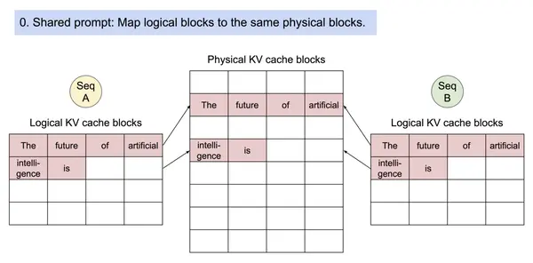

# Flashinfer

终于有机会深入学习一下 flashinfer 了，现在 flashinfer 也已经发展成为一个巨大的 kernel library。不过好在其保持了代码结构上的清晰性，仍然值得对其进行深入的学习而不至于失去方向。并且 flashinfer 本身对技术前沿还跟得特别紧，例如对 claude code skill & tvm ffi 等等，都是值得学习的

## Flashinfer Design

flashinfer 现在根本就没有 cmake 文件，整个 kernel 使用的逻辑已经改变了：从原始的 build cuda cpp，到现在的 jit 形式，整个 installation 变得非常简单

根据 `.claude/skills/add-cuda-kernel` 可以对 flashinfer 的算子开发流程有整体的认知。通过此流程可总结出 flashinfer 的设计精髓

1. JIT 优先

   Just in time compilation 使得 flashinfer 仅在使用 kernel 的时候对 kernel 进行编译。这对于开发来说会非常友好，不必要的 kernel 我们就不去编译了，是轻量且高效的选择

   另外的好处是我们可以完全不必写 Cmake 了！整个框架的配置和依赖都变得更简单

2. CUDA 内核与框架解耦

   所有的 kernel 全部实现在 `flashinfer/include` 中，以 header only 的形式存在。所有和框架相关的代码都放置在了 `flashinfer/csrc` 当中，通过 tvm ffi 实现了与框架（e.g. pytorch）的绑定。更具体来说通过 tvm ffi 的 `TensorView` 可以完成与各个框架之间的 Tensor 进行完美的接收与兼容，并以此为基础构建 kernel launcher。通过 `TVM_FFI_DLL_EXPORT_TYPED_FUNC` 导出 kernel launcher 为 `.so` 文件，使得我们的 kernel launcher 可被 python 调用

这里可以看到 flashinfer 的

## KV Cache Layout

以下讨论均讨论 `(N,H,C)` 形式的 layout，其中

- N 代表 seq len
- H 代表 num of heads
- C 代表 head dim

本小节将会展示 kv cache 的存储格式，至于如何管理 cache 的存储，将在 Paged Attention 章节讨论

### Ragged Layout

在 llm serving 上永远不会去使用这个 layout，永远会使用 paged layout。我认为该 layout 设计是为了服务非 llm 场景下的 batch attention，e.g. vision attention，这会比直接使用 single attention with kv cache 更快

ragged layout 表示，kv 的存储的形式为 `(N=max_seq_len, H, C)`


**需要注意的是：第一个维度 `N` 会把多个 batch 的 seq len 合并起来存储**。`indptr` 是一个 token cumsum，i.e. 把每个 sample 中的 token 数量做 cumsum。所以如果我们在使用 batch prefill with ragged kv 的时候 batch 维度就不会存在了。在使用时需要把多个 sample query 进行 concat，避免了 padding 操作

### Paged Layout

paged layout 表示，kv 的存储形式为 `(num_pages, page_size, H, C)`


这个图示就表示了 3 个 request，不同的 request 用不同的颜色表示。每一个 request 的 kv cache 会存储在不同的 pages 当中，当一个 page 存储满了，就会规划一个新的 page 以存储 kv cahe。和 ragged layout 一样，这里仍然会将多个 request 当中的 token concat 成为一个来进行看待以提高效率

我们需要获取某一个 request 的 kv cache 时，只需要把这些 kv indices 找到，配合 last page len 即可。完整的 `kv_len` 可用下面的公式计算：

```python
kv_len = page_size * (len(page_indices[i]) - 1) + last_page_length[i]
```

问题在于这些 Request 的 page indices 到底是怎么计算得到的，如果来了新的 request 会发生什么？这需要我们对 paged kv cache 进行管理，也是 paged attention 的精髓

## Major Api Usage

flashinfer 的核心 API 其实就根据 prefill/decode & ragged/paged 分为如下几种

|         | Ragged KV                                | Paged KV                                |
| ------- | ---------------------------------------- | --------------------------------------- |
| Prefill | **BatchPrefillWithRaggedKVCacheWrapper** | **BatchPrefillWithPagedKVCacheWrapper** |
| Decode  | N\A                                      | **BatchDecodeWithPagedKVCacheWrapper**  |

其中 batch decode 阶段没有实现 ragged kv 实现，个人认为原因在于：对 batch 场景下的 decode，ragged kv 会非常低效。想象以下，如果我们对 batch request 进行了 prefill，并存储了以下的 kv cache


接着我们要进行 decode 生成 first token，其 kv cache 需要存储到各个 request kv cache 的末尾，如此以来几乎需要对整个 ragged kv cache 进行重写以插入新的 kv cache。这将会是巨大的消耗，而 paged kv cache 则不存在这个问题。如果非要使用的话，可以直接调用 prefill，并设置 input len 为 1 即可

### BatchPrefillWithRaggedKVCacheWrapper

其实 flashinfer 本身的 [example](https://docs.flashinfer.ai/api/attention.html#flashinfer.prefill.BatchPrefillWithRaggedKVCacheWrapper) 是很好的说明。但是在未理解其 kv cache layout 之前，看着像天书一样。我对其中的一些变量命名进行更改，并省略了 device & dtype 设置，加入一些自己的注释以帮助阅读理解

```python
import torch
import flashinfer
num_layers = 32
num_qo_heads = 64
num_kv_heads = 16
head_dim = 128
# allocate 128MB workspace buffer, don't know why use this value
workspace_buffer = torch.empty(128 * 1024 * 1024, dtype=torch.uint8, device="cuda:0")
prefill_wrapper = flashinfer.BatchPrefillWithRaggedKVCacheWrapper(workspace_buffer, "NHD")

batch_size = 7	# 7 requset
cat_kv_len = 100	# total kv of all request
cat_qo_len = 100	# total q of all request
device = "cuda:0"

# cumsum of query nums, shape is [batch_size + 1,]
qo_indptr = torch.tensor([0, 33, 44, 55, 66, 77, 88, cat_kv_len], dtype=torch.int32)	
# cumsum of kv nums, shape is [batch_size + 1,],  we set it the same as query, self-attn
kv_indptr = qo_indptr.clone()

# create query and kv cahe
q_at_layer = torch.randn(num_layers, cat_qo_len, num_qo_heads, head_dim)
k_at_layer = torch.randn(num_layers, cat_kv_len, num_kv_heads, head_dim)
v_at_layer = torch.randn(num_layers, cat_kv_len, num_kv_heads, head_dim)

# plan, set attrs shared by all layers
prefill_wrapper.plan(
    qo_indptr,
    kv_indptr,
    num_qo_heads,
    num_kv_heads,
    head_dim,
    causal=True,
    # custom_mask=mask	# bring your own mask
)

outputs = []
for i in range(num_layers):
    q = q_at_layer[i]
    k = k_at_layer[i]
    v = v_at_layer[i]
    #### run ####
    o = prefill_wrapper.run(q, k, v)
    outputs.append(o)
```

对于 ragged kv 来说，其使用方式和 torch SDPA 还是比较相似，核心区别就是两点：

1. 没有 batch 维度，多个 sequence 直接进行 concat。所以你可以看到 `batch_size` 从来没有出现在任何的 qkv tensor creation 当中
2. 需要使用 plan method，把必要的参数传入：例如 query 和 kv 的 comsum，custom attention mask 等等。这些参数其实都是计算中必要的参数，完全可以放在 `run` 时输入，类似 SDPA。在之后的 `run` 当中会持续使用这些参数。除了设置参数外，plan 还会进行一些调度上的计算，例如将 sequences 进行合理的切分使得 work load balance，这些我也不太了解，就不整理了

### BatchPrefillWithPagedKVCacheWrapper

paged kv cache 相比 ragged 就要复杂一些，在 plan 阶段需要更多的参数 e.g. kv cache indices

```python
import torch
import flashinfer
num_layers = 32
num_qo_heads = 64
num_kv_heads = 16
head_dim = 128
max_num_pages = 128
page_size = 16
# allocate 128MB workspace buffer
workspace_buffer = torch.zeros(128 * 1024 * 1024, dtype=torch.uint8)
prefill_wrapper = flashinfer.BatchPrefillWithPagedKVCacheWrapper(workspace_buffer, "NHD")

batch_size = 7		# 7 request
concat_qo_len = 100	# total q of all request

# cumsum of query nums, shape is [batch_size + 1,]
qo_indptr = torch.tensor([0, 33, 44, 55, 66, 77, 88, concat_qo_len])
### KV Cache Related Params ###
# cumsum of kv pages nums, shape is [batch_size + 1,]
paged_kv_indptr = torch.tensor([0, 17, 29, 44, 48, 66, 100, 128])
# concat of all request's kv pages idx, shape is [paged_kv_indptr[-1],], 128 in this case
paged_kv_indices = torch.arange(max_num_pages)
# last page len of each request, shape is [batch_size,]
paged_kv_last_page_len = torch.tensor([1, 7, 14, 4, 3, 1, 16])

# create query and kv cache
q_at_layer = torch.randn(num_layers, nnz_qo, num_qo_heads, head_dim)
k_at_layer = torch.randn(num_layers, max_num_pages, page_size, num_kv_heads, head_dim)
v_at_layer = torch.randn(num_layers, max_num_pages, page_size, num_kv_heads, head_dim)

# plan, set attrs shared by all layers
prefill_wrapper.plan(
    qo_indptr,
    paged_kv_indptr,
    paged_kv_indices,
    paged_kv_last_page_len,
    num_qo_heads,
    num_kv_heads,
    head_dim,
    page_size,
    causal=True,
)
outputs = []
for i in range(num_layers):
    q = q_at_layer[i]
    kv_cache = (k_at_layer[i], v_at_layer[i])
    #### run ####
    o = prefill_wrapper.run(q, kv_cache)
    outputs.append(o)
```

与 ragged kv cache 的核心区别在于：

1. 在 plan 阶段，ragged kv cache 只需要设置 kv 的 cumsum (i.e. `kv_indptr`) 即可，但是 paged kv cache 就要设置更多了：

   1. `paged_kv_indptr`，是各个 request kv pages 的 cumsum
   2. `paged_kv_indices`，是各个 request 的 page indices concat
   3. `paged_kv_last_page_len`，各个 request 的最后一个 page 的占用长度

   这三个参数的含义如果仍然不清楚，建议可以回去看 paged kv layout 中的图示。这三个参数在上面的例子中是随机设置的，在实际 serving 的过程中，通常由 serving frame work (sglang or vllm) 计算给出，所以这些框架是才是管理 paged kv cache 的核心，并非 flashinfer 本身，这也是 flashinfer 的设计理念

   > **How do FlashInfer manages KV-Cache?**
   >
   > FlashInfer itself is not responsible for managing the page-table (pop and allocate new pages, etc.) and we leave the strategy to the user: different serving engines might have different strategies to manage the page-table. **FlashInfer is only responsible for computing the attention between queries and keys/values stored in KV-Cache.**

2. 在 run 阶段，不单独传入 kv，需要将二者打包为一个 tuple 作为一个 kv cache 整体传入

### BatchDecodeWithPagedKVCacheWrapper

decode with paged kv cache 在使用过程中和 prefill 几乎一样，除了在 plan 的时候不传入 `qo_indptr`，因为每一个 request 的 seq len 都是固定为1的，无需传入

```python
decode_wrapper.plan(
    # missing the `qo_indptr`
    kv_page_indptr,
    kv_page_indices,
    kv_last_page_len,
    num_qo_heads,
    num_kv_heads,
    head_dim,
    page_size,
    pos_encoding_mode="NONE",
    data_type=torch.float16
)
```

## Paged Attention

在介绍 paged attention 之前，我想先整理下，为什么我们需要 Paged Attention。在 paged attention 之前我们会给每一个 request 分配一个固定的空间，e.g. 2048 作为一个 Request 的最大 token 容量。这样的方式有两个方面的局限：

1. 内存的浪费

   由于每一次都是固定的配分空间，如果我们的 seq len 比较少，就会浪费分配的显存

2. 内存的碎片化

   本质上是第一点的延申。被浪费的显存就以碎片化的形式存在，我们无法利用他们。另外当 Request 所需要的 token 容量大于 2048 时，也是我们无法应对的情况

经过对各个 AI (Kimi, DeepSeek, GLM) 的严厉拷打，我算是整合除了一套我自己所理解的 paged attention 原理，可能和各个框架的实现有所出入，但我能以自己满意的方式理解其原理已经达到目的

在以上 flashinfer api 的整理中，对 paged kv cache 管理我们始终缺少 3 个关键参数的计算：`paged_kv_indptr` & `paged_kv_indices` & `paged_kv_last_page_len`

为了清楚地解释这些参数是如何在 serving 当中计算得到的，我必须要构建一个清晰的场景以及所需要的工具，使得这些计算能够自然地进行推导：

1. 一个 batch request。其中包含了 prefill & decode request
2. 一个 `free_pages` 队列。包含了哪些 pages 目前是可用的
3. 每一个 request 会维护自己的 page indices & last page len

有了这些条件进行 paged attention 就不难理解了：

1. request 进行 prefill 时，其 page indices 和 last page len 都是没有 history 的，我们可以从 `free_pages` 当中 pop 出一些新的 pages 以使用

   ```python
   neex_pages = prefill_len // page_size
   last_page_len = prefill_len % page_size
   ```

2. request 进行 decode 时，request 当中已经有了 history，我们现在要做的就是更新 page indices & last page len

   ```python
   if last_seq_len == (page_size - 1):
       page_indices.append(free_pages.pop())
       last_seq_len = 0
   else:
       last_seq_len +=1 
   ```

3. 在进行 attention 计算时，我们直接把各个 request 的 `page_indices & last_page_len` 连接起来，作为一个整体，输入给 flashinfer api 即可完成一次 batched prefill / decode

   ```python
   batch_page_indices = concat(page_indices)
   batch_page_indptr = [0] + cumsum([len(page) for page in page_indices])
   batch_last_page_len = concat(last_page_len)
   ```

我认为以上就是基本的 paged attention 算法原理。对于 prefix cache 之类的算法，则需要考虑更多，例如每一个 page 需要知道自己被共享给了多少 request，并且共享单位只能以 page 为单位，多出来的 token 则需要额外的复制，下面的动图来自 [zhihu](https://zhuanlan.zhihu.com/p/638468472)



## JIT

我认为现在可以走一个新的开发范式：

1. 使用 cuda cpp 进行开发 kernel header file
2. 使用 tvm ffi 标准接入到 flashinfer api 当中
3. 使用 JIT 的方式对 kernel 进行编译，在此 debug 一些编译错误
4. 使用 torch 直接在 python 端测试 kernel

我首先需要了解 JIT 的使用方法，然后理解 tvm ffi 如何桥接 pytorch

jit 的 core 代码在 `flashinfer/jit/core.py`，其中核心的 api 为 `gen_jit_spec`，通过这个 api 可以轻松配置之前在 cmake 当中配置的 include & library & flags 配置

```python
  def gen_jit_spec(                                                                  
      name: str,               
      sources: Sequence[Union[str, Path]],         
      extra_cflags: Optional[List[str]] = None,
      extra_cuda_cflags: Optional[List[str]] = None,        
      extra_ldflags: Optional[List[str]] = None,
      extra_include_paths: Optional[List[Union[str, Path]]] = None,
      needs_device_linking: bool = False,
  ) -> JitSpec:
```

下面是各个参数的详细解释，都来自 Kimi

| 参数                   | 作用                                                      | 典型值                                        |
| :--------------------- | :-------------------------------------------------------- | :-------------------------------------------- |
| `name`                 | 模块唯一标识符，决定 .so 文件名和缓存目录名               | `"batch_decode_fp16_128_heads"`               |
| `sources`              | 要编译的源文件路径列表（通常是 .cu 文件）                 | `[gen_dir/"kernel.cu", gen_dir/"binding.cu"]` |
| `extra_cflags`         | 传递给 c++ 编译器的额外标志（用于 .cpp 文件）             | `["-O3", "-march=native"]`                    |
| `extra_cuda_cflags`    | 传递给 nvcc 的额外标志（用于 .cu 文件）                   | `["-gencode=arch=compute_90a,code=sm_90a"]`   |
| `extra_ldflags`        | 传递给链接器的额外库和搜索路径                            | `["-L/path/to/lib", "-lcublas", "-lmyLib"]`   |
| `extra_include_paths`  | 额外的头文件搜索路径                                      | `["/usr/local/cutlass/include"]`              |
| `needs_device_linking` | 是否需要 nvcc 进行设备代码链接（复杂的 CUDA kernel 需要） | `True / False`                                |

此 api 会返回一个 `JiTSpec` 对象，我们调用该对象的 `build_and_load` 接口以实现 just in time compile

```python
# Step 1: Define (in flashinfer/jit/my_kernel.py)
def gen_my_kernel_module(dtype):
    uri = f"my_kernel_{dtype}"	# uniform resource identifier
    gen_directory = jit_env.FLASHINFER_GEN_SRC_DIR / uri

    # Copy sources (or render Jinja templates)
    sources = jit_env.FLASHINFER_CSRC_DIR / "my_kernel.cu"

    return gen_jit_spec(
        name=uri,
        sources=sources,
        extra_cuda_cflags=[...],
        # extra_ldflags=[...],      # if you need custom libs
        # extra_include_paths=[...], # if you need extra includes
    )

# Step 2: Cache, Build & Load (in flashinfer/my_kernel.py)
@functools.cache  # <-- Important: caches the compiled module in memory
def get_my_kernel_module(dtype):
    return gen_my_kernel_module(dtype).build_and_load()

# Step 3: Call the kernel
def my_kernel(input_tensor):
    module = get_my_kernel_module("nvfp4")	# JIT compiles on first call
    module.run(input_tensor)                # Calls the TVM-FFI exported function
```

其中有几点细节：

1. 需要使用 `functools.cache` 对得到的 module 进行装饰。当它装饰一个函数后，函数会记住之前调用时传入的参数和对应的返回值；如果后续再次用**完全相同的参数**调用，就不会重新执行函数体，而是直接返回之前缓存的结果

2. 有一些 flashinfer 会自动添加的 system include & flags & link libraries

   - system include 包含系统 cuda header file, tvm ffi, flashinfer, cutlass 

     ```cpp
     // Python & TVM-FFI
     -isystem <python-include>
     -isystem <tvm_ffi-include>
     -isystem <dlpack-include>
     
     // CUDA
     -isystem $cuda_home/include
     -isystem $cuda_home/include/cccl
     
     // FlashInfer
     -isystem <flashinfer>/data/include        // include/flashinfer/
     -isystem <flashinfer>/data/csrc           // csrc/
     -isystem <flashinfer>/data/cutlass/include
     -isystem <flashinfer>/data/cutlass/tools/util/include
     -isystem <flashinfer>/data/spdlog/include
     ```

   - 对于 flags 不用操心太多常规的 cpp & cuda flags 都会自动生成，e.g. `-std=c++17, -use_fast_math, -gencode`

   - 会自动 link cuda runtime

     ```python
     ldflags = [
         "-shared",
         "-L$cuda_home/lib64",
         "-L$cuda_home/lib64/stubs",
         "-lcudart",
         "-lcuda",
     ]
     ```

最后我们可以通过加 env `FLASHINFER_JIT_VERBOSE=1 FLASHINFER_JIT_DEBUG=0` 来看到完整的编译命令

## TVM FFI

兜兜转转还是没走出 tvm 这个圈，tvm ffi 已经被 CuteDSL & TileLang & Flashinfer 进行了应用。这说明该方式有着足够的易用性，并且功能保障性也很强，不然短时间内这些框架没办法将 tvm ffi 进行集成。tvm ffi 是 kernel launcher 和 pytorch 之间的桥梁，pytorch 传入的 torch Tensor 能够被 tvm ffi 所接收，然后传递给底层的 kernel

使用 tvm ffi 集成 kernel 的方式非常直接

```cpp
  // csrc/my_kernel_jit_binding.cu
  #include "tvm_ffi_utils.h"

  // 1. kernel launcher function (defined in my_kernel.cu)
  void my_kernel_launcher(TensorView input, TensorView output, int64_t param);

  // 2. export this function to name `run`
  TVM_FFI_DLL_EXPORT_TYPED_FUNC(run, my_kernel_launcher);
```

我们希望单独使用一个 `binding.cu` 来导出这个算子，而不是把这个 binding 放在 kernel launcher file 本身，这样保持了 kernel launcher 的单纯性，可以直接给提供给 cuda cpp 框架直接使用

之后我们就可以如上一节介绍的一样，通过 jit 获得编译好的 kernel，并且通过 export 时指定的 `run` 接口运行。在 flashinfer 使用 tvm ffi 时产生了一些最佳实践：

1. 设备和流管理

   ```cpp
   ffi::CUDADeviceGuard device_guard(q.device().device_id);
   const cudaStream_t stream = get_stream(q.device());
   ```

   其中 device guard 会确保 kernel 在所给定的 device id GPU 上运行，stream 则会输入到 kernel launch 参数当中

2. 数据转换

   使用 `static_cast<Dtype*>` 类型转换，将 `TensorView` 当中的 DLPack datatype 转换成 kernel 接收的底层 c type or cuda type 数据类型

3. 错误检查

   使用 `TVM_FFI_ICHECK` 进行断言检查，输出 cuda errors

   ```cpp
   TVM_FFI_ICHECK(status == cudaSuccess) << "Failed to run persistent paged attention, error: " << cudaGetErrorString(status);
   ```

   当然还有很多 CHECK 小工具，都是 cuda 编程常用的手段，可以在 `tvm_ffi_utils.h` 当中找到

4. TensorView

   可以像 torch tensor 一样获得 `TensorView` 对象的常用属性

   ```cpp
   // TensorView tensor;
   tensor.size(i)	// maybe equal with tensor.shape[i]
   tensor.ndim()
   tensor.dtype()
   tensor.device()
   ```

5. 可选参数 `Optional<Dtype>`

   通过 `tvm::ffi::Optional` 来控制可选参数，在 python 传入 `None` 是可以被 tvm ffi 所接收的，通过 `.has_value()` 来获知该参数是否传入，如果传入可使用 `.value()` 方法获得该值

## Questions

- 我在 sm110 上编译 backend = cutlass 虽然成功，但是 kernel 却没办法正常运行。不过我使用原生 cutlass example fmha 能够运行，同样的情况也发生在了 batched prefill paged kv cache

  目前来看 kernel launcher 本事是成功引发的，但是整个 kernel 没有被调用这是非常奇怪的

- 如何利用 tvm ffi & ninja 完成 cuda cpp -> python 的构建，其中的 3rdparty 依赖应该如何完成设置？

Conclusion:

- 如果不是 llm serving 完全可以不用考虑 flashinfer，使用直接的算子集成。可以看到 flashinfer 主推的仍然是 Paged attention，其需要结合 scheduler 对 Page 进行复杂的管理，这种场景和 llm serving 高度的绑定