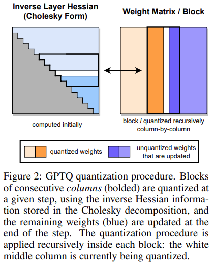
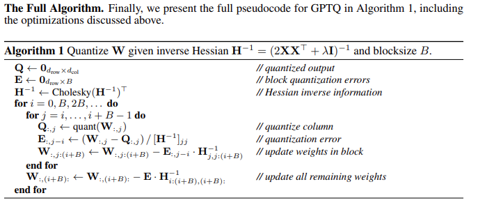
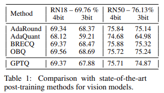
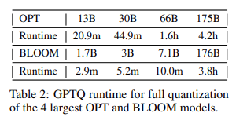
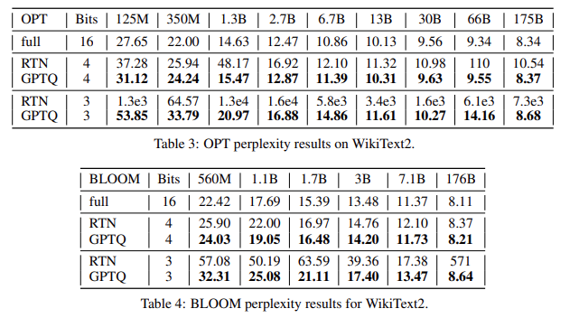

# GPTQ

- 论文：[GPTQ: Accurate Post-Training Quantization for Generative Pre-trained Transformers](https://arxiv.org/abs/2210.17323)
- 论文代码：https://github.com/IST-DASLab/gptq
- 社区代码：https://github.com/AutoGPTQ/AutoGPTQ

## 前身 OBS & OBQ

OBS: [Optimal Brain Surgeon](https://proceedings.neurips.cc/paper/1992/file/303ed4c69846ab36c2904d3ba8573050-Paper.pdf)

OBQ: [Optimal Brain Quantization](https://arxiv.org/abs/2208.11580)

OBS 是一种神经网络的裁剪方法，核心思路是：在二阶近似的条件下，寻找一些权重，将这些权重删除后对模型产生的误差最小

其简单的推导过程如下：

考虑训练到局部最小误差的网络，对于权重扰动 $$\delta \mathbf w$$​的 Loss 的二阶泰勒展开

$$
\delta E = ( \frac{\partial E}{\partial \mathbf{w}})^T \delta \mathbf{w} + \frac{1}{2} \delta \mathbf{w}^T \mathbf{H} ·\delta \mathbf{w} + O(\|\delta \mathbf{w}\|^3)
$$

> $$E$$ 就是网络的输出，例如：对于一个线性层来说 $$E=\mathbf{w}·\mathbf{x}$$

其中 $$\mathbf{H}= \frac{\partial^2 E}{\partial \mathbf{w}^2}$$ 是网络输出对权重的 Hessian Matrix，基于网络已经收敛到局部最优的假设，泰勒一阶展开应该比较小，所以忽略第一项。并且由于权重扰动较小，所以也忽略更高阶的展开。我们需要获得最小的 $$\delta E$$

此时对某个权重 $$\mathbb{w}_q$$进行删除的操作表示为

$$
\delta w_q +w_q = 0
$$
将上式用向量 $$\mathbf{w}$$ 表示

$$
\mathbf{e}_q^T·\delta \mathbf{w} + w_q=0
$$

> $$\mathbf{e}_q$$是权重空间 $$\mathbf{w}$$中对于 $$w_q$$位置的 one-hot 向量

基于以上约束，我们可以使用拉格朗日乘数法来解决该最优化问题

$$
L=\frac{1}{2} \delta \mathbf{w}^T· \mathbf{H}·  \delta \mathbf{w} + \lambda(\mathbf{e}_q^T·\delta \mathbf{w}+w_q)
$$

可以解得

$$
\delta\mathbf{w}=-\frac{w_q}{[\mathbf{H}^{-1}]_{qq}}\mathbf{H}^{-1}·\mathbf{e}_q    
$$

$$
L=\frac{1}{2} \frac{w_q^2}{[\mathbf{H}^{-1}]_{qq}}
$$

这样我们就得到了一个 $$\delta\mathbf{w}$$使得我们剪切了 $$w_q$$并且调整了其他的权重使得 Loss 的变动最小

有了 OBS 的铺垫，OBQ 很快把这种方式推广到了量化当中，**这其实很好理解：常用的量化则是把数值近似到一个接近的值， 而剪枝实际上可以看做把数值直接近似成0（某种意义上或许可以称作1bit或0bit量化）**，可以理解为一种特殊的量化

OBQ 将 OBS 扩展后的公式如下：

$$
\delta\mathbf{w}=-\frac{quant(w_q)-w_q}{[\mathbf{H}_F^{-1}]_{q,q}}(\mathbf{H}_F)^{-1}_{:,q}   
$$

$$
w_q=\arg min_q \frac{(quant(w_q)-w_q)^2}{[\mathbf{H}_F^{-1}]_{q,q}}
$$

> 下标 $$F$$ 代表当前剩余的所有未量化权重，$$\mathbf{H}_F$$则为对应的 Hessian Matrix

通过不断寻找影响最小的 $$w_q$$ 进行量化，就能够得到最后的量化模型。在这个过程中我们每量化一个权重 $$w_q$$ 就要更新当前未量化的权重，并重新计算未量化权重的 Hessian Matrix

## GPTQ 算法

OBQ 算法在量化结果上表现不错，但是太慢了。OBQ 对 ResNet-50 进行量化需要一个小时，但由于其算法复杂度为 $$O(d_{row}·d_{col}^3)$$，在大模型上将花费几年的时间，所以 GPTQ 方法就是在 OBQ 的基础上进行加速，其改进点总结为以下三点：

1. **取消贪心算法**

   1.  在 OBQ 中，是逐个找影响最小的 q 来剪枝/量化，经过观察发现，其实随机的顺序效果也一样好（甚至在大模型上更好）。原算法对 W 进行优化时，逐行计算，每一行挑选q的顺序都是不一样的。在 GPTQ 中直接全部都采用固定顺序，使得复杂度从 $$O(d_{row}·d_{col}^3)$$ 下降到 $$O(\max (d_{row}·d_{col}^2, d_{col}^3))$$。**对于一个** $$d_{raw}=d_{col}=1024$$ **的矩阵来说，复杂度将减少 1000 倍，即 3 个数量级**

2. **批处理**

   OBQ 算法在对单个权重量化完成后，会对所有未量化的权重进行更新来进行补偿。这样的方式是具有较低的 compute-memory-ratio 的，尤其是当未量化的权重比较多的情况。由于同一个特征矩阵 W 不同列间的权重更新是不会互相影响的，GPTQ 提出了批处理的方法，一次处理多个列（例如 128 列）。在一个批次内，仍然是逐列地进行量化，但是暂时不更新批次外的未量化权重，在完成列内的量化后，统一更新未量化的权重，这将**大幅提升 compute-memory-ratio**

   >  Compute-memory-ratio: 程序执行过程中，FLOPs 计算量与在 global memory 获取的数据量之比，单位为 FLOP/Byte，也称作计算强度

   

3. **数值稳定性**

   在 OBQ 计算 $$\mathbf{H}^{-1}$$的方式是利用 Gaussian elimination 迭代计算的，这样能避免求逆的三次复杂度操作

   $$
   \mathbf{H}^{-1}_{-q} = (\mathbf{H}^{-1}-\frac{1}{[\mathbf{H}^{-1}]_{q,q}}\mathbf{H}^{-1}_{:,q}\mathbf{H}^{-1}_{q,:})_{-q}
   $$

   > 下标 $$-q$$ 代表移除矩阵的第$$q$$行和第$$q$$列

   这个过程会产生数值不稳定的问题，对于小模型可以通过在矩阵对角元素上加一个小量 $$\lambda$$来解决，但对于大模型该方法将仍不奏效。得益于每一行都采用相同的量化顺序，所以他们都共享相同的 $$\mathbf{H}^{-1}$$，GPTQ 采用了提前计算好所有需要的信息，避免该迭代过程。计算这些信息的方法使用的是用 Cholesky decomposition 的形式等价原来的计算结果。下面是我自己写的一个测试脚本，测试 Cholesky decompsition 的等价性

   ```Python
   # test of Cholesky decomposition
   import torch
   torch.random.manual_seed(1)
   # create a 
   X = torch.rand(3, 3)
   # create a symmetric matrix
   A = X @ X.T + torch.eye(3) * 1e-3
   
   # compute the Cholesky decomposition
   L = torch.cholesky(A)
   A_inv = torch.cholesky_inverse(L)
   A_inv_L = torch.cholesky(A_inv, upper=True)
   A_inv_ = torch.inverse(A)
   print(f'Vanilla inverse equals Cholesky inverse: {torch.allclose(A_inv, A_inv_)}')
   print(A_inv / A_inv[0, 0])
   print(A_inv_L / A_inv_L[0, 0])
   print(f"First row of normed A_inv: {A_inv[0, :] / A_inv[0, 0]}")
   print(f"First row of A_inv_L: {A_inv_L[0, :] / A_inv_L[0, 0]}")
   
   print('\n----- Remove the First Row----------')
   B = X[1:, :] @ X[1:, :].T + torch.eye(2) * 1e-3
   B_inv = torch.inverse(B)
   B_inv_L = torch.cholesky(B_inv, upper=True)
   print(B_inv / B_inv[0, 0])
   print(A_inv_L / A_inv_L[1, 1])
   print(f"First row of normed B_inv: {B_inv[0, :] / B_inv[0, 0]}")
   print(f"First row of A_inv_L: {A_inv_L[1, :] / A_inv_L[1, 1]}")
   ```

GPTQ 完整的算法图如下



## 实验结果

### Quantizing Small Models

论文测试了 GPTQ 在 ResNet18 & ResNet50 上的量化效果，可以看到在 4-bit 量化中，GPTQ 几乎和最好的方法打平；在 3-bit 量化中略逊色于最好的方法。在量化时间上 GPTQ 只需要 < 1 min 的时间，而 OBQ 方法则需要 1 小时，这是 GPTQ 的优势



### Quantizing Big Models

GPTQ 算法在量化 1-3B 参数量的模型只需要几十分钟，对于 175B 参数量的模型则需要 3-4 个小时 (on single A100 GPU)



论文使用 RTN 作为 baseline 进行比较，是全面占优的。在越大的模型上，其量化结果越好



## 实践

有了量化方法过后，如何使用量化参数？量化所带来的好处到底有哪些？

## 总结

​    GPTQ 解决了大模型**量化的耗时长的问题以及稳定性问题**，在 4-bit 要求下能够保持良好的模型精度，并且对于千亿级别的模型，只需要**几个小时**就能完成量化。在实际使用中，可以先使用 GPTQ 快速地获得一个稳定的基线量化模型，并在此基础上进行精度优化。