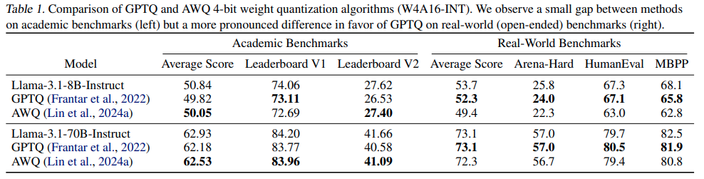
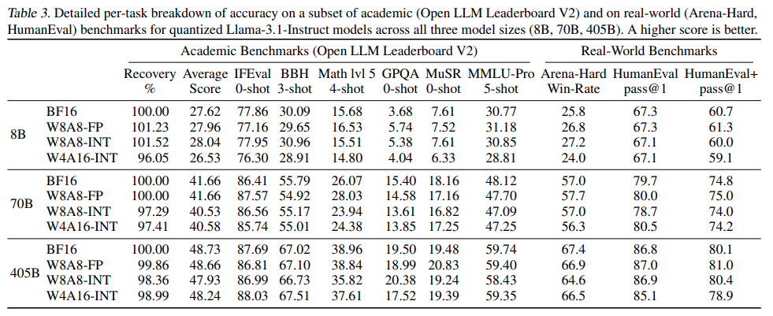

# Give Me BF16

[arxiv](https://arxiv.org/abs/2411.02355)

这篇论文对当前 LLM 量化做了整体的经验总结，对各式各样的量化方式、模型进行了对比和评估，可以帮助我们在不同的场景要求下选择合适的量化方式

## Concept

- Key Findings

  1. FP8 weight and activation quantization (W8A8-FP) is **lossless** across all model scales

     这个 Finding 对于我们来说挺重要的，但目前一个重要缺点：FP8 的支持仅在比较新的 GPU 架构中支持 (Hopper & Ada)，对于 Ampere 架构来说就比较困难了

  2. INT8 weight and activation quantization (W8A8-INT), when properly tuned, incurs **surprisingly low 1-3% accuracy degradation**

     W8A8-INT 的研究也与之前的研究相悖，之前的研究报告了使用 W8A8-INT 会有较大的精度损失。这是因为本论文使用了 dynamic activation quantization or SmoothQuant

  3. INT4 weight-only quantization (W4A16-INT) is **competitive with 8-bit integer weight** and activation quantization.

- Deployment Advice

  1. We find that **W4A16 offers the best cost-efficiency** for synchronous deployments, and for asynchronous deployment on mid-tier GPUs.
  2.  At the same time, **W8A8 formats excel in asynchronous “continuous batching”** deployment of mid- and large-size models on high-end GPUs.

- Weight Quantization

  论文点名表扬了：GPTQ, AWQ, SqueezeLLM, OWQ, SpQR 方法，这些方法都能获得 high accuracy，但是后三个方法是 outlier-aware quantization (only a small fraction of weights are effectively stored in higher precision)，由于这样的特性导致没有较好的 kernel 实现

- Activation Quantization

  同时量化 weights & activations 能够直接获得硬件加速的最大效果，但是也是由于 outlier features 的存在，量化激活值是比较困难的。论文点名表扬 SmoothQuant，该方法发现了 outlier feature 在整个模型之间基本上是 stable 的，所以可以通过一个 calibration set 进行计算获得

  同时还有论文也研究了 W4A4 & W4A8，这些研究都有明显的精度损失，并且没有好的 kernel 支持，所以论文就不讨论了

- vLLM

  论文简要介绍了一下 vLLM，并选择其作为所有实验的 codebase。vLLM 是一个高性能 LLM inference framework，其集成了很多 customized kernels in CUTLASS & hand-written kernels，并且也集成了许多其他的优化工作：FlashInfer, FlashAttention, PagedAttention, Marlin 等。**其中 CUTLASS kernels 有论文所需要的 W8A8 (both INT and FP)**，而对于 W4A16 也有 Marlin kernel

- Text similarity analysis

  论文对量化前后的模型输出进行了分析，想要看下文字输出到底发生了什么变化？论文的结论是：对于较大的模型，量化前后的模型，在选词上几乎没有差距；对于小一点的模型，会让模型的输出结构有一定的改变，但是依然在语义上是相近的

- W8A8-FP

  > This scheme uses an 8-bit floating point format for weights and activations of all linear operators within transformer blocks.

  看来 FP8 也只是对所有的 Linear 层进行量化，其他层应该仍然会选择较高精度的实现（attention & layernorm）

- W8A8-INT

  > This scheme reduces the weights and activations of all linear operators within transformer blocks to 8-bit integer values.

  同样也只是对 linear 层进行量化。对于 weight quantization 直接使用 GPTQ，对于 activation quantization 论文尝试了两种不同的方法：

  1. dynamic per-token quantization，该方法对于 8B 和 405B 的 llama3.1 都表现不错，但是对于 70B 的模型表现比较差
  2. SmoothQuant，弥补了 dynamic per-token quantization 的缺点，但是需要选择更好的 calibration set (OpenPlatypus)，尤其是对于竞争激烈的 academic benchmarks。不过对于 8B 大小的模型，random tokens/calibration set 就足够了

- W4A16-INT

  > In this scheme, the weights of all linear operators within transformer blocks are quantized to 4-bit integers, while activations are retained at 16-bit precision

  这相当于是 weight only quantization，同样也是使用 GPTQ，也需要选用更高质量的 OpenPlatypus dataset 作为 calibration set 效果会最佳

  GPTQ 所采用的配置是 group size 128 with MSE-optimal clipping factors

  论文还简单讨论了一下 GPTQ v.s. AWQ，在论文的实验中，GPTQ 对于 AWQ 要么是基本打平（in academic benchmark），要么是更好（in real-world benchmark），具体数值可以在下表看到

  

  总结原因：

  1. Use MSE-Optimal clipping factor

     实际上 MSE-Optimal clipping factor 在 GPTQ 中是没有引入的，我倒是在 AWQ 的论文中有看到过，看来这个方式是独立于量化方法的，可以直接加入

  2. Better calibration set

     What can I say, OpenPlatypus YES!

  3. 大部分研究都没有对比 real-world benchmark（这是个非技术原因，本来不太想整理的）

- **Performace Table**

  下面就将所有的量化方法、模型、benchmark 放在一块比较下，其实这个表格就是 key findings 的具体化

  

## Question

- What is MSE-optimal clipping factors in GPTQ? And what is Min-Max optimal

  主要需要理解 clipping factors 是啥：将权重进行 clipping，而 xx-optimal 其实就是将权重进行 clipping，然后计算 clipping 前后的误差，是这个误差最小的 clipping 方式就是 optimal clipping factor 