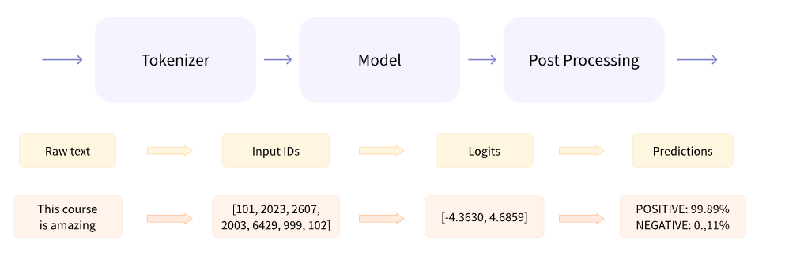
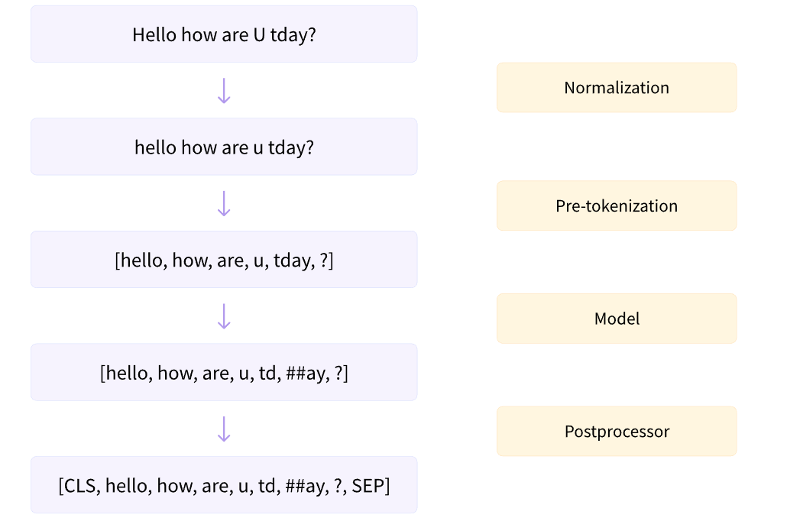

# Hugging Face

[Hugging Face NLP Course](https://huggingface.co/learn/nlp-course/chapter1/1) 学习笔记，这个课程比较老了，大概更新到了 2021 年的一些模型

## 第一章 Intro

1. 自然语言处理任务

   - **Classifying sentences or words in sentences**
   - **Generating text content**
   - **Extracting an answer from a text**
   - **Generating a new sentence from an input text**，最后一个任务就比较宽泛了，包含 chat, translate 等

2. `pipeline` in transformers

   能够创建一个 NLP 任务流程，包含预处理，模型前向路径，后处理。做到输入文字，返回输出

   

3. Transformer -2021 的一些重要模型

   - GPT series, auto-regressive transformer models
   - BERT & DistillBERT, auto-encoding transformer models
   - BART & T5, sequence-to-sequence transformer models

   似乎现在是 GPT 在引领潮流

## 第二章 Transformers Lib

transformers 是 huggingface 开源的第一个库，也是其最受欢迎的库，在 github 上已经收获了 100k ⭐️

其创建的目的是为了解决如下问题：1. 训练和使用开源模型困难；2. 相同模型在各个框架下实现不同。为了解决这两个难题，huggingface transformers 的设计就有如下特性：

1. Ease of use，能够轻松下载和使用预训练模型
2. Flexibility，不使用其他基础库，由基本的 pytorch 代码组成
3. Simplicity，没有任何的抽象和组件，所有的模型都在一个文件里，真正做到了 **all in one file**，一个文件即一个产品。这一点真的很棒，如果你知道我在说哪家的抽象很差的话🤨

下载 transformer library

```shell
pip install transformers
```

### Tokenizer

基本上这一整个章节都是在讲 tokenizer 的事情

tokenizer 实际上就是预处理，将文字转化为数字

所谓 token，狭隘的理解就是 sub-word，而 vocabulary 就是一张大表，在这个表上每一个 sub-word 都有自己 id，这个 id 也叫 token id。而 tokenizer 就是这个过程：word -> sub-word -> token id

tokenizer 需要在训练和推理时保持一致，所以可以通过 `.from_pretrained(checkpoint)` 方法获得训练信息

```python
from transformers import AutoTokenizer

checkpoint = "distilbert-base-uncased-finetuned-sst-2-english"
tokenizer = AutoTokenizer.from_pretrained(checkpoint)


raw_inputs = [
    "I've been waiting for a HuggingFace course my whole life.",
    "I hate this so much!",
]
inputs = tokenizer(raw_inputs, padding=True, truncation=True, return_tensors="pt")
print(inputs)
```

`AutoTokenizer` 的 `Auto` 在于识别 checkpoint 中的模型类别，然后再生成对应的 tokenizer，例如 `BertTokenizer`

除了 `AutoTokenizer` 之外，transformers 还提供 `AutoModel`，也可以通过字符串的方式获得预训练模型

```python
from transformers import AutoModel

checkpoint = "distilbert-base-uncased-finetuned-sst-2-english"
model = AutoModel.from_pretrained(checkpoint)

outputs = model(**inputs)
print(outputs.last_hidden_state.shape)
# torch.Size([2, 16, 768])
```

但需要注意的是 `AutoModel` 的输出只是 logtis，也就是没有经过预测头的输出。如果想要使用预测头，还得使用具体的 `Autoxxx`

```python
from transformers import AutoModelForSequenceClassification

checkpoint = "distilbert-base-uncased-finetuned-sst-2-english"
model = AutoModelForSequenceClassification.from_pretrained(checkpoint)
outputs = model(**inputs)
# torch.Size([2, 2])
```

在 transformers 中也可以使用配置来创建模型，每一个模型都有一个自己的配置类

```python
from transformers import BertConfig, BertModel

# Building the config
config = BertConfig()

# Building the model from the config
model = BertModel(config)

# Building from pretrain
model = BertModel.from_pretrained("bert-base-cased")
```

配置类包含了很多创建模型的属性

在 transformers 中保存模型将生成两个文件

```python
model.save_pretrained("dir_path")
```

一个是 `config.json` 其保存了模型的结构相关的属性，另一个就是 `pytorch_model.bin` 其保存了模型权重，相当于 `state_dict`

分词（tokenization）

1. word-based tokenization

   英文单词的数量有 5000,000 多个，这将是一个比较大查找表。并且按照 word 划分也无法获得词与词之间的共性，例如 dog 和 dogs 将分为两个词

2. character-based tokenization

   虽然这样分词是最简单的，毕竟只有26个字母，但这会让每一个 token 的意义没有那么明显

3. subword tokenization

   前两者的结合

tokenizer 的加载和保存与模型一样，保存下 config & weight，这里的 weight 也被称为 vocabulary，将文字转化为 token id

```python
from transformers import BertTokenizer

tokenizer = BertTokenizer.from_pretrained("bert-base-cased")
tokenizer.save_pretrained("dir_path")
```

tokenizer 的使用方法

1. `tokenizer(sequence, return_tensors='pt')`，将文字转为 batched token ids
2. `tokenizer.tokenize(sequence)`，将文字转为 token ids
3. `tokenizer.decode(sequence)`，将 token ids 转为文字

tokenizer 能够处理 batched sequences，并且模型也必须接受 batched inputs。为了处理 batched sequences，需要对不同长度的序列进行 padding，并且使用 attention mask 来控制注意力范围

一个完整的调用代码

```python
import torch
from transformers import AutoTokenizer, AutoModelForSequenceClassification

checkpoint = "distilbert-base-uncased-finetuned-sst-2-english"
tokenizer = AutoTokenizer.from_pretrained(checkpoint)
model = AutoModelForSequenceClassification.from_pretrained(checkpoint)
sequences = ["I've been waiting for a HuggingFace course my whole life.", "So have I!"]

tokens = tokenizer(sequences, padding=True, truncation=True, return_tensors="pt")
output = model(**tokens)
```

## 第三章 Finetune a Pretrained Model

Loading a dataest from hub

安装 datasets 库

```shell
pip install datasets
```

以  MRPC (Microsoft Research Paraphrase Corpus) dataset 为例

cache 地址可以通过环境变量 `HF_HOME` 来设置，否则将存储到默认的 `~/.cache/huggingface`

加载数据集

```python
from datasets import load_dataset

raw_datasets = load_dataset("glue", "mrpc")

# DatasetDict({
#     train: Dataset({
#         features: ['sentence1', 'sentence2', 'label', 'idx'],
#         num_rows: 3668
#     })
#     validation: Dataset({
#         features: ['sentence1', 'sentence2', 'label', 'idx'],
#         num_rows: 408
#     })
#     test: Dataset({
#         features: ['sentence1', 'sentence2', 'label', 'idx'],
#         num_rows: 1725
#     })
# })
```

这个 raw dataset 是一个 `DatasetDict` 类，以 train split 为例：该数据集的 train split 一共有 3668 个样本，每一个样本的特征有4个，分别是 `sentence1 & sentence2 & label & idx`

和 pytorch dataset 一样，可以直接使用 index 来获得每一个 item。与 Pytorch dataset 不一样的是还可以通过 dict 的方式来获得整个数据的某个特征

```python
raw_train_dataset = raw_datasets["train"]
sentence1 = raw_train_dataset["sentence1"]
print(type(sentence1), len(sentence1))
# <class 'list'> 3668
```

dataset 提供了 `map` 方法来对 samples 进行额外的处理

```python
def tokenize_function(example):
    # tokenize your example, or just use tokenizer
    return tokenized_example

tokenized_datasets = raw_datasets.map(tokenize_function, batched=True)
```

相当于所有的样本都经过了 `tokenize_function` 的处理，并且使用 batched 参数可以并行处理，起到加速的效果。tokenizer 使用 Tokenizer library，是用 Rust 实现的，所以已经使用了多线程进行加速

dynamic padding: 对每一个 batch，都 pad 到当前 batch 中最长的长度。相对的，not dynamic padding 是所有样本 padding 到指定长度，通常为整个数据集中最长的样本

实现 dynamic padding 是由 `DataCollatorWithPadding` 实现，实际等价于 pytorch dataloader 中的 collate function

```python
from transformers import DataCollatorWithPadding

data_collator = DataCollatorWithPadding(tokenizer=tokenizer)

samples = tokenized_datasets["train"][:8]
samples = {k: v for k, v in samples.items() if k not in ["idx", "sentence1", "sentence2"]}

batch = data_collator(samples)
print({k: v.shape for k, v in batch.items()})
# {'input_ids': torch.Size([8, 67]),
#  'token_type_ids': torch.Size([8, 67]),
#  'attention_mask': torch.Size([8, 67]),
#  'labels': torch.Size([8])}
```

Transformers 提供了一个 `Trainer` 类来做简单模型训练，这里不做过多介绍，毕竟这不是该库的核心

## 第四章 Huggingface Hub

huggingface model hub，每一个模型在 huggingface 都成立一个 github repo 可用于版本控制和下载，这个 Repo 也叫做 model card

huggingface 还是推荐上面介绍的方式 `.from_pretrained` 的方法来获得模型，而这也是大多数 model card 做的，可以打开一个 [CodeLlma](https://huggingface.co/codellama/CodeLlama-70b-Instruct-hf) 来看下

```python
from transformers import AutoTokenizer, AutoModelForCausalLM

import torch

model_id = "codellama/CodeLlama-70b-Instruct-hf"

tokenizer = AutoTokenizer.from_pretrained(model_id)

model = AutoModelForCausalLM.from_pretrained(
   model_id,
   torch_dtype=torch.float16,
   device_map="auto",
)
```

把模型推送到 huggingface 上，只需要使用 `.push_to_hub` 即可，前提是你有 huggingface 账号，账号登录有两种方法

```python
# first
from huggingface_hub import notebook_login

notebook_login()

# commandline
huggingface-cli login
```

登录过后使用 api 即可

```python
model.push_to_hub("dummy-model")
tokenizer.push_to_hub("dummy-model")
tokenizer.push_to_hub("dummy-model", organization="huggingface")
tokenizer.push_to_hub("dummy-model", organization="huggingface", use_auth_token="<TOKEN>")M
```

Model Card 界面是由 README.md 生成的，希望你能包含如下内容：

- Model description
- Intended uses & limitations
- How to use
- Limitations and bias
- Training data
- Training procedure
- Evaluation results

这样才能使得模型具有易用性，并且帮助别人复现你的工作

## 第五章 Datasets Lib

datasets 用于处理表格数据非常方便，例如以下格式：

| Data format        | Loading script | Example                                                 |
| ------------------ | -------------- | ------------------------------------------------------- |
| CSV & TSV          | `csv`          | `load_dataset("csv", data_files="my_file.csv")`         |
| Text files         | `text`         | `load_dataset("text", data_files="my_file.txt")`        |
| JSON & JSON Lines  | `json`         | `load_dataset("json", data_files="my_file.jsonl")`      |
| Pickled DataFrames | `pandas`       | `load_dataset("pandas", data_files="my_dataframe.pkl")` |

既可以从本地，也可以从 url；既可以 load 一个，也可以 load 多个 split

```python
from datasets import load_dataset

squad_it_dataset = load_dataset("json", data_files="SQuAD_it-train.json", field="data")

data_files = {"train": "SQuAD_it-train.json", "test": "SQuAD_it-test.json"}
squad_it_dataset = load_dataset("json", data_files=data_files, field="data")
squad_it_dataset

url = "https://github.com/crux82/squad-it/raw/master/"
data_files = {
    "train": url + "SQuAD_it-train.json.gz",
    "test": url + "SQuAD_it-test.json.gz",
}
squad_it_dataset = load_dataset("json", data_files=data_files, field="data")
```

接下来介绍了下 datasets 的常规功能

1. filter
2. **map**
3. sort

其中 map 是最重要的功能，还可以使用 `batched=True` 来开启多线程加速，配合 fast tokenizer 速度更快，但什么是 fast tokenizer 还没细说。还可以是用 `num_proc` 来开启多进程，进一步加速

可以使用 `datasets.save_to_disk & to_csv & to_json` 来保存数据集

`save_to_dist` 将采用 arrow format，什么是 arrow format 也不清楚


对于超大型的数据集，是不可能将所有数据载入到内存当中的，huggingface dataset 可以通过 memory-map 的方式解决，使用 memory-map 就需要使用 arrow format

memory-map 表示在 RAM 和 filesystem storage 之间提供一个映射，这样就能获取和操作数据集，从而避免完全将数据集装入内存

huggingface 还提供了 streaming datasets，这样就不需要将数据集完整地下载到本地，而是实时获取，随取随用


下面两章节使用了 request 去爬一些 github issues 作为数据，简单创建了一个数据集，然后使用一个 auto tokenizer & model 来进行文字编码，使用 FAISS 算法来进行语义搜索

## 第六章 Tokenizer Lib

当 corpus (语料库) 之间的差异太大了，对应的 tokenizer 显然差异也很大，例如英文语料库和日文语料库，里面对应的分词肯定不一样

为了让所有人都看懂，这一章以 English & Python 两个语言作为对比

直接拿 GPT2 的 tokenizer 过来训

```python
from transformers import AutoTokenizer

old_tokenizer = AutoTokenizer.from_pretrained("gpt2")
```

tokenizer 到底包含什么呢？为什么需要训练？可能它的参数不像神经网络的权重一样，但也是需要训练的

如果用 GPT2 的 tokenzier 去对 Python code 进行分词会发生什么？

```python
example = '''def add_numbers(a, b):
    """Add the two numbers `a` and `b`."""
    return a + b'''

tokens = old_tokenizer.tokenize(example)
print(tokens)

['def', 'Ġadd', '_', 'n', 'umbers', '(', 'a', ',', 'Ġb', '):', 'Ċ', 'Ġ', 'Ġ', 'Ġ', 'Ġ"""', 'Add', 'Ġthe', 'Ġtwo',
 'Ġnumbers', 'Ġ`', 'a', '`', 'Ġand', 'Ġ`', 'b', '`', '."', '""', 'Ċ', 'Ġ', 'Ġ', 'Ġ', 'Ġreturn', 'Ġa', 'Ġ+', 'Ġb']
```

其中的 C, G 都是代表了空格和换行。可以看到分词结果非常差，把 number 都分成了 n 和 umber，同时空格非常多

可以通过下面的接口训练

```python
tokenizer = old_tokenizer.train_new_from_iterator(training_corpus, 52000)
```

训练之后的分词结果

```python
['def', 'Ġadd', '_', 'numbers', '(', 'a', ',', 'Ġb', '):', 'ĊĠĠĠ', 'Ġ"""', 'Add', 'Ġthe', 'Ġtwo', 'Ġnumbers', 'Ġ`',
 'a', '`', 'Ġand', 'Ġ`', 'b', '`."""', 'ĊĠĠĠ', 'Ġreturn', 'Ġa', 'Ġ+', 'Ġb']
```

可以看到把 indent 都合在一起了，numbers 也正常了

训练完过后还是通过 `.save_pretrained` 接口保存 tokenizer


tokenizer 的输出不是普通的 python dict，而是一个 `BatchEncoding` 实例，该类有一些方法

1. `is_fast`，查看是否是 fast tokenizer

2. `tokens()`，查看所有的分词结果

   ```python
   ['[CLS]', 'My', 'name', 'is', 'S', '##yl', '##va', '##in', 'and', 'I', 'work', 'at', 'Hu', '##gging', 'Face', 'in',
    'Brooklyn', '.', '[SEP]']
   ```

3. `word_ids()`，不是 token ids，是用于查看 token 在该序列当中的哪个单词，通常查看这个单词是不是首位，或者两个单词是否连续

   ```python
   [None, 0, 1, 2, 3, 3, 3, 3, 4, 5, 6, 7, 8, 8, 9, 10, 11, 12, None]
   ```

4. `sentence_ids()`，查看 token 属于哪个 sentence


`offset_mapping` 通常用于查找 token 与原文本的对应，在 NER (Name Entity Recognition) or QA (Question Answering) 中经常使用

` "Hello, world!"` 的 token 如果结果为 `["Hello", ",", "world", "!"]`,  `offset_mapping` 大概就是这样 `[(0, 5), (5, 6), (7, 12), (12, 13)]`，可能还要考虑 special token，例如 CLS token，这些 token 的 offset mapping 就是没有意义的，例如 `(0,0)`

长句子这里提供了一个笨办法：使用一个滑动窗口，去单独处理每一个窗口


常见的分词方法：

1. BPE，Byte Pari Encoding
2. WordPiece
3. Unigram


normalization，一般是 preprocess 的其中一个过程，包含几个可能操作：

1. Lowercasing，转换大小写
2. Unicode normalization，全部使用同一个编码
3. Removing accents，去除口音、声调
4. Expanding contractions，展开一些缩写，例如 don't 展开为 do not

pre-tokenization，就是将 input 分成一个 words list，这里还不是 token

tokenze algorithm，进一步将 word 分为 sub-word，这里就是 token 了，一般使用 BPE 这些算法

postprocessor，加入一些特殊 token，例如 CLS, SEP 等等



## Question

1. huggingface 上的模型基本上都需要 VPN，下载模型和数据集都不方便，如果只是学习的话可以选择使用 Colab，能够做一些简单的测试
2. Dataset 的多进程是如何实现的？
