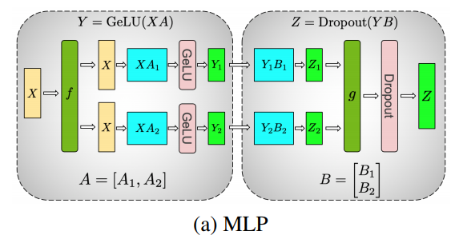

# Scaling Distritubed Machine Learning with the Parameter Server

[Parameter Server-Mu Li-bilibili](https://www.bilibili.com/video/BV1YA4y197G8)

## Layout

- 问题

  1. 在获得参数时需要大的带宽

  2. 有很多顺序任务（sequential），导致产生一些 barrier，使得同步效率低，延迟大

     gradient accumulation

  3. 大规模的机器中少部分机器出错的可能性非常大，会导致任务停滞，这需要系统有 fault torlerance

     解决方法是做一个实时的备份，或者每隔一段时间做一个备份

# Gpipe

[Gpipe-Mu Li-Bilibili](https://www.bilibili.com/video/BV1v34y1E7zu)

## Layout

- 问题

  模型太大，一个 GPU 放不下

  1. 流水线并行
  2. activation checkpoint，会额外增加 20%~30% 计算开销

  模型并行的致命问题：bubble!!!但是只要你的块数足够多，bubble 的占用比例会越小

  

  批量归一化会计算得不一样些，因为要算均值和方差

  衡量 activation checkpoint 的最大存储空间 $O(N+\frac{L}{K}·\frac{N}{M})$ 其中 N 就是数据的 batch size，L 就是模型的总长度，K 是将模型切分成为 K 个部分，你可以看做 K 个 GPU，而 M 就是将 batch size 分成 M 份，每一份为一个 micro batch

  而没有使用 activation checkpointing 的最大存储空间为 $O(N·L)$，这里其实只是用一个乘积的方式来表示我们将一个 N 大小的批量输入到 L 长度的网络中所需要的存储，而真实的存储关系不是严谨的乘积，单独的 N 应该表示为模型的输入

  而流水线的时间则表示为 $O(\frac{K-1}{M+K-1})$，其中 K 仍然表示模型将切分为 K 个部分，M 仍表示为有 M 个 micro batch。可以看到 micro batch 越大时间越低，因为并行度越高

# Megatron-LM

[Megatron-Mu Li-Bilibili](https://www.bilibili.com/video/BV1nB4y1R7Yz)

## Layout

- 张量并行 horizontal parallelism

  实现简单，不需要编译器，Pytorch 里面添加通信的操作就行

  系统简单，牺牲的是通用性，只针对 transformer-based 模型

  下面是 transformer block 中的 MLP 层的 tensor 切分方式，一般来说 X 输入没那么大，但是模型参数量很大，所以这里只讨论了参数的切分，MLP 就是两层的 Linear，对应的参数就是 A 和 B，A 被竖着切分成了2份，B 则被横着切分成了2份，这两份就可以分到2块 GPU 上。这样就能做到通信最少，不信的话，你横着切 A，那么输入 X 就得要被竖着切掉，之后就要进行整合通信。（切分搜索空间）

  

  下面是 transformer block 中的 attention 的 tensor 切分方式，其就是将 Head 作为切分代为，在不同的 GPU 上算不同的 Head 就行了

  

  在 embedding 层也进行了 GPU 的划分，所以也是有并行优化的

  tensor parallelism 的牺牲点就是在每一个层出来过后，都需要做一个 all-reduce 的 collective 操作，这个操作是一个 sequential 操作，无法并行。另外的一个缺点就是，你的层得能切！（又是一个切分搜索空间）

  通讯量比较：

  1. tensor parallel $O(B·L·K·N)$，其中 B 为 batch size，L 为序列长度，K 为隐藏层大小，N 为 transformer block 层数
  2. data parallel $O(K^2N)$，此时只有模型的梯度更新才需要通信

# ZeRO

[ZeRO-Mu Li-Bilibili](https://www.bilibili.com/video/BV1tY411g7ZT) 原来这论文不是我看得吃力，别人看着也挺吃力的😁

[Microsoft Blog]([ZeRO & DeepSpeed: New system optimizations enable training models with over 100 billion parameters - Microsoft Research](https://www.microsoft.com/en-us/research/blog/ZeRO-deepspeed-new-system-optimizations-enable-training-models-with-over-100-billion-parameters/))，强烈推荐看博客中的视频，非常详细地描述了整个过程

## Concept

- Horizontal & Vertical Model Parallelism

  参考 [huggingface Model Parallelism](https://huggingface.co/docs/transformers/v4.15.0/parallelism) [ColossalAI](https://colossalai.org/docs/concepts/paradigms_of_parallelism/)

  Horizontal 就是 tensor parallelism

  Vertical 就是 pipeline parallelism

  这两种叫法可能还不一样，因为在论文里面 horizontal 指代的是 pipeline parallelism，所以还得随机应变。另外一个结论是，model parallelism 有时候会和 tensor parallelsim 混用，其在 Megatron-LM 中提出，也称为 intra-layer model parallel

- ZeRO-DP three stages，也称为 **ZeRO-1, ZeRO-2, ZeRO-3**

  1. Optimizer state partition $P_{os}$
  2. Add gradient partition $P_{os+g}$
  3. Add parameter partition $P_{os+g+p}$

- ZeRO-R

  ZeRO 中优化 residual states 的方法，基本思路如下

  1. activation partition and offload
  2. 定义合理的 tempt buffer size
  3. 管理 tensor 的生命周期，以避免碎片内存

- 半精度训练

  fp16 在英伟达上面训练是非常的快的，通常是超过 fp32 两倍的速度。所以说训练大模型现在非常喜欢混合精度训练

  fp16 训练的缺点就是数值表示范围很小，容易出现梯度爆炸和梯度消失的问题（累计梯度的时候出现），所以在计算梯度的时候通常会转换为 fp32

- 混合精度训练所需要的参数

  假设模型本身有 $X$ 个参数，那么 fp16 模型则需要 $2X$ bytes，一个 byte 是 8 bit，而 fp32 模型则要 $4X$ bytes。并且如上面所说，在计算梯度的时候使用的是 fp32，所以优化器中保存的参数其实也是 fp32 的

  举一个例子，一个 GPT-2 模型有 1.5 Billion 参数，至少需要 24 GB 的显存才能训起来。但是单纯存储其 fp16 参数的话，只需要 3 GB，剩余的 21 GB 都是在做更新的时候需要使用：

  - fp32 参数，momentum, variance 分别需要 $4X$
  - fp16 梯度 $2X$

  所以 fp16 模型 + fp16 梯度 + fp32 优化器需要的存储空间
  $$
  2X+2X+12X=16X\ bytes=16\times1.5B\ bytes=24GB
  $$

## Layout

- 问题提出

  > DP has good compute/communication efficiency but poor memory efficiency while MP can have poor compute/communication efficiency.

- ZeRO-DP (data parallel) 核心思想：模型太大，放不了一个地方，那就把模型分布式地存储在各个地方，需要的时候就去指定的服务器拿。带宽换空间

- ZeRP-R (redundency?) 核心思想：开一个固定空间的 buffer，防止 buffer 不断扩大。并且不断做一些内存整理，防止内存过度的碎片化

- 模型并行/张量并行，不能把模型做得更大了，因为把模型垂直切开，每一个层都要做通讯，通讯量大。通讯量大，如果你在单个节点内部当然也是 OK 的，但你做到多节点的话就比较难了。ZeRO 论文把 Megatron 做到 40 B，用两个节点，只有 5 TFLOPs per V100 (5% hardware peak)

  而且切开的张量最后都要合并，最终模型也不能一直做到线性增长

  通信量变大，称为性能瓶颈。计算和通信之比很小

  Megatron 大概做到8卡就差不多了，多机比较弱

- 内存花费在那些地方？

  - 优化器参数。例如 Adam 对每个模型参数需要存两个状态：momentum & var
  - 梯度
  - 模型参数
  - 激活值。用 activation checkpointing 解决
  - buffer，例如算子的一些中间值，swap 的时候需要 tempt buffer

- 吐槽 ZeRO 论文把图放在摘要里并不好。因为这个图，没有起到向不懂的人解释论文观点的作用。只能说，懂的都懂，不懂的都不懂

  论文里讨论 ZeRO 和模型并行的论点沐神觉得讲得不是很对，直接跳过不讲！

- 论文不好读，叙述有问题，还罗里吧嗦的。但这个算法本身是一个挺简单的东西（沐神笑🤣

- 论文中单卡 1.5 B GPT-2 模型沐神说不知道怎么算出来的，多半是算错了（笑🤣

- 获得超线性增长的原因是因为卡多了过后，每张卡所需要存储的模型参数就变小了，这样就能够增加批量大小，从而进行加速。换句话说，通信保持不变，或者只增加一点，但是计算变多了。但批量增加可能导致收敛变慢

- 最后论文自夸，ZeRO 是一个革命性技术（沐神笑🤣）这些东西都是二三十年前研究透的分布式优化技术，论文虽然效果不错，但其实用的都是比较朴素的分布式技术。但是也得益于简单好用，其影响力也是很大的

## Question

- 对于 ZeRO-R 的思想，沐神说是工程上的小技术，但我仍然不太清楚如何操作。应该是之前比较常见的计算机技术，都已经被研究过了，而且 ZeRO-R 里面用的都是比较简单的。应该在计算机网络（通信）、编译器（内存管理 fragment）、内核、文件管理里面都有应用
- 在计算当中需要所有的参数的时候，怎么样通过通信来换取内存？难道通信过后就不需要空间来保存了吗？
