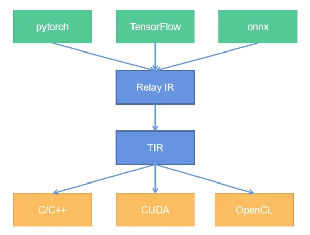

# MLC-LLM Usage

如何使用 MLC-LLM 工具链，需要回答以下问题：

1. MLC-LLM 的安装如何运行
2. 如何构建模型
3. 如何将模型进行编译并运行

## Concept

- 安装 [tvm unity install](https://llm.mlc.ai/docs/install/tvm.html)

   最简单的方式是通过 pre-built package 一键安装，下面是安装了 cuda 12.2 版本的 tvm unity

   ```shell
   pip install --pre -U -f https://mlc.ai/wheels mlc-ai-nightly-cu122
   ```

   如果需要安装其他 cuda 版本包，可以去 https://mlc.ai/wheels 寻找对应的 wheel 包，下载后安装

   > pip install -pre 会将 pre-release version packages 放入搜索路径当中

   > tvm unity 是 tvm 的一个分支版本，你可以在 tvm github 的 branch 中看到他。实际上 tvm unity 就是 tvm 的最新版本，功能和 tvm 一样，提供模型编译功能

   除此之外还可能要安装 xgboost

   ```python
   pip install xgboost --force
   ```

   > 我使用 --forece 强制安装，也可以用 -U 更新安装

   检验安装是否完成

   ```shell
   python -c "import tvm; print(tvm.__file__)"
   python -c "import tvm; print(tvm._ffi.base._LIB)"
   python -c "import tvm; print(tvm.cuda().exist)"
   ```

- 安装 [mlc-llm install](https://llm.mlc.ai/docs/install/mlc_llm.html)

   模型部署可以分为两个阶段： compile & runtime，tvm unity 提供了 compile 功能，而 mlc 则提供了 runtime 功能（个人理解）

   同样地，通过下载 wheels 进行本地安装

   ```python
   pip install --pre -U -f https://mlc.ai/wheels mlc-llm-nightly-cu122 mlc-ai-nightly-cu122
   ```

- Overview Function of tvm & mlc-llm

   我们要做的事情非常明确：构建模型 -> 编译模型 -> 运行模型

   tvm 其实为这件事情提供了完整的能力支撑：我们可以通过 tvm python api (relax) 来完成模型构建，然后对所构建的模型进行编译，使其能够在对应的平台上运行

   而 mlc-llm 则是一个由 tvm 支撑的，面相 LLM 的开发仓库。mlc-llm 包含了许多由 tvm python api 构建的语言模型。并且定义了许多 chat 配置模版，可以方便地调用模型来构建完整的聊天应用

- 如何通过 relax (tvm python api) 来构建模型，并编译运行，以 linear 层为例

   参考 [notebook](https://github.com/mlc-ai/notebooks/blob/main/mlc-llm/tutorial_add_new_model_architecture_in_tvm_nn_module.ipynb) [define_new_models](https://llm.mlc.ai/docs/compilation/define_new_models.html)

   直接跑官方的 notebook 肯定是跑不通的，继承了 tvm 文档的一贯风格😂原因在于 tvm/relax api 变化太快，但是文档完全没有跟上，下面就是其中一个例子

   ```python
   # before
q = q.permute_dims([0, 2, 1, 3])  # [b, h, s, d]
   k = k.permute_dims([0, 2, 1, 3])  # [b, h, t, d]
   v = v.permute_dims([0, 2, 1, 3])  # [b, h, t, d]
   
   # after
q = q.permute_dims(0, 2, 1, 3)  # [b, h, s, d]
   k = k.permute_dims(0, 2, 1, 3)  # [b, h, t, d]
   v = v.permute_dims(0, 2, 1, 3)  # [b, h, t, d]
   ```
   
   无法完成对 `nn.KVCache` 的一些操作

- Expression Node

   

- TIR & AST

   下面的整理基本上来自于 [TVM 自底向上（二）：TIR 的概念和编译原理](https://zhuanlan.zhihu.com/p/533161438)

   TIR 是 TVM 中最接近目标硬件的数据结构，是可以被编译为目标硬件编程语言（C++、CUDA、LLVM IR等）的中间表示。对于没有学习过编译原理的读者而言，会比较难以理解：**各种编程语言的语法，区别都非常大，那么 TIR 是如何做到可以编译为任何一种语言的？**

   **这里就要引入一个新的概念，叫抽象语法树（Abstract Syntax Tree，今后都简称为 AST）。不管任何编程语言，有什么特性如何，语法如何，一段程序都是如下元素组成的：**

   - **变量的声明、变量初始化（赋值或者内存分配）**
   - **变量的运算（四则运算、布尔运算等）、函数的调用**
   - **流程的控制（if-else 条件判断，循环等）**

   **那么，任何一段代码，都可以表达为类似于如下的树结构：**

   

   通常，AST 是按照中序遍历来阅读的，那么，上面的代码翻译为 C++，就是：

   ```c++
   void main(int x) {
       if (x < 5) {
           x = x * 2;
       }
   }
   ```

   翻译成 Python，就是：

   ```python
   def main(x):
       if x < 5:
           x = x * 2
   ```

   **即使 C++ 和 Python 的语法不同，只要实现相应的翻译器（也就是 CodeGen），在中序遍历的过程中，将树节点翻译为相应语法的字符串，就可以得到最终的源代码了。**

   

   **有了 AST，TIR 就能解决如下痛点：相同的计算指令、加速指令在不同硬件之间的转换。**

   目前对 AST 有了一定了解，那到底什么是 TIR 呢？如何构建一个 TIR？并且 TIR 又是如何转变为 AST 的？

   以下是个人理解：

   > TensorIR 就是 AST 本身，而通常我们所说的 TensorIR 是 TensorIR AST 的简称，为了让概念变得更加清晰将 TensorIR code & TensorIR AST 进行区分
   >
   > AST 可以翻译成为各种语言，但我们通常需要选择一种主语言来完成 TensorIR code 与 TensorIR AST 之间的转换，而 python 显然是一个不错的选择
   >
   > 使用 Python 所实现的 python TensorIR code，我们就称之为 TVMScript。TVMScript 借助 python AST 能够将 code 转换为 TensorIR AST，从而再利用其他语言的 CodeGen 转换为其他语言。

- IRModule & PrimFunc & CodeGen

   使用 TVMScrip 来编写 python TensorIR code 有几个重要的组件：

   1. IRModule，IRModule 是可以被编译的最小单元，所有的 TensorIR code 都必须在 IRModule 中实现
   2. PrimFunc，PrimFunc 是一个完整的函数，能够作为 API 入口被编译后的 IRModule 调用

   ```python
   import tvm
   from tvm.ir.module import IRModule
   from tvm.script import tir as T
   import numpy as np
   
   @tvm.script.ir_module
   class MyModule:
       @T.prim_func
       def main(a: T.handle, b: T.handle):
           # We exchange data between function by handles, which are similar to pointer.
           T.func_attr({"global_symbol": "main", "tir.noalias": True})
           # Create buffer from handles.
           A = T.match_buffer(a, (8,), dtype="float32")
           B = T.match_buffer(b, (8,), dtype="float32")
           for i in range(8):
               # A block is an abstraction for computation.
               with T.block("B"):
                   # Define a spatial block iterator and bind it to value i.
                   vi = T.axis.spatial(8, i)
                   B[vi] = A[vi] + 1.0
   
   
   ir_module = MyModule
   print(type(ir_module))
   print(ir_module.script())
   ```

   3. Compile，编译 IRModule，看下效果

   ```python
   import numpy as np
   
   mod = tvm.build(ir_module, target="llvm")
   # mod = tvm.build(ir_module, target="cuda")
   
   a = tvm.nd.array(np.arange(8).astype("float32"))
   # [0. 1. 2. 3. 4. 5. 6. 7.]
   
   b = tvm.nd.array(np.zeros((8,)).astype("float32"))
   mod(a, b)
   # [1. 2. 3. 4. 5. 6. 7. 8.]
   ```

   `tvm.build` 的最后一个参数 target，就是用来选择用哪一个 CodeGen 来编译 TIR AST

   > TIR AST -> C++/CUDA -> bin

- Algebraic Data Types (ADTs)

   通过组合旧的数据类型来定义新的数据类型

   > ADTs are trying to define new types by combining exsisting types. (result from GPT)

- Expression & Statement

   [TVM 自底向上（二）：TIR 的概念和编译原理](https://zhuanlan.zhihu.com/p/533161438)

   CodeGenC 会遍历到两种 TIR Node：Expression（表达式） 和 Statement（语句）。Expression（表达式）中包含了常见的变量声明、运算、判断、函数调用，而 Statement（语句）中包含了控制流（if-else，Loop 等）、内存管理、赋值（Assignment）等操作

- Frontend & Backbend & RelayIR & TensorIR

   [TVM 基本框架和概念](https://zhuanlan.zhihu.com/p/532873577)

   向上，兼容所有不同的深度学习框架（也叫 frontend），例如 pytorch、TensorFlow、onnx

   向下，兼容所有不同的底层硬件和推理框架（也叫 backend），同时性能最大化，例如 x86 cpu、arm cpu、mali gpu、nvidia gpu

   **因此，为了覆盖上述的全部场景，TVM 中引入了两个 IR**（Intermediate Representation，即中间表示）：

   1. 为了向上兼容的 **Relay IR**（简称 Relay），基于不同深度学习平台训练好的模型，在进入 TVM 后都会首先被转换为 Relay 的表示，消除表示差异；

   2. 为了向下兼容的 **Tensor IR**（简称 TIR），所有模型在编译为指定硬件上的源代码之前，都要先 lower 为 TIR。

      

   为什么要使用两种 IR，为什么不只设计 TensorIR，直接从 onnx -> cuda 一步到位。个人理解有以下原因：

   1. 从 pytorch/onnx 表示到 CUDA 表示有许多优化是可以进行的，在这个过程中，使用层级式的优化是更容易实现的
   2. 更高抽象的 IR 有利于快速地表示计算图，例如在 TVM 中通常就会使用 Relax IR 来快速搭建网络。也就是说我们可以直接舍弃从 ONNX/pytorch 转 Relax/RelayIR 的这个过程，直接使用 IR 来搭建网络
   3. 更高抽象的 IR 有利于在图融合层面进行优化
   4. 更低抽象的 IR 有利于设计更多运算细节，例如面向不同的硬件设计不同的并行方式

## -----


- 

- 如何使用 Git-LFS (Large File System)

   git-lfs 是用于管理 repo 中的大型文件。安装方式 [link](https://packagecloud.io/github/git-lfs/install)

   ```shell
   curl -s https://packagecloud.io/install/repositories/github/git-lfs/script.deb.sh | sudo bash
   apt install git-lfs
   ```

   在 huggingface 中 clone 一个模型通常会先运行 `git lfs install`，这一步就会对 git 进行全局的设置，能够在使用 `git clone` 的时候下载仓库中的 LFS 文件（一般为模型权重）

   ```shell
   git lfs install
   git clone https://huggingface.co/openai-community/gpt2
   # If you want to clone without large files - just their pointers
   GIT_LFS_SKIP_SMUDGE=1 git clone https://huggingface.co/openai-community/gpt2
   ```

   这里的设置是全局的，只用设置一次。但是有时候仓库中有很多 LFS 文件，并不是所有的文件都是我们需要的，所以可以使用如下方法

   ```shell
   # skip lfs globally
   git lfs install --skip-smudge
   # clone repo first
   git clone https://huggingface.co/openai-community/gpt2
   
   # pull certain file you need
   git lfs pull --include "model.safetensors"
   # pull all lfs
   git lfs pull
   ```

   我们先 clone 仓库，然后再进入仓库，对该仓库进行单独的配置，最后使用 `git lfs pull` 单独下载 LFS 文件

   可以通过 `git lfs uninstall` 来取消配置

- Models and model lib

   想要使用 mlc-llm 运行一个 chat model 需要两件事情：符合 mlc 要求的模型权重和模型库（model weights and model library）

   获取途径有两个

   1. 使用 mlc-llm 已经准备好的模型权重 [model cards hf](https://huggingface.co/mlc-ai)，模型库 [binary-mlc-llm-libs](https://github.com/mlc-ai/binary-mlc-llm-libs)

      ```python
      # Download pre-conveted weights
      git lfs install && mkdir dist/
      git clone https://huggingface.co/mlc-ai/Llama-2-7b-chat-hf-q4f16_1-MLC \
                                         dist/Llama-2-7b-chat-hf-q4f16_1-MLC
      
      # Download pre-compiled model library
      git clone https://github.com/mlc-ai/binary-mlc-llm-libs.git dist/prebuilt_libs
      ```

   2. 自己编译模型权重和模型库 [convert model weights via mlc](https://llm.mlc.ai/docs/compilation/convert_weights.html)，[compile model libraries](https://llm.mlc.ai/docs/compilation/compile_models.html)

- 使用 Python API 运行 chat model

- 配置 MLCChat，mlc-llm 提供两个 dataclass 来设定配置

- **Convert Model Weights** and **Compile Model Library**

   pre-request: tvm unity compiler & mlc_chat

   直接从 huggingface 上拉取模型，然后使用命令行工具转换

   ```python
   # Create directory
   mkdir -p dist/models && cd dist/models
   # Clone HF weights
   git lfs install
   git clone https://huggingface.co/togethercomputer/RedPajama-INCITE-Instruct-3B-v1
   cd ../..
   # Convert weight
   mlc_chat convert_weight ./dist/models/RedPajama-INCITE-Instruct-3B-v1/ \
       --quantization q4f16_1 \
       -o dist/RedPajama-INCITE-Instruct-3B-v1-q4f16_1-MLC
   ```

   教程还让我们生成 MLC Chat Config，为之后生成 model libraries 提供一些信息

   ```shell
   mlc_chat compile ./dist/RedPajama-INCITE-Chat-3B-v1-q4f16_1-MLC/mlc-chat-config.json \
       --device cuda -o dist/libs/RedPajama-INCITE-Chat-3B-v1-q4f16_1-cuda.so
   ```

## Question

- mlc-llm 似乎没有 tvm 的 auto tune 功能，而是选择使用手工实现 tir，似乎又回到了手工设计算子的时代 [[Question] performance optimization](https://github.com/mlc-ai/mlc-llm/issues/1800)。现在 AutoTune 这个功能已经不是其最大的卖点了！
- mlc container on Orin [github](https://github.com/dusty-nv/jetson-containers/tree/dev/packages/llm/mlc)
